---  
title: "International Test Match 2024 Status"  
date: 2024-07-22 6:00:00 -0500  
categories: model review projection  
layout: article  
aside:  
    toc: true  
---
# Current Team Rankings

# Standings

## Current Standings

| Club                     |   Played |   Wins |   Point Differential |   Losing Bonus Points |   Try Bonus Points |   Competition Points |
|:-------------------------|---------:|-------:|---------------------:|----------------------:|-------------------:|---------------------:|
| Hong Kong                |        5 |      5 |                  240 |                     0 |                nan |                   20 |
| Scotland                 |        4 |      4 |                  194 |                     0 |                nan |                   18 |
| South Africa             |        4 |      3 |                   77 |                     1 |                  2 |                   15 |
| Australia                |        3 |      3 |                   28 |                     0 |                  2 |                   14 |
| New Zealand              |        3 |      3 |                   50 |                     0 |                  1 |                   13 |
| Argentina                |        3 |      2 |                   67 |                     0 |                  2 |                   10 |
| Italy                    |        3 |      2 |                   42 |                     0 |                  2 |                   10 |
| Luxembourg               |        2 |      2 |                   80 |                     0 |                nan |                    8 |
| Sri Lanka                |        2 |      2 |                   73 |                     0 |                nan |                    8 |
| Switzerland              |        2 |      2 |                   41 |                     0 |                nan |                    8 |
| Algeria                  |        2 |      2 |                   34 |                     0 |                nan |                    8 |
| Sweden                   |        2 |      2 |                   31 |                     0 |                nan |                    8 |
| France                   |        3 |      2 |                   22 |                     0 |                nan |                    8 |
| Zimbabwe                 |        2 |      2 |                    6 |                     0 |                nan |                    8 |
| United Arab Emirates     |        3 |      2 |                    0 |                     0 |                nan |                    8 |
| England                  |        3 |      1 |                   27 |                     2 |                  1 |                    7 |
| Hungary                  |        2 |      1 |                   32 |                     1 |                nan |                    5 |
| Samoa                    |        1 |      1 |                    8 |                     0 |                  1 |                    5 |
| Qatar                    |        2 |      1 |                    7 |                     1 |                nan |                    5 |
| Chinese Taipei           |        2 |      1 |                   -3 |                     1 |                nan |                    5 |
| Ireland                  |        2 |      1 |                   -6 |                     1 |                  0 |                    5 |
| Korea Republic           |        3 |      1 |                  -14 |                     1 |                nan |                    5 |
| Georgia                  |        3 |      1 |                  -18 |                     0 |                  1 |                    5 |
| Singapore                |        3 |      1 |                  -21 |                     1 |                nan |                    5 |
| Portugal                 |        2 |      1 |                  -28 |                     0 |                  1 |                    5 |
| Barbados                 |        1 |      1 |                   84 |                     0 |                nan |                    4 |
| Finland                  |        1 |      1 |                   50 |                     0 |                nan |                    4 |
| Moldova                  |        1 |      1 |                   42 |                     0 |                nan |                    4 |
| Austria                  |        1 |      1 |                   40 |                     0 |                nan |                    4 |
| Jamaica                  |        1 |      1 |                   34 |                     0 |                nan |                    4 |
| Belgium                  |        1 |      1 |                   25 |                     0 |                nan |                    4 |
| Andorra                  |        1 |      1 |                   24 |                     0 |                nan |                    4 |
| Trinidad and Tobago      |        1 |      1 |                   23 |                     0 |                nan |                    4 |
| Cayman Islands           |        2 |      1 |                   22 |                     0 |                nan |                    4 |
| Kenya                    |        1 |      1 |                   19 |                     0 |                nan |                    4 |
| Namibia                  |        2 |      1 |                   18 |                     0 |                nan |                    4 |
| Czech Republic           |        2 |      1 |                   14 |                     0 |                nan |                    4 |
| Mexico                   |        1 |      1 |                   10 |                     0 |                nan |                    4 |
| Malta                    |        1 |      1 |                   10 |                     0 |                nan |                    4 |
| Latvia                   |        1 |      1 |                    4 |                     0 |                nan |                    4 |
| Bermuda                  |        2 |      1 |                   -2 |                     0 |                nan |                    4 |
| Croatia                  |        2 |      1 |                  -10 |                     0 |                nan |                    4 |
| Romania                  |        2 |      1 |                  -11 |                     0 |                nan |                    4 |
| Thailand                 |        2 |      1 |                  -15 |                     0 |                nan |                    4 |
| Bulgaria                 |        2 |      1 |                  -19 |                     0 |                nan |                    4 |
| Fiji                     |        2 |      1 |                  -33 |                     0 |                  0 |                    4 |
| Kazakhstan               |        2 |      1 |                  -36 |                     0 |                nan |                    4 |
| Canada                   |        2 |      1 |                  -48 |                     0 |                nan |                    4 |
| Malaysia                 |        4 |      1 |                 -118 |                     0 |                nan |                    4 |
| Brazil                   |        1 |      0 |                   -1 |                     1 |                nan |                    1 |
| Uganda                   |        1 |      0 |                   -2 |                     1 |                nan |                    1 |
| Denmark                  |        1 |      0 |                   -4 |                     1 |                nan |                    1 |
| Zambia                   |        1 |      0 |                   -4 |                     1 |                nan |                    1 |
| United States of America |        2 |      0 |                  -37 |                     1 |                  0 |                    1 |
| Wales                    |        3 |      0 |                  -45 |                     0 |                  1 |                    1 |
| Japan                    |        3 |      0 |                  -65 |                     1 |                  0 |                    1 |
| Cyprus                   |        1 |      0 |                  -10 |                     0 |                nan |                    0 |
| Ivory Coast              |        1 |      0 |                  -20 |                     0 |                nan |                    0 |
| Tonga                    |        1 |      0 |                  -22 |                     0 |                  0 |                    0 |
| Guyana                   |        1 |      0 |                  -23 |                     0 |                nan |                    0 |
| Serbia                   |        1 |      0 |                  -23 |                     0 |                nan |                    0 |
| Burkina Faso             |        1 |      0 |                  -33 |                     0 |                nan |                    0 |
| Senegal                  |        2 |      0 |                  -33 |                     0 |                nan |                    0 |
| Lithuania                |        2 |      0 |                  -34 |                     0 |                nan |                    0 |
| Ukraine                  |        2 |      0 |                  -42 |                     0 |                nan |                    0 |
| India                    |        2 |      0 |                  -44 |                     0 |                nan |                    0 |
| Bahamas                  |        2 |      0 |                  -64 |                     0 |                nan |                    0 |
| Norway                   |        2 |      0 |                  -74 |                     0 |                nan |                    0 |
| Bosnia and Herzegovina   |        2 |      0 |                  -75 |                     0 |                nan |                    0 |
| Slovenia                 |        1 |      0 |                  -77 |                     0 |                nan |                    0 |
| Saint Lucia              |        1 |      0 |                  -84 |                     0 |                nan |                    0 |
| Uruguay                  |        2 |      0 |                  -89 |                     0 |                nan |                    0 |
| Paraguay                 |        2 |      0 |                  -93 |                     0 |                nan |                    0 |
| Chile                    |        2 |      0 |                  -98 |                     0 |                nan |                    0 |

## Projected Remaining Table

| Club         |   Matches Remaining |   Wins |   Point Differential |   Losing Bonus Points |   Try Bonus Points |   Competition Points |
|:-------------|--------------------:|-------:|---------------------:|----------------------:|-------------------:|---------------------:|
| Scotland     |                   1 |    1   |             20.6974  |                   0   |                0.9 |                  4.9 |
| Uganda       |                   1 |    0.9 |             17.3793  |                   0.1 |                0.6 |                  4.2 |
| Ivory Coast  |                   1 |    0.8 |             10.2923  |                   0.1 |                0.6 |                  3.9 |
| Algeria      |                   1 |    0.7 |              5.61956 |                   0.2 |                0.6 |                  3.5 |
| Brazil       |                   1 |    0.7 |              4.93268 |                   0.2 |                0.4 |                  3.4 |
| Namibia      |                   1 |    0.6 |              2.41741 |                   0.2 |                0.6 |                  3.2 |
| Zimbabwe     |                   1 |    0.4 |             -2.41741 |                   0.3 |                0.6 |                  2.4 |
| Belgium      |                   1 |    0.3 |             -4.93268 |                   0.2 |                0.4 |                  2   |
| Kenya        |                   1 |    0.3 |             -5.61956 |                   0.2 |                0.3 |                  1.7 |
| Senegal      |                   1 |    0.2 |            -10.2923  |                   0.2 |                0.3 |                  1.3 |
| Burkina Faso |                   1 |    0.1 |            -17.3793  |                   0.1 |                0.3 |                  0.8 |
| Uruguay      |                   1 |    0   |            -20.6974  |                   0   |                0.1 |                  0.1 |

## Projected Total Table

| Club                     |   Total Matches |   Wins |   Point Differential |   Losing Bonus Points |   Try Bonus Points |   Competition Points |
|:-------------------------|----------------:|-------:|---------------------:|----------------------:|-------------------:|---------------------:|
| Scotland                 |               5 |    5   |            214.697   |                   0   |                0.9 |                 22.9 |
| Hong Kong                |               5 |    5   |            240       |                   0   |                0   |                 20   |
| South Africa             |               4 |    3   |             77       |                   1   |                2   |                 15   |
| Australia                |               3 |    3   |             28       |                   0   |                2   |                 14   |
| New Zealand              |               3 |    3   |             50       |                   0   |                1   |                 13   |
| Algeria                  |               3 |    2.7 |             39.6196  |                   0.2 |                0.6 |                 11.5 |
| Zimbabwe                 |               3 |    2.4 |              3.58259 |                   0.3 |                0.6 |                 10.4 |
| Argentina                |               3 |    2   |             67       |                   0   |                2   |                 10   |
| Italy                    |               3 |    2   |             42       |                   0   |                2   |                 10   |
| Luxembourg               |               2 |    2   |             80       |                   0   |                0   |                  8   |
| Sri Lanka                |               2 |    2   |             73       |                   0   |                0   |                  8   |
| Switzerland              |               2 |    2   |             41       |                   0   |                0   |                  8   |
| Sweden                   |               2 |    2   |             31       |                   0   |                0   |                  8   |
| France                   |               3 |    2   |             22       |                   0   |                0   |                  8   |
| United Arab Emirates     |               3 |    2   |              0       |                   0   |                0   |                  8   |
| Namibia                  |               3 |    1.6 |             20.4174  |                   0.2 |                0.6 |                  7.2 |
| England                  |               3 |    1   |             27       |                   2   |                1   |                  7   |
| Belgium                  |               2 |    1.3 |             20.0673  |                   0.2 |                0.4 |                  6   |
| Kenya                    |               2 |    1.3 |             13.3804  |                   0.2 |                0.3 |                  5.7 |
| Uganda                   |               2 |    0.9 |             15.3793  |                   1.1 |                0.6 |                  5.2 |
| Hungary                  |               2 |    1   |             32       |                   1   |                0   |                  5   |
| Samoa                    |               1 |    1   |              8       |                   0   |                1   |                  5   |
| Qatar                    |               2 |    1   |              7       |                   1   |                0   |                  5   |
| Chinese Taipei           |               2 |    1   |             -3       |                   1   |                0   |                  5   |
| Ireland                  |               2 |    1   |             -6       |                   1   |                0   |                  5   |
| Korea Republic           |               3 |    1   |            -14       |                   1   |                0   |                  5   |
| Georgia                  |               3 |    1   |            -18       |                   0   |                1   |                  5   |
| Singapore                |               3 |    1   |            -21       |                   1   |                0   |                  5   |
| Portugal                 |               2 |    1   |            -28       |                   0   |                1   |                  5   |
| Brazil                   |               2 |    0.7 |              3.93268 |                   1.2 |                0.4 |                  4.4 |
| Barbados                 |               1 |    1   |             84       |                   0   |                0   |                  4   |
| Finland                  |               1 |    1   |             50       |                   0   |                0   |                  4   |
| Moldova                  |               1 |    1   |             42       |                   0   |                0   |                  4   |
| Austria                  |               1 |    1   |             40       |                   0   |                0   |                  4   |
| Jamaica                  |               1 |    1   |             34       |                   0   |                0   |                  4   |
| Andorra                  |               1 |    1   |             24       |                   0   |                0   |                  4   |
| Trinidad and Tobago      |               1 |    1   |             23       |                   0   |                0   |                  4   |
| Cayman Islands           |               2 |    1   |             22       |                   0   |                0   |                  4   |
| Czech Republic           |               2 |    1   |             14       |                   0   |                0   |                  4   |
| Malta                    |               1 |    1   |             10       |                   0   |                0   |                  4   |
| Mexico                   |               1 |    1   |             10       |                   0   |                0   |                  4   |
| Latvia                   |               1 |    1   |              4       |                   0   |                0   |                  4   |
| Bermuda                  |               2 |    1   |             -2       |                   0   |                0   |                  4   |
| Croatia                  |               2 |    1   |            -10       |                   0   |                0   |                  4   |
| Romania                  |               2 |    1   |            -11       |                   0   |                0   |                  4   |
| Thailand                 |               2 |    1   |            -15       |                   0   |                0   |                  4   |
| Bulgaria                 |               2 |    1   |            -19       |                   0   |                0   |                  4   |
| Fiji                     |               2 |    1   |            -33       |                   0   |                0   |                  4   |
| Kazakhstan               |               2 |    1   |            -36       |                   0   |                0   |                  4   |
| Canada                   |               2 |    1   |            -48       |                   0   |                0   |                  4   |
| Malaysia                 |               4 |    1   |           -118       |                   0   |                0   |                  4   |
| Ivory Coast              |               2 |    0.8 |             -9.70768 |                   0.1 |                0.6 |                  3.9 |
| Senegal                  |               3 |    0.2 |            -43.2923  |                   0.2 |                0.3 |                  1.3 |
| Denmark                  |               1 |    0   |             -4       |                   1   |                0   |                  1   |
| Zambia                   |               1 |    0   |             -4       |                   1   |                0   |                  1   |
| United States of America |               2 |    0   |            -37       |                   1   |                0   |                  1   |
| Wales                    |               3 |    0   |            -45       |                   0   |                1   |                  1   |
| Japan                    |               3 |    0   |            -65       |                   1   |                0   |                  1   |
| Burkina Faso             |               2 |    0.1 |            -50.3793  |                   0.1 |                0.3 |                  0.8 |
| Uruguay                  |               3 |    0   |           -109.697   |                   0   |                0.1 |                  0.1 |
| Cyprus                   |               1 |    0   |            -10       |                   0   |                0   |                  0   |
| Tonga                    |               1 |    0   |            -22       |                   0   |                0   |                  0   |
| Guyana                   |               1 |    0   |            -23       |                   0   |                0   |                  0   |
| Serbia                   |               1 |    0   |            -23       |                   0   |                0   |                  0   |
| Lithuania                |               2 |    0   |            -34       |                   0   |                0   |                  0   |
| Ukraine                  |               2 |    0   |            -42       |                   0   |                0   |                  0   |
| India                    |               2 |    0   |            -44       |                   0   |                0   |                  0   |
| Bahamas                  |               2 |    0   |            -64       |                   0   |                0   |                  0   |
| Norway                   |               2 |    0   |            -74       |                   0   |                0   |                  0   |
| Bosnia and Herzegovina   |               2 |    0   |            -75       |                   0   |                0   |                  0   |
| Slovenia                 |               1 |    0   |            -77       |                   0   |                0   |                  0   |
| Saint Lucia              |               1 |    0   |            -84       |                   0   |                0   |                  0   |
| Paraguay                 |               2 |    0   |            -93       |                   0   |                0   |                  0   |
| Chile                    |               2 |    0   |            -98       |                   0   |                0   |                  0   |

# Completed Match Review

| Model | Percent Correct Predictions | Spread Error |
| ------ | ------ | ------ |
| Club Level | 76.4% | 20.8 |
| Player Level: Lineup | 80.0% | 17.8 |
| Player Level: Minutes | 76.0% | 18.6 |

# Future Predictions

## Week 6

### Kenya V Algeria on 2024/07/24

Average Margin: Algeria by 5.6

Average Scoreline: 25-19

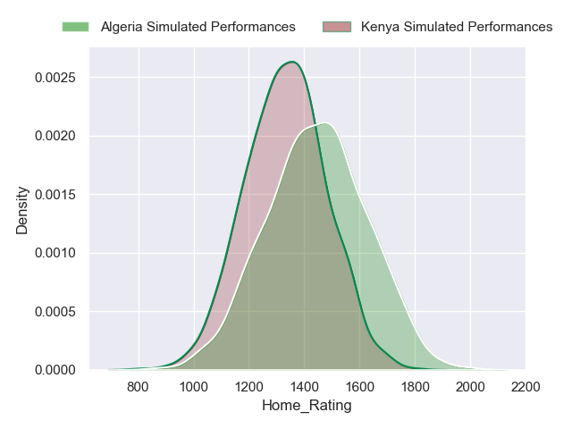
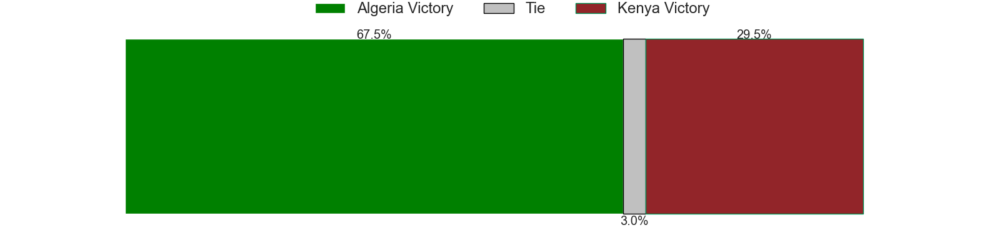
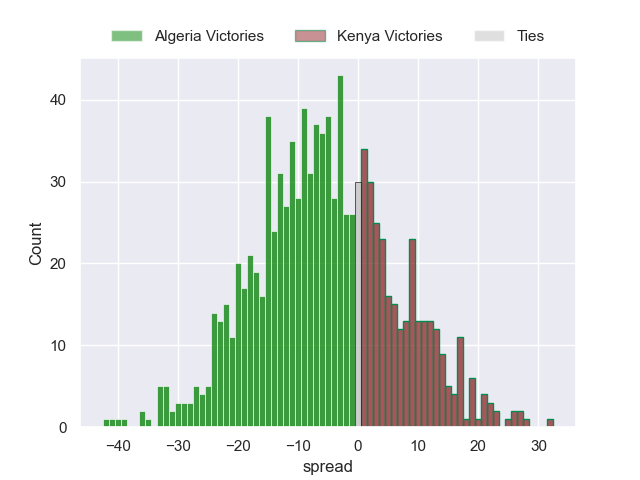

### Senegal V Ivory Coast on 2024/07/24

Average Margin: Ivory Coast by 10.3

Average Scoreline: 27-17

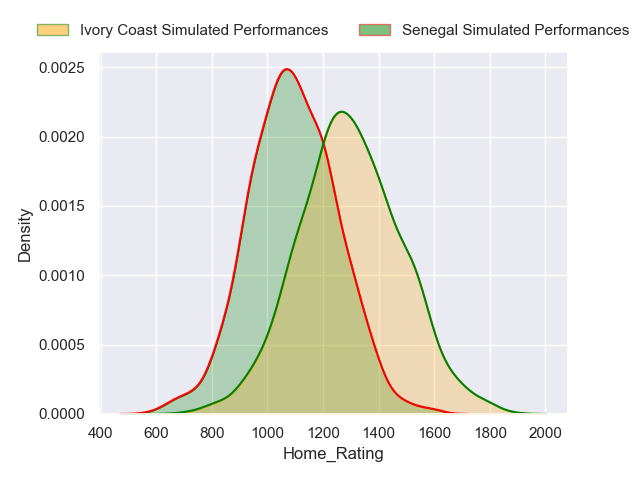
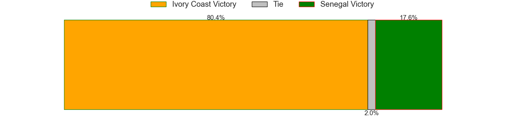
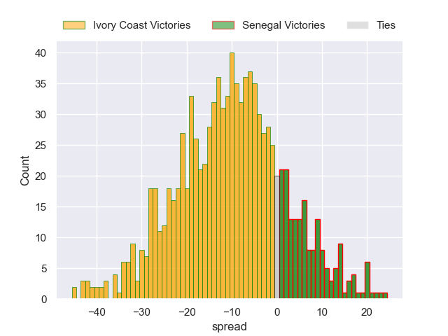

### Namibia V Zimbabwe on 2024/07/24

Average Margin: Namibia by 2.4

Average Scoreline: 23-20

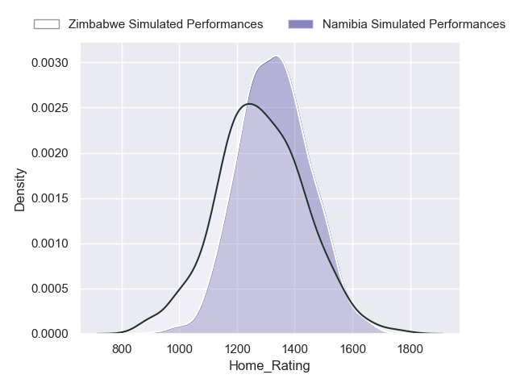
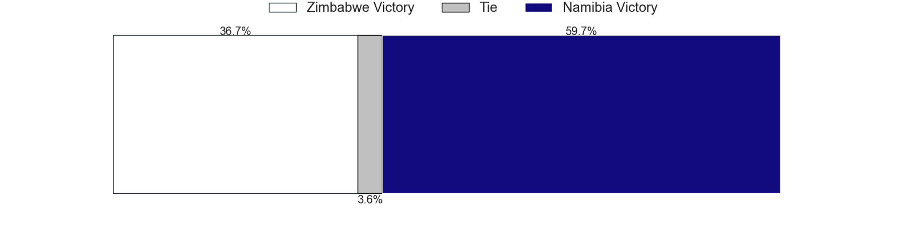
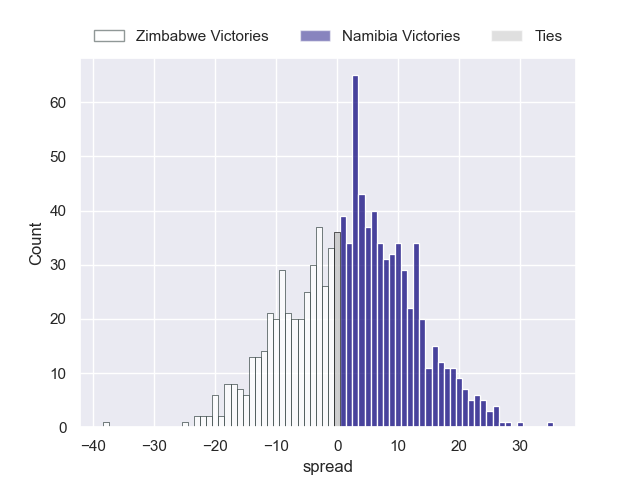

### Uganda V Burkina Faso on 2024/07/24

Average Margin: Uganda by 17.4

Average Scoreline: 33-15

### Uruguay V Scotland on 2024/07/27

Average Margin: Scotland by 20.7

Average Scoreline: 31-10

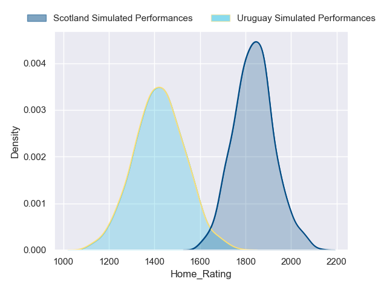
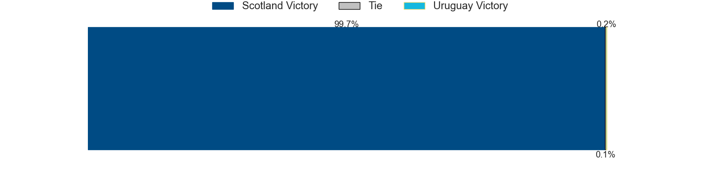
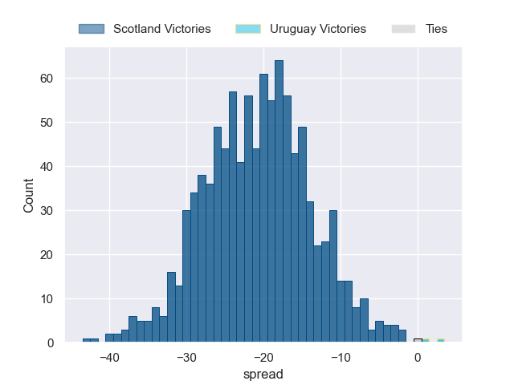

### Brazil V Belgium on 2024/07/27

Average Margin: Brazil by 4.9

Average Scoreline: 28-23

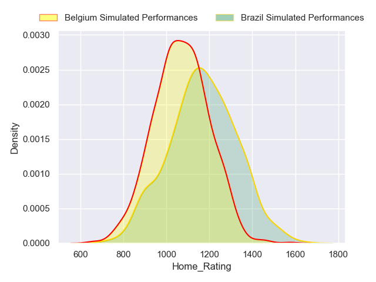
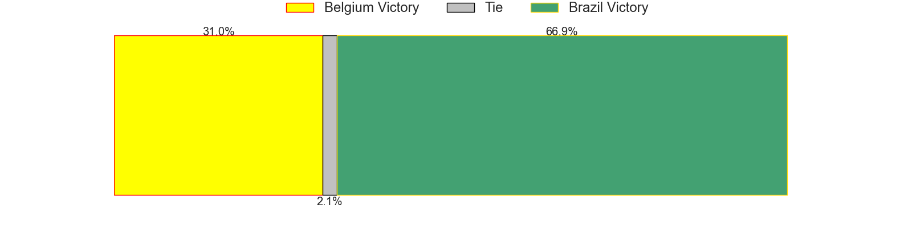
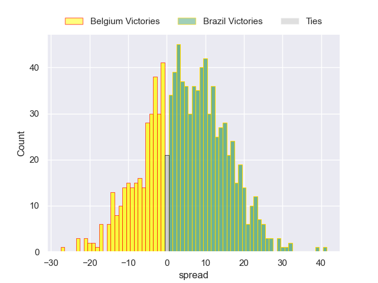

