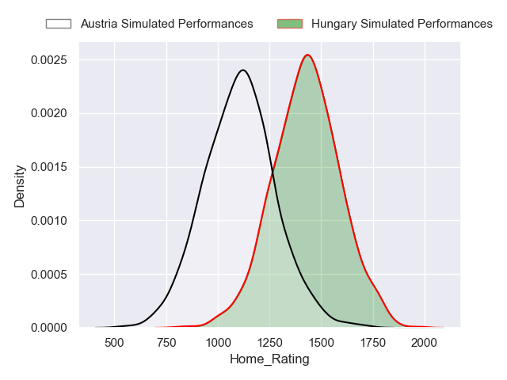
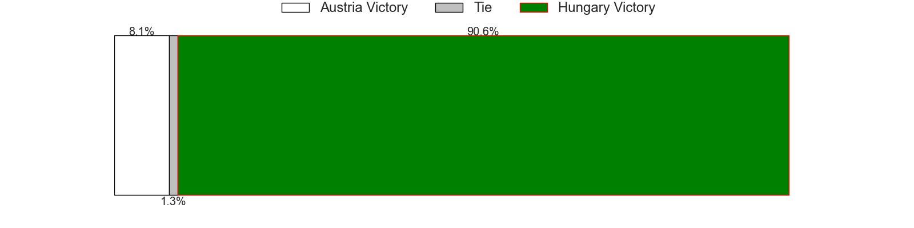
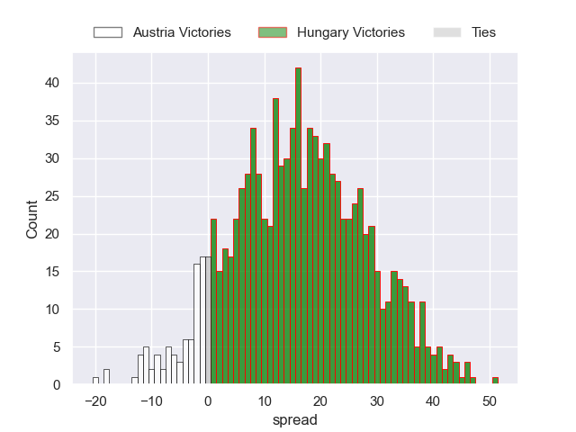

---  
title: "International Test Match 2024 Status"  
date: 2024-09-19 6:00:00 -0500  
categories: model review projection  
layout: article  
aside:  
    toc: true  
---
# Current Team Rankings

# Standings

## Current Standings

| Club                     |   Played |   Wins |   Point Differential |   Losing Bonus Points |   Try Bonus Points |   Competition Points |
|:-------------------------|---------:|-------:|---------------------:|----------------------:|-------------------:|---------------------:|
| Hong Kong                |        7 |      6 |                  303 |                     1 |                nan |                   27 |
| Scotland                 |        5 |      5 |                  201 |                     0 |                nan |                   22 |
| Zimbabwe                 |        4 |      4 |                   54 |                     0 |                nan |                   16 |
| South Africa             |        4 |      3 |                   77 |                     1 |                  2 |                   15 |
| Australia                |        3 |      3 |                   28 |                     0 |                  2 |                   14 |
| New Zealand              |        3 |      3 |                   50 |                     0 |                  1 |                   13 |
| Algeria                  |        4 |      3 |                   16 |                     0 |                nan |                   12 |
| Argentina                |        3 |      2 |                   67 |                     0 |                  2 |                   10 |
| Italy                    |        3 |      2 |                   42 |                     0 |                  2 |                   10 |
| France                   |        3 |      2 |                   22 |                     0 |                  1 |                    9 |
| Samoa                    |        2 |      2 |                   12 |                     0 |                nan |                    9 |
| Uganda                   |        3 |      2 |                   11 |                     1 |                nan |                    9 |
| Luxembourg               |        2 |      2 |                   80 |                     0 |                nan |                    8 |
| Sri Lanka                |        2 |      2 |                   73 |                     0 |                nan |                    8 |
| Switzerland              |        2 |      2 |                   41 |                     0 |                nan |                    8 |
| Sweden                   |        2 |      2 |                   31 |                     0 |                nan |                    8 |
| Namibia                  |        4 |      2 |                    7 |                     0 |                nan |                    8 |
| United Arab Emirates     |        3 |      2 |                    0 |                     0 |                nan |                    8 |
| Chile                    |        4 |      2 |                  -60 |                     0 |                nan |                    8 |
| England                  |        3 |      1 |                   27 |                     2 |                  1 |                    7 |
| Brazil                   |        2 |      1 |                   59 |                     1 |                nan |                    5 |
| Hungary                  |        2 |      1 |                   32 |                     1 |                nan |                    5 |
| Qatar                    |        2 |      1 |                    7 |                     1 |                nan |                    5 |
| Spain                    |        2 |      1 |                    5 |                     1 |                nan |                    5 |
| Chinese Taipei           |        2 |      1 |                   -3 |                     1 |                nan |                    5 |
| Ireland                  |        2 |      1 |                   -6 |                     1 |                  0 |                    5 |
| Korea Republic           |        3 |      1 |                  -14 |                     1 |                nan |                    5 |
| Georgia                  |        3 |      1 |                  -18 |                     0 |                  1 |                    5 |
| Senegal                  |        4 |      1 |                  -19 |                     1 |                nan |                    5 |
| Singapore                |        3 |      1 |                  -21 |                     1 |                nan |                    5 |
| Portugal                 |        2 |      1 |                  -28 |                     0 |                  1 |                    5 |
| Barbados                 |        1 |      1 |                   84 |                     0 |                nan |                    4 |
| Finland                  |        1 |      1 |                   50 |                     0 |                nan |                    4 |
| Moldova                  |        1 |      1 |                   42 |                     0 |                nan |                    4 |
| Austria                  |        1 |      1 |                   40 |                     0 |                nan |                    4 |
| Jamaica                  |        1 |      1 |                   34 |                     0 |                nan |                    4 |
| Andorra                  |        1 |      1 |                   24 |                     0 |                nan |                    4 |
| Trinidad and Tobago      |        1 |      1 |                   23 |                     0 |                nan |                    4 |
| Cayman Islands           |        2 |      1 |                   22 |                     0 |                nan |                    4 |
| Czech Republic           |        2 |      1 |                   14 |                     0 |                nan |                    4 |
| Mexico                   |        1 |      1 |                   10 |                     0 |                nan |                    4 |
| Malta                    |        1 |      1 |                   10 |                     0 |                nan |                    4 |
| Latvia                   |        1 |      1 |                    4 |                     0 |                nan |                    4 |
| Kenya                    |        3 |      1 |                    0 |                     0 |                nan |                    4 |
| Bermuda                  |        2 |      1 |                   -2 |                     0 |                nan |                    4 |
| Belgium                  |        2 |      1 |                   -3 |                     0 |                nan |                    4 |
| Croatia                  |        2 |      1 |                  -10 |                     0 |                nan |                    4 |
| Romania                  |        2 |      1 |                  -11 |                     0 |                nan |                    4 |
| Thailand                 |        2 |      1 |                  -15 |                     0 |                nan |                    4 |
| Bulgaria                 |        2 |      1 |                  -19 |                     0 |                nan |                    4 |
| Ivory Coast              |        3 |      1 |                  -24 |                     0 |                nan |                    4 |
| Fiji                     |        2 |      1 |                  -33 |                     0 |                  0 |                    4 |
| Kazakhstan               |        2 |      1 |                  -36 |                     0 |                nan |                    4 |
| Canada                   |        2 |      1 |                  -48 |                     0 |                nan |                    4 |
| Malaysia                 |        4 |      1 |                 -118 |                     0 |                nan |                    4 |
| Denmark                  |        1 |      0 |                   -4 |                     1 |                nan |                    1 |
| Zambia                   |        1 |      0 |                   -4 |                     1 |                nan |                    1 |
| United States of America |        2 |      0 |                  -37 |                     1 |                  0 |                    1 |
| Wales                    |        3 |      0 |                  -45 |                     0 |                  1 |                    1 |
| Japan                    |        3 |      0 |                  -65 |                     1 |                  0 |                    1 |
| Uruguay                  |        3 |      0 |                 -101 |                     0 |                nan |                    1 |
| Cyprus                   |        1 |      0 |                  -10 |                     0 |                nan |                    0 |
| Guyana                   |        1 |      0 |                  -23 |                     0 |                nan |                    0 |
| Serbia                   |        1 |      0 |                  -23 |                     0 |                nan |                    0 |
| Tonga                    |        2 |      0 |                  -31 |                     0 |                  0 |                    0 |
| Lithuania                |        2 |      0 |                  -34 |                     0 |                nan |                    0 |
| Ukraine                  |        2 |      0 |                  -42 |                     0 |                nan |                    0 |
| India                    |        2 |      0 |                  -44 |                     0 |                nan |                    0 |
| Burkina Faso             |        3 |      0 |                  -56 |                     0 |                nan |                    0 |
| Bahamas                  |        2 |      0 |                  -64 |                     0 |                nan |                    0 |
| Norway                   |        2 |      0 |                  -74 |                     0 |                nan |                    0 |
| Bosnia and Herzegovina   |        2 |      0 |                  -75 |                     0 |                nan |                    0 |
| Slovenia                 |        1 |      0 |                  -77 |                     0 |                nan |                    0 |
| Saint Lucia              |        1 |      0 |                  -84 |                     0 |                nan |                    0 |
| Paraguay                 |        4 |      0 |                 -221 |                     0 |                nan |                    0 |

## Projected Remaining Table

| Club    |   Matches Remaining |   Wins |   Point Differential |   Losing Bonus Points |   Try Bonus Points |   Competition Points |
|:--------|--------------------:|-------:|---------------------:|----------------------:|-------------------:|---------------------:|
| Hungary |                   1 |    0.9 |              16.1582 |                   0.1 |                0.6 |                  4.4 |
| Austria |                   1 |    0.1 |             -16.1582 |                   0.1 |                0.2 |                  0.7 |

## Projected Total Table

| Club                     |   Total Matches |   Wins |   Point Differential |   Losing Bonus Points |   Try Bonus Points |   Competition Points |
|:-------------------------|----------------:|-------:|---------------------:|----------------------:|-------------------:|---------------------:|
| Hong Kong                |               7 |    6   |             303      |                   1   |                0   |                 27   |
| Scotland                 |               5 |    5   |             201      |                   0   |                0   |                 22   |
| Zimbabwe                 |               4 |    4   |              54      |                   0   |                0   |                 16   |
| South Africa             |               4 |    3   |              77      |                   1   |                2   |                 15   |
| Australia                |               3 |    3   |              28      |                   0   |                2   |                 14   |
| New Zealand              |               3 |    3   |              50      |                   0   |                1   |                 13   |
| Algeria                  |               4 |    3   |              16      |                   0   |                0   |                 12   |
| Argentina                |               3 |    2   |              67      |                   0   |                2   |                 10   |
| Italy                    |               3 |    2   |              42      |                   0   |                2   |                 10   |
| Hungary                  |               3 |    1.9 |              48.1582 |                   1.1 |                0.6 |                  9.4 |
| France                   |               3 |    2   |              22      |                   0   |                1   |                  9   |
| Samoa                    |               2 |    2   |              12      |                   0   |                0   |                  9   |
| Uganda                   |               3 |    2   |              11      |                   1   |                0   |                  9   |
| Luxembourg               |               2 |    2   |              80      |                   0   |                0   |                  8   |
| Sri Lanka                |               2 |    2   |              73      |                   0   |                0   |                  8   |
| Switzerland              |               2 |    2   |              41      |                   0   |                0   |                  8   |
| Sweden                   |               2 |    2   |              31      |                   0   |                0   |                  8   |
| Namibia                  |               4 |    2   |               7      |                   0   |                0   |                  8   |
| United Arab Emirates     |               3 |    2   |               0      |                   0   |                0   |                  8   |
| Chile                    |               4 |    2   |             -60      |                   0   |                0   |                  8   |
| England                  |               3 |    1   |              27      |                   2   |                1   |                  7   |
| Brazil                   |               2 |    1   |              59      |                   1   |                0   |                  5   |
| Qatar                    |               2 |    1   |               7      |                   1   |                0   |                  5   |
| Spain                    |               2 |    1   |               5      |                   1   |                0   |                  5   |
| Chinese Taipei           |               2 |    1   |              -3      |                   1   |                0   |                  5   |
| Ireland                  |               2 |    1   |              -6      |                   1   |                0   |                  5   |
| Korea Republic           |               3 |    1   |             -14      |                   1   |                0   |                  5   |
| Georgia                  |               3 |    1   |             -18      |                   0   |                1   |                  5   |
| Senegal                  |               4 |    1   |             -19      |                   1   |                0   |                  5   |
| Singapore                |               3 |    1   |             -21      |                   1   |                0   |                  5   |
| Portugal                 |               2 |    1   |             -28      |                   0   |                1   |                  5   |
| Austria                  |               2 |    1.1 |              23.8418 |                   0.1 |                0.2 |                  4.7 |
| Barbados                 |               1 |    1   |              84      |                   0   |                0   |                  4   |
| Finland                  |               1 |    1   |              50      |                   0   |                0   |                  4   |
| Moldova                  |               1 |    1   |              42      |                   0   |                0   |                  4   |
| Jamaica                  |               1 |    1   |              34      |                   0   |                0   |                  4   |
| Andorra                  |               1 |    1   |              24      |                   0   |                0   |                  4   |
| Trinidad and Tobago      |               1 |    1   |              23      |                   0   |                0   |                  4   |
| Cayman Islands           |               2 |    1   |              22      |                   0   |                0   |                  4   |
| Czech Republic           |               2 |    1   |              14      |                   0   |                0   |                  4   |
| Malta                    |               1 |    1   |              10      |                   0   |                0   |                  4   |
| Mexico                   |               1 |    1   |              10      |                   0   |                0   |                  4   |
| Latvia                   |               1 |    1   |               4      |                   0   |                0   |                  4   |
| Kenya                    |               3 |    1   |               0      |                   0   |                0   |                  4   |
| Bermuda                  |               2 |    1   |              -2      |                   0   |                0   |                  4   |
| Belgium                  |               2 |    1   |              -3      |                   0   |                0   |                  4   |
| Croatia                  |               2 |    1   |             -10      |                   0   |                0   |                  4   |
| Romania                  |               2 |    1   |             -11      |                   0   |                0   |                  4   |
| Thailand                 |               2 |    1   |             -15      |                   0   |                0   |                  4   |
| Bulgaria                 |               2 |    1   |             -19      |                   0   |                0   |                  4   |
| Ivory Coast              |               3 |    1   |             -24      |                   0   |                0   |                  4   |
| Fiji                     |               2 |    1   |             -33      |                   0   |                0   |                  4   |
| Kazakhstan               |               2 |    1   |             -36      |                   0   |                0   |                  4   |
| Canada                   |               2 |    1   |             -48      |                   0   |                0   |                  4   |
| Malaysia                 |               4 |    1   |            -118      |                   0   |                0   |                  4   |
| Denmark                  |               1 |    0   |              -4      |                   1   |                0   |                  1   |
| Zambia                   |               1 |    0   |              -4      |                   1   |                0   |                  1   |
| United States of America |               2 |    0   |             -37      |                   1   |                0   |                  1   |
| Wales                    |               3 |    0   |             -45      |                   0   |                1   |                  1   |
| Japan                    |               3 |    0   |             -65      |                   1   |                0   |                  1   |
| Uruguay                  |               3 |    0   |            -101      |                   0   |                0   |                  1   |
| Cyprus                   |               1 |    0   |             -10      |                   0   |                0   |                  0   |
| Guyana                   |               1 |    0   |             -23      |                   0   |                0   |                  0   |
| Serbia                   |               1 |    0   |             -23      |                   0   |                0   |                  0   |
| Tonga                    |               2 |    0   |             -31      |                   0   |                0   |                  0   |
| Lithuania                |               2 |    0   |             -34      |                   0   |                0   |                  0   |
| Ukraine                  |               2 |    0   |             -42      |                   0   |                0   |                  0   |
| India                    |               2 |    0   |             -44      |                   0   |                0   |                  0   |
| Burkina Faso             |               3 |    0   |             -56      |                   0   |                0   |                  0   |
| Bahamas                  |               2 |    0   |             -64      |                   0   |                0   |                  0   |
| Norway                   |               2 |    0   |             -74      |                   0   |                0   |                  0   |
| Bosnia and Herzegovina   |               2 |    0   |             -75      |                   0   |                0   |                  0   |
| Slovenia                 |               1 |    0   |             -77      |                   0   |                0   |                  0   |
| Saint Lucia              |               1 |    0   |             -84      |                   0   |                0   |                  0   |
| Paraguay                 |               4 |    0   |            -221      |                   0   |                0   |                  0   |

# Completed Match Review

| Model | Percent Correct Predictions | Spread Error |
| ------ | ------ | ------ |
| Club Level | 75.9% | 20.1 |
| Player Level: Lineup | 73.5% | 19.1 |
| Player Level: Minutes | 72.7% | 20.2 |

# Future Predictions

## Week 8

### Hungary V Austria on 2024/09/21

Average Margin: Hungary by 16.2

Average Scoreline: 32-16

