---  
title: "International Test Match 2024 Status"  
date: 2024-09-30 6:00:00 -0500  
categories: model review projection  
layout: article  
aside:  
    toc: true  
---
# Current Team Rankings

# Standings

## Current Standings

| Club                     |   Played |   Wins |   Point Differential |   Losing Bonus Points |   Try Bonus Points |   Competition Points |
|:-------------------------|---------:|-------:|---------------------:|----------------------:|-------------------:|---------------------:|
| Hong Kong                |        7 |      6 |                  303 |                     1 |                nan |                   27 |
| Scotland                 |        5 |      5 |                  201 |                     0 |                nan |                   22 |
| Zimbabwe                 |        4 |      4 |                   54 |                     0 |                nan |                   16 |
| South Africa             |        4 |      3 |                   77 |                     1 |                  2 |                   15 |
| Australia                |        3 |      3 |                   28 |                     0 |                  2 |                   14 |
| New Zealand              |        3 |      3 |                   50 |                     0 |                  1 |                   13 |
| Algeria                  |        4 |      3 |                   16 |                     0 |                nan |                   12 |
| Chile                    |        5 |      3 |                    4 |                     0 |                nan |                   12 |
| Argentina                |        3 |      2 |                   67 |                     0 |                  2 |                   10 |
| Italy                    |        3 |      2 |                   42 |                     0 |                  2 |                   10 |
| France                   |        3 |      2 |                   22 |                     0 |                  1 |                    9 |
| Samoa                    |        2 |      2 |                   12 |                     0 |                nan |                    9 |
| Uganda                   |        3 |      2 |                   11 |                     1 |                nan |                    9 |
| Luxembourg               |        2 |      2 |                   80 |                     0 |                nan |                    8 |
| Sri Lanka                |        2 |      2 |                   73 |                     0 |                nan |                    8 |
| Moldova                  |        2 |      2 |                   72 |                     0 |                nan |                    8 |
| Austria                  |        2 |      2 |                   67 |                     0 |                nan |                    8 |
| Switzerland              |        2 |      2 |                   41 |                     0 |                nan |                    8 |
| Sweden                   |        2 |      2 |                   31 |                     0 |                nan |                    8 |
| Namibia                  |        4 |      2 |                    7 |                     0 |                nan |                    8 |
| United Arab Emirates     |        3 |      2 |                    0 |                     0 |                nan |                    8 |
| England                  |        3 |      1 |                   27 |                     2 |                  1 |                    7 |
| Brazil                   |        2 |      1 |                   59 |                     1 |                nan |                    5 |
| Qatar                    |        2 |      1 |                    7 |                     1 |                nan |                    5 |
| Hungary                  |        3 |      1 |                    5 |                     1 |                nan |                    5 |
| Spain                    |        2 |      1 |                    5 |                     1 |                nan |                    5 |
| Chinese Taipei           |        2 |      1 |                   -3 |                     1 |                nan |                    5 |
| Ireland                  |        2 |      1 |                   -6 |                     1 |                  0 |                    5 |
| Korea Republic           |        3 |      1 |                  -14 |                     1 |                nan |                    5 |
| Georgia                  |        3 |      1 |                  -18 |                     0 |                  1 |                    5 |
| Senegal                  |        4 |      1 |                  -19 |                     1 |                nan |                    5 |
| Singapore                |        3 |      1 |                  -21 |                     1 |                nan |                    5 |
| Portugal                 |        2 |      1 |                  -28 |                     0 |                  1 |                    5 |
| Colombia                 |        1 |      1 |                  136 |                     0 |                nan |                    4 |
| Barbados                 |        1 |      1 |                   84 |                     0 |                nan |                    4 |
| Finland                  |        1 |      1 |                   50 |                     0 |                nan |                    4 |
| Jamaica                  |        1 |      1 |                   34 |                     0 |                nan |                    4 |
| Andorra                  |        1 |      1 |                   24 |                     0 |                nan |                    4 |
| Trinidad and Tobago      |        1 |      1 |                   23 |                     0 |                nan |                    4 |
| Cayman Islands           |        2 |      1 |                   22 |                     0 |                nan |                    4 |
| Czech Republic           |        2 |      1 |                   14 |                     0 |                nan |                    4 |
| Venezuela                |        1 |      1 |                   12 |                     0 |                nan |                    4 |
| Mexico                   |        1 |      1 |                   10 |                     0 |                nan |                    4 |
| Malta                    |        1 |      1 |                   10 |                     0 |                nan |                    4 |
| Latvia                   |        1 |      1 |                    4 |                     0 |                nan |                    4 |
| Kenya                    |        3 |      1 |                    0 |                     0 |                nan |                    4 |
| Bermuda                  |        2 |      1 |                   -2 |                     0 |                nan |                    4 |
| Belgium                  |        2 |      1 |                   -3 |                     0 |                nan |                    4 |
| Croatia                  |        2 |      1 |                  -10 |                     0 |                nan |                    4 |
| Romania                  |        2 |      1 |                  -11 |                     0 |                nan |                    4 |
| Thailand                 |        2 |      1 |                  -15 |                     0 |                nan |                    4 |
| Bulgaria                 |        2 |      1 |                  -19 |                     0 |                nan |                    4 |
| Ivory Coast              |        3 |      1 |                  -24 |                     0 |                nan |                    4 |
| Fiji                     |        2 |      1 |                  -33 |                     0 |                  0 |                    4 |
| Kazakhstan               |        2 |      1 |                  -36 |                     0 |                nan |                    4 |
| Canada                   |        2 |      1 |                  -48 |                     0 |                nan |                    4 |
| Malaysia                 |        4 |      1 |                 -118 |                     0 |                nan |                    4 |
| Denmark                  |        1 |      0 |                   -4 |                     1 |                nan |                    1 |
| Zambia                   |        1 |      0 |                   -4 |                     1 |                nan |                    1 |
| United States of America |        2 |      0 |                  -37 |                     1 |                  0 |                    1 |
| Wales                    |        3 |      0 |                  -45 |                     0 |                  1 |                    1 |
| Japan                    |        3 |      0 |                  -65 |                     1 |                  0 |                    1 |
| Uruguay                  |        3 |      0 |                 -101 |                     0 |                nan |                    1 |
| Cyprus                   |        1 |      0 |                  -10 |                     0 |                nan |                    0 |
| Peru                     |        1 |      0 |                  -12 |                     0 |                nan |                    0 |
| Guyana                   |        1 |      0 |                  -23 |                     0 |                nan |                    0 |
| Serbia                   |        1 |      0 |                  -23 |                     0 |                nan |                    0 |
| Turkey                   |        1 |      0 |                  -30 |                     0 |                nan |                    0 |
| Tonga                    |        2 |      0 |                  -31 |                     0 |                  0 |                    0 |
| Lithuania                |        2 |      0 |                  -34 |                     0 |                nan |                    0 |
| Ukraine                  |        2 |      0 |                  -42 |                     0 |                nan |                    0 |
| India                    |        2 |      0 |                  -44 |                     0 |                nan |                    0 |
| Burkina Faso             |        3 |      0 |                  -56 |                     0 |                nan |                    0 |
| Bahamas                  |        2 |      0 |                  -64 |                     0 |                nan |                    0 |
| Norway                   |        2 |      0 |                  -74 |                     0 |                nan |                    0 |
| Bosnia and Herzegovina   |        2 |      0 |                  -75 |                     0 |                nan |                    0 |
| Slovenia                 |        1 |      0 |                  -77 |                     0 |                nan |                    0 |
| Saint Lucia              |        1 |      0 |                  -84 |                     0 |                nan |                    0 |
| Costa Rica               |        1 |      0 |                 -136 |                     0 |                nan |                    0 |
| Paraguay                 |        5 |      0 |                 -285 |                     0 |                nan |                    0 |

## Projected Remaining Table

| Club                   |   Matches Remaining |   Wins |   Point Differential |   Losing Bonus Points |   Try Bonus Points |   Competition Points |
|:-----------------------|--------------------:|-------:|---------------------:|----------------------:|-------------------:|---------------------:|
| Moldova                |                   1 |    1   |             31.1246  |                   0   |                0.8 |                  4.8 |
| Bulgaria               |                   1 |    0.9 |             14.493   |                   0.1 |                0.7 |                  4.2 |
| Malta                  |                   1 |    0.9 |             12.7125  |                   0.1 |                0.5 |                  4   |
| Chile                  |                   1 |    0.8 |              9.62789 |                   0.1 |                0.5 |                  4   |
| Denmark                |                   1 |    0.7 |              4.45412 |                   0.2 |                0.4 |                  3.2 |
| Bosnia and Herzegovina |                   1 |    0.6 |              3.12661 |                   0.2 |                0.5 |                  3   |
| Montenegro             |                   1 |    0.4 |             -3.12661 |                   0.2 |                0.2 |                  2.1 |
| Finland                |                   1 |    0.3 |             -4.45412 |                   0.2 |                0.4 |                  2   |
| Brazil                 |                   1 |    0.2 |             -9.62789 |                   0.2 |                0.4 |                  1.3 |
| Cyprus                 |                   1 |    0.1 |            -12.7125  |                   0.1 |                0.2 |                  1   |
| Turkey                 |                   1 |    0.1 |            -14.493   |                   0.1 |                0.2 |                  0.9 |
| Serbia                 |                   1 |    0   |            -31.1246  |                   0   |                0.2 |                  0.2 |

## Projected Total Table

| Club                     |   Total Matches |   Wins |   Point Differential |   Losing Bonus Points |   Try Bonus Points |   Competition Points |
|:-------------------------|----------------:|-------:|---------------------:|----------------------:|-------------------:|---------------------:|
| Hong Kong                |               7 |    6   |           303        |                   1   |                0   |                 27   |
| Scotland                 |               5 |    5   |           201        |                   0   |                0   |                 22   |
| Zimbabwe                 |               4 |    4   |            54        |                   0   |                0   |                 16   |
| Chile                    |               6 |    3.8 |            13.6279   |                   0.1 |                0.5 |                 16   |
| South Africa             |               4 |    3   |            77        |                   1   |                2   |                 15   |
| Australia                |               3 |    3   |            28        |                   0   |                2   |                 14   |
| New Zealand              |               3 |    3   |            50        |                   0   |                1   |                 13   |
| Moldova                  |               3 |    3   |           103.125    |                   0   |                0.8 |                 12.8 |
| Algeria                  |               4 |    3   |            16        |                   0   |                0   |                 12   |
| Argentina                |               3 |    2   |            67        |                   0   |                2   |                 10   |
| Italy                    |               3 |    2   |            42        |                   0   |                2   |                 10   |
| France                   |               3 |    2   |            22        |                   0   |                1   |                  9   |
| Samoa                    |               2 |    2   |            12        |                   0   |                0   |                  9   |
| Uganda                   |               3 |    2   |            11        |                   1   |                0   |                  9   |
| Bulgaria                 |               3 |    1.9 |            -4.50699  |                   0.1 |                0.7 |                  8.2 |
| Luxembourg               |               2 |    2   |            80        |                   0   |                0   |                  8   |
| Sri Lanka                |               2 |    2   |            73        |                   0   |                0   |                  8   |
| Austria                  |               2 |    2   |            67        |                   0   |                0   |                  8   |
| Switzerland              |               2 |    2   |            41        |                   0   |                0   |                  8   |
| Sweden                   |               2 |    2   |            31        |                   0   |                0   |                  8   |
| Malta                    |               2 |    1.9 |            22.7125   |                   0.1 |                0.5 |                  8   |
| Namibia                  |               4 |    2   |             7        |                   0   |                0   |                  8   |
| United Arab Emirates     |               3 |    2   |             0        |                   0   |                0   |                  8   |
| England                  |               3 |    1   |            27        |                   2   |                1   |                  7   |
| Brazil                   |               3 |    1.2 |            49.3721   |                   1.2 |                0.4 |                  6.3 |
| Finland                  |               2 |    1.3 |            45.5459   |                   0.2 |                0.4 |                  6   |
| Qatar                    |               2 |    1   |             7        |                   1   |                0   |                  5   |
| Hungary                  |               3 |    1   |             5        |                   1   |                0   |                  5   |
| Spain                    |               2 |    1   |             5        |                   1   |                0   |                  5   |
| Chinese Taipei           |               2 |    1   |            -3        |                   1   |                0   |                  5   |
| Ireland                  |               2 |    1   |            -6        |                   1   |                0   |                  5   |
| Korea Republic           |               3 |    1   |           -14        |                   1   |                0   |                  5   |
| Georgia                  |               3 |    1   |           -18        |                   0   |                1   |                  5   |
| Senegal                  |               4 |    1   |           -19        |                   1   |                0   |                  5   |
| Singapore                |               3 |    1   |           -21        |                   1   |                0   |                  5   |
| Portugal                 |               2 |    1   |           -28        |                   0   |                1   |                  5   |
| Denmark                  |               2 |    0.7 |             0.454116 |                   1.2 |                0.4 |                  4.2 |
| Colombia                 |               1 |    1   |           136        |                   0   |                0   |                  4   |
| Barbados                 |               1 |    1   |            84        |                   0   |                0   |                  4   |
| Jamaica                  |               1 |    1   |            34        |                   0   |                0   |                  4   |
| Andorra                  |               1 |    1   |            24        |                   0   |                0   |                  4   |
| Trinidad and Tobago      |               1 |    1   |            23        |                   0   |                0   |                  4   |
| Cayman Islands           |               2 |    1   |            22        |                   0   |                0   |                  4   |
| Czech Republic           |               2 |    1   |            14        |                   0   |                0   |                  4   |
| Venezuela                |               1 |    1   |            12        |                   0   |                0   |                  4   |
| Mexico                   |               1 |    1   |            10        |                   0   |                0   |                  4   |
| Latvia                   |               1 |    1   |             4        |                   0   |                0   |                  4   |
| Kenya                    |               3 |    1   |             0        |                   0   |                0   |                  4   |
| Bermuda                  |               2 |    1   |            -2        |                   0   |                0   |                  4   |
| Belgium                  |               2 |    1   |            -3        |                   0   |                0   |                  4   |
| Croatia                  |               2 |    1   |           -10        |                   0   |                0   |                  4   |
| Romania                  |               2 |    1   |           -11        |                   0   |                0   |                  4   |
| Thailand                 |               2 |    1   |           -15        |                   0   |                0   |                  4   |
| Ivory Coast              |               3 |    1   |           -24        |                   0   |                0   |                  4   |
| Fiji                     |               2 |    1   |           -33        |                   0   |                0   |                  4   |
| Kazakhstan               |               2 |    1   |           -36        |                   0   |                0   |                  4   |
| Canada                   |               2 |    1   |           -48        |                   0   |                0   |                  4   |
| Malaysia                 |               4 |    1   |          -118        |                   0   |                0   |                  4   |
| Bosnia and Herzegovina   |               3 |    0.6 |           -71.8734   |                   0.2 |                0.5 |                  3   |
| Montenegro               |               1 |    0.4 |            -3.12661  |                   0.2 |                0.2 |                  2.1 |
| Zambia                   |               1 |    0   |            -4        |                   1   |                0   |                  1   |
| Cyprus                   |               2 |    0.1 |           -22.7125   |                   0.1 |                0.2 |                  1   |
| United States of America |               2 |    0   |           -37        |                   1   |                0   |                  1   |
| Wales                    |               3 |    0   |           -45        |                   0   |                1   |                  1   |
| Japan                    |               3 |    0   |           -65        |                   1   |                0   |                  1   |
| Uruguay                  |               3 |    0   |          -101        |                   0   |                0   |                  1   |
| Turkey                   |               2 |    0.1 |           -44.493    |                   0.1 |                0.2 |                  0.9 |
| Serbia                   |               2 |    0   |           -54.1246   |                   0   |                0.2 |                  0.2 |
| Peru                     |               1 |    0   |           -12        |                   0   |                0   |                  0   |
| Guyana                   |               1 |    0   |           -23        |                   0   |                0   |                  0   |
| Tonga                    |               2 |    0   |           -31        |                   0   |                0   |                  0   |
| Lithuania                |               2 |    0   |           -34        |                   0   |                0   |                  0   |
| Ukraine                  |               2 |    0   |           -42        |                   0   |                0   |                  0   |
| India                    |               2 |    0   |           -44        |                   0   |                0   |                  0   |
| Burkina Faso             |               3 |    0   |           -56        |                   0   |                0   |                  0   |
| Bahamas                  |               2 |    0   |           -64        |                   0   |                0   |                  0   |
| Norway                   |               2 |    0   |           -74        |                   0   |                0   |                  0   |
| Slovenia                 |               1 |    0   |           -77        |                   0   |                0   |                  0   |
| Saint Lucia              |               1 |    0   |           -84        |                   0   |                0   |                  0   |
| Costa Rica               |               1 |    0   |          -136        |                   0   |                0   |                  0   |
| Paraguay                 |               5 |    0   |          -285        |                   0   |                0   |                  0   |

# Completed Match Review

| Model | Percent Correct Predictions | Spread Error |
| ------ | ------ | ------ |
| Club Level | 73.9% | 22.0 |
| Player Level: Lineup | 70.6% | 19.5 |
| Player Level: Minutes | 72.7% | 20.4 |

# Future Predictions

## Week 8

### Denmark V Finland on 2024/10/05

Average Margin: Denmark by 4.5

Average Scoreline: 25-20

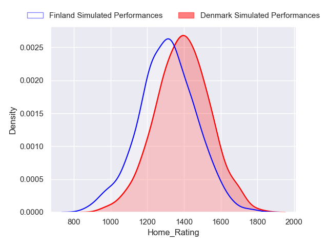
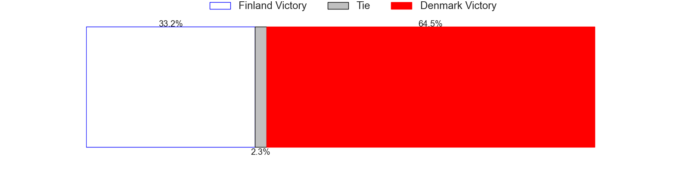
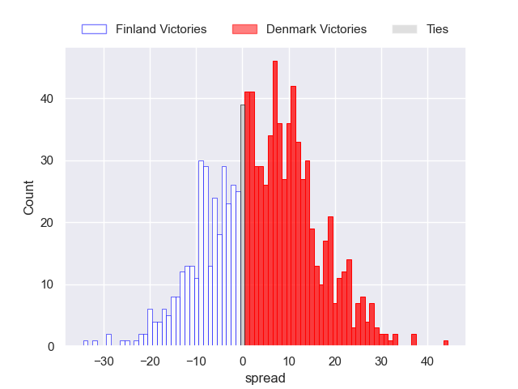

### Bosnia and Herzegovina V Montenegro on 2024/10/05

Average Margin: Bosnia and Herzegovina by 3.1

Average Scoreline: 23-20

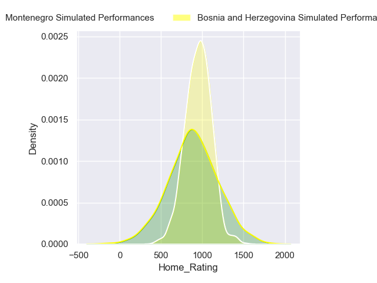
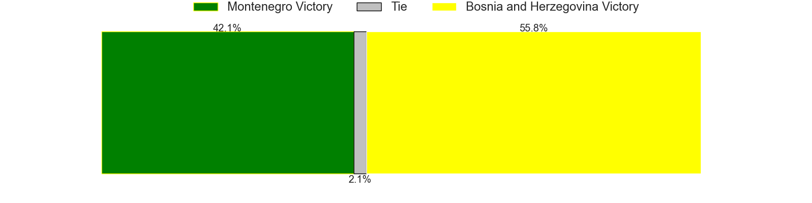
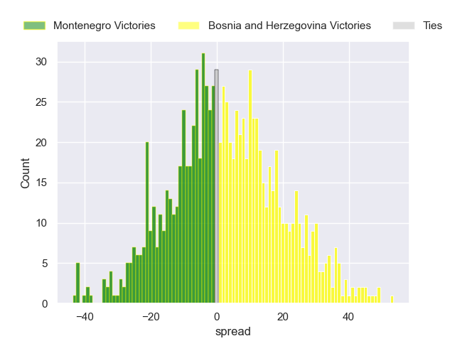

### Serbia V Moldova on 2024/10/05

Average Margin: Moldova by 31.1

Average Scoreline: 40-9

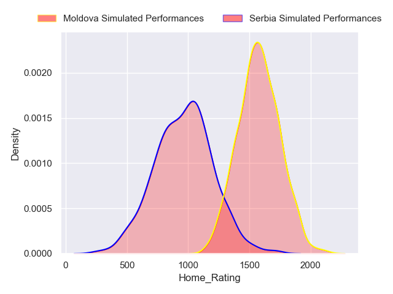
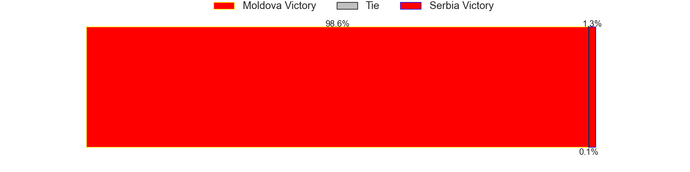
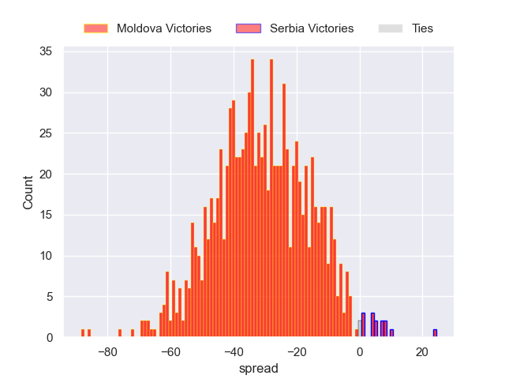

### Malta V Cyprus on 2024/10/05

Average Margin: Malta by 12.7

Average Scoreline: 30-17

### Turkey V Bulgaria on 2024/10/05

Average Margin: Bulgaria by 14.5

Average Scoreline: 35-20

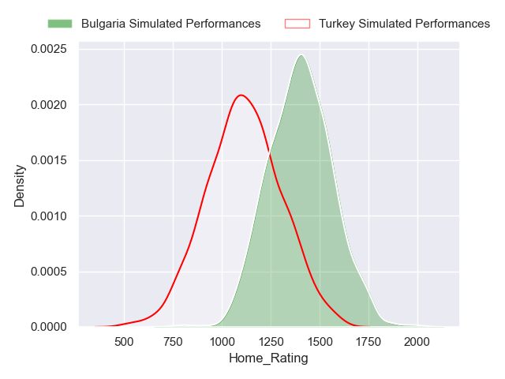
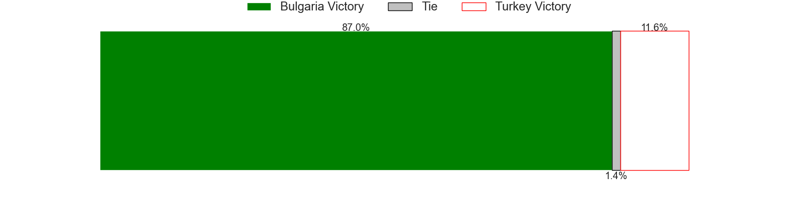
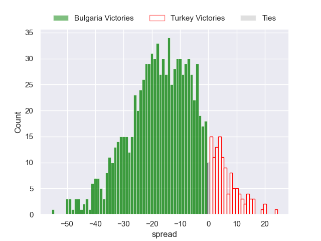

### Chile V Brazil on 2024/10/06

Average Margin: Chile by 9.6

Average Scoreline: 32-23

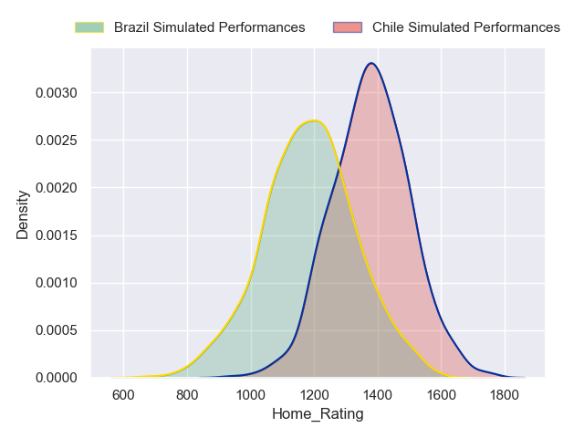
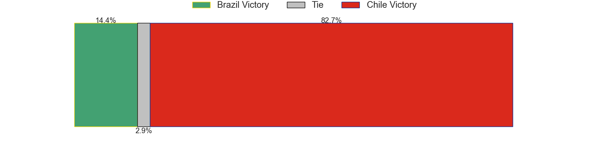
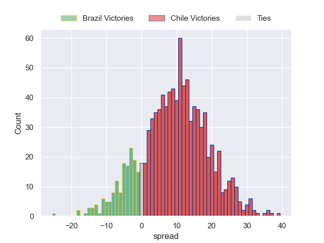

