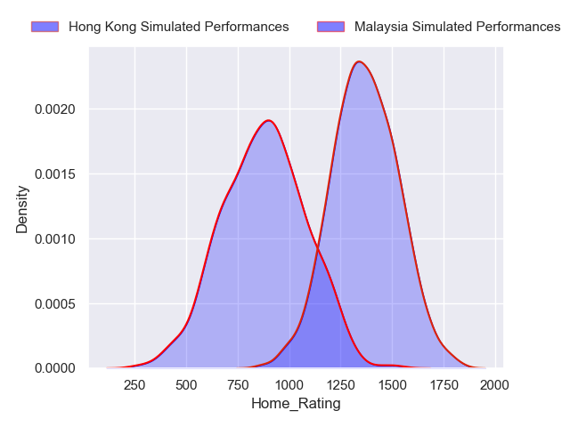
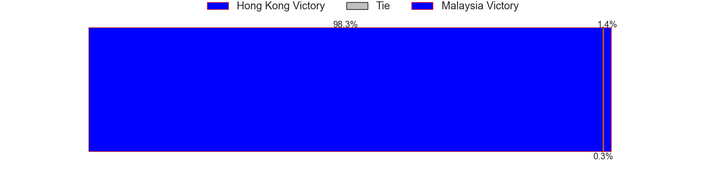
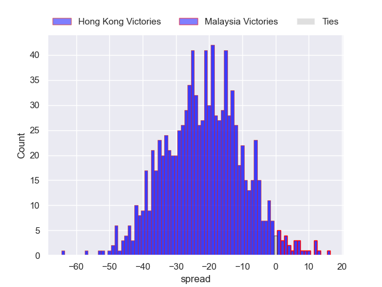
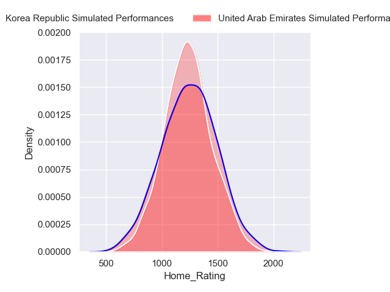
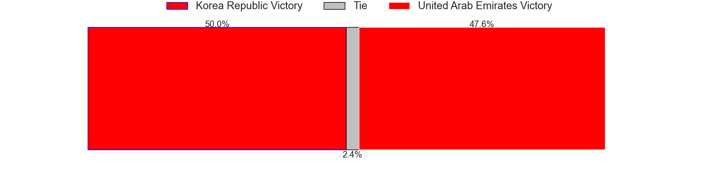
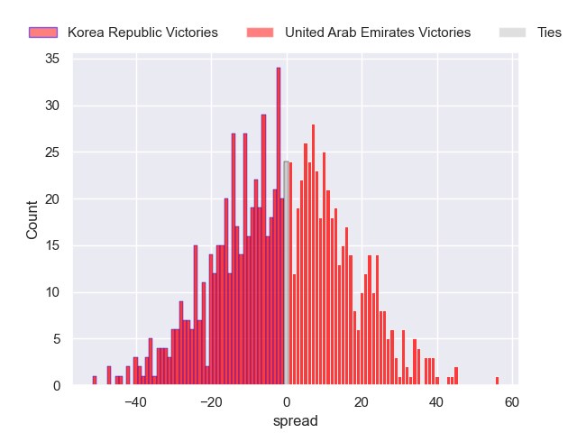

---  
title: "International Test Match 2024 Status"  
date: 2024-06-03 6:00:00 -0500  
categories: model review projection  
layout: article  
aside:  
    toc: true  
---
# Current Team Rankings

# Standings

## Current Standings

| Club                   |   Played |   Wins |   Point Differential |   Losing Bonus Points |   Try Bonus Points |   Competition Points |
|:-----------------------|---------:|-------:|---------------------:|----------------------:|-------------------:|---------------------:|
| Luxembourg             |        2 |      2 |                   80 |                     0 |                nan |                    8 |
| Sri Lanka              |        2 |      2 |                   73 |                     0 |                nan |                    8 |
| Switzerland            |        2 |      2 |                   41 |                     0 |                nan |                    8 |
| Sweden                 |        2 |      2 |                   31 |                     0 |                nan |                    8 |
| Hungary                |        2 |      1 |                   32 |                     1 |                nan |                    5 |
| Qatar                  |        2 |      1 |                    7 |                     1 |                nan |                    5 |
| Korea Republic         |        1 |      1 |                   50 |                     0 |                nan |                    4 |
| Finland                |        1 |      1 |                   50 |                     0 |                nan |                    4 |
| Hong Kong              |        1 |      1 |                   47 |                     0 |                nan |                    4 |
| Moldova                |        1 |      1 |                   42 |                     0 |                nan |                    4 |
| Austria                |        1 |      1 |                   40 |                     0 |                nan |                    4 |
| Andorra                |        1 |      1 |                   24 |                     0 |                nan |                    4 |
| Cayman Islands         |        2 |      1 |                   22 |                     0 |                nan |                    4 |
| Czech Republic         |        2 |      1 |                   14 |                     0 |                nan |                    4 |
| Algeria                |        1 |      1 |                   14 |                     0 |                nan |                    4 |
| Mexico                 |        1 |      1 |                   10 |                     0 |                nan |                    4 |
| Malta                  |        1 |      1 |                   10 |                     0 |                nan |                    4 |
| Latvia                 |        1 |      1 |                    4 |                     0 |                nan |                    4 |
| Zimbabwe               |        1 |      1 |                    4 |                     0 |                nan |                    4 |
| Bermuda                |        2 |      1 |                   -2 |                     0 |                nan |                    4 |
| Croatia                |        2 |      1 |                  -10 |                     0 |                nan |                    4 |
| Malaysia               |        2 |      1 |                  -11 |                     0 |                nan |                    4 |
| Bulgaria               |        2 |      1 |                  -19 |                     0 |                nan |                    4 |
| Kazakhstan             |        2 |      1 |                  -36 |                     0 |                nan |                    4 |
| Denmark                |        1 |      0 |                   -4 |                     1 |                nan |                    1 |
| Zambia                 |        1 |      0 |                   -4 |                     1 |                nan |                    1 |
| Cyprus                 |        1 |      0 |                  -10 |                     0 |                nan |                    0 |
| Senegal                |        1 |      0 |                  -14 |                     0 |                nan |                    0 |
| Serbia                 |        1 |      0 |                  -23 |                     0 |                nan |                    0 |
| Bahamas                |        1 |      0 |                  -30 |                     0 |                nan |                    0 |
| Lithuania              |        2 |      0 |                  -34 |                     0 |                nan |                    0 |
| Singapore              |        1 |      0 |                  -39 |                     0 |                nan |                    0 |
| Ukraine                |        2 |      0 |                  -42 |                     0 |                nan |                    0 |
| India                  |        2 |      0 |                  -44 |                     0 |                nan |                    0 |
| United Arab Emirates   |        1 |      0 |                  -47 |                     0 |                nan |                    0 |
| Norway                 |        2 |      0 |                  -74 |                     0 |                nan |                    0 |
| Bosnia and Herzegovina |        2 |      0 |                  -75 |                     0 |                nan |                    0 |
| Slovenia               |        1 |      0 |                  -77 |                     0 |                nan |                    0 |

## Projected Remaining Table

| Club                 |   Matches Remaining |   Wins |   Point Differential |   Losing Bonus Points |   Try Bonus Points |   Competition Points |
|:---------------------|--------------------:|-------:|---------------------:|----------------------:|-------------------:|---------------------:|
| Hong Kong            |                   1 |    1   |             21.5238  |                   0   |                0.9 |                  4.8 |
| Saint Lucia          |                   1 |    0.6 |              3.67032 |                   0.1 |                0.6 |                  3   |
| Korea Republic       |                   1 |    0.5 |              0.50878 |                   0.1 |                0.3 |                  2.5 |
| United Arab Emirates |                   1 |    0.5 |             -0.50878 |                   0.2 |                0.2 |                  2.3 |
| Barbados             |                   1 |    0.4 |             -3.67032 |                   0.1 |                0.1 |                  2   |
| Malaysia             |                   1 |    0   |            -21.5238  |                   0.1 |                0.2 |                  0.4 |

## Projected Total Table

| Club                   |   Total Matches |   Wins |   Point Differential |   Losing Bonus Points |   Try Bonus Points |   Competition Points |
|:-----------------------|----------------:|-------:|---------------------:|----------------------:|-------------------:|---------------------:|
| Hong Kong              |               2 |    2   |             68.5238  |                   0   |                0.9 |                  8.8 |
| Luxembourg             |               2 |    2   |             80       |                   0   |                0   |                  8   |
| Sri Lanka              |               2 |    2   |             73       |                   0   |                0   |                  8   |
| Switzerland            |               2 |    2   |             41       |                   0   |                0   |                  8   |
| Sweden                 |               2 |    2   |             31       |                   0   |                0   |                  8   |
| Korea Republic         |               2 |    1.5 |             50.5088  |                   0.1 |                0.3 |                  6.5 |
| Hungary                |               2 |    1   |             32       |                   1   |                0   |                  5   |
| Qatar                  |               2 |    1   |              7       |                   1   |                0   |                  5   |
| Malaysia               |               3 |    1   |            -32.5238  |                   0.1 |                0.2 |                  4.4 |
| Finland                |               1 |    1   |             50       |                   0   |                0   |                  4   |
| Moldova                |               1 |    1   |             42       |                   0   |                0   |                  4   |
| Austria                |               1 |    1   |             40       |                   0   |                0   |                  4   |
| Andorra                |               1 |    1   |             24       |                   0   |                0   |                  4   |
| Cayman Islands         |               2 |    1   |             22       |                   0   |                0   |                  4   |
| Algeria                |               1 |    1   |             14       |                   0   |                0   |                  4   |
| Czech Republic         |               2 |    1   |             14       |                   0   |                0   |                  4   |
| Malta                  |               1 |    1   |             10       |                   0   |                0   |                  4   |
| Mexico                 |               1 |    1   |             10       |                   0   |                0   |                  4   |
| Latvia                 |               1 |    1   |              4       |                   0   |                0   |                  4   |
| Zimbabwe               |               1 |    1   |              4       |                   0   |                0   |                  4   |
| Bermuda                |               2 |    1   |             -2       |                   0   |                0   |                  4   |
| Croatia                |               2 |    1   |            -10       |                   0   |                0   |                  4   |
| Bulgaria               |               2 |    1   |            -19       |                   0   |                0   |                  4   |
| Kazakhstan             |               2 |    1   |            -36       |                   0   |                0   |                  4   |
| Saint Lucia            |               1 |    0.6 |              3.67032 |                   0.1 |                0.6 |                  3   |
| United Arab Emirates   |               2 |    0.5 |            -47.5088  |                   0.2 |                0.2 |                  2.3 |
| Barbados               |               1 |    0.4 |             -3.67032 |                   0.1 |                0.1 |                  2   |
| Denmark                |               1 |    0   |             -4       |                   1   |                0   |                  1   |
| Zambia                 |               1 |    0   |             -4       |                   1   |                0   |                  1   |
| Cyprus                 |               1 |    0   |            -10       |                   0   |                0   |                  0   |
| Senegal                |               1 |    0   |            -14       |                   0   |                0   |                  0   |
| Serbia                 |               1 |    0   |            -23       |                   0   |                0   |                  0   |
| Bahamas                |               1 |    0   |            -30       |                   0   |                0   |                  0   |
| Lithuania              |               2 |    0   |            -34       |                   0   |                0   |                  0   |
| Singapore              |               1 |    0   |            -39       |                   0   |                0   |                  0   |
| Ukraine                |               2 |    0   |            -42       |                   0   |                0   |                  0   |
| India                  |               2 |    0   |            -44       |                   0   |                0   |                  0   |
| Norway                 |               2 |    0   |            -74       |                   0   |                0   |                  0   |
| Bosnia and Herzegovina |               2 |    0   |            -75       |                   0   |                0   |                  0   |
| Slovenia               |               1 |    0   |            -77       |                   0   |                0   |                  0   |

# Completed Match Review

| Model | Percent Correct Predictions | Spread Error |
| ------ | ------ | ------ |
| Club Level | 67.9% | 23.2 |
| Player Level: Lineup | nan% | nan |
| Player Level: Minutes | nan% | nan |

# Future Predictions

## Week 3

### Malaysia V Hong Kong on 2024/06/08

Average Margin: Hong Kong by 21.5

Average Scoreline: 36-15

### United Arab Emirates V Korea Republic on 2024/06/09

Average Margin: Korea Republic by 0.5

Average Scoreline: 21-21

