---  
title: "International Test Match 2024 Status"  
date: 2024-10-25 6:00:00 -0500  
categories: model review projection  
layout: article  
aside:  
    toc: true  
---
# Current Team Rankings

# Standings

## Current Standings

| Club                     |   Played |   Wins |   Point Differential |   Losing Bonus Points |   Try Bonus Points |   Competition Points |
|:-------------------------|---------:|-------:|---------------------:|----------------------:|-------------------:|---------------------:|
| Hong Kong                |        7 |      6 |                  303 |                     1 |                nan |                   27 |
| Scotland                 |        5 |      5 |                  201 |                     0 |                nan |                   22 |
| Zimbabwe                 |        4 |      4 |                   54 |                     0 |                nan |                   16 |
| Chile                    |        6 |      4 |                   30 |                     0 |                nan |                   16 |
| South Africa             |        4 |      3 |                   77 |                     1 |                  2 |                   15 |
| Australia                |        3 |      3 |                   28 |                     0 |                  2 |                   14 |
| New Zealand              |        3 |      3 |                   50 |                     0 |                  1 |                   13 |
| Moldova                  |        3 |      3 |                  100 |                     0 |                nan |                   12 |
| Algeria                  |        4 |      3 |                   16 |                     0 |                nan |                   12 |
| Argentina                |        3 |      2 |                   67 |                     0 |                  2 |                   10 |
| Italy                    |        3 |      2 |                   42 |                     0 |                  2 |                   10 |
| France                   |        3 |      2 |                   22 |                     0 |                  1 |                    9 |
| Samoa                    |        2 |      2 |                   12 |                     0 |                nan |                    9 |
| Uganda                   |        3 |      2 |                   11 |                     1 |                nan |                    9 |
| Finland                  |        2 |      2 |                  121 |                     0 |                nan |                    8 |
| Luxembourg               |        2 |      2 |                   80 |                     0 |                nan |                    8 |
| Sri Lanka                |        2 |      2 |                   73 |                     0 |                nan |                    8 |
| Austria                  |        2 |      2 |                   67 |                     0 |                nan |                    8 |
| Switzerland              |        2 |      2 |                   41 |                     0 |                nan |                    8 |
| Malta                    |        2 |      2 |                   32 |                     0 |                nan |                    8 |
| Sweden                   |        2 |      2 |                   31 |                     0 |                nan |                    8 |
| Namibia                  |        4 |      2 |                    7 |                     0 |                nan |                    8 |
| United Arab Emirates     |        3 |      2 |                    0 |                     0 |                nan |                    8 |
| England                  |        3 |      1 |                   27 |                     2 |                  1 |                    7 |
| Denmark                  |        2 |      1 |                  101 |                     1 |                nan |                    5 |
| Brazil                   |        3 |      1 |                   33 |                     1 |                nan |                    5 |
| Qatar                    |        2 |      1 |                    7 |                     1 |                nan |                    5 |
| Hungary                  |        3 |      1 |                    5 |                     1 |                nan |                    5 |
| Spain                    |        2 |      1 |                    5 |                     1 |                nan |                    5 |
| Chinese Taipei           |        2 |      1 |                   -3 |                     1 |                nan |                    5 |
| Ireland                  |        2 |      1 |                   -6 |                     1 |                  0 |                    5 |
| Korea Republic           |        3 |      1 |                  -14 |                     1 |                nan |                    5 |
| Georgia                  |        3 |      1 |                  -18 |                     0 |                  1 |                    5 |
| Senegal                  |        4 |      1 |                  -19 |                     1 |                nan |                    5 |
| Singapore                |        3 |      1 |                  -21 |                     1 |                nan |                    5 |
| Portugal                 |        2 |      1 |                  -28 |                     0 |                  1 |                    5 |
| Colombia                 |        2 |      1 |                  105 |                     0 |                nan |                    4 |
| Barbados                 |        1 |      1 |                   84 |                     0 |                nan |                    4 |
| Jamaica                  |        1 |      1 |                   34 |                     0 |                nan |                    4 |
| Andorra                  |        1 |      1 |                   24 |                     0 |                nan |                    4 |
| Trinidad and Tobago      |        1 |      1 |                   23 |                     0 |                nan |                    4 |
| Cayman Islands           |        2 |      1 |                   22 |                     0 |                nan |                    4 |
| Czech Republic           |        2 |      1 |                   14 |                     0 |                nan |                    4 |
| Venezuela                |        1 |      1 |                   12 |                     0 |                nan |                    4 |
| Mexico                   |        1 |      1 |                   10 |                     0 |                nan |                    4 |
| Turkey                   |        2 |      1 |                    9 |                     0 |                nan |                    4 |
| Australia Women          |        1 |      1 |                    7 |                     0 |                nan |                    4 |
| Latvia                   |        1 |      1 |                    4 |                     0 |                nan |                    4 |
| Kenya                    |        3 |      1 |                    0 |                     0 |                nan |                    4 |
| Bermuda                  |        2 |      1 |                   -2 |                     0 |                nan |                    4 |
| Belgium                  |        2 |      1 |                   -3 |                     0 |                nan |                    4 |
| Croatia                  |        2 |      1 |                  -10 |                     0 |                nan |                    4 |
| Romania                  |        2 |      1 |                  -11 |                     0 |                nan |                    4 |
| Slovenia                 |        2 |      1 |                  -13 |                     0 |                nan |                    4 |
| Thailand                 |        2 |      1 |                  -15 |                     0 |                nan |                    4 |
| Ivory Coast              |        3 |      1 |                  -24 |                     0 |                nan |                    4 |
| Fiji                     |        2 |      1 |                  -33 |                     0 |                  0 |                    4 |
| Kazakhstan               |        2 |      1 |                  -36 |                     0 |                nan |                    4 |
| Canada                   |        2 |      1 |                  -48 |                     0 |                nan |                    4 |
| Bulgaria                 |        3 |      1 |                  -58 |                     0 |                nan |                    4 |
| Bosnia and Herzegovina   |        3 |      1 |                  -65 |                     0 |                nan |                    4 |
| Malaysia                 |        4 |      1 |                 -118 |                     0 |                nan |                    4 |
| Paraguay                 |        6 |      1 |                 -254 |                     0 |                nan |                    4 |
| Zambia                   |        1 |      0 |                   -4 |                     1 |                nan |                    1 |
| South Africa Women       |        1 |      0 |                   -7 |                     1 |                nan |                    1 |
| United States of America |        2 |      0 |                  -37 |                     1 |                  0 |                    1 |
| Wales                    |        3 |      0 |                  -45 |                     0 |                  1 |                    1 |
| Japan                    |        3 |      0 |                  -65 |                     1 |                  0 |                    1 |
| Uruguay                  |        3 |      0 |                 -101 |                     0 |                nan |                    1 |
| Montenegro               |        1 |      0 |                  -10 |                     0 |                nan |                    0 |
| Peru                     |        1 |      0 |                  -12 |                     0 |                nan |                    0 |
| Guyana                   |        1 |      0 |                  -23 |                     0 |                nan |                    0 |
| Tonga                    |        2 |      0 |                  -31 |                     0 |                  0 |                    0 |
| Cyprus                   |        2 |      0 |                  -32 |                     0 |                nan |                    0 |
| Lithuania                |        2 |      0 |                  -34 |                     0 |                nan |                    0 |
| Ukraine                  |        2 |      0 |                  -42 |                     0 |                nan |                    0 |
| India                    |        2 |      0 |                  -44 |                     0 |                nan |                    0 |
| Serbia                   |        2 |      0 |                  -51 |                     0 |                nan |                    0 |
| Burkina Faso             |        3 |      0 |                  -56 |                     0 |                nan |                    0 |
| Bahamas                  |        2 |      0 |                  -64 |                     0 |                nan |                    0 |
| Kosovo                   |        1 |      0 |                  -64 |                     0 |                nan |                    0 |
| Saint Lucia              |        1 |      0 |                  -84 |                     0 |                nan |                    0 |
| Estonia                  |        1 |      0 |                 -105 |                     0 |                nan |                    0 |
| Costa Rica               |        1 |      0 |                 -136 |                     0 |                nan |                    0 |
| Norway                   |        3 |      0 |                 -145 |                     0 |                nan |                    0 |

## Projected Remaining Table

| Club           |   Matches Remaining |   Wins |   Point Differential |   Losing Bonus Points |   Try Bonus Points |   Competition Points |
|:---------------|--------------------:|-------:|---------------------:|----------------------:|-------------------:|---------------------:|
| New Zealand    |                   1 |    1   |            14.8887   |                   0   |                0.9 |                  4.9 |
| Latvia         |                   1 |    1   |            23.9886   |                   0   |                0.9 |                  4.8 |
| Hungary        |                   1 |    0.9 |            17.594    |                   0.1 |                0.8 |                  4.3 |
| Sweden         |                   1 |    0.7 |             4.69914  |                   0.2 |                0.3 |                  3.1 |
| Lithuania      |                   1 |    0.5 |             0.277389 |                   0.2 |                0.2 |                  2.5 |
| Luxembourg     |                   1 |    0.5 |            -0.277389 |                   0.2 |                0.3 |                  2.5 |
| Czech Republic |                   1 |    0.3 |            -4.69914  |                   0.3 |                0.2 |                  1.8 |
| Slovakia       |                   1 |    0.1 |           -17.594    |                   0.1 |                0.2 |                  0.9 |
| Norway         |                   1 |    0   |           -23.9886   |                   0.1 |                0.3 |                  0.5 |
| Japan          |                   1 |    0   |           -14.8887   |                   0.1 |                0.1 |                  0.2 |

## Projected Total Table

| Club                     |   Total Matches |   Wins |   Point Differential |   Losing Bonus Points |   Try Bonus Points |   Competition Points |
|:-------------------------|----------------:|-------:|---------------------:|----------------------:|-------------------:|---------------------:|
| Hong Kong                |               7 |    6   |            303       |                   1   |                0   |                 27   |
| Scotland                 |               5 |    5   |            201       |                   0   |                0   |                 22   |
| New Zealand              |               4 |    4   |             64.8887  |                   0   |                1.9 |                 17.9 |
| Zimbabwe                 |               4 |    4   |             54       |                   0   |                0   |                 16   |
| Chile                    |               6 |    4   |             30       |                   0   |                0   |                 16   |
| South Africa             |               4 |    3   |             77       |                   1   |                2   |                 15   |
| Australia                |               3 |    3   |             28       |                   0   |                2   |                 14   |
| Moldova                  |               3 |    3   |            100       |                   0   |                0   |                 12   |
| Algeria                  |               4 |    3   |             16       |                   0   |                0   |                 12   |
| Sweden                   |               3 |    2.7 |             35.6991  |                   0.2 |                0.3 |                 11.1 |
| Luxembourg               |               3 |    2.5 |             79.7226  |                   0.2 |                0.3 |                 10.5 |
| Argentina                |               3 |    2   |             67       |                   0   |                2   |                 10   |
| Italy                    |               3 |    2   |             42       |                   0   |                2   |                 10   |
| Hungary                  |               4 |    1.9 |             22.594   |                   1.1 |                0.8 |                  9.3 |
| France                   |               3 |    2   |             22       |                   0   |                1   |                  9   |
| Samoa                    |               2 |    2   |             12       |                   0   |                0   |                  9   |
| Uganda                   |               3 |    2   |             11       |                   1   |                0   |                  9   |
| Latvia                   |               2 |    2   |             27.9886  |                   0   |                0.9 |                  8.8 |
| Finland                  |               2 |    2   |            121       |                   0   |                0   |                  8   |
| Sri Lanka                |               2 |    2   |             73       |                   0   |                0   |                  8   |
| Austria                  |               2 |    2   |             67       |                   0   |                0   |                  8   |
| Switzerland              |               2 |    2   |             41       |                   0   |                0   |                  8   |
| Malta                    |               2 |    2   |             32       |                   0   |                0   |                  8   |
| Namibia                  |               4 |    2   |              7       |                   0   |                0   |                  8   |
| United Arab Emirates     |               3 |    2   |              0       |                   0   |                0   |                  8   |
| England                  |               3 |    1   |             27       |                   2   |                1   |                  7   |
| Czech Republic           |               3 |    1.3 |              9.30086 |                   0.3 |                0.2 |                  5.8 |
| Denmark                  |               2 |    1   |            101       |                   1   |                0   |                  5   |
| Brazil                   |               3 |    1   |             33       |                   1   |                0   |                  5   |
| Qatar                    |               2 |    1   |              7       |                   1   |                0   |                  5   |
| Spain                    |               2 |    1   |              5       |                   1   |                0   |                  5   |
| Chinese Taipei           |               2 |    1   |             -3       |                   1   |                0   |                  5   |
| Ireland                  |               2 |    1   |             -6       |                   1   |                0   |                  5   |
| Korea Republic           |               3 |    1   |            -14       |                   1   |                0   |                  5   |
| Georgia                  |               3 |    1   |            -18       |                   0   |                1   |                  5   |
| Senegal                  |               4 |    1   |            -19       |                   1   |                0   |                  5   |
| Singapore                |               3 |    1   |            -21       |                   1   |                0   |                  5   |
| Portugal                 |               2 |    1   |            -28       |                   0   |                1   |                  5   |
| Colombia                 |               2 |    1   |            105       |                   0   |                0   |                  4   |
| Barbados                 |               1 |    1   |             84       |                   0   |                0   |                  4   |
| Jamaica                  |               1 |    1   |             34       |                   0   |                0   |                  4   |
| Andorra                  |               1 |    1   |             24       |                   0   |                0   |                  4   |
| Trinidad and Tobago      |               1 |    1   |             23       |                   0   |                0   |                  4   |
| Cayman Islands           |               2 |    1   |             22       |                   0   |                0   |                  4   |
| Venezuela                |               1 |    1   |             12       |                   0   |                0   |                  4   |
| Mexico                   |               1 |    1   |             10       |                   0   |                0   |                  4   |
| Turkey                   |               2 |    1   |              9       |                   0   |                0   |                  4   |
| Australia Women          |               1 |    1   |              7       |                   0   |                0   |                  4   |
| Kenya                    |               3 |    1   |              0       |                   0   |                0   |                  4   |
| Bermuda                  |               2 |    1   |             -2       |                   0   |                0   |                  4   |
| Belgium                  |               2 |    1   |             -3       |                   0   |                0   |                  4   |
| Croatia                  |               2 |    1   |            -10       |                   0   |                0   |                  4   |
| Romania                  |               2 |    1   |            -11       |                   0   |                0   |                  4   |
| Slovenia                 |               2 |    1   |            -13       |                   0   |                0   |                  4   |
| Thailand                 |               2 |    1   |            -15       |                   0   |                0   |                  4   |
| Ivory Coast              |               3 |    1   |            -24       |                   0   |                0   |                  4   |
| Fiji                     |               2 |    1   |            -33       |                   0   |                0   |                  4   |
| Kazakhstan               |               2 |    1   |            -36       |                   0   |                0   |                  4   |
| Canada                   |               2 |    1   |            -48       |                   0   |                0   |                  4   |
| Bulgaria                 |               3 |    1   |            -58       |                   0   |                0   |                  4   |
| Bosnia and Herzegovina   |               3 |    1   |            -65       |                   0   |                0   |                  4   |
| Malaysia                 |               4 |    1   |           -118       |                   0   |                0   |                  4   |
| Paraguay                 |               6 |    1   |           -254       |                   0   |                0   |                  4   |
| Lithuania                |               3 |    0.5 |            -33.7226  |                   0.2 |                0.2 |                  2.5 |
| Japan                    |               4 |    0   |            -79.8887  |                   1.1 |                0.1 |                  1.2 |
| Zambia                   |               1 |    0   |             -4       |                   1   |                0   |                  1   |
| South Africa Women       |               1 |    0   |             -7       |                   1   |                0   |                  1   |
| United States of America |               2 |    0   |            -37       |                   1   |                0   |                  1   |
| Wales                    |               3 |    0   |            -45       |                   0   |                1   |                  1   |
| Uruguay                  |               3 |    0   |           -101       |                   0   |                0   |                  1   |
| Slovakia                 |               1 |    0.1 |            -17.594   |                   0.1 |                0.2 |                  0.9 |
| Norway                   |               4 |    0   |           -168.989   |                   0.1 |                0.3 |                  0.5 |
| Montenegro               |               1 |    0   |            -10       |                   0   |                0   |                  0   |
| Peru                     |               1 |    0   |            -12       |                   0   |                0   |                  0   |
| Guyana                   |               1 |    0   |            -23       |                   0   |                0   |                  0   |
| Tonga                    |               2 |    0   |            -31       |                   0   |                0   |                  0   |
| Cyprus                   |               2 |    0   |            -32       |                   0   |                0   |                  0   |
| Ukraine                  |               2 |    0   |            -42       |                   0   |                0   |                  0   |
| India                    |               2 |    0   |            -44       |                   0   |                0   |                  0   |
| Serbia                   |               2 |    0   |            -51       |                   0   |                0   |                  0   |
| Burkina Faso             |               3 |    0   |            -56       |                   0   |                0   |                  0   |
| Bahamas                  |               2 |    0   |            -64       |                   0   |                0   |                  0   |
| Kosovo                   |               1 |    0   |            -64       |                   0   |                0   |                  0   |
| Saint Lucia              |               1 |    0   |            -84       |                   0   |                0   |                  0   |
| Estonia                  |               1 |    0   |           -105       |                   0   |                0   |                  0   |
| Costa Rica               |               1 |    0   |           -136       |                   0   |                0   |                  0   |

# Completed Match Review

| Model | Percent Correct Predictions | Spread Error |
| ------ | ------ | ------ |
| Club Level | 73.5% | 23.3 |
| Player Level: Lineup | 70.6% | 19.5 |
| Player Level: Minutes | 72.7% | 20.4 |

# Future Predictions

## Week 8

### Sweden V Czech Republic on 2024/10/26

Average Margin: Sweden by 4.7

Average Scoreline: 32-28

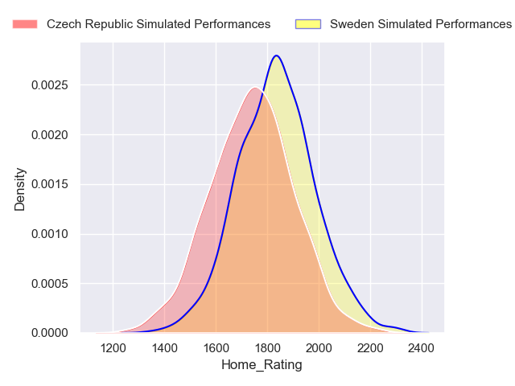
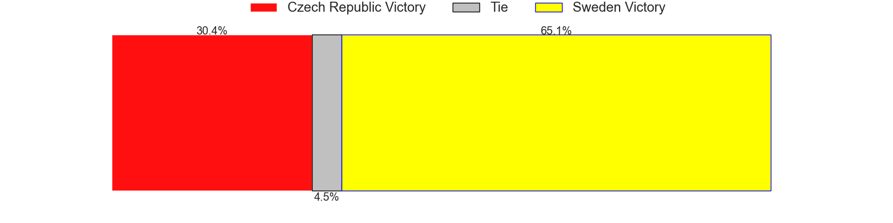
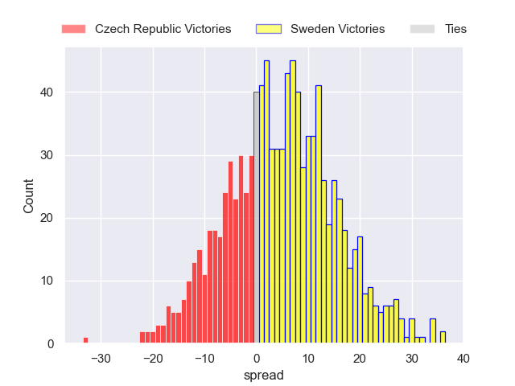

### Slovakia V Hungary on 2024/10/26

Average Margin: Hungary by 17.6

Average Scoreline: 32-14

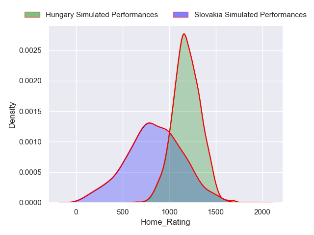
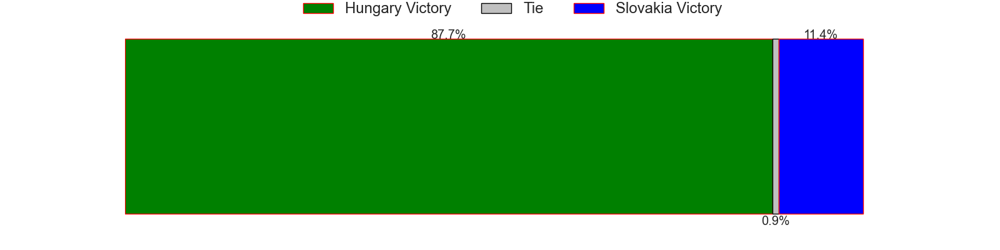
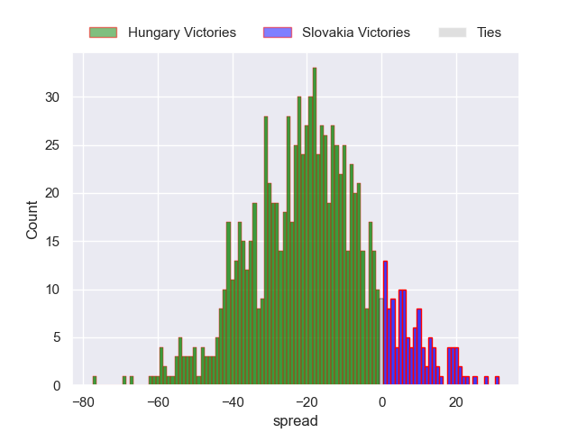

### Norway V Latvia on 2024/10/26

Average Margin: Latvia by 24.0

Average Scoreline: 35-11

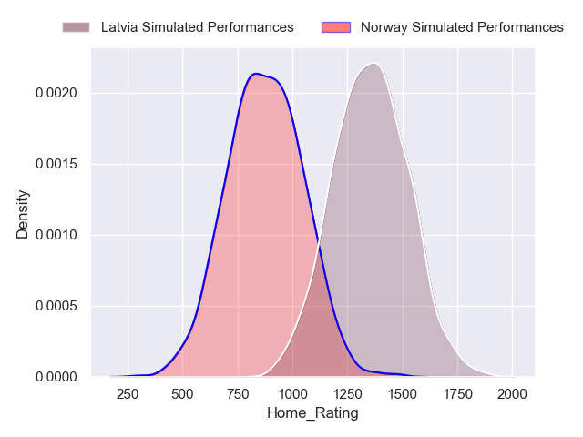
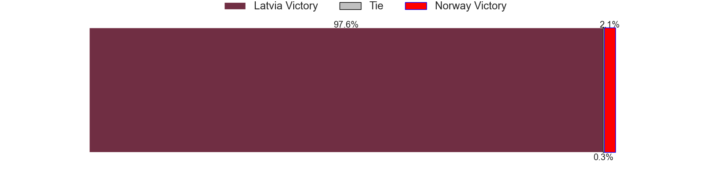
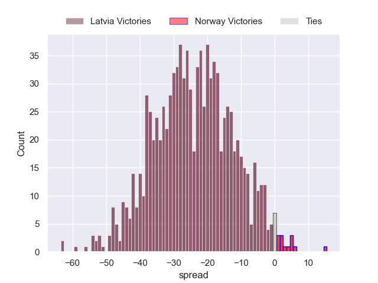

### Lithuania V Luxembourg on 2024/10/26

Average Margin: Lithuania by 0.3

Average Scoreline: 21-20

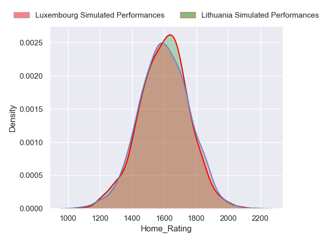

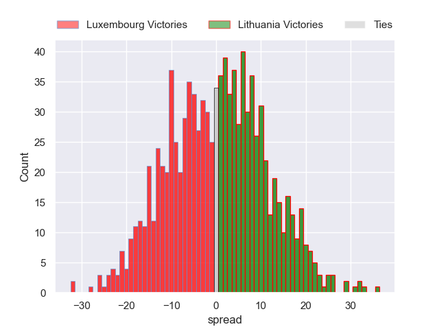

### Japan V New Zealand on 2024/10/26

Average Margin: New Zealand by 14.9

Average Scoreline: 38-23

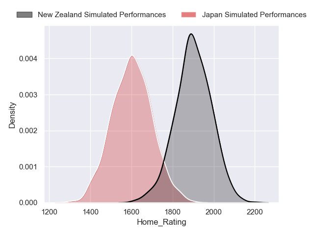
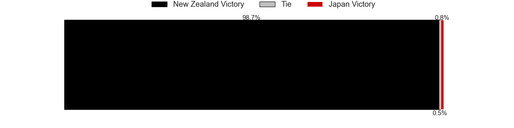
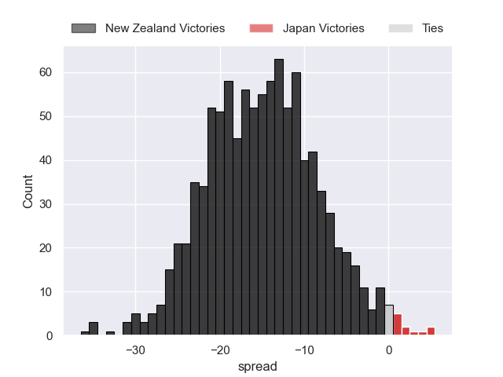

