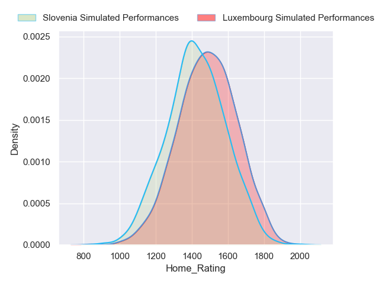
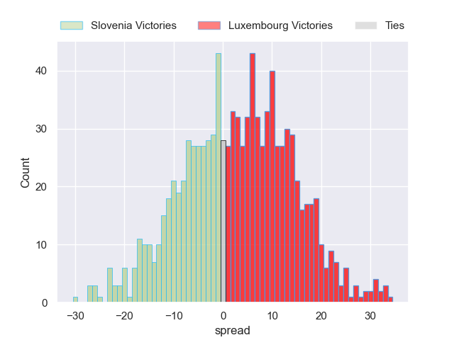

---  
title: "International Test Match 2024 Status"  
date: 2024-04-15 6:00:00 -0500  
categories: model review projection  
layout: article  
aside:  
    toc: true  
---
# Current Team Rankings

# Standings

## Current Standings

| Club                   |   Played |   Wins |   Point Differential |   Losing Bonus Points |   Try Bonus Points |   Competition Points |
|:-----------------------|---------:|-------:|---------------------:|----------------------:|-------------------:|---------------------:|
| Switzerland            |        2 |      2 |                   41 |                     0 |                nan |                    8 |
| Sweden                 |        2 |      2 |                   31 |                     0 |                nan |                    8 |
| Austria                |        1 |      1 |                   40 |                     0 |                nan |                    4 |
| Czech Republic         |        2 |      1 |                   14 |                     0 |                nan |                    4 |
| Algeria                |        1 |      1 |                   14 |                     0 |                nan |                    4 |
| Luxembourg             |        1 |      1 |                    3 |                     0 |                nan |                    4 |
| Croatia                |        2 |      1 |                  -10 |                     0 |                nan |                    4 |
| Hungary                |        1 |      0 |                   -3 |                     1 |                nan |                    1 |
| Senegal                |        1 |      0 |                  -14 |                     0 |                nan |                    0 |
| Lithuania              |        2 |      0 |                  -34 |                     0 |                nan |                    0 |
| Bosnia and Herzegovina |        1 |      0 |                  -40 |                     0 |                nan |                    0 |
| Ukraine                |        2 |      0 |                  -42 |                     0 |                nan |                    0 |

## Projected Remaining Table

| Club                   |   Matches Remaining |   Wins |   Point Differential |   Losing Bonus Points |   Try Bonus Points |   Competition Points |
|:-----------------------|--------------------:|-------:|---------------------:|----------------------:|-------------------:|---------------------:|
| Bulgaria               |                   2 |    1.2 |             25.6098  |                   0.2 |                1   |                  6   |
| Andorra                |                   1 |    0.9 |             18.2555  |                   0   |                0.7 |                  4.5 |
| Hungary                |                   1 |    0.9 |             12.1646  |                   0.1 |                0.7 |                  4.4 |
| Finland                |                   1 |    0.9 |             13.0399  |                   0.1 |                0.7 |                  4.3 |
| Moldova                |                   1 |    0.8 |             10.6609  |                   0.1 |                0.3 |                  3.7 |
| Latvia                 |                   1 |    0.8 |              7.04227 |                   0.1 |                0.4 |                  3.6 |
| Luxembourg             |                   1 |    0.6 |              3.08417 |                   0.2 |                0.3 |                  2.9 |
| Cyprus                 |                   1 |    0.6 |              1.81421 |                   0.2 |                0.3 |                  2.7 |
| Malta                  |                   1 |    0.4 |             -1.81421 |                   0.2 |                0.3 |                  2.3 |
| Slovenia               |                   1 |    0.4 |             -3.08417 |                   0.2 |                0.3 |                  2.1 |
| Norway                 |                   2 |    0.2 |            -31.2954  |                   0.3 |                0.6 |                  1.6 |
| Denmark                |                   1 |    0.2 |             -7.04227 |                   0.3 |                0.2 |                  1.4 |
| Bosnia and Herzegovina |                   1 |    0.1 |            -12.1646  |                   0.2 |                0.3 |                  1   |
| Serbia                 |                   1 |    0   |            -36.2707  |                   0   |                0.1 |                  0.2 |

## Projected Total Table

| Club                   |   Total Matches |   Wins |   Point Differential |   Losing Bonus Points |   Try Bonus Points |   Competition Points |
|:-----------------------|----------------:|-------:|---------------------:|----------------------:|-------------------:|---------------------:|
| Switzerland            |               2 |    2   |             41       |                   0   |                0   |                  8   |
| Sweden                 |               2 |    2   |             31       |                   0   |                0   |                  8   |
| Luxembourg             |               2 |    1.6 |              6.08417 |                   0.2 |                0.3 |                  6.9 |
| Bulgaria               |               2 |    1.2 |             25.6098  |                   0.2 |                1   |                  6   |
| Hungary                |               2 |    0.9 |              9.16459 |                   1.1 |                0.7 |                  5.4 |
| Andorra                |               1 |    0.9 |             18.2555  |                   0   |                0.7 |                  4.5 |
| Finland                |               1 |    0.9 |             13.0399  |                   0.1 |                0.7 |                  4.3 |
| Austria                |               1 |    1   |             40       |                   0   |                0   |                  4   |
| Algeria                |               1 |    1   |             14       |                   0   |                0   |                  4   |
| Czech Republic         |               2 |    1   |             14       |                   0   |                0   |                  4   |
| Croatia                |               2 |    1   |            -10       |                   0   |                0   |                  4   |
| Moldova                |               1 |    0.8 |             10.6609  |                   0.1 |                0.3 |                  3.7 |
| Latvia                 |               1 |    0.8 |              7.04227 |                   0.1 |                0.4 |                  3.6 |
| Cyprus                 |               1 |    0.6 |              1.81421 |                   0.2 |                0.3 |                  2.7 |
| Malta                  |               1 |    0.4 |             -1.81421 |                   0.2 |                0.3 |                  2.3 |
| Slovenia               |               1 |    0.4 |             -3.08417 |                   0.2 |                0.3 |                  2.1 |
| Norway                 |               2 |    0.2 |            -31.2954  |                   0.3 |                0.6 |                  1.6 |
| Denmark                |               1 |    0.2 |             -7.04227 |                   0.3 |                0.2 |                  1.4 |
| Bosnia and Herzegovina |               2 |    0.1 |            -52.1646  |                   0.2 |                0.3 |                  1   |
| Serbia                 |               1 |    0   |            -36.2707  |                   0   |                0.1 |                  0.2 |
| Senegal                |               1 |    0   |            -14       |                   0   |                0   |                  0   |
| Lithuania              |               2 |    0   |            -34       |                   0   |                0   |                  0   |
| Ukraine                |               2 |    0   |            -42       |                   0   |                0   |                  0   |

# Completed Match Review

| Model | Percent Correct Predictions | Spread Error |
| ------ | ------ | ------ |
| Club Level | 88.9% | 13.9 |
| Player Level: Lineup | nan% | nan |
| Player Level: Minutes | nan% | nan |

# Future Predictions

## Week 3

### Luxembourg V Slovenia on 2024/04/20

Average Margin: Luxembourg by 3.1

Average Scoreline: 21-18

### Bosnia and Herzegovina V Hungary on 2024/04/20

Average Margin: Hungary by 12.2

Average Scoreline: 43-30

### Bulgaria V Serbia on 2024/04/20

Average Margin: Bulgaria by 36.3

Average Scoreline: 46-9

### Latvia V Denmark on 2024/04/20

Average Margin: Latvia by 7.0

Average Scoreline: 26-19

## Week 4

### Norway V Andorra on 2024/05/04

Average Margin: Andorra by 18.3

Average Scoreline: 34-15

### Moldova V Bulgaria on 2024/05/04

Average Margin: Moldova by 10.7

Average Scoreline: 28-17

### Cyprus V Malta on 2024/05/04

Average Margin: Cyprus by 1.8

Average Scoreline: 22-20

## Week 5

### Norway V Finland on 2024/05/11

Average Margin: Finland by 13.0

Average Scoreline: 40-27

