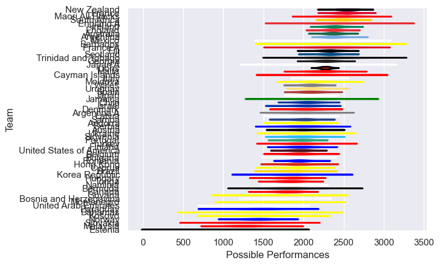

---  
title: "International Test Match 2025"  
date: 2025-08-22 6:00:00 -0500  
categories: model review projection  
layout: article  
aside:  
    toc: true  
---
# Team Rankings

# Standings

## Current Standings

| Club                     |   Played |   Wins |   Point Differential |   Losing Bonus Points |   Try Bonus Points |   Competition Points |
|:-------------------------|---------:|-------:|---------------------:|----------------------:|-------------------:|---------------------:|
| South Africa             |        3 |      3 |                  108 |                     0 |                  3 |                   15 |
| New Zealand              |        3 |      3 |                   40 |                     0 |                  3 |                   15 |
| England                  |        3 |      3 |                   63 |                     0 |                  2 |                   14 |
| Denmark                  |        3 |      3 |                   64 |                     0 |                    |                   12 |
| Chile                    |        3 |      3 |                   53 |                     0 |                    |                   12 |
| Ireland                  |        2 |      2 |                  128 |                     0 |                  2 |                   10 |
| Argentina                |        4 |      2 |                   11 |                     1 |                  1 |                   10 |
| Spain                    |        2 |      2 |                   12 |                     0 |                  1 |                    9 |
| Australia                |        4 |      2 |                    2 |                     1 |                    |                    9 |
| Lions                    |        4 |      2 |                   -3 |                     1 |                    |                    9 |
| Finland                  |        2 |      2 |                  116 |                     0 |                    |                    8 |
| Uruguay                  |        3 |      2 |                   65 |                     0 |                    |                    8 |
| Mexico                   |        2 |      2 |                   44 |                     0 |                    |                    8 |
| Cayman Islands           |        2 |      2 |                   39 |                     0 |                    |                    8 |
| Serbia                   |        2 |      2 |                   32 |                     0 |                    |                    8 |
| Slovenia                 |        2 |      2 |                   30 |                     0 |                    |                    8 |
| Andorra                  |        2 |      2 |                   12 |                     0 |                    |                    8 |
| Austria                  |        2 |      1 |                  114 |                     0 |                    |                    6 |
| Ukraine                  |        2 |      1 |                   76 |                     0 |                    |                    6 |
| Fiji                     |        2 |      1 |                   12 |                     1 |                  1 |                    6 |
| Wales                    |        2 |      1 |                    4 |                     1 |                  1 |                    6 |
| Barbados                 |        2 |      1 |                   39 |                     1 |                    |                    5 |
| Scotland                 |        2 |      1 |                   14 |                     0 |                  1 |                    5 |
| Italy                    |        3 |      1 |                    4 |                     0 |                  1 |                    5 |
| Israel                   |        2 |      1 |                   -2 |                     1 |                    |                    5 |
| United States of America |        3 |      1 |                  -27 |                     0 |                  1 |                    5 |
| Bosnia and Herzegovina   |        2 |      1 |                   54 |                     0 |                    |                    4 |
| Argentina A              |        1 |      1 |                   38 |                     0 |                    |                    4 |
| Maori All Blacks         |        1 |      1 |                   33 |                     0 |                    |                    4 |
| Norway                   |        2 |      1 |                   22 |                     0 |                    |                    4 |
| France A                 |        1 |      1 |                    2 |                     0 |                    |                    4 |
| Malaysia                 |        2 |      1 |                    0 |                     0 |                    |                    4 |
| Japan                    |        2 |      1 |                   -4 |                     0 |                    |                    4 |
| Cyprus                   |        3 |      0 |                   -9 |                     0 |                    |                    4 |
| Belgium                  |        2 |      1 |                  -12 |                     0 |                    |                    4 |
| Bulgaria                 |        2 |      1 |                  -15 |                     0 |                    |                    4 |
| Trinidad and Tobago      |        2 |      1 |                  -30 |                     0 |                    |                    4 |
| Bahamas                  |        1 |      0 |                    0 |                     0 |                    |                    2 |
| Latvia                   |        2 |      0 |                   -4 |                     2 |                    |                    2 |
| Bermuda                  |        2 |      0 |                   -8 |                     0 |                    |                    2 |
| Canada                   |        2 |      0 |                   -8 |                     2 |                    |                    2 |
| Brazil                   |        3 |      0 |                  -29 |                     0 |                    |                    2 |
| Romania                  |        4 |      0 |                 -124 |                     0 |                    |                    2 |
| Malta                    |        1 |      0 |                   -1 |                     1 |                    |                    1 |
| England A                |        1 |      0 |                   -2 |                     1 |                    |                    1 |
| Moldova                  |        2 |      0 |                  -36 |                     1 |                    |                    1 |
| France                   |        3 |      0 |                  -40 |                     1 |                    |                    1 |
| Jamaica                  |        1 |      0 |                  -13 |                     0 |                    |                    0 |
| Turkey                   |        1 |      0 |                  -16 |                     0 |                    |                    0 |
| Montenegro               |        1 |      0 |                  -17 |                     0 |                    |                    0 |
| Samoa                    |        1 |      0 |                  -29 |                     0 |                    |                    0 |
| Japan A                  |        1 |      0 |                  -33 |                     0 |                    |                    0 |
| Paraguay                 |        1 |      0 |                  -38 |                     0 |                    |                    0 |
| Kosovo                   |        1 |      0 |                  -67 |                     0 |                    |                    0 |
| Namibia                  |        1 |      0 |                  -67 |                     0 |                    |                    0 |
| Guyana                   |        2 |      0 |                  -71 |                     0 |                    |                    0 |
| Georgia                  |        2 |      0 |                  -74 |                     0 |                    |                    0 |
| Hungary                  |        1 |      0 |                  -76 |                     0 |                    |                    0 |
| Portugal                 |        1 |      0 |                  -99 |                     0 |                    |                    0 |
| Slovakia                 |        1 |      0 |                 -114 |                     0 |                    |                    0 |
| Estonia                  |        2 |      0 |                 -163 |                     0 |                    |                    0 |

## Projected Remaining Table

| Club                     |   To Play |   Projected Wins |   Projected Differential |   Projected Losing Bonus Points | Projected Try Bonus Points   |   Projected Competition Points |
|:-------------------------|----------:|-----------------:|-------------------------:|--------------------------------:|:-----------------------------|-------------------------------:|
| England                  |         4 |            2.59  |                   20.141 |                           0.688 |                              |                         11.39  |
| Scotland                 |         4 |            2.476 |                   27.887 |                           0.664 |                              |                         10.866 |
| Ireland                  |         4 |            2.402 |                   18.886 |                           0.725 |                              |                         10.665 |
| New Zealand              |         4 |            2.225 |                   10.029 |                           0.815 |                              |                         10.063 |
| South Africa             |         4 |            2.207 |                   11.075 |                           0.781 |                              |                          9.927 |
| Australia                |         5 |            2.094 |                   -8.706 |                           1.04  |                              |                          9.864 |
| France                   |         3 |            1.946 |                   15.241 |                           0.506 |                              |                          8.544 |
| Wales                    |         4 |            1.445 |                  -16.298 |                           0.818 |                              |                          6.896 |
| Argentina                |         3 |            1.325 |                   -3.471 |                           0.645 |                              |                          6.219 |
| Italy                    |         3 |            1.292 |                   -4.391 |                           0.629 |                              |                          6.069 |
| Japan                    |         4 |            1.104 |                  -30.146 |                           0.809 |                              |                          5.539 |
| Uruguay                  |         1 |            0.758 |                   17.515 |                           0.116 |                              |                          3.208 |
| Korea Republic           |         1 |            0.732 |                   15.019 |                           0.113 |                              |                          3.111 |
| Hong Kong                |         1 |            0.681 |                    9.463 |                           0.122 |                              |                          2.928 |
| Georgia                  |         1 |            0.669 |                    6.405 |                           0.145 |                              |                          2.921 |
| Fiji                     |         2 |            0.501 |                  -14.314 |                           0.454 |                              |                          2.6   |
| United Arab Emirates     |         2 |            0.511 |                  -24.482 |                           0.344 |                              |                          2.54  |
| Samoa                    |         1 |            0.329 |                   -4.489 |                           0.243 |                              |                          1.645 |
| Paraguay                 |         1 |            0.212 |                  -17.515 |                           0.144 |                              |                          1.052 |
| United States of America |         1 |            0.204 |                  -12.301 |                           0.149 |                              |                          1.035 |
| Tonga                    |         1 |            0.205 |                  -15.548 |                           0.131 |                              |                          0.999 |

## Projected Total Table

| Club                     |   Played |   Wins |   Point Differential |   Losing Bonus Points |   Try Bonus Points |   Competition Points |
|:-------------------------|---------:|-------:|---------------------:|----------------------:|-------------------:|---------------------:|
| England                  |        7 |  5.59  |               83.141 |                 0.688 |                  2 |               25.39  |
| New Zealand              |        7 |  5.225 |               50.029 |                 0.815 |                  3 |               25.063 |
| South Africa             |        7 |  5.207 |              119.075 |                 0.781 |                  3 |               24.927 |
| Ireland                  |        6 |  4.402 |              146.886 |                 0.725 |                  2 |               20.665 |
| Australia                |        9 |  4.094 |               -6.706 |                 2.04  |                    |               18.864 |
| Argentina                |        7 |  3.325 |                7.529 |                 1.645 |                  1 |               16.219 |
| Scotland                 |        6 |  3.476 |               41.887 |                 0.664 |                  1 |               15.866 |
| Wales                    |        6 |  2.445 |              -12.298 |                 1.818 |                  1 |               12.896 |
| Denmark                  |        3 |  3     |               64     |                 0     |                    |               12     |
| Chile                    |        3 |  3     |               53     |                 0     |                    |               12     |
| Uruguay                  |        4 |  2.758 |               82.515 |                 0.116 |                    |               11.208 |
| Italy                    |        6 |  2.292 |               -0.391 |                 0.629 |                  1 |               11.069 |
| France                   |        6 |  1.946 |              -24.759 |                 1.506 |                    |                9.544 |
| Japan                    |        6 |  2.104 |              -34.146 |                 0.809 |                    |                9.539 |
| Spain                    |        2 |  2     |               12     |                 0     |                  1 |                9     |
| Lions                    |        4 |  2     |               -3     |                 1     |                    |                9     |
| Fiji                     |        4 |  1.501 |               -2.314 |                 1.454 |                  1 |                8.6   |
| Finland                  |        2 |  2     |              116     |                 0     |                    |                8     |
| Mexico                   |        2 |  2     |               44     |                 0     |                    |                8     |
| Cayman Islands           |        2 |  2     |               39     |                 0     |                    |                8     |
| Serbia                   |        2 |  2     |               32     |                 0     |                    |                8     |
| Slovenia                 |        2 |  2     |               30     |                 0     |                    |                8     |
| Andorra                  |        2 |  2     |               12     |                 0     |                    |                8     |
| United States of America |        4 |  1.204 |              -39.301 |                 0.149 |                  1 |                6.035 |
| Austria                  |        2 |  1     |              114     |                 0     |                    |                6     |
| Ukraine                  |        2 |  1     |               76     |                 0     |                    |                6     |
| Barbados                 |        2 |  1     |               39     |                 1     |                    |                5     |
| Israel                   |        2 |  1     |               -2     |                 1     |                    |                5     |
| Bosnia and Herzegovina   |        2 |  1     |               54     |                 0     |                    |                4     |
| Argentina A              |        1 |  1     |               38     |                 0     |                    |                4     |
| Maori All Blacks         |        1 |  1     |               33     |                 0     |                    |                4     |
| Norway                   |        2 |  1     |               22     |                 0     |                    |                4     |
| France A                 |        1 |  1     |                2     |                 0     |                    |                4     |
| Malaysia                 |        2 |  1     |                0     |                 0     |                    |                4     |
| Cyprus                   |        3 |  0     |               -9     |                 0     |                    |                4     |
| Belgium                  |        2 |  1     |              -12     |                 0     |                    |                4     |
| Bulgaria                 |        2 |  1     |              -15     |                 0     |                    |                4     |
| Trinidad and Tobago      |        2 |  1     |              -30     |                 0     |                    |                4     |
| Korea Republic           |        1 |  0.732 |               15.019 |                 0.113 |                    |                3.111 |
| Hong Kong                |        1 |  0.681 |                9.463 |                 0.122 |                    |                2.928 |
| Georgia                  |        3 |  0.669 |              -67.595 |                 0.145 |                    |                2.921 |
| United Arab Emirates     |        2 |  0.511 |              -24.482 |                 0.344 |                    |                2.54  |
| Bahamas                  |        1 |  0     |                0     |                 0     |                    |                2     |
| Latvia                   |        2 |  0     |               -4     |                 2     |                    |                2     |
| Bermuda                  |        2 |  0     |               -8     |                 0     |                    |                2     |
| Canada                   |        2 |  0     |               -8     |                 2     |                    |                2     |
| Brazil                   |        3 |  0     |              -29     |                 0     |                    |                2     |
| Romania                  |        4 |  0     |             -124     |                 0     |                    |                2     |
| Samoa                    |        2 |  0.329 |              -33.489 |                 0.243 |                    |                1.645 |
| Paraguay                 |        2 |  0.212 |              -55.515 |                 0.144 |                    |                1.052 |
| Malta                    |        1 |  0     |               -1     |                 1     |                    |                1     |
| England A                |        1 |  0     |               -2     |                 1     |                    |                1     |
| Moldova                  |        2 |  0     |              -36     |                 1     |                    |                1     |
| Tonga                    |        1 |  0.205 |              -15.548 |                 0.131 |                    |                0.999 |
| Jamaica                  |        1 |  0     |              -13     |                 0     |                    |                0     |
| Turkey                   |        1 |  0     |              -16     |                 0     |                    |                0     |
| Montenegro               |        1 |  0     |              -17     |                 0     |                    |                0     |
| Japan A                  |        1 |  0     |              -33     |                 0     |                    |                0     |
| Kosovo                   |        1 |  0     |              -67     |                 0     |                    |                0     |
| Namibia                  |        1 |  0     |              -67     |                 0     |                    |                0     |
| Guyana                   |        2 |  0     |              -71     |                 0     |                    |                0     |
| Hungary                  |        1 |  0     |              -76     |                 0     |                    |                0     |
| Portugal                 |        1 |  0     |              -99     |                 0     |                    |                0     |
| Slovakia                 |        1 |  0     |             -114     |                 0     |                    |                0     |
| Estonia                  |        2 |  0     |             -163     |                 0     |                    |                0     |

# Completed Match Review

| Model | Percent Correct Predictions | Spread Error |
| ------ | ------ | ------ |
| Club Level | 68.5% | 17.3 |
| Player Level: Lineup | nan% | nan |
| Player Level: Minutes | nan% | nan |

# Future Predictions

## Week 5

### United Arab Emirates V Hong Kong on 2025/06/13

Average Margin: Hong Kong by 9.5

## Week 6

### Korea Republic V United Arab Emirates on 2025/06/20

Average Margin: Korea Republic by 15.0

## Week 7

### Uruguay V Paraguay on 2025/08/23

Average Margin: Uruguay by 17.5

## Week 8

### Japan V Australia on 2025/10/24

Average Margin: Australia by 6.3

## Week 9

### Ireland V New Zealand on 2025/11/01

Average Margin: New Zealand by 0.2

### England V Australia on 2025/11/01

Average Margin: England by 6.5

### Scotland V United States of America on 2025/11/01

Average Margin: Scotland by 12.3

## Week 10

### England V Fiji on 2025/11/08

Average Margin: England by 7.0

### Italy V Australia on 2025/11/08

Average Margin: Australia by 2.2

### Scotland V New Zealand on 2025/11/08

Average Margin: New Zealand by 2.3

### France V South Africa on 2025/11/08

Average Margin: France by 2.4

### Ireland V Japan on 2025/11/08

Average Margin: Ireland by 12.8

### Wales V Argentina on 2025/11/09

Average Margin: Argentina by 4.4

## Week 11

### England V New Zealand on 2025/11/15

Average Margin: England by 1.0

### Italy V South Africa on 2025/11/15

Average Margin: South Africa by 6.7

### Ireland V Australia on 2025/11/15

Average Margin: Ireland by 5.1

### Wales V Japan on 2025/11/15

Average Margin: Wales by 4.6

### France V Fiji on 2025/11/15

Average Margin: France by 7.3

### Scotland V Argentina on 2025/11/16

Average Margin: Scotland by 2.3

## Week 12

### Georgia V Japan on 2025/11/21

Average Margin: Georgia by 6.4

### France V Australia on 2025/11/22

Average Margin: France by 5.6

### Italy V Samoa on 2025/11/22

Average Margin: Italy by 4.5

### Ireland V South Africa on 2025/11/22

Average Margin: Ireland by 1.2

### Wales V New Zealand on 2025/11/22

Average Margin: New Zealand by 8.6

### England V Argentina on 2025/11/23

Average Margin: England by 5.6

### Scotland V Tonga on 2025/11/23

Average Margin: Scotland by 15.5

## Week 13

### Wales V South Africa on 2025/11/29

Average Margin: South Africa by 7.9

