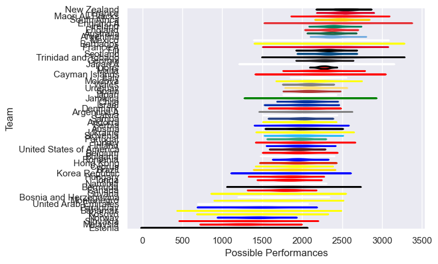

---  
title: "International Test Match 2025 Status"  
date: 2025-06-15 6:00:00 -0500  
categories: model review projection  
layout: article  
aside:  
    toc: true  
---
# Current Team Rankings

# Standings

## Current Standings

| Club                   |   Played |   Wins |   Point Differential |   Losing Bonus Points | Try Bonus Points   |   Competition Points |
|:-----------------------|---------:|-------:|---------------------:|----------------------:|:-------------------|---------------------:|
| Georgia                |        5 |      5 |                  229 |                     0 |                    |                   20 |
| Denmark                |        3 |      3 |                   64 |                     0 |                    |                   12 |
| Portugal               |        5 |      3 |                   55 |                     0 |                    |                   12 |
| Belgium                |        5 |      3 |                   47 |                     0 |                    |                   12 |
| Cayman Islands         |        3 |      3 |                   47 |                     0 |                    |                   12 |
| Spain                  |        5 |      3 |                   22 |                     0 |                    |                   12 |
| Andorra                |        3 |      3 |                   15 |                     0 |                    |                   12 |
| Romania                |        5 |      3 |                    3 |                     0 |                    |                   12 |
| Barbados               |        3 |      2 |                   79 |                     1 |                    |                    9 |
| Finland                |        2 |      2 |                  116 |                     0 |                    |                    8 |
| Sri Lanka              |        2 |      2 |                   80 |                     0 |                    |                    8 |
| Serbia                 |        2 |      2 |                   32 |                     0 |                    |                    8 |
| Slovenia               |        2 |      2 |                   30 |                     0 |                    |                    8 |
| Netherlands            |        5 |      2 |                   19 |                     0 |                    |                    8 |
| Israel                 |        4 |      1 |                   -5 |                     2 |                    |                    8 |
| Austria                |        2 |      1 |                  114 |                     0 |                    |                    6 |
| Ukraine                |        2 |      1 |                   76 |                     0 |                    |                    6 |
| Bosnia and Herzegovina |        2 |      1 |                   54 |                     0 |                    |                    4 |
| Norway                 |        2 |      1 |                   22 |                     0 |                    |                    4 |
| Mexico                 |        1 |      1 |                   13 |                     0 |                    |                    4 |
| Trinidad and Tobago    |        1 |      1 |                    1 |                     0 |                    |                    4 |
| Bulgaria               |        2 |      1 |                  -15 |                     0 |                    |                    4 |
| Switzerland            |        5 |      1 |                 -243 |                     0 |                    |                    4 |
| Bahamas                |        1 |      0 |                    0 |                     0 |                    |                    2 |
| Latvia                 |        2 |      0 |                   -4 |                     2 |                    |                    2 |
| Cyprus                 |        2 |      0 |                   -9 |                     0 |                    |                    2 |
| Bermuda                |        3 |      0 |                  -16 |                     0 |                    |                    2 |
| Malta                  |        1 |      0 |                   -1 |                     1 |                    |                    1 |
| Moldova                |        2 |      0 |                  -36 |                     1 |                    |                    1 |
| Germany                |        5 |      0 |                 -132 |                     1 |                    |                    1 |
| Jamaica                |        1 |      0 |                  -13 |                     0 |                    |                    0 |
| Turkey                 |        1 |      0 |                  -16 |                     0 |                    |                    0 |
| Montenegro             |        1 |      0 |                  -17 |                     0 |                    |                    0 |
| Kosovo                 |        1 |      0 |                  -67 |                     0 |                    |                    0 |
| Hungary                |        1 |      0 |                  -76 |                     0 |                    |                    0 |
| Malaysia               |        2 |      0 |                  -80 |                     0 |                    |                    0 |
| Guyana                 |        3 |      0 |                 -111 |                     0 |                    |                    0 |
| Slovakia               |        1 |      0 |                 -114 |                     0 |                    |                    0 |
| Estonia                |        2 |      0 |                 -163 |                     0 |                    |                    0 |

# Completed Match Review

| Model | Percent Correct Predictions | Spread Error |
| ------ | ------ | ------ |
| Club Level | 66.0% | 24.9 |
| Player Level: Lineup | nan% | nan |
| Player Level: Minutes | nan% | nan |

