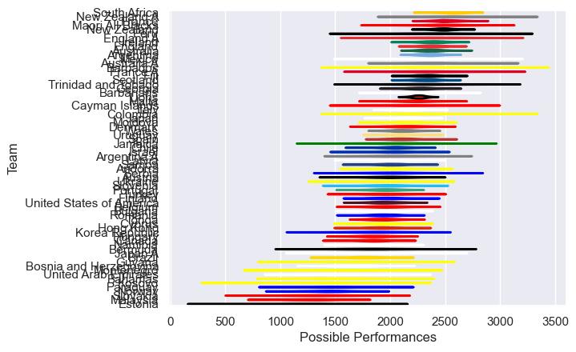

---  
title: "International Test Match 2025"  
date: 2025-07-29 6:00:00 -0500  
categories: model review projection  
layout: article  
aside:  
    toc: true  
---
# Team Rankings

# Standings

## Current Standings

| Club                     |   Played |   Wins |   Point Differential |   Losing Bonus Points |   Try Bonus Points |   Competition Points |
|:-------------------------|---------:|-------:|---------------------:|----------------------:|-------------------:|---------------------:|
| South Africa             |        3 |      3 |                  108 |                     0 |                  3 |                   15 |
| New Zealand              |        3 |      3 |                   40 |                     0 |                  3 |                   15 |
| England                  |        3 |      3 |                   63 |                     0 |                  2 |                   14 |
| Denmark                  |        3 |      3 |                   64 |                     0 |                    |                   12 |
| Chile                    |        3 |      3 |                   53 |                     0 |                    |                   12 |
| Ireland                  |        2 |      2 |                  128 |                     0 |                  2 |                   10 |
| Argentina                |        4 |      2 |                   11 |                     1 |                  1 |                   10 |
| Spain                    |        2 |      2 |                   12 |                     0 |                  1 |                    9 |
| Lions                    |        3 |      2 |                    7 |                     1 |                    |                    9 |
| Finland                  |        2 |      2 |                  116 |                     0 |                    |                    8 |
| Uruguay                  |        3 |      2 |                   65 |                     0 |                    |                    8 |
| Mexico                   |        2 |      2 |                   44 |                     0 |                    |                    8 |
| Cayman Islands           |        2 |      2 |                   39 |                     0 |                    |                    8 |
| Serbia                   |        2 |      2 |                   32 |                     0 |                    |                    8 |
| Slovenia                 |        2 |      2 |                   30 |                     0 |                    |                    8 |
| Andorra                  |        2 |      2 |                   12 |                     0 |                    |                    8 |
| Austria                  |        2 |      1 |                  114 |                     0 |                    |                    6 |
| Ukraine                  |        2 |      1 |                   76 |                     0 |                    |                    6 |
| Fiji                     |        2 |      1 |                   12 |                     1 |                  1 |                    6 |
| Wales                    |        2 |      1 |                    4 |                     1 |                  1 |                    6 |
| Barbados                 |        2 |      1 |                   39 |                     1 |                    |                    5 |
| Scotland                 |        2 |      1 |                   14 |                     0 |                  1 |                    5 |
| Italy                    |        3 |      1 |                    4 |                     0 |                  1 |                    5 |
| Israel                   |        2 |      1 |                   -2 |                     1 |                    |                    5 |
| Australia                |        3 |      1 |                   -8 |                     1 |                    |                    5 |
| United States of America |        3 |      1 |                  -27 |                     0 |                  1 |                    5 |
| Bosnia and Herzegovina   |        2 |      1 |                   54 |                     0 |                    |                    4 |
| Argentina A              |        1 |      1 |                   38 |                     0 |                    |                    4 |
| Maori All Blacks         |        1 |      1 |                   33 |                     0 |                    |                    4 |
| Norway                   |        2 |      1 |                   22 |                     0 |                    |                    4 |
| France A                 |        1 |      1 |                    2 |                     0 |                    |                    4 |
| Malaysia                 |        2 |      1 |                    0 |                     0 |                    |                    4 |
| Japan                    |        2 |      1 |                   -4 |                     0 |                    |                    4 |
| Cyprus                   |        3 |      0 |                   -9 |                     0 |                    |                    4 |
| Belgium                  |        2 |      1 |                  -12 |                     0 |                    |                    4 |
| Bulgaria                 |        2 |      1 |                  -15 |                     0 |                    |                    4 |
| Trinidad and Tobago      |        2 |      1 |                  -30 |                     0 |                    |                    4 |
| Bahamas                  |        1 |      0 |                    0 |                     0 |                    |                    2 |
| Latvia                   |        2 |      0 |                   -4 |                     2 |                    |                    2 |
| Bermuda                  |        2 |      0 |                   -8 |                     0 |                    |                    2 |
| Canada                   |        2 |      0 |                   -8 |                     2 |                    |                    2 |
| Brazil                   |        3 |      0 |                  -29 |                     0 |                    |                    2 |
| Romania                  |        4 |      0 |                 -124 |                     0 |                    |                    2 |
| Malta                    |        1 |      0 |                   -1 |                     1 |                    |                    1 |
| England A                |        1 |      0 |                   -2 |                     1 |                    |                    1 |
| Moldova                  |        2 |      0 |                  -36 |                     1 |                    |                    1 |
| France                   |        3 |      0 |                  -40 |                     1 |                    |                    1 |
| Jamaica                  |        1 |      0 |                  -13 |                     0 |                    |                    0 |
| Turkey                   |        1 |      0 |                  -16 |                     0 |                    |                    0 |
| Montenegro               |        1 |      0 |                  -17 |                     0 |                    |                    0 |
| Samoa                    |        1 |      0 |                  -29 |                     0 |                    |                    0 |
| Japan A                  |        1 |      0 |                  -33 |                     0 |                    |                    0 |
| Paraguay                 |        1 |      0 |                  -38 |                     0 |                    |                    0 |
| Kosovo                   |        1 |      0 |                  -67 |                     0 |                    |                    0 |
| Namibia                  |        1 |      0 |                  -67 |                     0 |                    |                    0 |
| Guyana                   |        2 |      0 |                  -71 |                     0 |                    |                    0 |
| Georgia                  |        2 |      0 |                  -74 |                     0 |                    |                    0 |
| Hungary                  |        1 |      0 |                  -76 |                     0 |                    |                    0 |
| Portugal                 |        1 |      0 |                  -99 |                     0 |                    |                    0 |
| Slovakia                 |        1 |      0 |                 -114 |                     0 |                    |                    0 |
| Estonia                  |        2 |      0 |                 -163 |                     0 |                    |                    0 |

## Projected Remaining Table

| Club                     |   To Play |   Projected Wins |   Projected Differential |   Projected Losing Bonus Points | Projected Try Bonus Points   |   Projected Competition Points |
|:-------------------------|----------:|-----------------:|-------------------------:|--------------------------------:|:-----------------------------|-------------------------------:|
| England                  |         4 |            2.607 |                   21.278 |                           0.661 |                              |                         11.431 |
| Ireland                  |         4 |            2.509 |                   22.984 |                           0.676 |                              |                         11.07  |
| Scotland                 |         4 |            2.435 |                   25.917 |                           0.711 |                              |                         10.795 |
| South Africa             |         4 |            2.297 |                   13.443 |                           0.775 |                              |                         10.291 |
| New Zealand              |         4 |            2.114 |                    7.858 |                           0.832 |                              |                          9.664 |
| Australia                |         5 |            1.881 |                  -17.635 |                           1.047 |                              |                          8.957 |
| France                   |         3 |            1.958 |                   16.659 |                           0.496 |                              |                          8.558 |
| Wales                    |         4 |            1.429 |                  -17.293 |                           0.83  |                              |                          6.802 |
| Italy                    |         3 |            1.376 |                   -1.688 |                           0.643 |                              |                          6.417 |
| Argentina                |         3 |            1.362 |                   -1.714 |                           0.675 |                              |                          6.393 |
| Japan                    |         4 |            1.146 |                  -29.23  |                           0.877 |                              |                          5.719 |
| Uruguay                  |         1 |            0.761 |                   17.552 |                           0.093 |                              |                          3.197 |
| Korea Republic           |         1 |            0.701 |                   13.493 |                           0.133 |                              |                          2.995 |
| Georgia                  |         1 |            0.682 |                    6.742 |                           0.157 |                              |                          2.953 |
| Hong Kong                |         1 |            0.678 |                    9.279 |                           0.152 |                              |                          2.926 |
| United Arab Emirates     |         2 |            0.561 |                  -22.772 |                           0.379 |                              |                          2.743 |
| Fiji                     |         2 |            0.494 |                  -15.657 |                           0.417 |                              |                          2.537 |
| Samoa                    |         1 |            0.311 |                   -5.453 |                           0.223 |                              |                          1.555 |
| United States of America |         1 |            0.221 |                  -11.709 |                           0.159 |                              |                          1.131 |
| Tonga                    |         1 |            0.212 |                  -14.502 |                           0.145 |                              |                          1.051 |
| Paraguay                 |         1 |            0.209 |                  -17.552 |                           0.137 |                              |                          1.033 |

## Projected Total Table

| Club                     |   Played |   Wins |   Point Differential |   Losing Bonus Points |   Try Bonus Points |   Competition Points |
|:-------------------------|---------:|-------:|---------------------:|----------------------:|-------------------:|---------------------:|
| England                  |        7 |  5.607 |               84.278 |                 0.661 |                  2 |               25.431 |
| South Africa             |        7 |  5.297 |              121.443 |                 0.775 |                  3 |               25.291 |
| New Zealand              |        7 |  5.114 |               47.858 |                 0.832 |                  3 |               24.664 |
| Ireland                  |        6 |  4.509 |              150.984 |                 0.676 |                  2 |               21.07  |
| Argentina                |        7 |  3.362 |                9.286 |                 1.675 |                  1 |               16.393 |
| Scotland                 |        6 |  3.435 |               39.917 |                 0.711 |                  1 |               15.795 |
| Australia                |        8 |  2.881 |              -25.635 |                 2.047 |                    |               13.957 |
| Wales                    |        6 |  2.429 |              -13.293 |                 1.83  |                  1 |               12.802 |
| Denmark                  |        3 |  3     |               64     |                 0     |                    |               12     |
| Chile                    |        3 |  3     |               53     |                 0     |                    |               12     |
| Italy                    |        6 |  2.376 |                2.312 |                 0.643 |                  1 |               11.417 |
| Uruguay                  |        4 |  2.761 |               82.552 |                 0.093 |                    |               11.197 |
| Japan                    |        6 |  2.146 |              -33.23  |                 0.877 |                    |                9.719 |
| France                   |        6 |  1.958 |              -23.341 |                 1.496 |                    |                9.558 |
| Spain                    |        2 |  2     |               12     |                 0     |                  1 |                9     |
| Lions                    |        3 |  2     |                7     |                 1     |                    |                9     |
| Fiji                     |        4 |  1.494 |               -3.657 |                 1.417 |                  1 |                8.537 |
| Finland                  |        2 |  2     |              116     |                 0     |                    |                8     |
| Mexico                   |        2 |  2     |               44     |                 0     |                    |                8     |
| Cayman Islands           |        2 |  2     |               39     |                 0     |                    |                8     |
| Serbia                   |        2 |  2     |               32     |                 0     |                    |                8     |
| Slovenia                 |        2 |  2     |               30     |                 0     |                    |                8     |
| Andorra                  |        2 |  2     |               12     |                 0     |                    |                8     |
| United States of America |        4 |  1.221 |              -38.709 |                 0.159 |                  1 |                6.131 |
| Austria                  |        2 |  1     |              114     |                 0     |                    |                6     |
| Ukraine                  |        2 |  1     |               76     |                 0     |                    |                6     |
| Barbados                 |        2 |  1     |               39     |                 1     |                    |                5     |
| Israel                   |        2 |  1     |               -2     |                 1     |                    |                5     |
| Bosnia and Herzegovina   |        2 |  1     |               54     |                 0     |                    |                4     |
| Argentina A              |        1 |  1     |               38     |                 0     |                    |                4     |
| Maori All Blacks         |        1 |  1     |               33     |                 0     |                    |                4     |
| Norway                   |        2 |  1     |               22     |                 0     |                    |                4     |
| France A                 |        1 |  1     |                2     |                 0     |                    |                4     |
| Malaysia                 |        2 |  1     |                0     |                 0     |                    |                4     |
| Cyprus                   |        3 |  0     |               -9     |                 0     |                    |                4     |
| Belgium                  |        2 |  1     |              -12     |                 0     |                    |                4     |
| Bulgaria                 |        2 |  1     |              -15     |                 0     |                    |                4     |
| Trinidad and Tobago      |        2 |  1     |              -30     |                 0     |                    |                4     |
| Korea Republic           |        1 |  0.701 |               13.493 |                 0.133 |                    |                2.995 |
| Georgia                  |        3 |  0.682 |              -67.258 |                 0.157 |                    |                2.953 |
| Hong Kong                |        1 |  0.678 |                9.279 |                 0.152 |                    |                2.926 |
| United Arab Emirates     |        2 |  0.561 |              -22.772 |                 0.379 |                    |                2.743 |
| Bahamas                  |        1 |  0     |                0     |                 0     |                    |                2     |
| Latvia                   |        2 |  0     |               -4     |                 2     |                    |                2     |
| Bermuda                  |        2 |  0     |               -8     |                 0     |                    |                2     |
| Canada                   |        2 |  0     |               -8     |                 2     |                    |                2     |
| Brazil                   |        3 |  0     |              -29     |                 0     |                    |                2     |
| Romania                  |        4 |  0     |             -124     |                 0     |                    |                2     |
| Samoa                    |        2 |  0.311 |              -34.453 |                 0.223 |                    |                1.555 |
| Tonga                    |        1 |  0.212 |              -14.502 |                 0.145 |                    |                1.051 |
| Paraguay                 |        2 |  0.209 |              -55.552 |                 0.137 |                    |                1.033 |
| Malta                    |        1 |  0     |               -1     |                 1     |                    |                1     |
| England A                |        1 |  0     |               -2     |                 1     |                    |                1     |
| Moldova                  |        2 |  0     |              -36     |                 1     |                    |                1     |
| Jamaica                  |        1 |  0     |              -13     |                 0     |                    |                0     |
| Turkey                   |        1 |  0     |              -16     |                 0     |                    |                0     |
| Montenegro               |        1 |  0     |              -17     |                 0     |                    |                0     |
| Japan A                  |        1 |  0     |              -33     |                 0     |                    |                0     |
| Kosovo                   |        1 |  0     |              -67     |                 0     |                    |                0     |
| Namibia                  |        1 |  0     |              -67     |                 0     |                    |                0     |
| Guyana                   |        2 |  0     |              -71     |                 0     |                    |                0     |
| Hungary                  |        1 |  0     |              -76     |                 0     |                    |                0     |
| Portugal                 |        1 |  0     |              -99     |                 0     |                    |                0     |
| Slovakia                 |        1 |  0     |             -114     |                 0     |                    |                0     |
| Estonia                  |        2 |  0     |             -163     |                 0     |                    |                0     |

# Completed Match Review

| Model | Percent Correct Predictions | Spread Error |
| ------ | ------ | ------ |
| Club Level | 72.7% | 17.2 |
| Player Level: Lineup | nan% | nan |
| Player Level: Minutes | nan% | nan |

# Future Predictions

## Week 5

### United Arab Emirates V Hong Kong on 2025/06/13

Average Margin: Hong Kong by 9.3

## Week 6

### Korea Republic V United Arab Emirates on 2025/06/20

Average Margin: Korea Republic by 13.5

## Week 7

### Uruguay V Paraguay on 2025/08/22

Average Margin: Uruguay by 17.6

## Week 8

### Japan V Australia on 2025/10/24

Average Margin: Australia by 4.4

## Week 9

### England V Australia on 2025/11/01

Average Margin: England by 7.4

### Ireland V New Zealand on 2025/11/01

Average Margin: Ireland by 1.5

### Scotland V United States of America on 2025/11/01

Average Margin: Scotland by 11.7

## Week 10

### Italy V Australia on 2025/11/08

Average Margin: Australia by 0.0

### France V South Africa on 2025/11/08

Average Margin: France by 1.1

### Ireland V Japan on 2025/11/08

Average Margin: Ireland by 13.8

### Scotland V New Zealand on 2025/11/08

Average Margin: New Zealand by 1.8

### England V Fiji on 2025/11/08

Average Margin: England by 7.8

### Wales V Argentina on 2025/11/09

Average Margin: Argentina by 4.8

## Week 11

### Wales V Japan on 2025/11/15

Average Margin: Wales by 4.3

### Italy V South Africa on 2025/11/15

Average Margin: South Africa by 7.1

### England V New Zealand on 2025/11/15

Average Margin: England by 1.0

### France V Fiji on 2025/11/15

Average Margin: France by 7.8

### Ireland V Australia on 2025/11/15

Average Margin: Ireland by 6.9

### Scotland V Argentina on 2025/11/16

Average Margin: Scotland by 1.5

## Week 12

### Georgia V Japan on 2025/11/21

Average Margin: Georgia by 6.7

### Wales V New Zealand on 2025/11/22

Average Margin: New Zealand by 8.6

### France V Australia on 2025/11/22

Average Margin: France by 7.8

### Italy V Samoa on 2025/11/22

Average Margin: Italy by 5.5

### Ireland V South Africa on 2025/11/22

Average Margin: Ireland by 0.8

### England V Argentina on 2025/11/23

Average Margin: England by 5.0

### Scotland V Tonga on 2025/11/23

Average Margin: Scotland by 14.5

## Week 13

### Wales V South Africa on 2025/11/29

Average Margin: South Africa by 8.2

