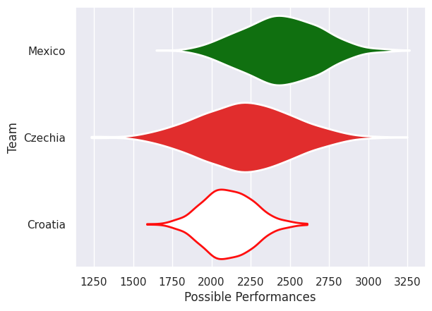
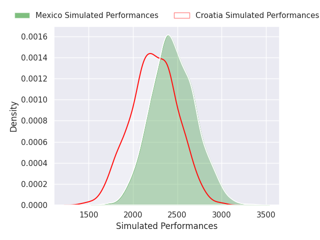
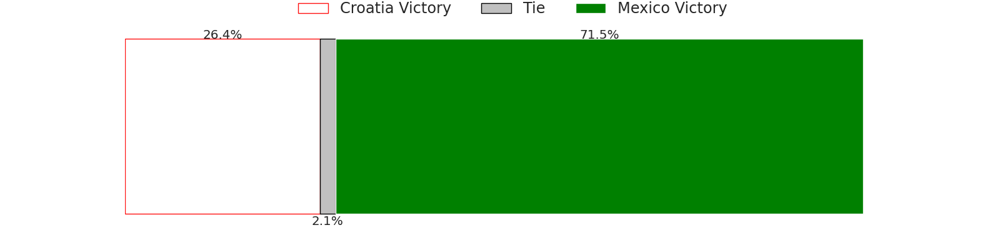
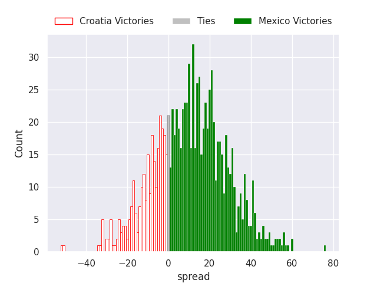

# Team Rankings

# Standings

## Current Standings

| Club    |   Played |   Wins |   Point Differential |   Losing Bonus Points | Try Bonus Points   |   Competition Points |
|:--------|---------:|-------:|---------------------:|----------------------:|:-------------------|---------------------:|
| Czechia |        1 |      1 |                   27 |                     0 |                    |                    4 |
| Mexico  |        1 |      0 |                  -27 |                     0 |                    |                    0 |

## Projected Remaining Table

| Club    |   To Play |   Projected Wins |   Projected Differential |   Projected Losing Bonus Points | Projected Try Bonus Points   |   Projected Competition Points |
|:--------|----------:|-----------------:|-------------------------:|--------------------------------:|:-----------------------------|-------------------------------:|
| Mexico  |         1 |            0.715 |                   10.879 |                           0.113 |                              |                          3.015 |
| Croatia |         1 |            0.264 |                  -10.879 |                           0.132 |                              |                          1.23  |

## Projected Total Table

| Club    |   Played |   Wins |   Point Differential |   Losing Bonus Points | Try Bonus Points   |   Competition Points |
|:--------|---------:|-------:|---------------------:|----------------------:|:-------------------|---------------------:|
| Czechia |        1 |  1     |               27     |                 0     |                    |                4     |
| Mexico  |        2 |  0.715 |              -16.121 |                 0.113 |                    |                3.015 |
| Croatia |        1 |  0.264 |              -10.879 |                 0.132 |                    |                1.23  |

# Completed Match Review

| Model | Percent Correct Predictions | Spread Error |
| ------ | ------ | ------ |
| Club Level | 50.0% | 16.6 |
| Player Level: Lineup | nan% | nan |
| Player Level: Minutes | nan% | nan |

# Future Predictions

## Week 2

### Croatia V Mexico on 2026/04/10

Average Margin: Mexico by 10.9

