# Team Rankings

# Standings

## Current Standings

| Club    |   Played |   Wins |   Point Differential |   Losing Bonus Points | Try Bonus Points   |   Competition Points |
|:--------|---------:|-------:|---------------------:|----------------------:|:-------------------|---------------------:|
| Czechia |        1 |      1 |                   27 |                     0 |                    |                    4 |
| Mexico  |        2 |      1 |                  -11 |                     0 |                    |                    4 |
| Croatia |        1 |      0 |                  -16 |                     0 |                    |                    0 |

## Projected Remaining Table

| Club         |   To Play |   Projected Wins |   Projected Differential |   Projected Losing Bonus Points | Projected Try Bonus Points   |   Projected Competition Points |
|:-------------|----------:|-----------------:|-------------------------:|--------------------------------:|:-----------------------------|-------------------------------:|
| South Africa |         3 |            2.35  |                   28.594 |                           0.365 |                              |                          9.957 |
| Australia    |         3 |            1.553 |                    2.443 |                           0.499 |                              |                          6.885 |
| Argentina    |         2 |            1.048 |                    2.868 |                           0.332 |                              |                          4.662 |
| Japan        |         2 |            0.552 |                  -12.509 |                           0.464 |                              |                          2.79  |
| New Zealand  |         2 |            0.314 |                  -21.396 |                           0.403 |                              |                          1.769 |

## Projected Total Table

| Club         |   Played |   Wins |   Point Differential |   Losing Bonus Points | Try Bonus Points   |   Competition Points |
|:-------------|---------:|-------:|---------------------:|----------------------:|:-------------------|---------------------:|
| South Africa |        3 |  2.35  |               28.594 |                 0.365 |                    |                9.957 |
| Australia    |        3 |  1.553 |                2.443 |                 0.499 |                    |                6.885 |
| Argentina    |        2 |  1.048 |                2.868 |                 0.332 |                    |                4.662 |
| Czechia      |        1 |  1     |               27     |                 0     |                    |                4     |
| Mexico       |        2 |  1     |              -11     |                 0     |                    |                4     |
| Japan        |        2 |  0.552 |              -12.509 |                 0.464 |                    |                2.79  |
| New Zealand  |        2 |  0.314 |              -21.396 |                 0.403 |                    |                1.769 |
| Croatia      |        1 |  0     |              -16     |                 0     |                    |                0     |

# Completed Match Review

| Model | Percent Correct Predictions | Spread Error |
| ------ | ------ | ------ |
| Club Level | 75.0% | 10.9 |
| Player Level: Lineup | nan% | nan |
| Player Level: Minutes | nan% | nan |

# Future Predictions

## Week 3

### Argentina V South Africa on 2026/08/08

Average Margin: South Africa by 7.2

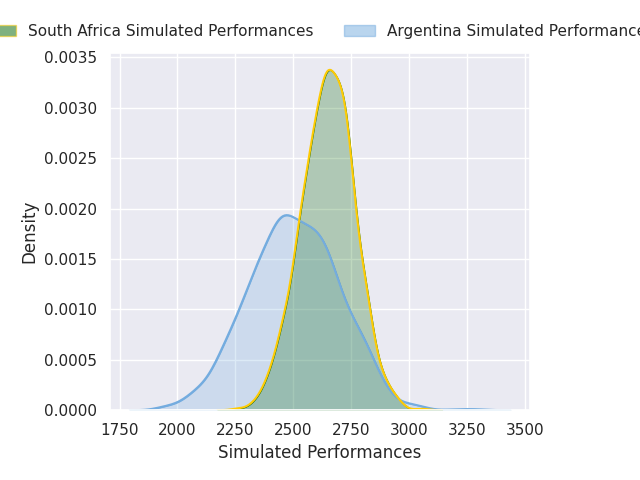
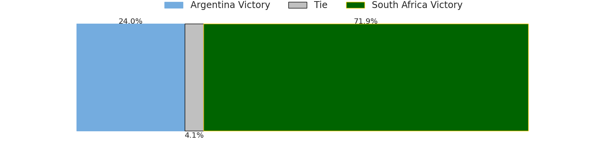
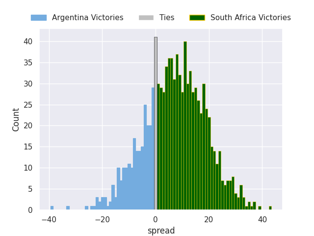

### Japan V Australia on 2026/08/08

Average Margin: Australia by 2.1

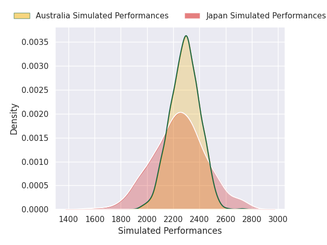

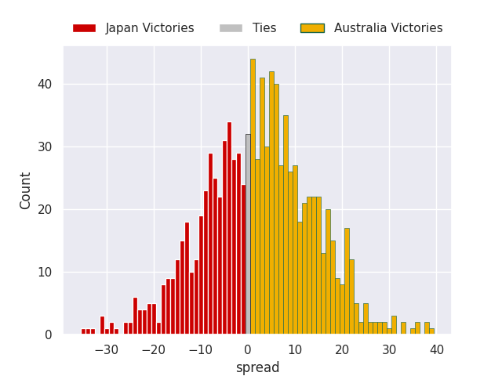

## Week 4

### Australia V Japan on 2026/08/15

Average Margin: Australia by 10.4

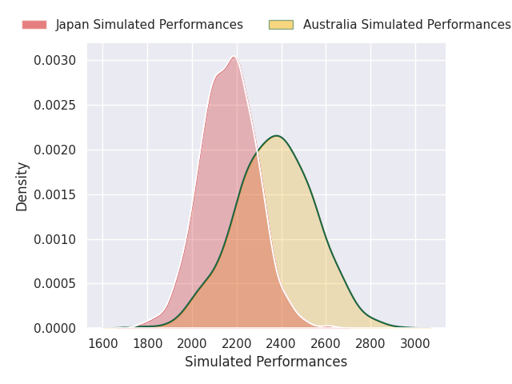
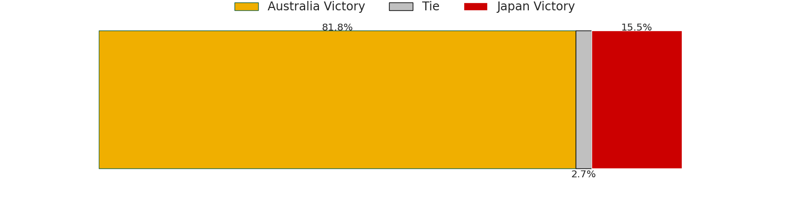
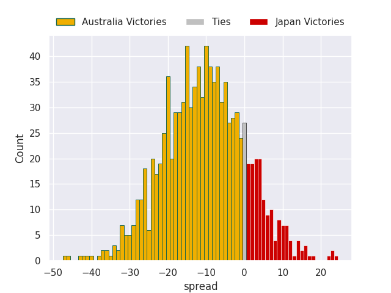

## Week 5

### South Africa V New Zealand on 2026/08/22

Average Margin: South Africa by 10.7

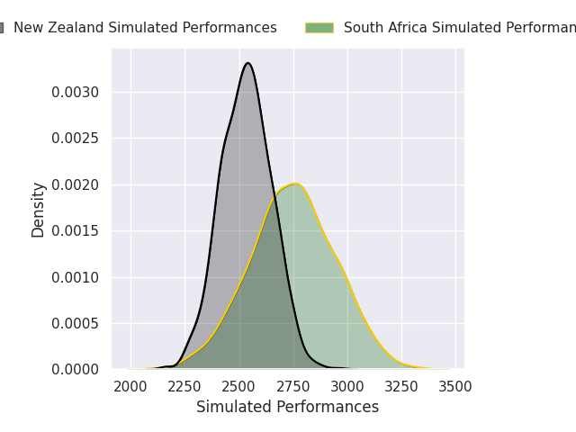
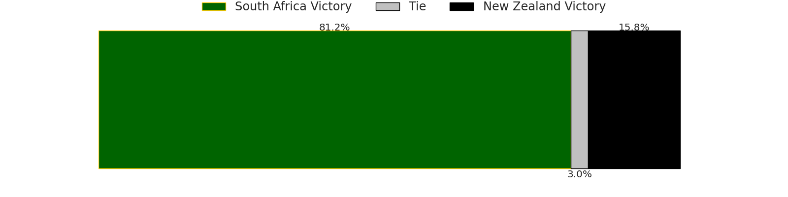
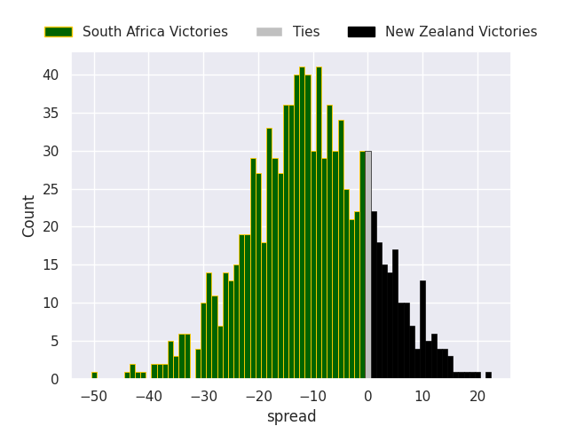

## Week 6

### Argentina V Australia on 2026/08/29

Average Margin: Argentina by 10.1

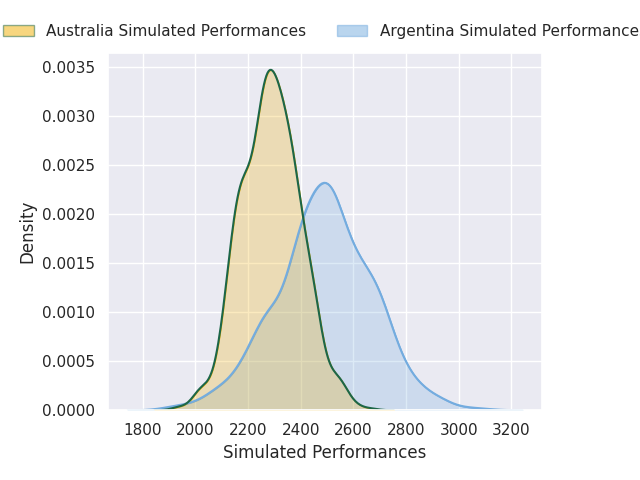
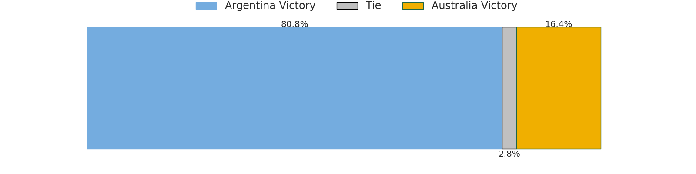
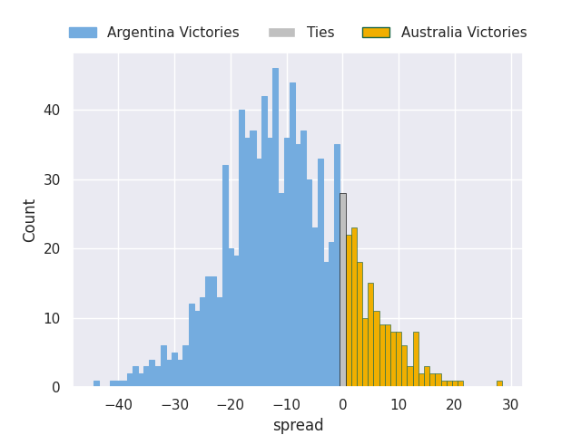

### South Africa V New Zealand on 2026/08/29

Average Margin: South Africa by 10.7

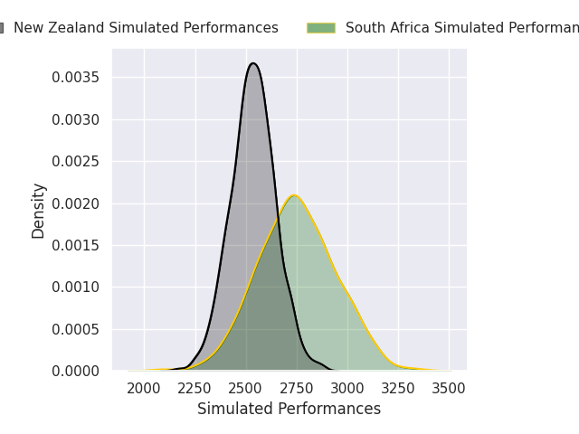

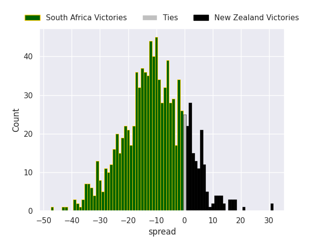

