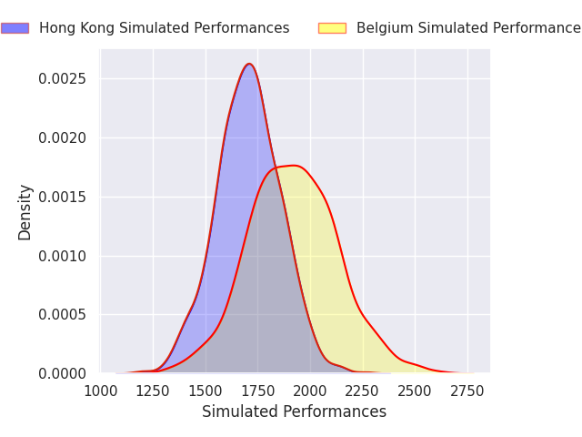
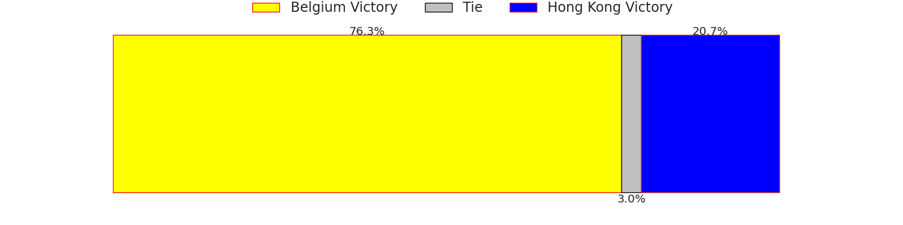
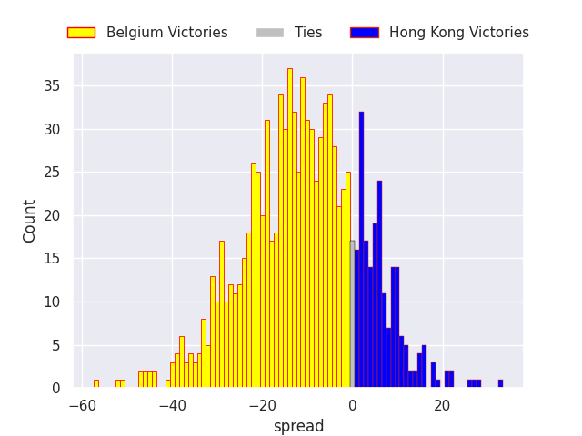
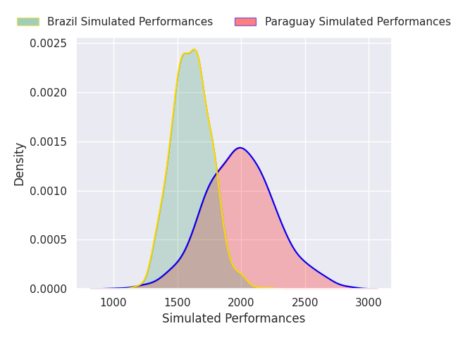
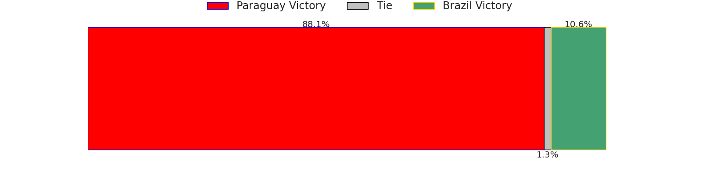
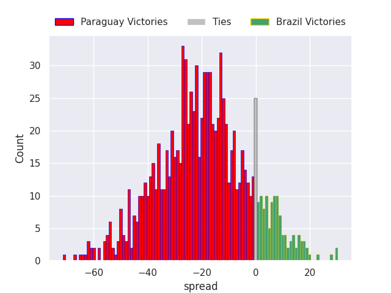

# Team Rankings

# Standings

## Current Standings

| Club                     |   Played |   Wins |   Point Differential |   Losing Bonus Points |   Try Bonus Points |   Competition Points |
|:-------------------------|---------:|-------:|---------------------:|----------------------:|-------------------:|---------------------:|
| Australia                |        3 |      3 |                   48 |                     0 |                  3 |                   15 |
| Czechia                  |        1 |      1 |                   27 |                     0 |                    |                    4 |
| France A                 |        1 |      1 |                   16 |                     0 |                    |                    4 |
| Maori All Blacks         |        1 |      1 |                    7 |                     0 |                    |                    4 |
| South Africa             |        1 |      1 |                    7 |                     0 |                    |                    4 |
| United States of America |        1 |      1 |                    1 |                     0 |                    |                    4 |
| Mexico                   |        2 |      1 |                  -11 |                     0 |                    |                    4 |
| Argentina                |        2 |      0 |                  -13 |                     2 |                    |                    2 |
| Japan                    |        2 |      0 |                  -42 |                     1 |                  1 |                    2 |
| Argentina A              |        1 |      0 |                   -1 |                     1 |                    |                    1 |
| Japan A                  |        1 |      0 |                   -7 |                     1 |                    |                    1 |
| Croatia                  |        1 |      0 |                  -16 |                     0 |                    |                    0 |
| England A                |        1 |      0 |                  -16 |                     0 |                    |                    0 |

## Projected Remaining Table

| Club         |   To Play |   Projected Wins |   Projected Differential |   Projected Losing Bonus Points | Projected Try Bonus Points   |   Projected Competition Points |
|:-------------|----------:|-----------------:|-------------------------:|--------------------------------:|:-----------------------------|-------------------------------:|
| New Zealand  |         4 |            2.624 |                   25.236 |                           0.677 |                              |                         11.435 |
| South Africa |         3 |            1.897 |                   12.16  |                           0.592 |                              |                          8.446 |
| Japan        |         2 |            1.608 |                   22.706 |                           0.215 |                              |                          6.751 |
| Australia    |         4 |            0.669 |                  -39.734 |                           0.901 |                              |                          3.811 |
| Paraguay     |         1 |            0.881 |                   19.588 |                           0.066 |                              |                          3.602 |
| Belgium      |         1 |            0.786 |                   11.092 |                           0.114 |                              |                          3.306 |
| Argentina    |         1 |            0.598 |                    2.338 |                           0.202 |                              |                          2.68  |
| Fiji         |         1 |            0.3   |                   -5.325 |                           0.248 |                              |                          1.522 |
| Hong Kong    |         1 |            0.19  |                  -11.092 |                           0.177 |                              |                          0.985 |
| Brazil       |         1 |            0.113 |                  -19.588 |                           0.113 |                              |                          0.577 |
| Canada       |         1 |            0.04  |                  -17.381 |                           0.131 |                              |                          0.321 |

## Projected Total Table

| Club                     |   Played |   Wins |   Point Differential |   Losing Bonus Points |   Try Bonus Points |   Competition Points |
|:-------------------------|---------:|-------:|---------------------:|----------------------:|-------------------:|---------------------:|
| Australia                |        7 |  3.669 |                8.266 |                 0.901 |                  3 |               18.811 |
| South Africa             |        4 |  2.897 |               19.16  |                 0.592 |                    |               12.446 |
| New Zealand              |        4 |  2.624 |               25.236 |                 0.677 |                    |               11.435 |
| Japan                    |        4 |  1.608 |              -19.294 |                 1.215 |                  1 |                8.751 |
| Argentina                |        3 |  0.598 |              -10.662 |                 2.202 |                    |                4.68  |
| Czechia                  |        1 |  1     |               27     |                 0     |                    |                4     |
| France A                 |        1 |  1     |               16     |                 0     |                    |                4     |
| Maori All Blacks         |        1 |  1     |                7     |                 0     |                    |                4     |
| United States of America |        1 |  1     |                1     |                 0     |                    |                4     |
| Mexico                   |        2 |  1     |              -11     |                 0     |                    |                4     |
| Paraguay                 |        1 |  0.881 |               19.588 |                 0.066 |                    |                3.602 |
| Belgium                  |        1 |  0.786 |               11.092 |                 0.114 |                    |                3.306 |
| Fiji                     |        1 |  0.3   |               -5.325 |                 0.248 |                    |                1.522 |
| Argentina A              |        1 |  0     |               -1     |                 1     |                    |                1     |
| Japan A                  |        1 |  0     |               -7     |                 1     |                    |                1     |
| Hong Kong                |        1 |  0.19  |              -11.092 |                 0.177 |                    |                0.985 |
| Brazil                   |        1 |  0.113 |              -19.588 |                 0.113 |                    |                0.577 |
| Canada                   |        1 |  0.04  |              -17.381 |                 0.131 |                    |                0.321 |
| Croatia                  |        1 |  0     |              -16     |                 0     |                    |                0     |
| England A                |        1 |  0     |              -16     |                 0     |                    |                0     |

# Completed Match Review

| Model | Percent Correct Predictions | Spread Error |
| ------ | ------ | ------ |
| Club Level | 73.7% | 7.8 |
| Player Level: Lineup | nan% | nan |
| Player Level: Minutes | nan% | nan |

# Future Predictions

## Week 4

### South Africa V New Zealand on 2026/09/05

Average Margin: South Africa by 2.1

### Argentina V Australia on 2026/09/05

Average Margin: Argentina by 2.3

### Japan V Canada on 2026/09/05

Average Margin: Japan by 17.4

## Week 5

### South Africa V New Zealand on 2026/09/12

Average Margin: South Africa by 1.9

## Week 6

### Australia V South Africa on 2026/09/27

Average Margin: South Africa by 8.2

## Week 7

### New Zealand V Australia on 2026/10/10

Average Margin: New Zealand by 18.7

## Week 8

### Australia V New Zealand on 2026/10/17

Average Margin: New Zealand by 10.6

## Week 9

### Japan V Fiji on 2026/10/24

Average Margin: Japan by 5.3

## Week 10

### Belgium V Hong Kong on 2026/10/31

Average Margin: Belgium by 11.1

## Week 11

### Paraguay V Brazil on 2026/11/13

Average Margin: Paraguay by 19.6

