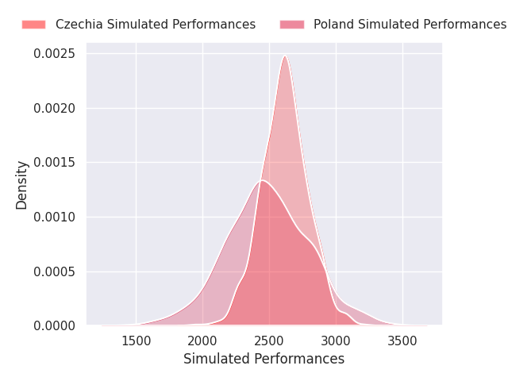
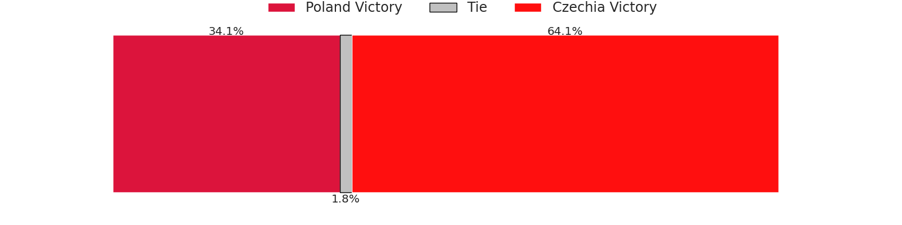
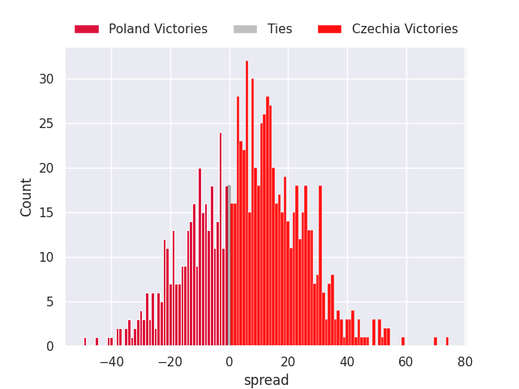

# Team Rankings

# Standings

## Current Standings

| Club                     |   Played |   Wins |   Point Differential |   Losing Bonus Points |   Try Bonus Points |   Competition Points |
|:-------------------------|---------:|-------:|---------------------:|----------------------:|-------------------:|---------------------:|
| Australia                |        4 |      3 |                   48 |                     0 |                  3 |                   17 |
| Japan                    |        3 |      1 |                    3 |                     1 |                  2 |                    7 |
| Argentina                |        3 |      0 |                  -13 |                     2 |                  1 |                    5 |
| Czechia                  |        1 |      1 |                   27 |                     0 |                    |                    4 |
| France A                 |        1 |      1 |                   16 |                     0 |                    |                    4 |
| Maori All Blacks         |        1 |      1 |                    7 |                     0 |                    |                    4 |
| South Africa             |        1 |      1 |                    7 |                     0 |                    |                    4 |
| United States of America |        1 |      1 |                    1 |                     0 |                    |                    4 |
| Mexico                   |        2 |      1 |                  -11 |                     0 |                    |                    4 |
| Argentina A              |        1 |      0 |                   -1 |                     1 |                    |                    1 |
| Japan A                  |        1 |      0 |                   -7 |                     1 |                    |                    1 |
| Croatia                  |        1 |      0 |                  -16 |                     0 |                    |                    0 |
| England A                |        1 |      0 |                  -16 |                     0 |                    |                    0 |
| Canada                   |        1 |      0 |                  -45 |                     0 |                    |                    0 |

## Projected Remaining Table

| Club         |   To Play |   Projected Wins |   Projected Differential |   Projected Losing Bonus Points | Projected Try Bonus Points   |   Projected Competition Points |
|:-------------|----------:|-----------------:|-------------------------:|--------------------------------:|:-----------------------------|-------------------------------:|
| New Zealand  |         2 |            1.78  |                   24.879 |                           0.134 |                              |                          7.338 |
| Paraguay     |         1 |            0.881 |                   18.964 |                           0.06  |                              |                          3.61  |
| South Africa |         1 |            0.845 |                    9.915 |                           0.115 |                              |                          3.537 |
| Japan        |         1 |            0.792 |                    8.483 |                           0.128 |                              |                          3.352 |
| Belgium      |         1 |            0.763 |                   10.171 |                           0.119 |                              |                          3.231 |
| Czechia      |         1 |            0.658 |                    6.88  |                           0.129 |                              |                          2.799 |
| Australia    |         3 |            0.312 |                  -34.794 |                           0.638 |                              |                          2.012 |
| Poland       |         1 |            0.323 |                   -6.88  |                           0.184 |                              |                          1.514 |
| Hong Kong    |         1 |            0.207 |                  -10.171 |                           0.171 |                              |                          1.059 |
| Fiji         |         1 |            0.18  |                   -8.483 |                           0.254 |                              |                          1.03  |
| Brazil       |         1 |            0.106 |                  -18.964 |                           0.127 |                              |                          0.577 |

## Projected Total Table

| Club                     |   Played |   Wins |   Point Differential |   Losing Bonus Points |   Try Bonus Points |   Competition Points |
|:-------------------------|---------:|-------:|---------------------:|----------------------:|-------------------:|---------------------:|
| Australia                |        7 |  3.312 |               13.206 |                 0.638 |                  3 |               19.012 |
| Japan                    |        4 |  1.792 |               11.483 |                 1.128 |                  2 |               10.352 |
| South Africa             |        2 |  1.845 |               16.915 |                 0.115 |                    |                7.537 |
| New Zealand              |        2 |  1.78  |               24.879 |                 0.134 |                    |                7.338 |
| Czechia                  |        2 |  1.658 |               33.88  |                 0.129 |                    |                6.799 |
| Argentina                |        3 |  0     |              -13     |                 2     |                  1 |                5     |
| France A                 |        1 |  1     |               16     |                 0     |                    |                4     |
| Maori All Blacks         |        1 |  1     |                7     |                 0     |                    |                4     |
| United States of America |        1 |  1     |                1     |                 0     |                    |                4     |
| Mexico                   |        2 |  1     |              -11     |                 0     |                    |                4     |
| Paraguay                 |        1 |  0.881 |               18.964 |                 0.06  |                    |                3.61  |
| Belgium                  |        1 |  0.763 |               10.171 |                 0.119 |                    |                3.231 |
| Poland                   |        1 |  0.323 |               -6.88  |                 0.184 |                    |                1.514 |
| Hong Kong                |        1 |  0.207 |              -10.171 |                 0.171 |                    |                1.059 |
| Fiji                     |        1 |  0.18  |               -8.483 |                 0.254 |                    |                1.03  |
| Argentina A              |        1 |  0     |               -1     |                 1     |                    |                1     |
| Japan A                  |        1 |  0     |               -7     |                 1     |                    |                1     |
| Brazil                   |        1 |  0.106 |              -18.964 |                 0.127 |                    |                0.577 |
| Croatia                  |        1 |  0     |              -16     |                 0     |                    |                0     |
| England A                |        1 |  0     |              -16     |                 0     |                    |                0     |
| Canada                   |        1 |  0     |              -45     |                 0     |                    |                0     |

# Completed Match Review

| Model | Percent Correct Predictions | Spread Error |
| ------ | ------ | ------ |
| Club Level | 83.3% | 8.2 |
| Player Level: Lineup | nan% | nan |
| Player Level: Minutes | nan% | nan |

# Future Predictions

## Week 5

### Poland V Czechia on 2026/09/19

Average Margin: Czechia by 6.9

## Week 6

### Australia V South Africa on 2026/09/27

Average Margin: South Africa by 9.9

## Week 7

### New Zealand V Australia on 2026/10/10

Average Margin: New Zealand by 16.4

## Week 8

### Australia V New Zealand on 2026/10/17

Average Margin: New Zealand by 8.5

## Week 9

### Japan V Fiji on 2026/10/24

Average Margin: Japan by 8.5

## Week 10

### Belgium V Hong Kong on 2026/10/31

Average Margin: Belgium by 10.2

## Week 11

### Paraguay V Brazil on 2026/11/13

Average Margin: Paraguay by 19.0

