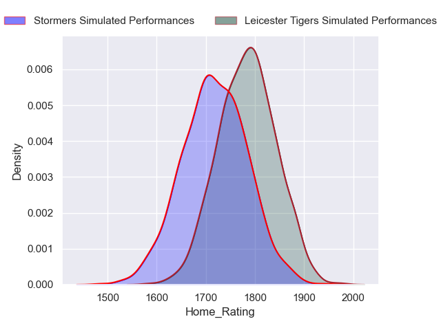
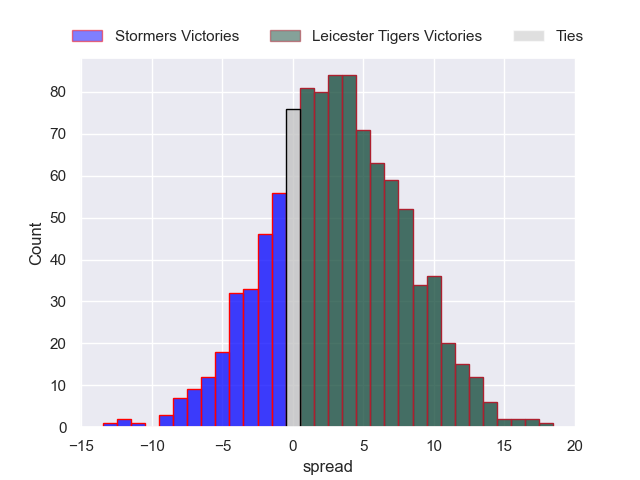
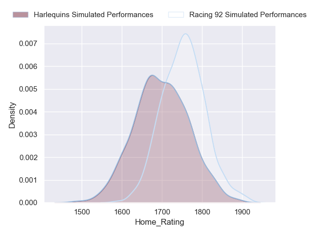
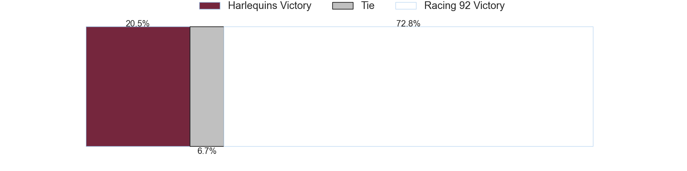
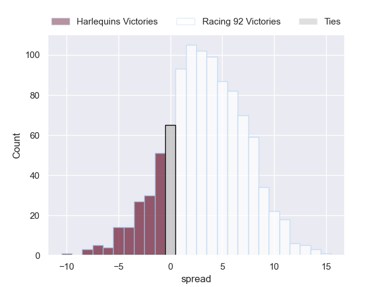

---  
title: "Investec Champions Cup 2023 Status"  
date: 2023-12-10 6:00:00 -0500  
categories: model review projection  
layout: article  
aside:  
    toc: true  
---
# Current Team Rankings

# Standings

## Projected Total Table

| Club             |   Total Matches |   Wins |   Point Differential |   Losing Bonus Points |   Try Bonus Points |   Competition Points |
|:-----------------|----------------:|-------:|---------------------:|----------------------:|-------------------:|---------------------:|
| Leicester Tigers |               1 |    0.8 |              4.02516 |                   0.2 |                0.8 |                  4.3 |
| Racing 92        |               1 |    0.8 |              2.89157 |                   0.2 |                0.7 |                  4.1 |
| Harlequins       |               1 |    0.2 |             -2.89157 |                   0.7 |                0.2 |                  1.7 |
| Stormers         |               1 |    0.2 |             -4.02516 |                   0.6 |                0.1 |                  1.4 |

# Future Predictions

## Week 1

### Leicester Tigers V Stormers on 2023/12/10

Average Margin: Leicester Tigers by 4.0

### Racing 92 V Harlequins on 2023/12/10

Average Margin: Racing 92 by 2.9

