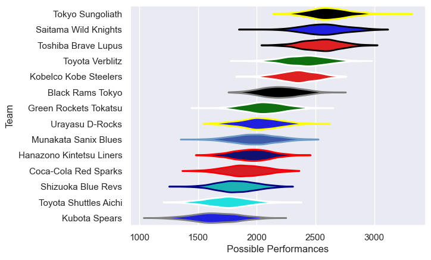

---  
title: "Japan Rugby League One 10/11 Status"  
date: 2025-07-28 6:00:00 -0500  
categories: model review projection  
layout: article  
aside:  
    toc: true  
---
# Current Team Rankings

# Standings

## Current Standings

| Club                     |   Played |   Wins |   Point Differential |   Losing Bonus Points | Try Bonus Points   |   Competition Points |
|:-------------------------|---------:|-------:|---------------------:|----------------------:|:-------------------|---------------------:|
| Saitama Wild Knights     |       15 |     13 |                  409 |                     2 |                    |                   54 |
| Toshiba Brave Lupus      |       14 |     11 |                  268 |                     3 |                    |                   47 |
| Tokyo Sungoliath         |       15 |     11 |                  292 |                     2 |                    |                   46 |
| Toyota Verblitz          |       14 |     11 |                  163 |                     2 |                    |                   46 |
| Kobelco Kobe Steelers    |       13 |      7 |                  116 |                     2 |                    |                   30 |
| Green Rockets Tokatsu    |       13 |      7 |                  -58 |                     1 |                    |                   29 |
| Black Rams Tokyo         |       13 |      6 |                  -25 |                     4 |                    |                   28 |
| Hanazono Kintetsu Liners |       13 |      6 |                  -67 |                     3 |                    |                   27 |
| Munakata Sanix Blues     |       13 |      5 |                 -115 |                     3 |                    |                   25 |
| Coca-Cola Red Sparks     |       13 |      5 |                 -188 |                     3 |                    |                   23 |
| Shizuoka Blue Revs       |       13 |      5 |                 -175 |                     2 |                    |                   22 |
| Urayasu D-Rocks          |       13 |      4 |                  -72 |                     5 |                    |                   21 |
| Kubota Spears            |       13 |      1 |                 -219 |                     2 |                    |                    8 |
| Toyota Shuttles Aichi    |       13 |      1 |                 -329 |                     4 |                    |                    8 |

# Completed Match Review

| Model | Percent Correct Predictions | Spread Error |
| ------ | ------ | ------ |
| Club Level | 68.1% | 15.8 |
| Player Level: Lineup | nan% | nan |
| Player Level: Minutes | nan% | nan |

