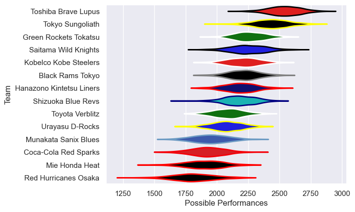

---  
title: "Japan Rugby League One 11/12 Status"  
date: 2025-07-28 6:00:00 -0500  
categories: model review projection  
layout: article  
aside:  
    toc: true  
---
# Current Team Rankings

# Standings

## Current Standings

| Club                     |   Played |   Wins |   Point Differential |   Losing Bonus Points |   Try Bonus Points |   Competition Points |
|:-------------------------|---------:|-------:|---------------------:|----------------------:|-------------------:|---------------------:|
| Tokyo Sungoliath         |       15 |     14 |                  301 |                     1 |                  1 |                   58 |
| Saitama Wild Knights     |       15 |     12 |                  149 |                     1 |                    |                   49 |
| Toshiba Brave Lupus      |       14 |     11 |                  290 |                     2 |                    |                   46 |
| Hanazono Kintetsu Liners |       13 |      8 |                   30 |                     2 |                    |                   34 |
| Green Rockets Tokatsu    |       14 |      8 |                  -13 |                     1 |                    |                   33 |
| Kobelco Kobe Steelers    |       13 |      6 |                   61 |                     5 |                    |                   31 |
| Black Rams Tokyo         |       13 |      7 |                   53 |                     1 |                    |                   31 |
| Shizuoka Blue Revs       |       13 |      6 |                  133 |                     3 |                    |                   29 |
| Toyota Verblitz          |       13 |      5 |                   18 |                     4 |                    |                   24 |
| Urayasu D-Rocks          |       13 |      5 |                  -92 |                     2 |                    |                   24 |
| Munakata Sanix Blues     |       13 |      4 |                 -204 |                     2 |                    |                   18 |
| Mie Honda Heat           |       13 |      2 |                 -253 |                     1 |                    |                   11 |
| Red Hurricanes Osaka     |       13 |      2 |                 -264 |                     0 |                    |                   10 |
| Coca-Cola Red Sparks     |       13 |      1 |                 -209 |                     5 |                    |                    9 |

# Completed Match Review

| Model | Percent Correct Predictions | Spread Error |
| ------ | ------ | ------ |
| Club Level | 68.1% | 17.8 |
| Player Level: Lineup | nan% | nan |
| Player Level: Minutes | nan% | nan |

