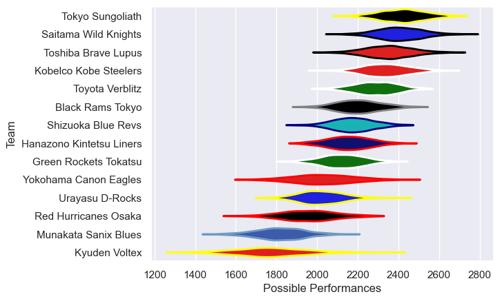

---  
title: "Japan Rugby League One 12/13"  
date: 2025-07-29 6:00:00 -0500  
categories: model review projection  
layout: article  
aside:  
    toc: true  
---
# Current Team Rankings

# Standings

## Current Standings

| Club                     |   Played |   Wins |   Point Differential |   Losing Bonus Points | Try Bonus Points   |   Competition Points |
|:-------------------------|---------:|-------:|---------------------:|----------------------:|:-------------------|---------------------:|
| Tokyo Sungoliath         |       15 |     15 |                  258 |                     0 |                    |                   60 |
| Toshiba Brave Lupus      |       15 |     11 |                  208 |                     2 |                    |                   46 |
| Saitama Wild Knights     |       14 |     10 |                  222 |                     1 |                    |                   41 |
| Kobelco Kobe Steelers    |       14 |      9 |                  194 |                     2 |                    |                   40 |
| Toyota Verblitz          |       13 |      9 |                   52 |                     1 |                    |                   39 |
| Shizuoka Blue Revs       |       13 |      8 |                  119 |                     3 |                    |                   35 |
| Urayasu D-Rocks          |       13 |      7 |                  -73 |                     2 |                    |                   30 |
| Hanazono Kintetsu Liners |       13 |      6 |                   48 |                     3 |                    |                   27 |
| Green Rockets Tokatsu    |       13 |      6 |                   24 |                     1 |                    |                   25 |
| Black Rams Tokyo         |       13 |      5 |                  -38 |                     3 |                    |                   23 |
| Yokohama Canon Eagles    |       13 |      3 |                  -95 |                     2 |                    |                   14 |
| Kyuden Voltex            |       13 |      2 |                 -355 |                     3 |                    |                   11 |
| Red Hurricanes Osaka     |       13 |      1 |                 -307 |                     2 |                    |                    6 |
| Munakata Sanix Blues     |       13 |      1 |                 -257 |                     1 |                    |                    5 |

# Completed Match Review

| Model | Percent Correct Predictions | Spread Error |
| ------ | ------ | ------ |
| Club Level | 75.5% | 15.3 |
| Player Level: Lineup | nan% | nan |
| Player Level: Minutes | nan% | nan |

