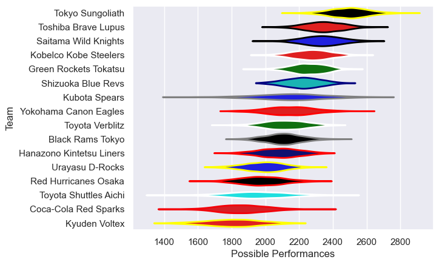

---  
title: "Japan Rugby League One 13/14 Status"  
date: 2025-07-28 6:00:00 -0500  
categories: model review projection  
layout: article  
aside:  
    toc: true  
---
# Current Team Rankings

# Standings

## Current Standings

| Club                     |   Played |   Wins |   Point Differential |   Losing Bonus Points | Try Bonus Points   |   Competition Points |
|:-------------------------|---------:|-------:|---------------------:|----------------------:|:-------------------|---------------------:|
| Tokyo Sungoliath         |        7 |      6 |                  135 |                     1 |                    |                   25 |
| Saitama Wild Knights     |        7 |      5 |                  134 |                     1 |                    |                   23 |
| Shizuoka Blue Revs       |        7 |      5 |                   59 |                     0 |                    |                   22 |
| Green Rockets Tokatsu    |        7 |      5 |                   55 |                     1 |                    |                   21 |
| Toyota Verblitz          |        7 |      5 |                   31 |                     1 |                    |                   21 |
| Kobelco Kobe Steelers    |        7 |      5 |                   66 |                     0 |                    |                   20 |
| Toshiba Brave Lupus      |        7 |      5 |                   33 |                     0 |                    |                   20 |
| Yokohama Canon Eagles    |        7 |      4 |                   26 |                     2 |                    |                   18 |
| Kubota Spears            |        7 |      4 |                   -4 |                     1 |                    |                   17 |
| Urayasu D-Rocks          |        7 |      4 |                  -20 |                     0 |                    |                   16 |
| Hanazono Kintetsu Liners |        7 |      2 |                  -28 |                     3 |                    |                   11 |
| Toyota Shuttles Aichi    |        7 |      1 |                  -13 |                     4 |                    |                    8 |
| Black Rams Tokyo         |        7 |      1 |                  -54 |                     2 |                    |                    8 |
| Red Hurricanes Osaka     |        7 |      2 |                  -92 |                     0 |                    |                    8 |
| Coca-Cola Red Sparks     |        7 |      0 |                 -166 |                     1 |                    |                    3 |
| Kyuden Voltex            |        7 |      0 |                 -162 |                     0 |                    |                    0 |

# Completed Match Review

| Model | Percent Correct Predictions | Spread Error |
| ------ | ------ | ------ |
| Club Level | 80.4% | 14.5 |
| Player Level: Lineup | nan% | nan |
| Player Level: Minutes | nan% | nan |

