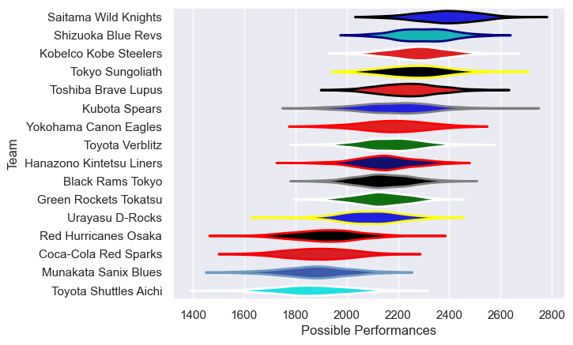

---  
title: "Japan Rugby League One 14/15 Status"  
date: 2025-07-28 6:00:00 -0500  
categories: model review projection  
layout: article  
aside:  
    toc: true  
---
# Current Team Rankings

# Standings

## Current Standings

| Club                     |   Played |   Wins |   Point Differential |   Losing Bonus Points | Try Bonus Points   |   Competition Points |
|:-------------------------|---------:|-------:|---------------------:|----------------------:|:-------------------|---------------------:|
| Kobelco Kobe Steelers    |        7 |      6 |                   76 |                     0 |                    |                   26 |
| Tokyo Sungoliath         |        7 |      6 |                   65 |                     1 |                    |                   25 |
| Saitama Wild Knights     |        7 |      6 |                  192 |                     0 |                    |                   24 |
| Toshiba Brave Lupus      |        7 |      5 |                   77 |                     2 |                    |                   22 |
| Shizuoka Blue Revs       |        7 |      4 |                  114 |                     2 |                    |                   20 |
| Toyota Verblitz          |        7 |      4 |                   12 |                     2 |                    |                   20 |
| Yokohama Canon Eagles    |        7 |      4 |                   42 |                     3 |                    |                   19 |
| Hanazono Kintetsu Liners |        7 |      4 |                    4 |                     2 |                    |                   18 |
| Urayasu D-Rocks          |        7 |      4 |                    3 |                     2 |                    |                   18 |
| Kubota Spears            |        7 |      3 |                  -30 |                     1 |                    |                   15 |
| Black Rams Tokyo         |        7 |      2 |                   23 |                     3 |                    |                   11 |
| Green Rockets Tokatsu    |        7 |      2 |                  -39 |                     3 |                    |                   11 |
| Toyota Shuttles Aichi    |        7 |      2 |                 -126 |                     0 |                    |                    8 |
| Coca-Cola Red Sparks     |        7 |      1 |                 -120 |                     2 |                    |                    6 |
| Munakata Sanix Blues     |        7 |      1 |                 -191 |                     0 |                    |                    4 |
| Red Hurricanes Osaka     |        7 |      0 |                 -102 |                     3 |                    |                    3 |

# Completed Match Review

| Model | Percent Correct Predictions | Spread Error |
| ------ | ------ | ------ |
| Club Level | 76.8% | 12.7 |
| Player Level: Lineup | nan% | nan |
| Player Level: Minutes | nan% | nan |

