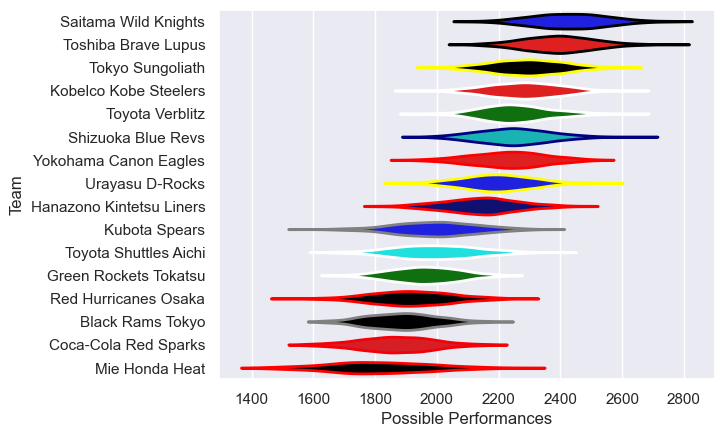

---  
title: "Japan Rugby League One 15/16 Status"  
date: 2025-07-28 6:00:00 -0500  
categories: model review projection  
layout: article  
aside:  
    toc: true  
---
# Current Team Rankings

# Standings

## Current Standings

| Club                     |   Played |   Wins |   Point Differential |   Losing Bonus Points |   Try Bonus Points |   Competition Points |
|:-------------------------|---------:|-------:|---------------------:|----------------------:|-------------------:|---------------------:|
| Saitama Wild Knights     |       10 |      9 |                  226 |                     0 |                    |                   38 |
| Shizuoka Blue Revs       |       10 |      8 |                   97 |                     0 |                  1 |                   33 |
| Toshiba Brave Lupus      |       10 |      7 |                  176 |                     1 |                  1 |                   32 |
| Tokyo Sungoliath         |       10 |      7 |                  219 |                     1 |                  1 |                   30 |
| Toyota Verblitz          |       10 |      7 |                  108 |                     1 |                  1 |                   30 |
| Kobelco Kobe Steelers    |       10 |      6 |                   94 |                     3 |                    |                   27 |
| Hanazono Kintetsu Liners |       10 |      6 |                  -37 |                     1 |                  1 |                   26 |
| Yokohama Canon Eagles    |       10 |      6 |                  -11 |                     1 |                    |                   25 |
| Toyota Shuttles Aichi    |       10 |      5 |                  -80 |                     0 |                    |                   20 |
| Urayasu D-Rocks          |       10 |      4 |                   13 |                     3 |                    |                   19 |
| Kubota Spears            |       10 |      3 |                 -130 |                     2 |                  1 |                   15 |
| Mie Honda Heat           |       10 |      3 |                 -175 |                     1 |                  1 |                   14 |
| Red Hurricanes Osaka     |       10 |      2 |                  -87 |                     2 |                    |                   12 |
| Green Rockets Tokatsu    |       10 |      2 |                 -128 |                     1 |                  1 |                   12 |
| Black Rams Tokyo         |       10 |      2 |                 -132 |                     1 |                  1 |                   10 |
| Coca-Cola Red Sparks     |       10 |      1 |                 -153 |                     3 |                    |                    7 |

# Completed Match Review

| Model | Percent Correct Predictions | Spread Error |
| ------ | ------ | ------ |
| Club Level | 67.5% | 14.9 |
| Player Level: Lineup | nan% | nan |
| Player Level: Minutes | nan% | nan |

