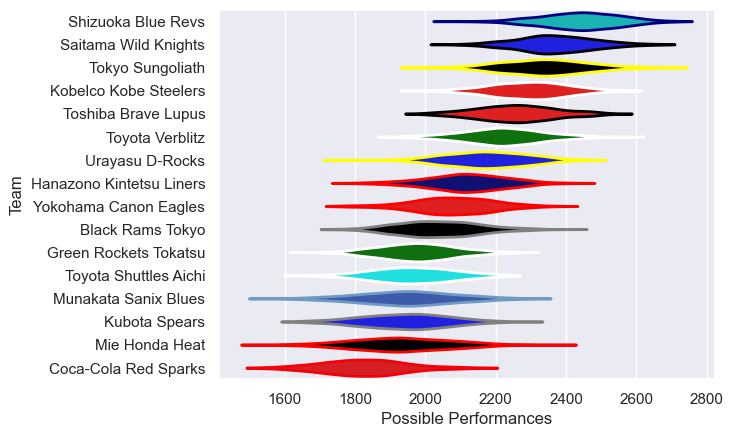

---  
title: "Japan Rugby League One 16/17 Status"  
date: 2025-07-28 6:00:00 -0500  
categories: model review projection  
layout: article  
aside:  
    toc: true  
---
# Current Team Rankings

# Standings

## Current Standings

| Club                     |   Played |   Wins |   Point Differential |   Losing Bonus Points | Try Bonus Points   |   Competition Points |
|:-------------------------|---------:|-------:|---------------------:|----------------------:|:-------------------|---------------------:|
| Shizuoka Blue Revs       |        8 |      8 |                  201 |                     0 |                    |                   32 |
| Tokyo Sungoliath         |        8 |      8 |                  191 |                     0 |                    |                   32 |
| Kobelco Kobe Steelers    |        8 |      7 |                  121 |                     0 |                    |                   28 |
| Saitama Wild Knights     |        8 |      6 |                  102 |                     1 |                    |                   25 |
| Toyota Verblitz          |        8 |      5 |                   69 |                     2 |                    |                   22 |
| Urayasu D-Rocks          |        8 |      5 |                   15 |                     1 |                    |                   21 |
| Munakata Sanix Blues     |        8 |      5 |                  -35 |                     1 |                    |                   21 |
| Toshiba Brave Lupus      |        8 |      4 |                  -13 |                     2 |                    |                   18 |
| Black Rams Tokyo         |        8 |      4 |                  -40 |                     2 |                    |                   18 |
| Kubota Spears            |        8 |      3 |                  -76 |                     1 |                    |                   15 |
| Hanazono Kintetsu Liners |        8 |      2 |                  -30 |                     4 |                    |                   12 |
| Green Rockets Tokatsu    |        8 |      2 |                  -61 |                     1 |                    |                   11 |
| Yokohama Canon Eagles    |        8 |      2 |                  -39 |                     2 |                    |                   10 |
| Coca-Cola Red Sparks     |        8 |      1 |                 -128 |                     3 |                    |                    7 |
| Toyota Shuttles Aichi    |        8 |      1 |                 -127 |                     2 |                    |                    6 |
| Mie Honda Heat           |        8 |      0 |                 -150 |                     2 |                    |                    2 |

# Completed Match Review

| Model | Percent Correct Predictions | Spread Error |
| ------ | ------ | ------ |
| Club Level | 76.6% | 12.7 |
| Player Level: Lineup | nan% | nan |
| Player Level: Minutes | nan% | nan |

