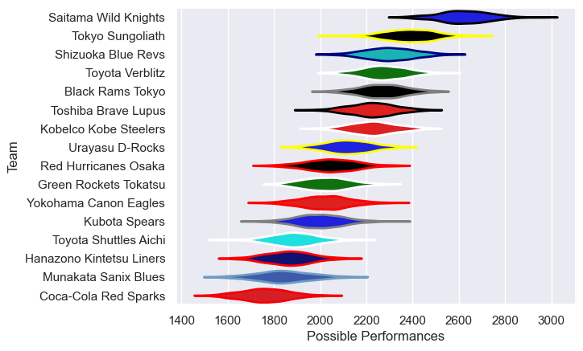

---  
title: "Japan Rugby League One 17/18 Status"  
date: 2025-07-28 6:00:00 -0500  
categories: model review projection  
layout: article  
aside:  
    toc: true  
---
# Current Team Rankings

# Standings

## Current Standings

| Club                     |   Played |   Wins |   Point Differential |   Losing Bonus Points |   Try Bonus Points |   Competition Points |
|:-------------------------|---------:|-------:|---------------------:|----------------------:|-------------------:|---------------------:|
| Saitama Wild Knights     |       15 |     14 |                  440 |                     1 |                    |                   57 |
| Tokyo Sungoliath         |       15 |     14 |                  316 |                     0 |                    |                   56 |
| Shizuoka Blue Revs       |       15 |     10 |                  184 |                     2 |                  1 |                   43 |
| Toyota Verblitz          |       15 |     10 |                   82 |                     3 |                    |                   43 |
| Black Rams Tokyo         |       15 |     10 |                   90 |                     1 |                  1 |                   42 |
| Kobelco Kobe Steelers    |       15 |      9 |                   89 |                     3 |                  1 |                   42 |
| Toshiba Brave Lupus      |       15 |      9 |                   36 |                     3 |                    |                   39 |
| Urayasu D-Rocks          |       15 |      8 |                   47 |                     3 |                  1 |                   38 |
| Kubota Spears            |       15 |      7 |                  -76 |                     2 |                  1 |                   31 |
| Red Hurricanes Osaka     |       15 |      7 |                 -108 |                     1 |                    |                   29 |
| Green Rockets Tokatsu    |       15 |      6 |                 -104 |                     2 |                    |                   26 |
| Yokohama Canon Eagles    |       15 |      5 |                 -158 |                     4 |                  1 |                   25 |
| Munakata Sanix Blues     |       15 |      3 |                 -139 |                     4 |                  1 |                   17 |
| Hanazono Kintetsu Liners |       15 |      4 |                 -181 |                     1 |                    |                   17 |
| Toyota Shuttles Aichi    |       15 |      2 |                 -143 |                     2 |                    |                   10 |
| Coca-Cola Red Sparks     |       15 |      1 |                 -375 |                     3 |                    |                    7 |

# Completed Match Review

| Model | Percent Correct Predictions | Spread Error |
| ------ | ------ | ------ |
| Club Level | 79.2% | 12.3 |
| Player Level: Lineup | nan% | nan |
| Player Level: Minutes | nan% | nan |

