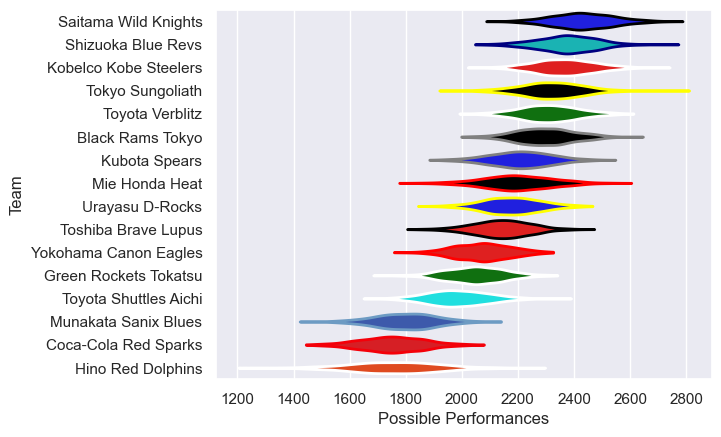

---  
title: "Japan Rugby League One 18/19"  
date: 2025-07-29 6:00:00 -0500  
categories: model review projection  
layout: article  
aside:  
    toc: true  
---
# Current Team Rankings

# Standings

## Current Standings

| Club                  |   Played |   Wins |   Point Differential |   Losing Bonus Points |   Try Bonus Points |   Competition Points |
|:----------------------|---------:|-------:|---------------------:|----------------------:|-------------------:|---------------------:|
| Kobelco Kobe Steelers |       10 |      9 |                  295 |                     0 |                  1 |                   39 |
| Shizuoka Blue Revs    |       10 |      8 |                  116 |                     1 |                    |                   33 |
| Tokyo Sungoliath      |       10 |      8 |                   30 |                     0 |                    |                   32 |
| Saitama Wild Knights  |       10 |      7 |                  113 |                     2 |                  1 |                   31 |
| Toyota Verblitz       |       10 |      6 |                   91 |                     2 |                    |                   28 |
| Kubota Spears         |       10 |      6 |                   32 |                     3 |                    |                   27 |
| Urayasu D-Rocks       |       10 |      5 |                   73 |                     4 |                  1 |                   25 |
| Mie Honda Heat        |       10 |      5 |                   22 |                     2 |                    |                   24 |
| Green Rockets Tokatsu |       10 |      5 |                   21 |                     2 |                    |                   22 |
| Black Rams Tokyo      |       10 |      4 |                  -23 |                     4 |                  1 |                   21 |
| Toshiba Brave Lupus   |       10 |      4 |                  -22 |                     3 |                  1 |                   20 |
| Toyota Shuttles Aichi |       10 |      4 |                  -98 |                     1 |                  1 |                   18 |
| Yokohama Canon Eagles |       10 |      3 |                  -49 |                     1 |                    |                   15 |
| Hino Red Dolphins     |       10 |      2 |                 -161 |                     2 |                  1 |                   11 |
| Munakata Sanix Blues  |       10 |      2 |                 -206 |                     1 |                  1 |                   10 |
| Coca-Cola Red Sparks  |       10 |      0 |                 -234 |                     2 |                  1 |                    3 |

# Completed Match Review

| Model | Percent Correct Predictions | Spread Error |
| ------ | ------ | ------ |
| Club Level | 66.2% | 13.5 |
| Player Level: Lineup | nan% | nan |
| Player Level: Minutes | nan% | nan |

