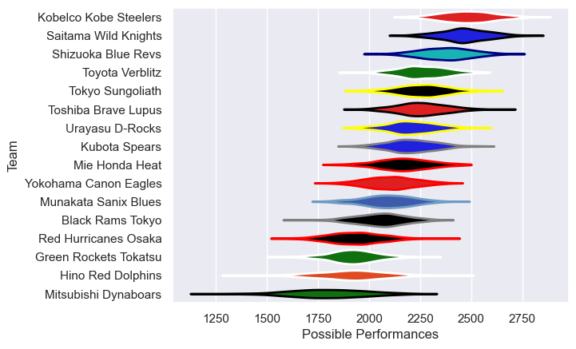

---  
title: "Japan Rugby League One 19/20 Status"  
date: 2025-07-28 6:00:00 -0500  
categories: model review projection  
layout: article  
aside:  
    toc: true  
---
# Current Team Rankings

# Standings

## Current Standings

| Club                  |   Played |   Wins |   Point Differential |   Losing Bonus Points | Try Bonus Points   |   Competition Points |
|:----------------------|---------:|-------:|---------------------:|----------------------:|:-------------------|---------------------:|
| Kobelco Kobe Steelers |        6 |      6 |                  243 |                     0 |                    |                   24 |
| Saitama Wild Knights  |        6 |      6 |                  185 |                     0 |                    |                   24 |
| Shizuoka Blue Revs    |        6 |      5 |                  194 |                     0 |                    |                   20 |
| Tokyo Sungoliath      |        6 |      4 |                  126 |                     2 |                    |                   18 |
| Urayasu D-Rocks       |        6 |      4 |                   76 |                     1 |                    |                   17 |
| Kubota Spears         |        6 |      4 |                   49 |                     1 |                    |                   17 |
| Toshiba Brave Lupus   |        6 |      4 |                  -23 |                     0 |                    |                   16 |
| Toyota Verblitz       |        6 |      3 |                   -7 |                     1 |                    |                   13 |
| Yokohama Canon Eagles |        6 |      3 |                  -37 |                     0 |                    |                   12 |
| Mie Honda Heat        |        6 |      2 |                   -3 |                     2 |                    |                   10 |
| Munakata Sanix Blues  |        6 |      2 |                  -75 |                     1 |                    |                    9 |
| Black Rams Tokyo      |        6 |      2 |                  -98 |                     0 |                    |                    8 |
| Mitsubishi Dynaboars  |        6 |      1 |                 -141 |                     1 |                    |                    5 |
| Hino Red Dolphins     |        6 |      1 |                 -150 |                     0 |                    |                    4 |
| Red Hurricanes Osaka  |        6 |      1 |                 -250 |                     0 |                    |                    4 |
| Green Rockets Tokatsu |        6 |      0 |                  -89 |                     2 |                    |                    2 |

# Completed Match Review

| Model | Percent Correct Predictions | Spread Error |
| ------ | ------ | ------ |
| Club Level | 75.0% | 19.0 |
| Player Level: Lineup | nan% | nan |
| Player Level: Minutes | nan% | nan |

