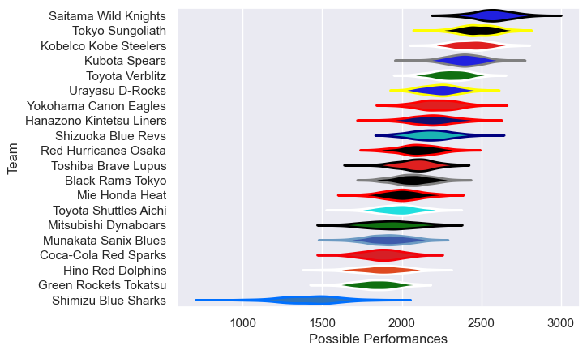

---  
title: "Japan Rugby League One 20/21"  
date: 2025-07-29 6:00:00 -0500  
categories: model review projection  
layout: article  
aside:  
    toc: true  
---
# Current Team Rankings

# Standings

## Current Standings

| Club                     |   Played |   Wins |   Point Differential |   Losing Bonus Points |   Try Bonus Points |   Competition Points |
|:-------------------------|---------:|-------:|---------------------:|----------------------:|-------------------:|---------------------:|
| Saitama Wild Knights     |       11 |     10 |                  336 |                     0 |                    |                   42 |
| Tokyo Sungoliath         |       10 |      9 |                  348 |                     1 |                  1 |                   38 |
| Toyota Verblitz          |       10 |      8 |                   99 |                     1 |                    |                   33 |
| Kobelco Kobe Steelers    |        9 |      7 |                  182 |                     1 |                    |                   31 |
| Kubota Spears            |       10 |      7 |                  125 |                     2 |                    |                   30 |
| Black Rams Tokyo         |        8 |      4 |                   -2 |                     3 |                    |                   19 |
| Red Hurricanes Osaka     |        8 |      4 |                  -15 |                     2 |                    |                   18 |
| Yokohama Canon Eagles    |        8 |      4 |                  -39 |                     1 |                    |                   17 |
| Toshiba Brave Lupus      |        8 |      3 |                   -8 |                     2 |                    |                   14 |
| Urayasu D-Rocks          |        8 |      3 |                  -48 |                     0 |                    |                   14 |
| Shizuoka Blue Revs       |        8 |      3 |                  -35 |                     1 |                    |                   13 |
| Mitsubishi Dynaboars     |        9 |      2 |                 -212 |                     0 |                    |                   10 |
| Hino Red Dolphins        |        8 |      2 |                 -140 |                     1 |                    |                    9 |
| Mie Honda Heat           |        8 |      1 |                 -115 |                     1 |                    |                    5 |
| Munakata Sanix Blues     |        8 |      1 |                 -193 |                     1 |                    |                    5 |
| Green Rockets Tokatsu    |        8 |      1 |                 -210 |                     1 |                    |                    5 |
| Hanazono Kintetsu Liners |        2 |      1 |                  -37 |                     0 |                    |                    4 |
| Toyota Shuttles Aichi    |        1 |      0 |                   -1 |                     1 |                    |                    1 |
| Coca-Cola Red Sparks     |        1 |      0 |                   -7 |                     1 |                    |                    1 |
| Shimizu Blue Sharks      |        1 |      0 |                  -28 |                     0 |                    |                    0 |

# Completed Match Review

| Model | Percent Correct Predictions | Spread Error |
| ------ | ------ | ------ |
| Club Level | 76.4% | 16.8 |
| Player Level: Lineup | nan% | nan |
| Player Level: Minutes | nan% | nan |

