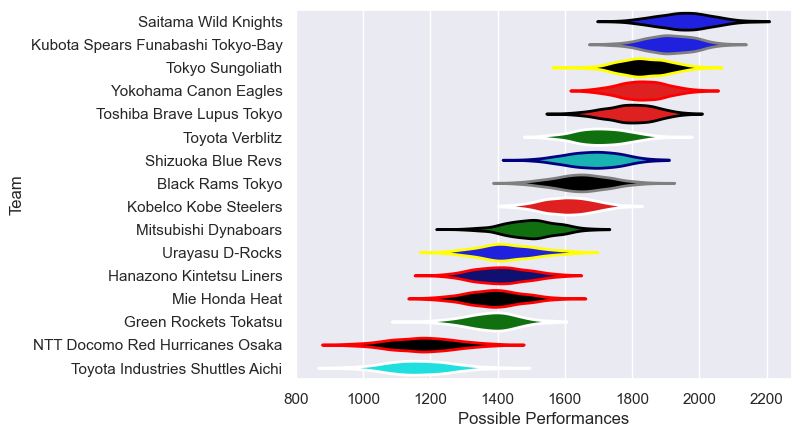

---  
title: "Japan Rugby League One 2022 Status"  
date: 2023-05-19 6:00:00 -0500  
categories: model review projection  
layout: article  
aside:  
    toc: true  
---
# Current Team Rankings

# Standings

## Current Standings

| Club                              |   Played |   Wins |   Point Differential |   Losing Bonus Points |   Try Bonus Points |   Competition Points |
|:----------------------------------|---------:|-------:|---------------------:|----------------------:|-------------------:|---------------------:|
| Saitama Wild Knights              |       33 |     32 |                  591 |                     0 |                nan |                  137 |
| Kubota Spears Funabashi Tokyo-Bay |       33 |     26 |                  467 |                     2 |                nan |                  127 |
| Tokyo Sungoliath                  |       32 |     24 |                  426 |                     3 |                nan |                  119 |
| Toshiba Brave Lupus Tokyo         |       33 |     20 |                  282 |                     5 |                nan |                  105 |
| Yokohama Canon Eagles             |       32 |     20 |                  319 |                     3 |                nan |                   99 |
| Toyota Verblitz                   |       28 |     15 |                   10 |                     3 |                nan |                   74 |
| Kobelco Kobe Steelers             |       29 |     11 |                  -53 |                     5 |                nan |                   64 |
| Shizuoka Blue Revs                |       27 |     10 |                  -12 |                     7 |                nan |                   61 |
| Black Rams Tokyo                  |       28 |      8 |                 -174 |                     6 |                nan |                   46 |
| Mitsubishi Dynaboars              |       20 |      8 |                 -160 |                     1 |                nan |                   40 |
| Green Rockets Tokatsu             |       33 |      4 |                 -579 |                     8 |                nan |                   33 |
| Hanazono Kintetsu Liners          |       18 |      3 |                 -500 |                     1 |                nan |                   18 |
| Urayasu D-Rocks                   |       17 |      4 |                 -266 |                     1 |                nan |                   17 |
| Mie Honda Heat                    |        4 |      3 |                  -15 |                     0 |                nan |                   12 |
| NTT Docomo Red Hurricanes Osaka   |       11 |      1 |                 -269 |                     0 |                nan |                    6 |
| Toyota Industries Shuttles Aichi  |        2 |      0 |                  -67 |                     0 |                nan |                    0 |

## Projected Remaining Table

| Club                              |   Matches Remaining |   Wins |   Point Differential |   Losing Bonus Points |   Try Bonus Points |   Competition Points |
|:----------------------------------|--------------------:|-------:|---------------------:|----------------------:|-------------------:|---------------------:|
| Saitama Wild Knights              |                   1 |    0.9 |                  5.2 |                   0.1 |                0.8 |                  4.4 |
| Kubota Spears Funabashi Tokyo-Bay |                   1 |    0.1 |                 -5.2 |                   0.5 |                0.1 |                  1.2 |

## Projected Total Table

| Club                              |   Total Matches |   Wins |   Point Differential |   Losing Bonus Points |   Try Bonus Points |   Competition Points |
|:----------------------------------|----------------:|-------:|---------------------:|----------------------:|-------------------:|---------------------:|
| Saitama Wild Knights              |              34 |   32.9 |                596.2 |                   0.1 |                0.8 |                141.4 |
| Kubota Spears Funabashi Tokyo-Bay |              34 |   26.1 |                461.8 |                   2.5 |                0.1 |                128.2 |
| Tokyo Sungoliath                  |              32 |   24   |                426   |                   3   |                0   |                119   |
| Toshiba Brave Lupus Tokyo         |              33 |   20   |                282   |                   5   |                0   |                105   |
| Yokohama Canon Eagles             |              32 |   20   |                319   |                   3   |                0   |                 99   |
| Toyota Verblitz                   |              28 |   15   |                 10   |                   3   |                0   |                 74   |
| Kobelco Kobe Steelers             |              29 |   11   |                -53   |                   5   |                0   |                 64   |
| Shizuoka Blue Revs                |              27 |   10   |                -12   |                   7   |                0   |                 61   |
| Black Rams Tokyo                  |              28 |    8   |               -174   |                   6   |                0   |                 46   |
| Mitsubishi Dynaboars              |              20 |    8   |               -160   |                   1   |                0   |                 40   |
| Green Rockets Tokatsu             |              33 |    4   |               -579   |                   8   |                0   |                 33   |
| Hanazono Kintetsu Liners          |              18 |    3   |               -500   |                   1   |                0   |                 18   |
| Urayasu D-Rocks                   |              17 |    4   |               -266   |                   1   |                0   |                 17   |
| Mie Honda Heat                    |               4 |    3   |                -15   |                   0   |                0   |                 12   |
| NTT Docomo Red Hurricanes Osaka   |              11 |    1   |               -269   |                   0   |                0   |                  6   |
| Toyota Industries Shuttles Aichi  |               2 |    0   |                -67   |                   0   |                0   |                  0   |

# Completed Match Review

| Model | Percent Correct Predictions | Spread Error |
| ------ | ------ | ------ |
| Club Level | 78.4% | 13.5 |
| Player Level: Lineup | 75.3% | 16.1 |
| Player Level: Minutes | 74.7% | 14.2 |

# Future Predictions

## Week 34

### Saitama Wild Knights V Kubota Spears Funabashi Tokyo-Bay on 2023/05/20

Average Margin: Saitama Wild Knights by 5.6

