---  
title: "Japan Rugby League One 2023 Status"  
date: 2023-12-18 6:00:00 -0500  
categories: model review projection  
layout: article  
aside:  
    toc: true  
---
# Current Team Rankings

# Standings

## Current Standings

| Club                     |   Played |   Wins |   Point Differential |   Losing Bonus Points |   Try Bonus Points |   Competition Points |
|:-------------------------|---------:|-------:|---------------------:|----------------------:|-------------------:|---------------------:|
| Saitama Wild Knights     |        2 |      2 |                   90 |                     0 |                nan |                    9 |
| Kobelco Kobe Steelers    |        2 |      2 |                   69 |                     0 |                nan |                    8 |
| Toshiba Brave Lupus      |        2 |      2 |                   20 |                     0 |                nan |                    8 |
| Mitsubishi Dynaboars     |        2 |      2 |                    9 |                     0 |                nan |                    8 |
| Kubota Spears            |        2 |      1 |                   49 |                     0 |                  2 |                    6 |
| Tokyo Sungoliath         |        2 |      1 |                   19 |                     1 |                nan |                    6 |
| Toyota Verblitz          |        2 |      1 |                    5 |                     1 |                nan |                    5 |
| Yokohama Canon Eagles    |        2 |      1 |                  -39 |                     0 |                  0 |                    4 |
| Black Rams Tokyo         |        2 |      0 |                  -15 |                     1 |                nan |                    1 |
| Shizuoka Blue Revs       |        2 |      0 |                  -17 |                     1 |                nan |                    1 |
| Hanazono Kintetsu Liners |        2 |      0 |                  -50 |                     1 |                nan |                    1 |
| Mie Honda Heat           |        2 |      0 |                 -140 |                     0 |                nan |                    0 |

## Projected Remaining Table

| Club                     |   Matches Remaining |   Wins |   Point Differential |   Losing Bonus Points |   Try Bonus Points |   Competition Points |
|:-------------------------|--------------------:|-------:|---------------------:|----------------------:|-------------------:|---------------------:|
| Saitama Wild Knights     |                  14 |   13.3 |             226.336  |                   0.6 |               13.1 |                 67   |
| Tokyo Sungoliath         |                  14 |   11.4 |             139.836  |                   1.6 |               11.1 |                 58.2 |
| Kubota Spears            |                  14 |   10.9 |             117.161  |                   2.2 |               10.5 |                 56.4 |
| Toshiba Brave Lupus      |                  14 |   10.5 |             108.834  |                   2.1 |               10.2 |                 54.3 |
| Yokohama Canon Eagles    |                  14 |    9.9 |              85.9368 |                   2.5 |                9.5 |                 51.5 |
| Toyota Verblitz          |                  14 |    7.7 |              22.8972 |                   3.2 |                7.4 |                 41.4 |
| Shizuoka Blue Revs       |                  14 |    5.1 |             -41.4669 |                   3.4 |                5   |                 28.7 |
| Kobelco Kobe Steelers    |                  14 |    4.9 |             -54.4431 |                   3.4 |                4.8 |                 27.6 |
| Black Rams Tokyo         |                  14 |    4.4 |             -84.5383 |                   3.2 |                4.1 |                 24.9 |
| Mitsubishi Dynaboars     |                  14 |    3   |            -128.902  |                   3.1 |                2.8 |                 17.7 |
| Hanazono Kintetsu Liners |                  14 |    2.5 |            -141.087  |                   2.7 |                2.4 |                 14.9 |
| Mie Honda Heat           |                  14 |    0.5 |            -250.564  |                   1.7 |                0.5 |                  4.3 |

## Projected Total Table

| Club                     |   Total Matches |   Wins |   Point Differential |   Losing Bonus Points |   Try Bonus Points |   Competition Points |
|:-------------------------|----------------:|-------:|---------------------:|----------------------:|-------------------:|---------------------:|
| Saitama Wild Knights     |              16 |   15.3 |             316.336  |                   0.6 |               13.1 |                 76   |
| Tokyo Sungoliath         |              16 |   12.4 |             158.836  |                   2.6 |               11.1 |                 64.2 |
| Kubota Spears            |              16 |   11.9 |             166.161  |                   2.2 |               12.5 |                 62.4 |
| Toshiba Brave Lupus      |              16 |   12.5 |             128.834  |                   2.1 |               10.2 |                 62.3 |
| Yokohama Canon Eagles    |              16 |   10.9 |              46.9368 |                   2.5 |                9.5 |                 55.5 |
| Toyota Verblitz          |              16 |    8.7 |              27.8972 |                   4.2 |                7.4 |                 46.4 |
| Kobelco Kobe Steelers    |              16 |    6.9 |              14.5569 |                   3.4 |                4.8 |                 35.6 |
| Shizuoka Blue Revs       |              16 |    5.1 |             -58.4669 |                   4.4 |                5   |                 29.7 |
| Black Rams Tokyo         |              16 |    4.4 |             -99.5383 |                   4.2 |                4.1 |                 25.9 |
| Mitsubishi Dynaboars     |              16 |    5   |            -119.902  |                   3.1 |                2.8 |                 25.7 |
| Hanazono Kintetsu Liners |              16 |    2.5 |            -191.087  |                   3.7 |                2.4 |                 15.9 |
| Mie Honda Heat           |              16 |    0.5 |            -390.564  |                   1.7 |                0.5 |                  4.3 |

# Completed Match Review

| Model | Percent Correct Predictions | Spread Error |
| ------ | ------ | ------ |
| Club Level | 66.7% | 21.7 |
| Player Level: Lineup | 71.4% | 35.8 |
| Player Level: Minutes | 71.4% | 35.7 |

# Future Predictions

## Week 3

### Saitama Wild Knights V Black Rams Tokyo on 2023/12/23

Average Margin: Saitama Wild Knights by 23.1

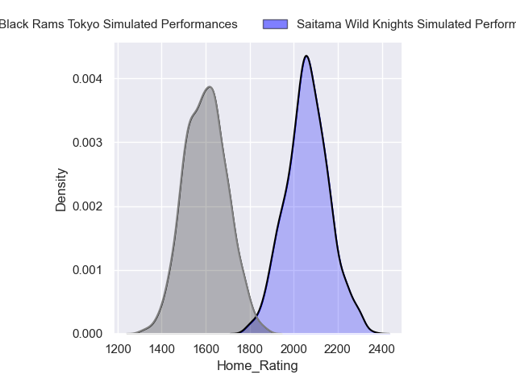

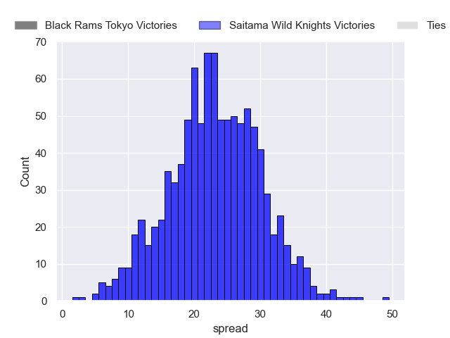

### Toyota Verblitz V Mitsubishi Dynaboars on 2023/12/23

Average Margin: Toyota Verblitz by 12.0

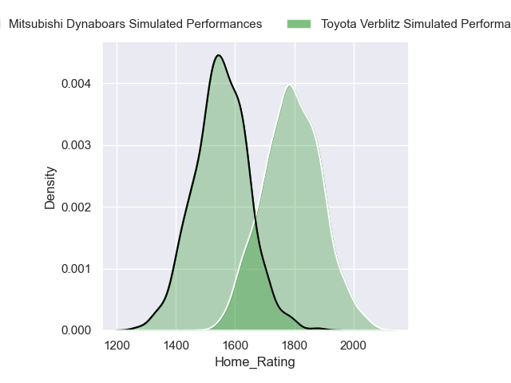
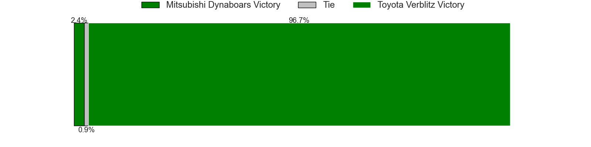
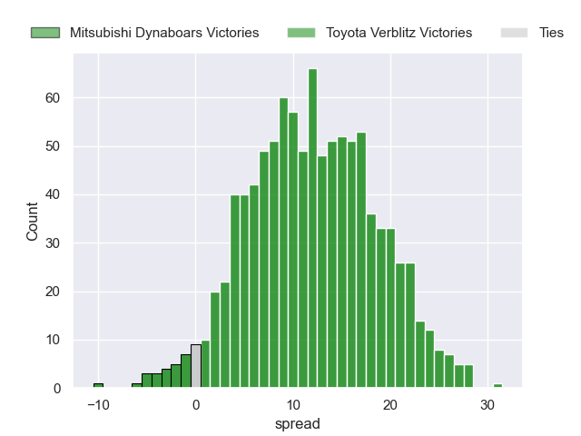

### Yokohama Canon Eagles V Hanazono Kintetsu Liners on 2023/12/23

Average Margin: Yokohama Canon Eagles by 17.1

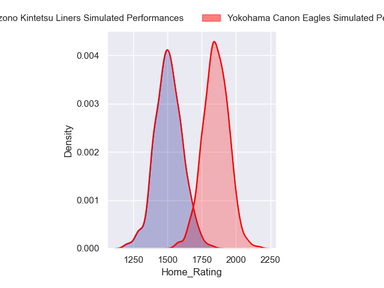
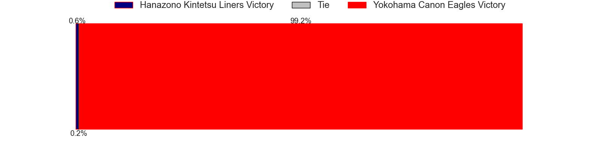
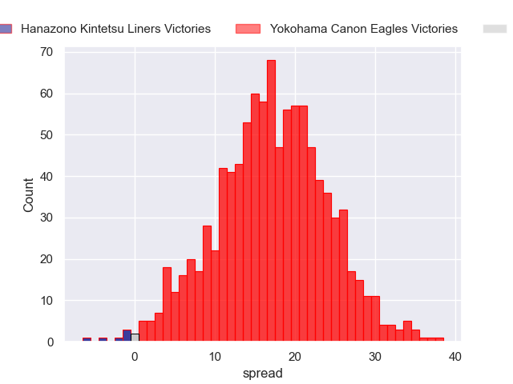

### Mie Honda Heat V Tokyo Sungoliath on 2023/12/24

Average Margin: Tokyo Sungoliath by 20.8

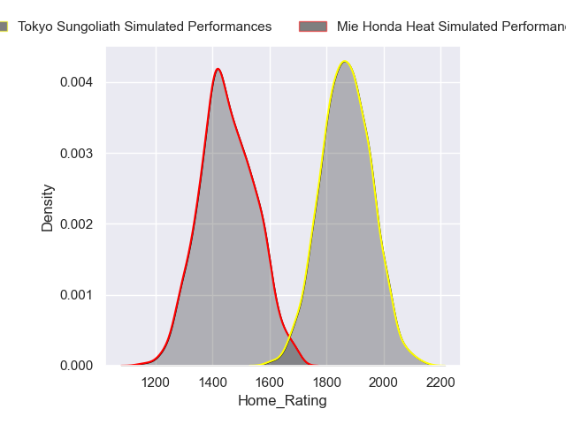

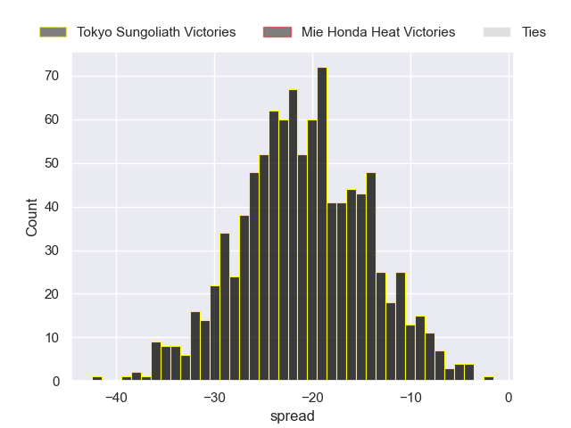

### Kobelco Kobe Steelers V Toshiba Brave Lupus on 2023/12/24

Average Margin: Toshiba Brave Lupus by 5.7

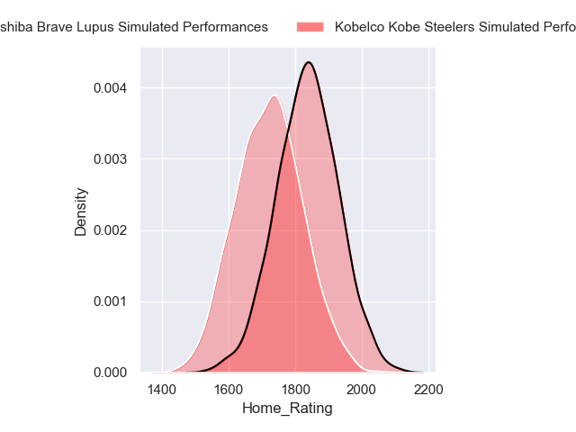
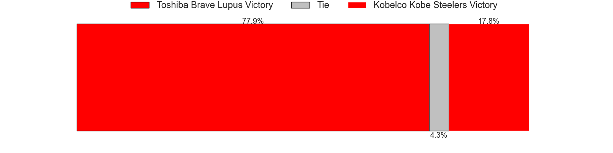
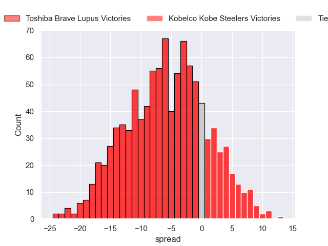

### Kubota Spears V Shizuoka Blue Revs on 2023/12/24

Average Margin: Kubota Spears by 14.3

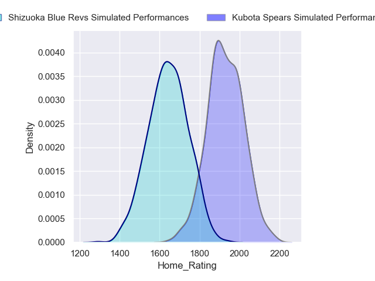
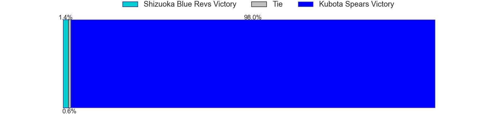
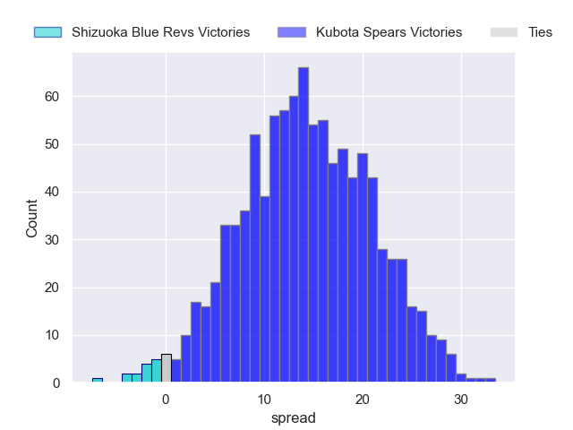

## Week 4

### Tokyo Sungoliath V Kobelco Kobe Steelers on 2024/01/06

Average Margin: Tokyo Sungoliath by 13.7

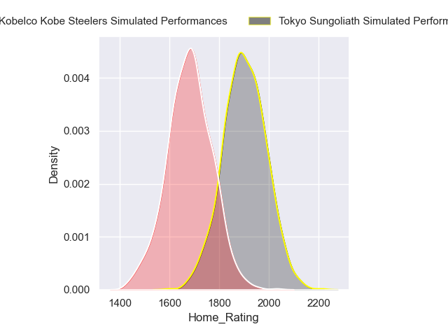
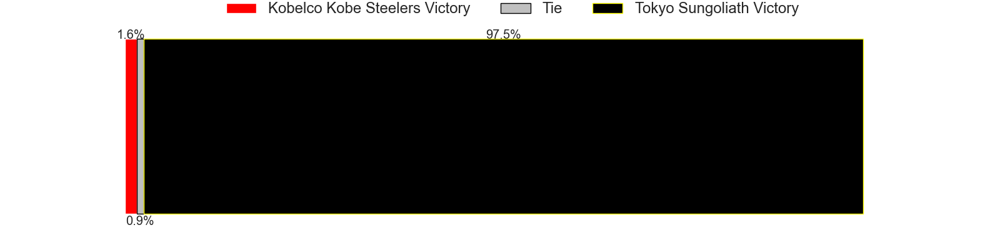
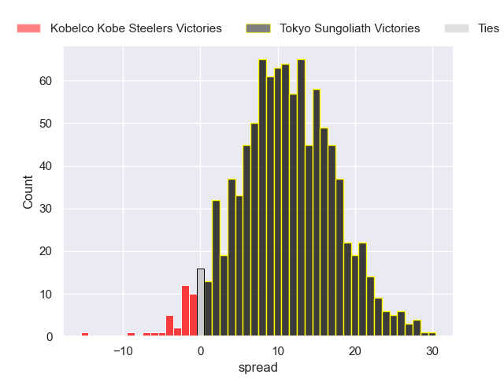

### Saitama Wild Knights V Toyota Verblitz on 2024/01/06

Average Margin: Saitama Wild Knights by 16.5

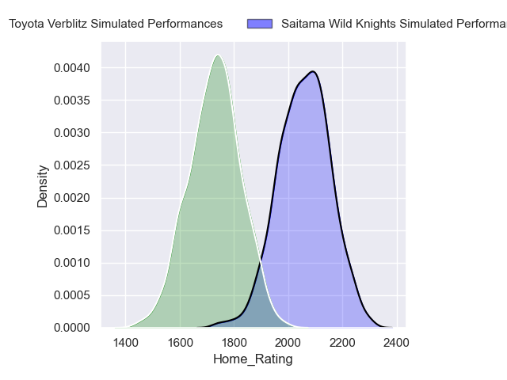
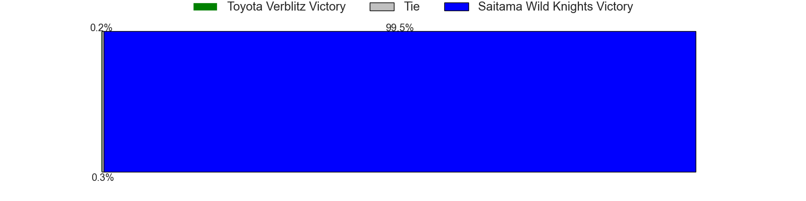
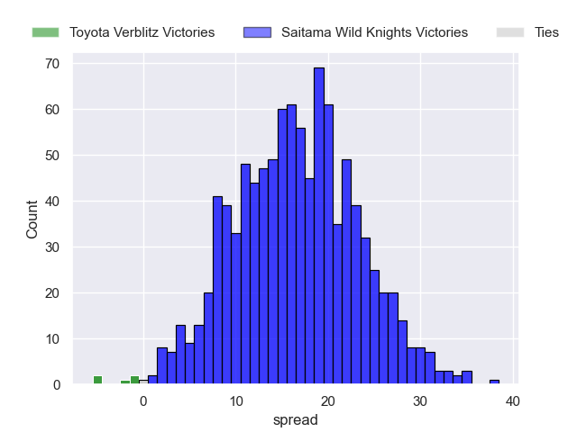

### Black Rams Tokyo V Hanazono Kintetsu Liners on 2024/01/06

Average Margin: Black Rams Tokyo by 8.2

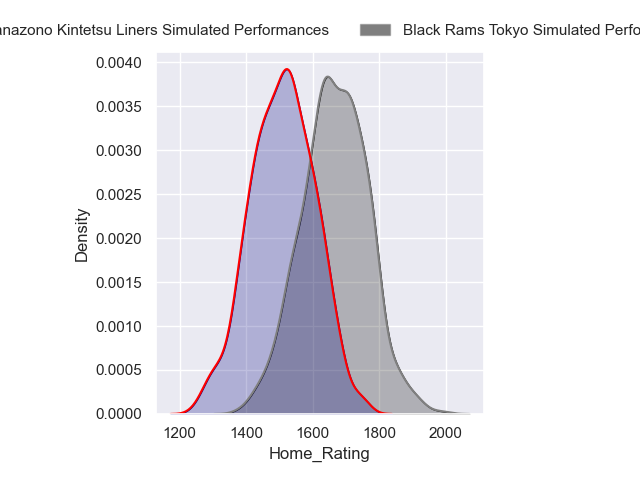
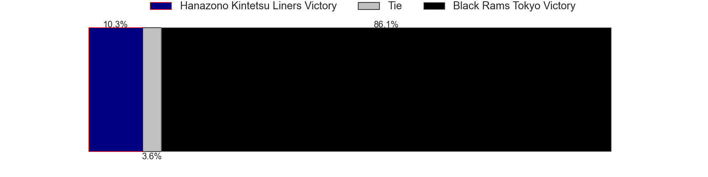
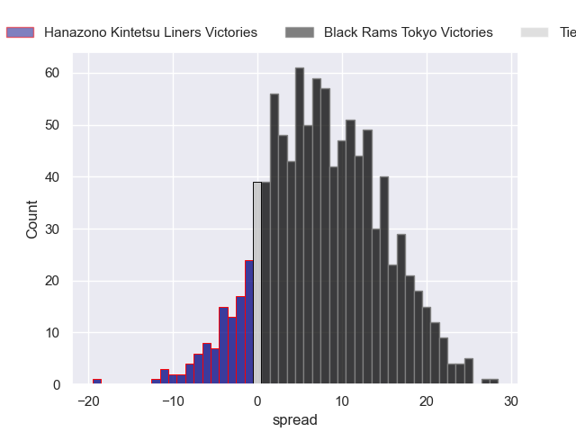

### Toshiba Brave Lupus V Kubota Spears on 2024/01/07

Average Margin: Toshiba Brave Lupus by 1.9

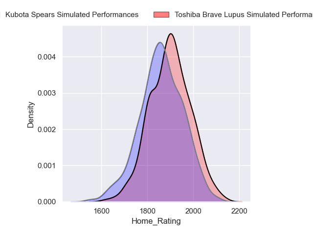
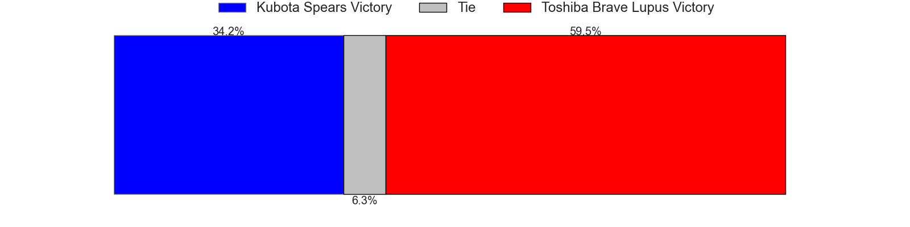
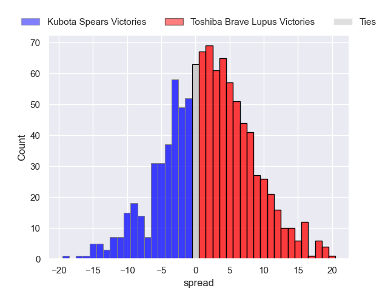

### Mie Honda Heat V Shizuoka Blue Revs on 2024/01/07

Average Margin: Shizuoka Blue Revs by 9.9

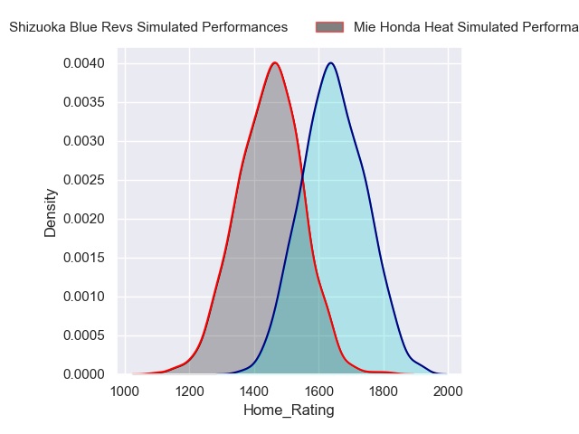
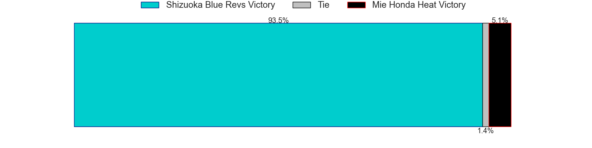
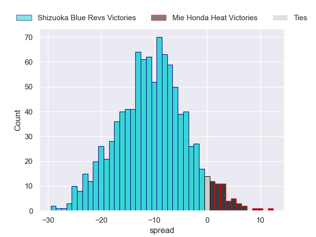

### Mitsubishi Dynaboars V Yokohama Canon Eagles on 2024/01/07

Average Margin: Yokohama Canon Eagles by 8.1

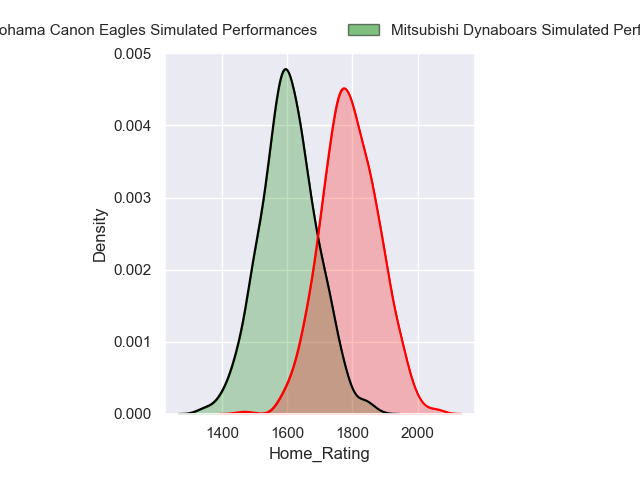
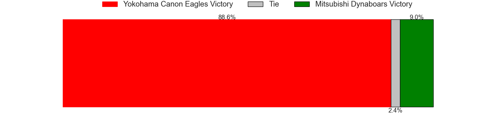
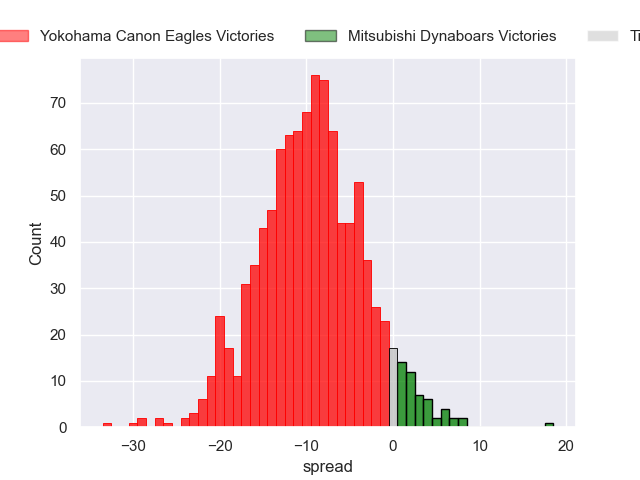

## Week 5

### Shizuoka Blue Revs V Tokyo Sungoliath on 2024/01/13

Average Margin: Tokyo Sungoliath by 7.5

### Yokohama Canon Eagles V Black Rams Tokyo on 2024/01/13

Average Margin: Yokohama Canon Eagles by 12.9

### Mitsubishi Dynaboars V Saitama Wild Knights on 2024/01/13

Average Margin: Saitama Wild Knights by 19.0

### Toshiba Brave Lupus V Mie Honda Heat on 2024/01/14

Average Margin: Toshiba Brave Lupus by 26.4

### Hanazono Kintetsu Liners V Toyota Verblitz on 2024/01/14

Average Margin: Toyota Verblitz by 7.5

### Kobelco Kobe Steelers V Kubota Spears on 2024/01/14

Average Margin: Kubota Spears by 6.6

## Week 6

### Mitsubishi Dynaboars V Tokyo Sungoliath on 2024/01/20

Average Margin: Tokyo Sungoliath by 12.0

### Saitama Wild Knights V Mie Honda Heat on 2024/01/20

Average Margin: Saitama Wild Knights by 34.2

## Week 7

### Yokohama Canon Eagles V Kobelco Kobe Steelers on 2024/01/27

Average Margin: Yokohama Canon Eagles by 10.1

### Shizuoka Blue Revs V Hanazono Kintetsu Liners on 2024/01/27

Average Margin: Shizuoka Blue Revs by 10.1

### Black Rams Tokyo V Kubota Spears on 2024/01/27

Average Margin: Kubota Spears by 9.8

### Toyota Verblitz V Toshiba Brave Lupus on 2024/01/27

Average Margin: Toshiba Brave Lupus by 1.9

## Week 8

### Saitama Wild Knights V Tokyo Sungoliath on 2024/02/17

Average Margin: Saitama Wild Knights by 10.0

### Toyota Verblitz V Mie Honda Heat on 2024/02/17

Average Margin: Toyota Verblitz by 20.9

## Week 9

### Mitsubishi Dynaboars V Shizuoka Blue Revs on 2024/02/24

Average Margin: Shizuoka Blue Revs by 1.0

### Toshiba Brave Lupus V Yokohama Canon Eagles on 2024/02/24

Average Margin: Toshiba Brave Lupus by 5.8

### Hanazono Kintetsu Liners V Kubota Spears on 2024/02/24

Average Margin: Kubota Spears by 13.8

### Black Rams Tokyo V Kobelco Kobe Steelers on 2024/02/25

Average Margin: Black Rams Tokyo by 0.7

## Week 10

### Mie Honda Heat V Yokohama Canon Eagles on 2024/03/01

Average Margin: Yokohama Canon Eagles by 16.8

### Hanazono Kintetsu Liners V Toshiba Brave Lupus on 2024/03/02

Average Margin: Toshiba Brave Lupus by 12.6

### Shizuoka Blue Revs V Saitama Wild Knights on 2024/03/02

Average Margin: Saitama Wild Knights by 13.8

### Tokyo Sungoliath V Black Rams Tokyo on 2024/03/02

Average Margin: Tokyo Sungoliath by 16.0

### Kubota Spears V Mitsubishi Dynaboars on 2024/03/03

Average Margin: Kubota Spears by 18.1

### Kobelco Kobe Steelers V Toyota Verblitz on 2024/03/03

Average Margin: Kobelco Kobe Steelers by 0.3

## Week 11

### Yokohama Canon Eagles V Shizuoka Blue Revs on 2024/03/09

Average Margin: Yokohama Canon Eagles by 10.4

### Kubota Spears V Toyota Verblitz on 2024/03/09

Average Margin: Kubota Spears by 9.8

### Saitama Wild Knights V Toshiba Brave Lupus on 2024/03/09

Average Margin: Saitama Wild Knights by 11.2

### Tokyo Sungoliath V Hanazono Kintetsu Liners on 2024/03/09

Average Margin: Tokyo Sungoliath by 20.9

### Mie Honda Heat V Black Rams Tokyo on 2024/03/10

Average Margin: Black Rams Tokyo by 7.1

### Mitsubishi Dynaboars V Kobelco Kobe Steelers on 2024/03/10

Average Margin: Kobelco Kobe Steelers by 2.0

## Week 12

### Yokohama Canon Eagles V Kubota Spears on 2024/03/15

Average Margin: Kubota Spears by 0.5

### Toyota Verblitz V Tokyo Sungoliath on 2024/03/16

Average Margin: Tokyo Sungoliath by 3.3

### Black Rams Tokyo V Shizuoka Blue Revs on 2024/03/16

Average Margin: Black Rams Tokyo by 1.1

### Kobelco Kobe Steelers V Saitama Wild Knights on 2024/03/16

Average Margin: Saitama Wild Knights by 12.9

### Toshiba Brave Lupus V Mitsubishi Dynaboars on 2024/03/17

Average Margin: Toshiba Brave Lupus by 17.5

### Hanazono Kintetsu Liners V Mie Honda Heat on 2024/03/17

Average Margin: Hanazono Kintetsu Liners by 9.7

## Week 13

### Kubota Spears V Saitama Wild Knights on 2024/03/22

Average Margin: Saitama Wild Knights by 2.8

### Tokyo Sungoliath V Yokohama Canon Eagles on 2024/03/23

Average Margin: Tokyo Sungoliath by 6.8

### Shizuoka Blue Revs V Toyota Verblitz on 2024/03/23

Average Margin: Toyota Verblitz by 1.0

### Mie Honda Heat V Mitsubishi Dynaboars on 2024/03/24

Average Margin: Mitsubishi Dynaboars by 5.5

### Toshiba Brave Lupus V Black Rams Tokyo on 2024/03/24

Average Margin: Toshiba Brave Lupus by 14.8

### Kobelco Kobe Steelers V Hanazono Kintetsu Liners on 2024/03/24

Average Margin: Kobelco Kobe Steelers by 10.6

## Week 14

### Shizuoka Blue Revs V Mie Honda Heat on 2024/04/06

Average Margin: Shizuoka Blue Revs by 16.4

### Black Rams Tokyo V Yokohama Canon Eagles on 2024/04/06

Average Margin: Yokohama Canon Eagles by 5.7

### Saitama Wild Knights V Mitsubishi Dynaboars on 2024/04/06

Average Margin: Saitama Wild Knights by 24.6

### Toyota Verblitz V Hanazono Kintetsu Liners on 2024/04/06

Average Margin: Toyota Verblitz by 13.8

### Kubota Spears V Toshiba Brave Lupus on 2024/04/07

Average Margin: Kubota Spears by 4.7

### Kobelco Kobe Steelers V Tokyo Sungoliath on 2024/04/07

Average Margin: Tokyo Sungoliath by 6.5

## Week 15

### Hanazono Kintetsu Liners V Yokohama Canon Eagles on 2024/04/12

Average Margin: Yokohama Canon Eagles by 9.9

### Black Rams Tokyo V Saitama Wild Knights on 2024/04/12

Average Margin: Saitama Wild Knights by 15.7

### Shizuoka Blue Revs V Kubota Spears on 2024/04/13

Average Margin: Kubota Spears by 7.1

### Mitsubishi Dynaboars V Toyota Verblitz on 2024/04/13

Average Margin: Toyota Verblitz by 5.2

### Tokyo Sungoliath V Mie Honda Heat on 2024/04/13

Average Margin: Tokyo Sungoliath by 26.8

### Toshiba Brave Lupus V Kobelco Kobe Steelers on 2024/04/14

Average Margin: Toshiba Brave Lupus by 12.0

## Week 16

### Tokyo Sungoliath V Shizuoka Blue Revs on 2024/04/19

Average Margin: Tokyo Sungoliath by 14.1

### Yokohama Canon Eagles V Mitsubishi Dynaboars on 2024/04/20

Average Margin: Yokohama Canon Eagles by 14.9

### Toyota Verblitz V Saitama Wild Knights on 2024/04/20

Average Margin: Saitama Wild Knights by 9.2

### Hanazono Kintetsu Liners V Black Rams Tokyo on 2024/04/21

Average Margin: Black Rams Tokyo by 0.8

### Kubota Spears V Kobelco Kobe Steelers on 2024/04/21

Average Margin: Kubota Spears by 13.4

### Mie Honda Heat V Toshiba Brave Lupus on 2024/04/21

Average Margin: Toshiba Brave Lupus by 18.6

## Week 17

### Saitama Wild Knights V Hanazono Kintetsu Liners on 2024/04/27

Average Margin: Saitama Wild Knights by 26.9

### Toyota Verblitz V Yokohama Canon Eagles on 2024/04/27

Average Margin: Toyota Verblitz by 0.5

### Toshiba Brave Lupus V Tokyo Sungoliath on 2024/04/27

Average Margin: Toshiba Brave Lupus by 2.1

### Kubota Spears V Mie Honda Heat on 2024/04/27

Average Margin: Kubota Spears by 27.1

### Kobelco Kobe Steelers V Shizuoka Blue Revs on 2024/04/27

Average Margin: Kobelco Kobe Steelers by 3.9

### Mitsubishi Dynaboars V Black Rams Tokyo on 2024/04/27

Average Margin: Mitsubishi Dynaboars by 1.4

## Week 18

### Mie Honda Heat V Kobelco Kobe Steelers on 2024/05/04

Average Margin: Kobelco Kobe Steelers by 10.2

### Yokohama Canon Eagles V Saitama Wild Knights on 2024/05/04

Average Margin: Saitama Wild Knights by 6.5

### Shizuoka Blue Revs V Toshiba Brave Lupus on 2024/05/04

Average Margin: Toshiba Brave Lupus by 5.5

### Tokyo Sungoliath V Kubota Spears on 2024/05/04

Average Margin: Tokyo Sungoliath by 3.4

### Hanazono Kintetsu Liners V Mitsubishi Dynaboars on 2024/05/05

Average Margin: Hanazono Kintetsu Liners by 1.4

### Black Rams Tokyo V Toyota Verblitz on 2024/05/05

Average Margin: Toyota Verblitz by 3.1

