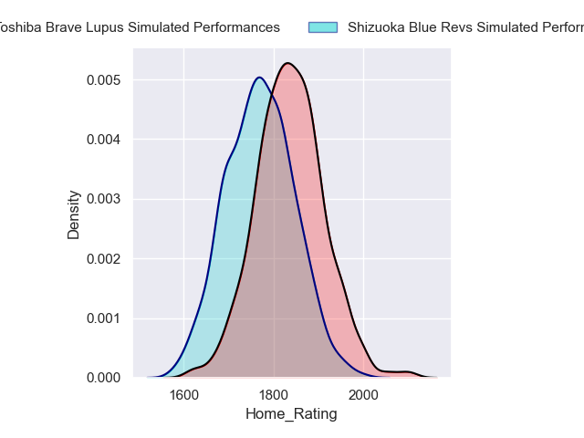
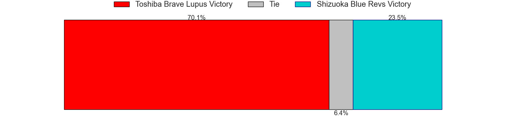
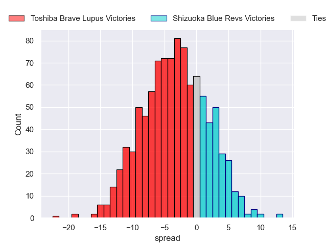

---  
title: "Japan Rugby League One 2023 Status"  
date: 2024-04-29 6:00:00 -0500  
categories: model review projection  
layout: article  
aside:  
    toc: true  
---
# Current Team Rankings

# Standings

## Current Standings

| Club                     |   Played |   Wins |   Point Differential |   Losing Bonus Points |   Try Bonus Points |   Competition Points |
|:-------------------------|---------:|-------:|---------------------:|----------------------:|-------------------:|---------------------:|
| Saitama Wild Knights     |       15 |     15 |                  443 |                     0 |                nan |                   72 |
| Toshiba Brave Lupus      |       15 |     13 |                  142 |                     0 |                nan |                   63 |
| Tokyo Sungoliath         |       15 |     10 |                  178 |                     3 |                nan |                   57 |
| Yokohama Canon Eagles    |       15 |     10 |                  101 |                     3 |                nan |                   52 |
| Kobelco Kobe Steelers    |       15 |      8 |                  186 |                     2 |                nan |                   46 |
| Kubota Spears            |       15 |      7 |                   88 |                     5 |                nan |                   44 |
| Toyota Verblitz          |       15 |      8 |                   21 |                     2 |                nan |                   42 |
| Shizuoka Blue Revs       |       15 |      7 |                   27 |                     2 |                nan |                   38 |
| Mitsubishi Dynaboars     |       15 |      5 |                 -190 |                     3 |                nan |                   29 |
| Black Rams Tokyo         |       15 |      3 |                 -155 |                     4 |                nan |                   21 |
| Hanazono Kintetsu Liners |       15 |      1 |                 -341 |                     2 |                nan |                   12 |
| Mie Honda Heat           |       15 |      1 |                 -500 |                     2 |                nan |                    6 |

## Projected Remaining Table

| Club                     |   Matches Remaining |   Wins |   Point Differential |   Losing Bonus Points |   Try Bonus Points |   Competition Points |
|:-------------------------|--------------------:|-------:|---------------------:|----------------------:|-------------------:|---------------------:|
| Kobelco Kobe Steelers    |                   1 |    1   |             16.453   |                   0   |                0.9 |                  4.9 |
| Saitama Wild Knights     |                   1 |    0.9 |              8.72493 |                   0.1 |                0.5 |                  4.3 |
| Tokyo Sungoliath         |                   1 |    0.9 |              6.67224 |                   0.1 |                0.3 |                  4   |
| Toyota Verblitz          |                   1 |    0.8 |              4.36331 |                   0.2 |                0.4 |                  3.8 |
| Toshiba Brave Lupus      |                   1 |    0.7 |              3.33785 |                   0.3 |                0.4 |                  3.5 |
| Mitsubishi Dynaboars     |                   1 |    0.7 |              2.15458 |                   0.3 |                0.3 |                  3.2 |
| Hanazono Kintetsu Liners |                   1 |    0.3 |             -2.15458 |                   0.5 |                0.4 |                  2.3 |
| Shizuoka Blue Revs       |                   1 |    0.3 |             -3.33785 |                   0.5 |                0.2 |                  1.8 |
| Black Rams Tokyo         |                   1 |    0.2 |             -4.36331 |                   0.5 |                0.2 |                  1.5 |
| Kubota Spears            |                   1 |    0.1 |             -6.67224 |                   0.4 |                0.2 |                  1   |
| Yokohama Canon Eagles    |                   1 |    0.1 |             -8.72493 |                   0.3 |                0.1 |                  0.6 |
| Mie Honda Heat           |                   1 |    0   |            -16.453   |                   0   |                0.1 |                  0.2 |

## Projected Total Table

| Club                     |   Total Matches |   Wins |   Point Differential |   Losing Bonus Points |   Try Bonus Points |   Competition Points |
|:-------------------------|----------------:|-------:|---------------------:|----------------------:|-------------------:|---------------------:|
| Saitama Wild Knights     |              16 |   15.9 |             451.725  |                   0.1 |                0.5 |                 76.3 |
| Toshiba Brave Lupus      |              16 |   13.7 |             145.338  |                   0.3 |                0.4 |                 66.5 |
| Tokyo Sungoliath         |              16 |   10.9 |             184.672  |                   3.1 |                0.3 |                 61   |
| Yokohama Canon Eagles    |              16 |   10.1 |              92.2751 |                   3.3 |                0.1 |                 52.6 |
| Kobelco Kobe Steelers    |              16 |    9   |             202.453  |                   2   |                0.9 |                 50.9 |
| Toyota Verblitz          |              16 |    8.8 |              25.3633 |                   2.2 |                0.4 |                 45.8 |
| Kubota Spears            |              16 |    7.1 |              81.3278 |                   5.4 |                0.2 |                 45   |
| Shizuoka Blue Revs       |              16 |    7.3 |              23.6621 |                   2.5 |                0.2 |                 39.8 |
| Mitsubishi Dynaboars     |              16 |    5.7 |            -187.845  |                   3.3 |                0.3 |                 32.2 |
| Black Rams Tokyo         |              16 |    3.2 |            -159.363  |                   4.5 |                0.2 |                 22.5 |
| Hanazono Kintetsu Liners |              16 |    1.3 |            -343.155  |                   2.5 |                0.4 |                 14.3 |
| Mie Honda Heat           |              16 |    1   |            -516.453  |                   2   |                0.1 |                  6.2 |

# Completed Match Review

| Model | Percent Correct Predictions | Spread Error |
| ------ | ------ | ------ |
| Club Level | 78.9% | 13.6 |
| Player Level: Lineup | 76.2% | 14.4 |
| Player Level: Minutes | 75.0% | 14.8 |

# Future Predictions

## Week 16

### Mie Honda Heat V Kobelco Kobe Steelers on 2024/05/04

Average Margin: Kobelco Kobe Steelers by 16.5

Average Scoreline: 35-19

### Yokohama Canon Eagles V Saitama Wild Knights on 2024/05/04

Average Margin: Saitama Wild Knights by 8.7

Average Scoreline: 35-26

### Tokyo Sungoliath V Kubota Spears on 2024/05/04

Average Margin: Tokyo Sungoliath by 6.7

Average Scoreline: 35-28

### Black Rams Tokyo V Toyota Verblitz on 2024/05/05

Average Margin: Toyota Verblitz by 4.4

Average Scoreline: 34-30

### Hanazono Kintetsu Liners V Mitsubishi Dynaboars on 2024/05/05

Average Margin: Mitsubishi Dynaboars by 2.2

Average Scoreline: 34-32

### Shizuoka Blue Revs V Toshiba Brave Lupus on 2024/05/05

Average Margin: Toshiba Brave Lupus by 3.3

Average Scoreline: 33-30

