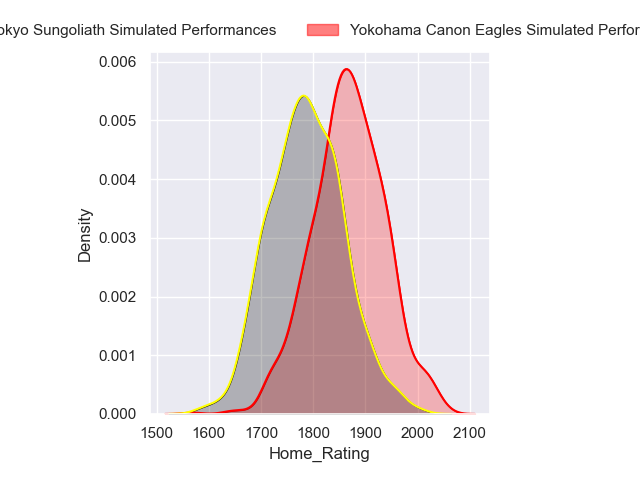
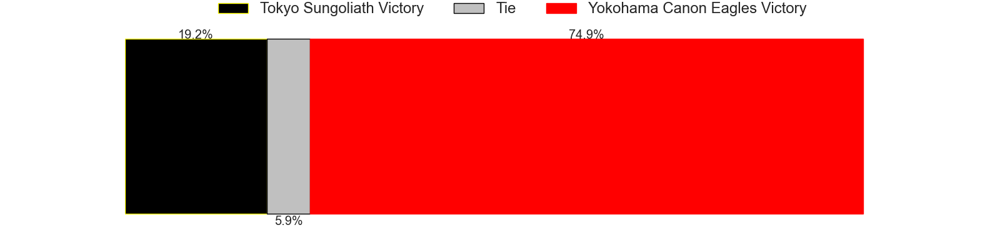
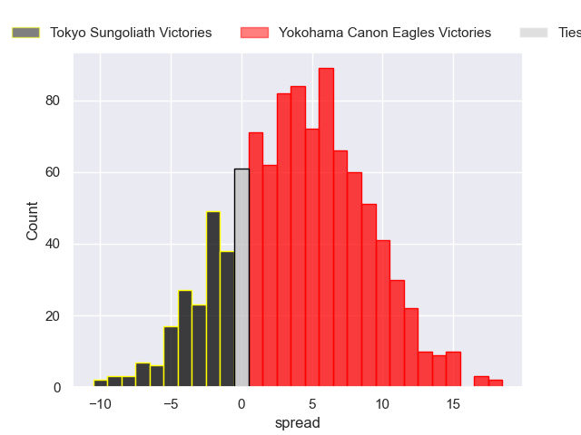
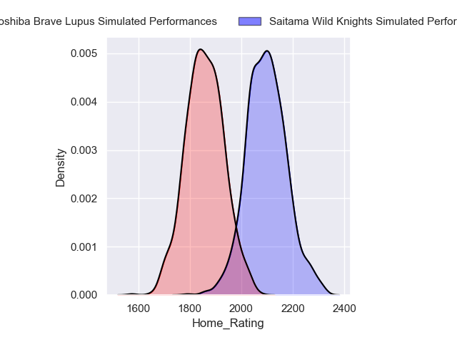
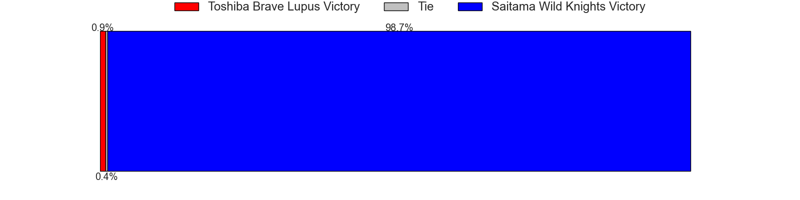
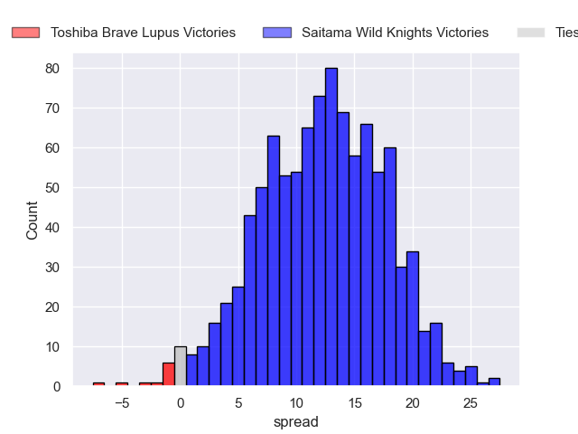

---  
title: "Japan Rugby League One 2023 Status"  
date: 2024-05-23 6:00:00 -0500  
categories: model review projection  
layout: article  
aside:  
    toc: true  
---
# Current Team Rankings

# Standings

## Current Standings

| Club                     |   Played |   Wins |   Point Differential |   Losing Bonus Points |   Try Bonus Points |   Competition Points |
|:-------------------------|---------:|-------:|---------------------:|----------------------:|-------------------:|---------------------:|
| Saitama Wild Knights     |       17 |     17 |                  475 |                     0 |                nan |                   82 |
| Toshiba Brave Lupus      |       17 |     15 |                  189 |                     0 |                nan |                   73 |
| Tokyo Sungoliath         |       17 |     10 |                  151 |                     3 |                nan |                   59 |
| Yokohama Canon Eagles    |       17 |     10 |                   69 |                     4 |                nan |                   54 |
| Kobelco Kobe Steelers    |       16 |      9 |                  188 |                     2 |                 12 |                   52 |
| Kubota Spears            |       16 |      8 |                  107 |                     5 |                 11 |                   50 |
| Toyota Verblitz          |       16 |      9 |                   48 |                     2 |                 10 |                   48 |
| Shizuoka Blue Revs       |       16 |      7 |                  -12 |                     2 |                  8 |                   38 |
| Mitsubishi Dynaboars     |       16 |      6 |                 -180 |                     3 |                  7 |                   34 |
| Black Rams Tokyo         |       17 |      4 |                 -163 |                     4 |                nan |                   26 |
| Hanazono Kintetsu Liners |       17 |      1 |                 -360 |                     2 |                nan |                   14 |
| Mie Honda Heat           |       17 |      2 |                 -482 |                     3 |                nan |                   12 |
| Urayasu D-Rocks          |        1 |      1 |                    9 |                     0 |                nan |                    4 |
| Green Rockets Tokatsu    |        1 |      0 |                  -19 |                     0 |                nan |                    0 |
| Toyota Shuttles Aichi    |        1 |      0 |                  -20 |                     0 |                nan |                    0 |

## Projected Remaining Table

| Club                     |   Matches Remaining |   Wins |   Point Differential |   Losing Bonus Points |   Try Bonus Points |   Competition Points |
|:-------------------------|--------------------:|-------:|---------------------:|----------------------:|-------------------:|---------------------:|
| Black Rams Tokyo         |                   1 |    1   |             11.9459  |                   0   |                0.6 |                  4.6 |
| Saitama Wild Knights     |                   1 |    1   |             11.9739  |                   0   |                0.6 |                  4.5 |
| Mie Honda Heat           |                   1 |    1   |             11.1196  |                   0   |                0.5 |                  4.4 |
| Yokohama Canon Eagles    |                   1 |    0.8 |              4.01696 |                   0.2 |                0.2 |                  3.6 |
| Hanazono Kintetsu Liners |                   1 |    0.6 |              1.29951 |                   0.3 |                0.5 |                  3.2 |
| Urayasu D-Rocks          |                   1 |    0.4 |             -1.29951 |                   0.4 |                0.3 |                  2.4 |
| Tokyo Sungoliath         |                   1 |    0.2 |             -4.01696 |                   0.5 |                0.2 |                  1.5 |
| Toyota Shuttles Aichi    |                   1 |    0   |            -11.1196  |                   0.2 |                0.2 |                  0.5 |
| Green Rockets Tokatsu    |                   1 |    0   |            -11.9459  |                   0.2 |                0.2 |                  0.4 |
| Toshiba Brave Lupus      |                   1 |    0   |            -11.9739  |                   0.2 |                0.1 |                  0.3 |

## Projected Total Table

| Club                     |   Total Matches |   Wins |   Point Differential |   Losing Bonus Points |   Try Bonus Points |   Competition Points |
|:-------------------------|----------------:|-------:|---------------------:|----------------------:|-------------------:|---------------------:|
| Saitama Wild Knights     |              18 |   18   |            486.974   |                   0   |                0.6 |                 86.5 |
| Toshiba Brave Lupus      |              18 |   15   |            177.026   |                   0.2 |                0.1 |                 73.3 |
| Tokyo Sungoliath         |              18 |   10.2 |            146.983   |                   3.5 |                0.2 |                 60.5 |
| Yokohama Canon Eagles    |              18 |   10.8 |             73.017   |                   4.2 |                0.2 |                 57.6 |
| Kobelco Kobe Steelers    |              16 |    9   |            188       |                   2   |               12   |                 52   |
| Kubota Spears            |              16 |    8   |            107       |                   5   |               11   |                 50   |
| Toyota Verblitz          |              16 |    9   |             48       |                   2   |               10   |                 48   |
| Shizuoka Blue Revs       |              16 |    7   |            -12       |                   2   |                8   |                 38   |
| Mitsubishi Dynaboars     |              16 |    6   |           -180       |                   3   |                7   |                 34   |
| Black Rams Tokyo         |              18 |    5   |           -151.054   |                   4   |                0.6 |                 30.6 |
| Hanazono Kintetsu Liners |              18 |    1.6 |           -358.7     |                   2.3 |                0.5 |                 17.2 |
| Mie Honda Heat           |              18 |    3   |           -470.88    |                   3   |                0.5 |                 16.4 |
| Urayasu D-Rocks          |               2 |    1.4 |              7.70049 |                   0.4 |                0.3 |                  6.4 |
| Toyota Shuttles Aichi    |               2 |    0   |            -31.1196  |                   0.2 |                0.2 |                  0.5 |
| Green Rockets Tokatsu    |               2 |    0   |            -30.9459  |                   0.2 |                0.2 |                  0.4 |

# Completed Match Review

| Model | Percent Correct Predictions | Spread Error |
| ------ | ------ | ------ |
| Club Level | 79.2% | 13.8 |
| Player Level: Lineup | 75.0% | 15.0 |
| Player Level: Minutes | 72.9% | 15.2 |

# Future Predictions

## Week 18

### Hanazono Kintetsu Liners V Urayasu D-Rocks on 2024/05/24

Average Margin: Hanazono Kintetsu Liners by 1.3

Average Scoreline: 35-33

### Yokohama Canon Eagles V Tokyo Sungoliath on 2024/05/25

Average Margin: Yokohama Canon Eagles by 4.0

Average Scoreline: 41-37

### Black Rams Tokyo V Green Rockets Tokatsu on 2024/05/25

Average Margin: Black Rams Tokyo by 11.9

Average Scoreline: 37-25

### Mie Honda Heat V Toyota Shuttles Aichi on 2024/05/25

Average Margin: Mie Honda Heat by 11.1

Average Scoreline: 38-27

### Saitama Wild Knights V Toshiba Brave Lupus on 2024/05/26

Average Margin: Saitama Wild Knights by 12.0

Average Scoreline: 36-24

