---  
title: "Japan Rugby League One 2023 Status"  
date: 2024-05-13 6:00:00 -0500  
categories: model review projection  
layout: article  
aside:  
    toc: true  
---
# Current Team Rankings

# Standings

## Current Standings

| Club                     |   Played |   Wins |   Point Differential |   Losing Bonus Points |   Try Bonus Points |   Competition Points |
|:-------------------------|---------:|-------:|---------------------:|----------------------:|-------------------:|---------------------:|
| Saitama Wild Knights     |       16 |     16 |                  472 |                     0 |                 14 |                   78 |
| Toshiba Brave Lupus      |       16 |     14 |                  181 |                     0 |                 11 |                   69 |
| Tokyo Sungoliath         |       16 |     10 |                  159 |                     3 |                 14 |                   59 |
| Yokohama Canon Eagles    |       16 |     10 |                   72 |                     3 |                 10 |                   53 |
| Kobelco Kobe Steelers    |       16 |      9 |                  188 |                     2 |                 12 |                   52 |
| Kubota Spears            |       16 |      8 |                  107 |                     5 |                 11 |                   50 |
| Toyota Verblitz          |       16 |      9 |                   48 |                     2 |                 10 |                   48 |
| Shizuoka Blue Revs       |       16 |      7 |                  -12 |                     2 |                  8 |                   38 |
| Mitsubishi Dynaboars     |       16 |      6 |                 -180 |                     3 |                  7 |                   34 |
| Black Rams Tokyo         |       16 |      3 |                 -182 |                     4 |                  6 |                   22 |
| Hanazono Kintetsu Liners |       16 |      1 |                 -351 |                     2 |                  8 |                   14 |
| Mie Honda Heat           |       16 |      1 |                 -502 |                     3 |                  1 |                    8 |

## Projected Remaining Table

| Club                     |   Matches Remaining |   Wins |   Point Differential |   Losing Bonus Points |   Try Bonus Points |   Competition Points |
|:-------------------------|--------------------:|-------:|---------------------:|----------------------:|-------------------:|---------------------:|
| Black Rams Tokyo         |                   2 |    1.7 |             13.4506  |                   0.3 |                1   |                  7.9 |
| Mie Honda Heat           |                   2 |    1.5 |              9.52579 |                   0.4 |                0.8 |                  7.2 |
| Urayasu D-Rocks          |                   2 |    1.1 |              2.63027 |                   0.6 |                0.7 |                  5.8 |
| Hanazono Kintetsu Liners |                   2 |    0.9 |             -2.63027 |                   0.7 |                0.7 |                  4.8 |
| Saitama Wild Knights     |                   1 |    1   |             16.387   |                   0   |                0.5 |                  4.5 |
| Toshiba Brave Lupus      |                   1 |    0.9 |              6.23274 |                   0.1 |                0.2 |                  3.9 |
| Toyota Shuttles Aichi    |                   2 |    0.5 |             -9.52579 |                   0.7 |                0.6 |                  3.3 |
| Green Rockets Tokatsu    |                   2 |    0.3 |            -13.4506  |                   0.7 |                0.4 |                  2.4 |
| Tokyo Sungoliath         |                   1 |    0.1 |             -6.23274 |                   0.5 |                0.3 |                  1.2 |
| Yokohama Canon Eagles    |                   1 |    0   |            -16.387   |                   0   |                0.1 |                  0.1 |

## Projected Total Table

| Club                     |   Total Matches |   Wins |   Point Differential |   Losing Bonus Points |   Try Bonus Points |   Competition Points |
|:-------------------------|----------------:|-------:|---------------------:|----------------------:|-------------------:|---------------------:|
| Saitama Wild Knights     |              17 |   17   |            488.387   |                   0   |               14.5 |                 82.5 |
| Toshiba Brave Lupus      |              17 |   14.9 |            187.233   |                   0.1 |               11.2 |                 72.9 |
| Tokyo Sungoliath         |              17 |   10.1 |            152.767   |                   3.5 |               14.3 |                 60.2 |
| Yokohama Canon Eagles    |              17 |   10   |             55.613   |                   3   |               10.1 |                 53.1 |
| Kobelco Kobe Steelers    |              16 |    9   |            188       |                   2   |               12   |                 52   |
| Kubota Spears            |              16 |    8   |            107       |                   5   |               11   |                 50   |
| Toyota Verblitz          |              16 |    9   |             48       |                   2   |               10   |                 48   |
| Shizuoka Blue Revs       |              16 |    7   |            -12       |                   2   |                8   |                 38   |
| Mitsubishi Dynaboars     |              16 |    6   |           -180       |                   3   |                7   |                 34   |
| Black Rams Tokyo         |              18 |    4.7 |           -168.549   |                   4.3 |                7   |                 29.9 |
| Hanazono Kintetsu Liners |              18 |    1.9 |           -353.63    |                   2.7 |                8.7 |                 18.8 |
| Mie Honda Heat           |              18 |    2.5 |           -492.474   |                   3.4 |                1.8 |                 15.2 |
| Urayasu D-Rocks          |               2 |    1.1 |              2.63027 |                   0.6 |                0.7 |                  5.8 |
| Toyota Shuttles Aichi    |               2 |    0.5 |             -9.52579 |                   0.7 |                0.6 |                  3.3 |
| Green Rockets Tokatsu    |               2 |    0.3 |            -13.4506  |                   0.7 |                0.4 |                  2.4 |

# Completed Match Review

| Model | Percent Correct Predictions | Spread Error |
| ------ | ------ | ------ |
| Club Level | 79.2% | 13.9 |
| Player Level: Lineup | 75.0% | 15.0 |
| Player Level: Minutes | 72.9% | 15.2 |

# Future Predictions

## Week 17

### Toyota Shuttles Aichi V Mie Honda Heat on 2024/05/18

Average Margin: Mie Honda Heat by 1.2

Average Scoreline: 35-34

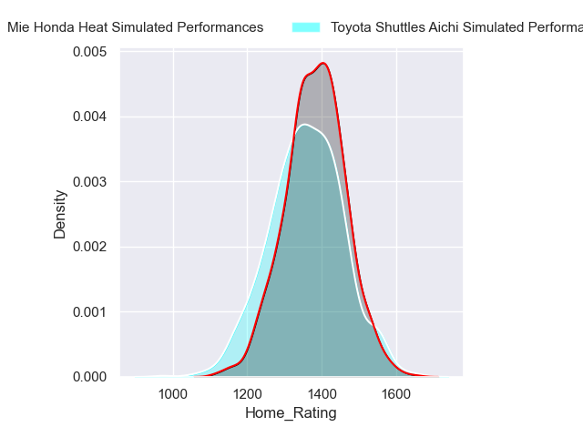

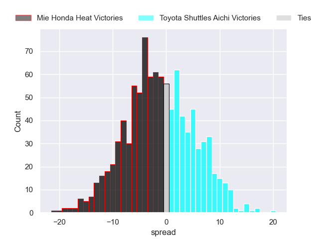

### Urayasu D-Rocks V Hanazono Kintetsu Liners on 2024/05/18

Average Margin: Urayasu D-Rocks by 4.5

Average Scoreline: 36-32

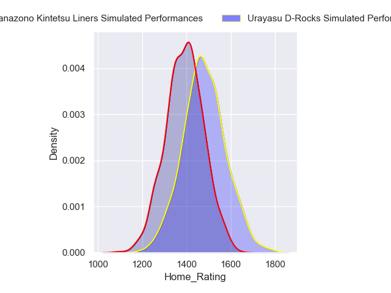
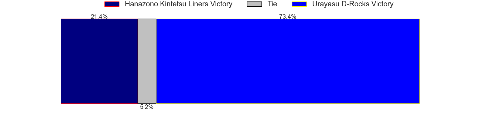
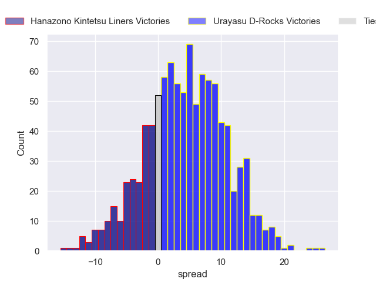

### Green Rockets Tokatsu V Black Rams Tokyo on 2024/05/18

Average Margin: Black Rams Tokyo by 3.2

Average Scoreline: 25-22

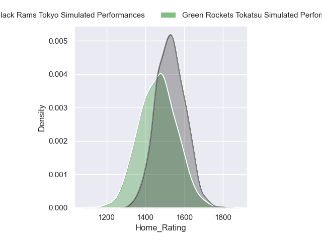

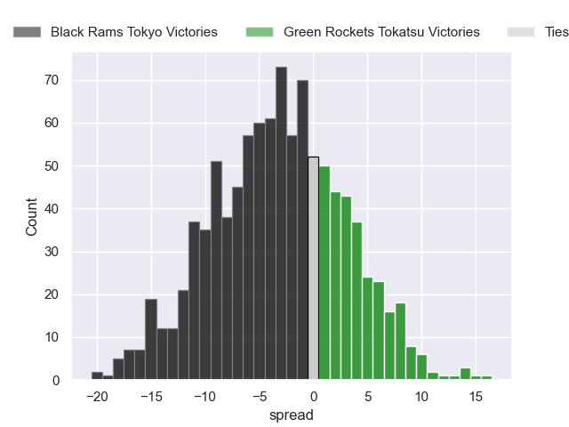

### Saitama Wild Knights V Yokohama Canon Eagles on 2024/05/18

Average Margin: Saitama Wild Knights by 16.4

Average Scoreline: 43-26

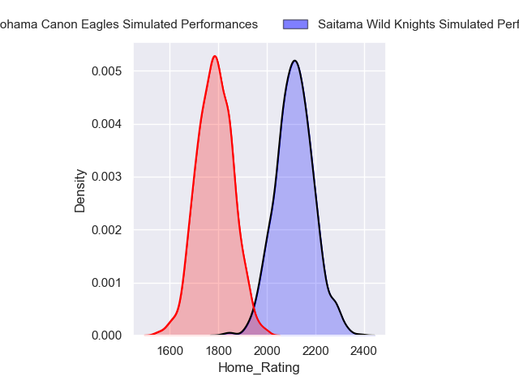
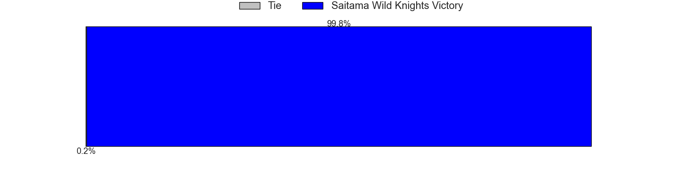
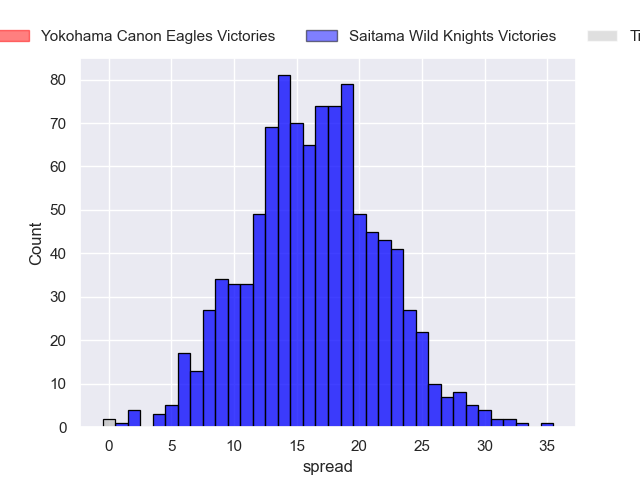

### Toshiba Brave Lupus V Tokyo Sungoliath on 2024/05/19

Average Margin: Toshiba Brave Lupus by 6.2

Average Scoreline: 41-35

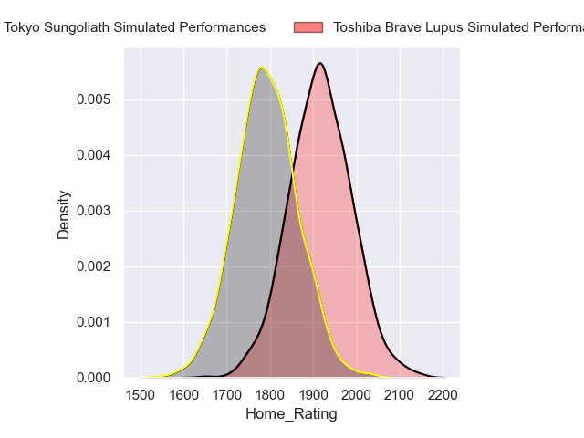
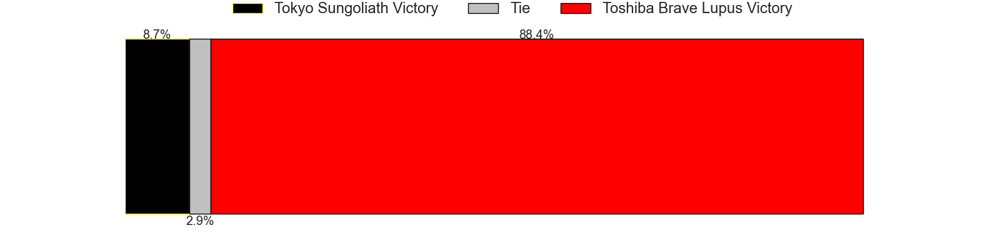
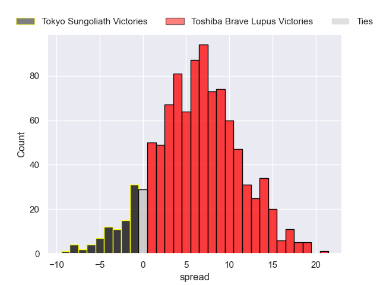

## Week 18

### Hanazono Kintetsu Liners V Urayasu D-Rocks on 2024/05/24

Average Margin: Hanazono Kintetsu Liners by 1.8

Average Scoreline: 34-32

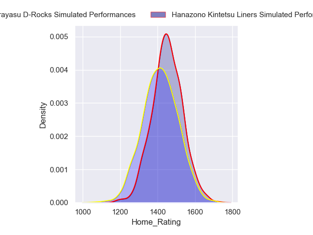

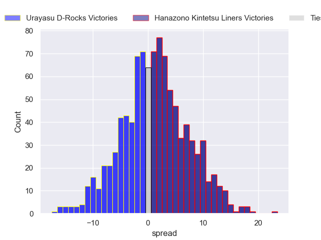

### Mie Honda Heat V Toyota Shuttles Aichi on 2024/05/25

Average Margin: Mie Honda Heat by 8.3

Average Scoreline: 40-32

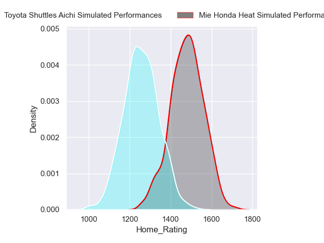
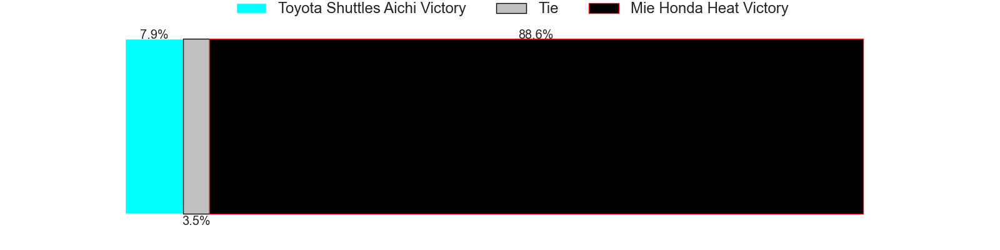
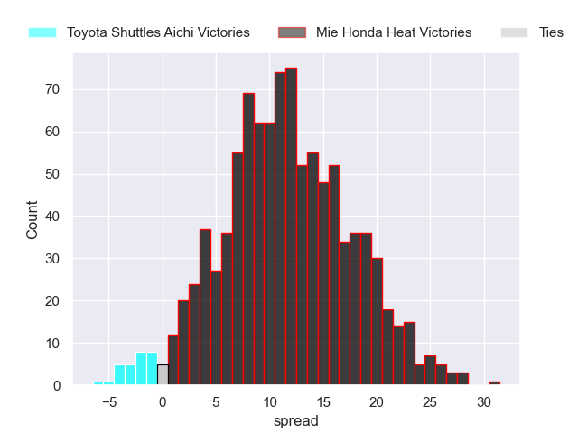

### Black Rams Tokyo V Green Rockets Tokatsu on 2024/05/25

Average Margin: Black Rams Tokyo by 10.3

Average Scoreline: 41-31

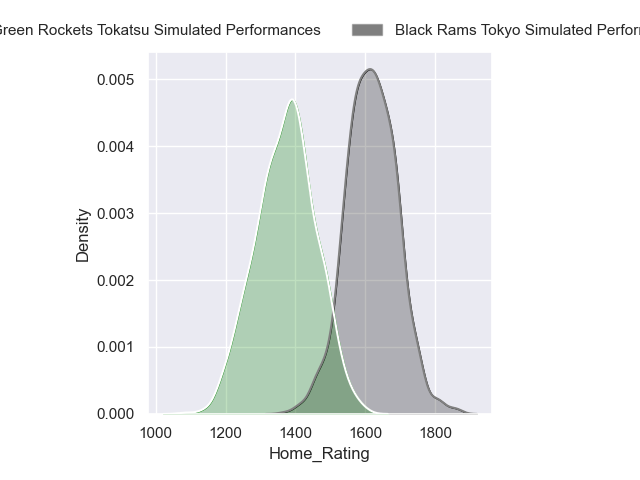
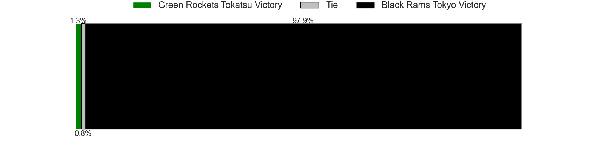
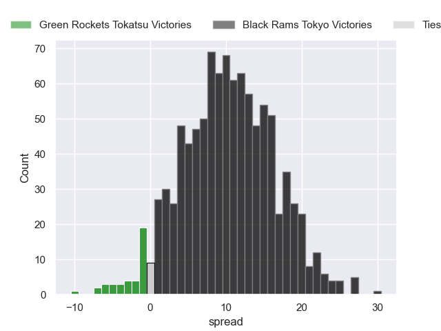

