---  
title: "Japan Rugby League One 2024 Status"  
date: 2024-11-04 6:00:00 -0500  
categories: model review projection  
layout: article  
aside:  
    toc: true  
---
# Current Team Rankings

# Standings

## Projected Total Table

| Club                  |   Total Matches |   Wins |   Point Differential |   Losing Bonus Points |   Try Bonus Points |   Competition Points |
|:----------------------|----------------:|-------:|---------------------:|----------------------:|-------------------:|---------------------:|
| Saitama Wild Knights  |              18 |   17   |             295.342  |                   0.9 |               11.2 |                 80   |
| Toshiba Brave Lupus   |              18 |   14.8 |             186.056  |                   2.1 |                8.6 |                 70.1 |
| Tokyo Sungoliath      |              18 |   12.2 |             100.339  |                   3.3 |                7.8 |                 60   |
| Kubota Spears         |              18 |   12.1 |              94.936  |                   3.2 |                7.1 |                 58.8 |
| Yokohama Canon Eagles |              18 |   11.6 |              83.1386 |                   3.9 |                7   |                 57.4 |
| Kobelco Kobe Steelers |              18 |   11   |              63.8939 |                   3.7 |                8.8 |                 56.4 |
| Toyota Verblitz       |              18 |   10.1 |              37.9982 |                   4   |                6.2 |                 50.7 |
| Shizuoka Blue Revs    |              18 |    7.7 |             -21.3241 |                   4.2 |                5.6 |                 40.6 |
| Black Rams Tokyo      |              18 |    4.2 |            -133.746  |                   3.8 |                3.8 |                 24.6 |
| Mitsubishi Dynaboars  |              18 |    3.8 |            -152.552  |                   3.8 |                3.1 |                 22.1 |
| Urayasu D-Rocks       |              18 |    2.1 |            -243.173  |                   2.8 |                3.2 |                 14.4 |
| Mie Honda Heat        |              18 |    1.2 |            -310.908  |                   2   |                2.7 |                  9.4 |

# Future Predictions

## Week 1

### Tokyo Sungoliath V Saitama Wild Knights on 2024/12/21

Average Margin: Saitama Wild Knights by 6.6

Average Scoreline: 26-20

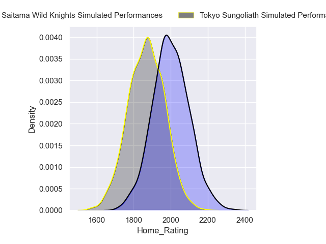
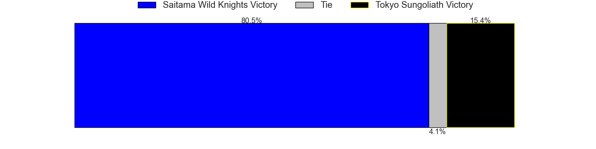
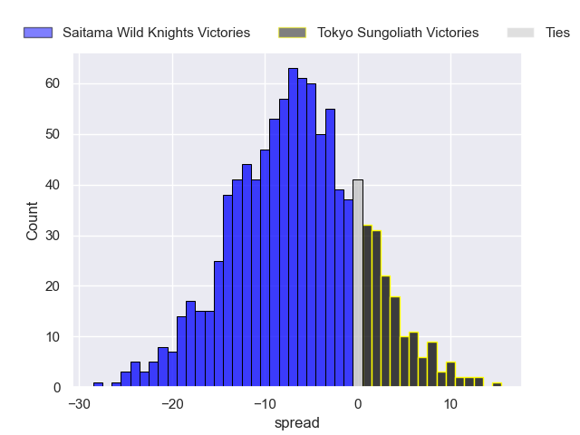

### Mie Honda Heat V Black Rams Tokyo on 2024/12/21

Average Margin: Black Rams Tokyo by 6.2

Average Scoreline: 30-24

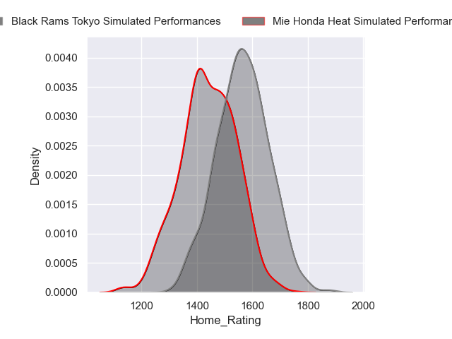

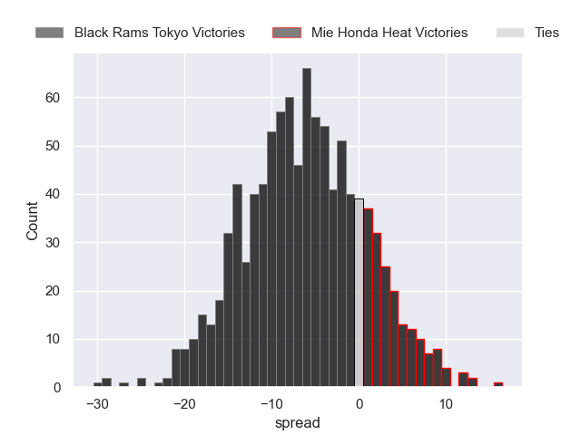

### Shizuoka Blue Revs V Kobelco Kobe Steelers on 2024/12/21

Average Margin: Kobelco Kobe Steelers by 0.9

Average Scoreline: 22-21

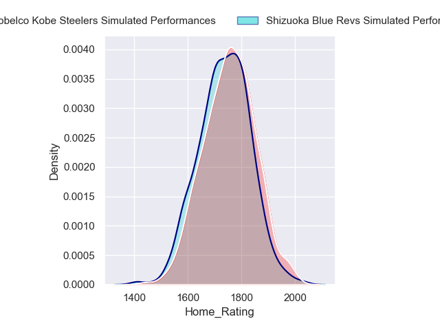

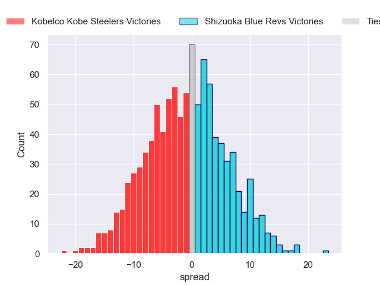

### Mitsubishi Dynaboars V Urayasu D-Rocks on 2024/12/22

Average Margin: Mitsubishi Dynaboars by 8.3

Average Scoreline: 29-21

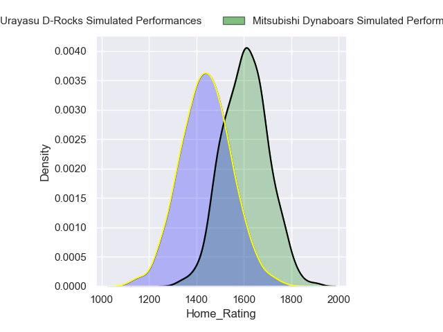
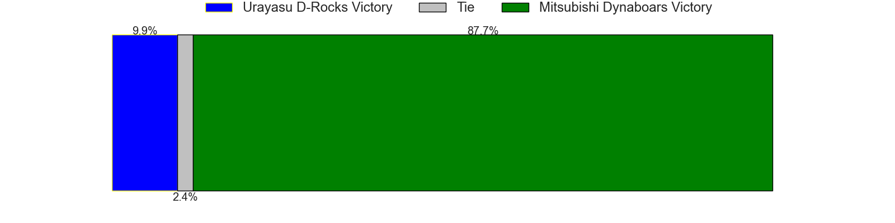
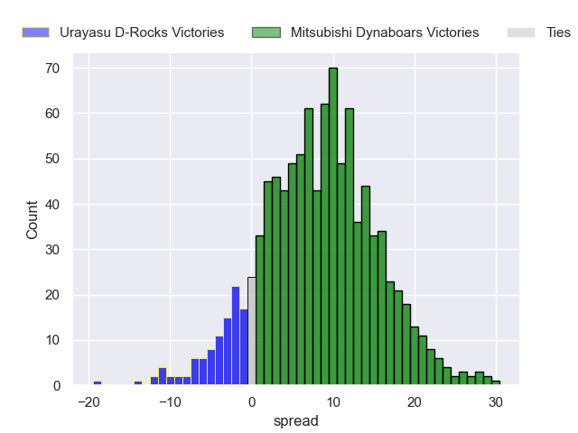

### Kubota Spears V Toyota Verblitz on 2024/12/22

Average Margin: Kubota Spears by 6.3

Average Scoreline: 30-23

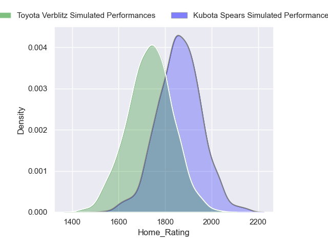
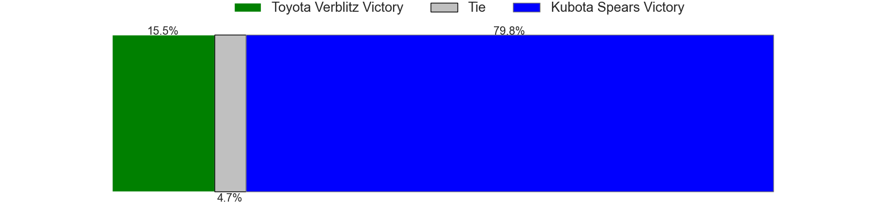
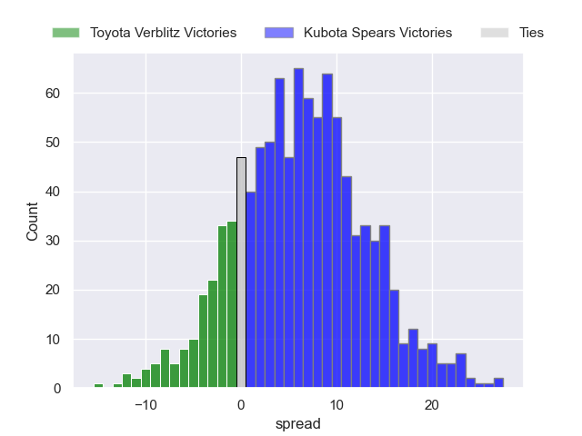

### Yokohama Canon Eagles V Toshiba Brave Lupus on 2024/12/22

Average Margin: Toshiba Brave Lupus by 1.4

Average Scoreline: 18-16

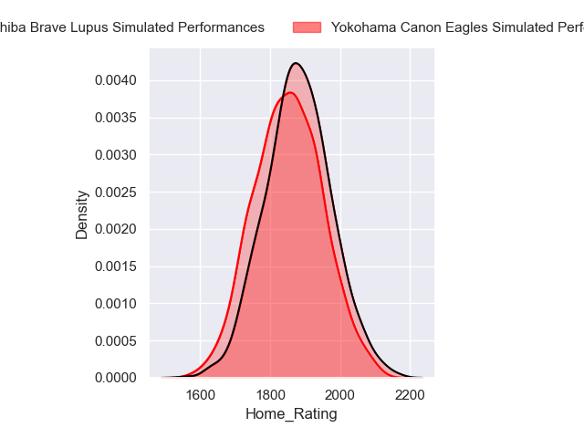
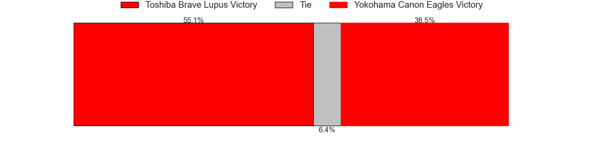
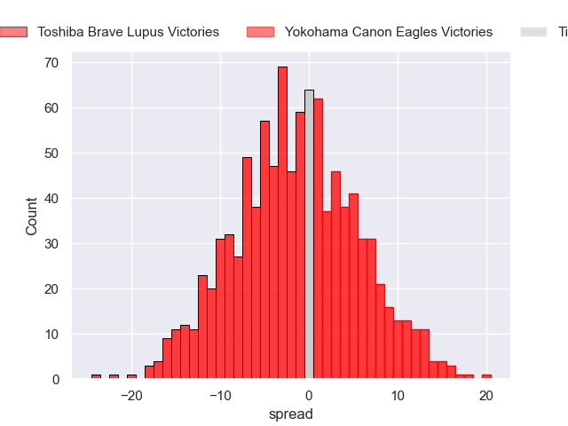

## Week 2

### Saitama Wild Knights V Kubota Spears on 2024/12/28

Average Margin: Saitama Wild Knights by 13.4

Average Scoreline: 29-16

### Black Rams Tokyo V Tokyo Sungoliath on 2024/12/28

Average Margin: Tokyo Sungoliath by 8.6

Average Scoreline: 27-18

### Toyota Verblitz V Mie Honda Heat on 2024/12/28

Average Margin: Toyota Verblitz by 20.9

Average Scoreline: 38-17

### Urayasu D-Rocks V Shizuoka Blue Revs on 2024/12/28

Average Margin: Shizuoka Blue Revs by 8.0

Average Scoreline: 21-13

### Kobelco Kobe Steelers V Yokohama Canon Eagles on 2024/12/29

Average Margin: Kobelco Kobe Steelers by 2.0

Average Scoreline: 24-22

### Toshiba Brave Lupus V Mitsubishi Dynaboars on 2024/12/29

Average Margin: Toshiba Brave Lupus by 20.1

Average Scoreline: 40-20

## Week 3

### Urayasu D-Rocks V Yokohama Canon Eagles on 2025/01/04

Average Margin: Yokohama Canon Eagles by 13.8

Average Scoreline: 29-15

### Mitsubishi Dynaboars V Shizuoka Blue Revs on 2025/01/04

Average Margin: Shizuoka Blue Revs by 2.9

Average Scoreline: 26-23

### Black Rams Tokyo V Saitama Wild Knights on 2025/01/04

Average Margin: Saitama Wild Knights by 18.2

Average Scoreline: 30-11

### Tokyo Sungoliath V Toyota Verblitz on 2025/01/04

Average Margin: Tokyo Sungoliath by 6.9

Average Scoreline: 30-23

### Toshiba Brave Lupus V Kobelco Kobe Steelers on 2025/01/05

Average Margin: Toshiba Brave Lupus by 9.4

Average Scoreline: 28-19

### Mie Honda Heat V Kubota Spears on 2025/01/05

Average Margin: Kubota Spears by 17.5

Average Scoreline: 29-12

## Week 4

### Toshiba Brave Lupus V Urayasu D-Rocks on 2025/01/11

Average Margin: Toshiba Brave Lupus by 25.2

Average Scoreline: 39-14

### Yokohama Canon Eagles V Shizuoka Blue Revs on 2025/01/11

Average Margin: Yokohama Canon Eagles by 9.6

Average Scoreline: 29-20

### Toyota Verblitz V Black Rams Tokyo on 2025/01/11

Average Margin: Toyota Verblitz by 12.0

Average Scoreline: 30-18

### Mitsubishi Dynaboars V Kobelco Kobe Steelers on 2025/01/12

Average Margin: Kobelco Kobe Steelers by 7.3

Average Scoreline: 25-18

### Tokyo Sungoliath V Kubota Spears on 2025/01/12

Average Margin: Tokyo Sungoliath by 4.0

Average Scoreline: 28-24

### Saitama Wild Knights V Mie Honda Heat on 2025/01/12

Average Margin: Saitama Wild Knights by 34.1

Average Scoreline: 47-13

## Week 5

### Kubota Spears V Black Rams Tokyo on 2025/01/18

Average Margin: Kubota Spears by 14.8

Average Scoreline: 33-18

### Yokohama Canon Eagles V Mitsubishi Dynaboars on 2025/01/18

Average Margin: Yokohama Canon Eagles by 15.5

Average Scoreline: 34-19

### Shizuoka Blue Revs V Toshiba Brave Lupus on 2025/01/18

Average Margin: Toshiba Brave Lupus by 7.1

Average Scoreline: 23-16

### Kobelco Kobe Steelers V Urayasu D-Rocks on 2025/01/19

Average Margin: Kobelco Kobe Steelers by 19.0

Average Scoreline: 39-21

### Mie Honda Heat V Tokyo Sungoliath on 2025/01/19

Average Margin: Tokyo Sungoliath by 17.8

Average Scoreline: 29-12

### Toyota Verblitz V Saitama Wild Knights on 2025/01/19

Average Margin: Saitama Wild Knights by 9.8

Average Scoreline: 28-18

## Week 6

### Toyota Verblitz V Yokohama Canon Eagles on 2025/02/01

Average Margin: Toyota Verblitz by 1.5

Average Scoreline: 23-22

### Shizuoka Blue Revs V Tokyo Sungoliath on 2025/02/01

Average Margin: Tokyo Sungoliath by 3.4

Average Scoreline: 24-21

### Mitsubishi Dynaboars V Kubota Spears on 2025/02/01

Average Margin: Kubota Spears by 9.2

Average Scoreline: 25-15

### Saitama Wild Knights V Urayasu D-Rocks on 2025/02/01

Average Margin: Saitama Wild Knights by 30.7

Average Scoreline: 42-12

### Kobelco Kobe Steelers V Black Rams Tokyo on 2025/02/01

Average Margin: Kobelco Kobe Steelers by 12.5

Average Scoreline: 32-20

### Mie Honda Heat V Toshiba Brave Lupus on 2025/02/02

Average Margin: Toshiba Brave Lupus by 20.9

Average Scoreline: 33-12

## Week 7

### Yokohama Canon Eagles V Kubota Spears on 2025/02/08

Average Margin: Yokohama Canon Eagles by 2.5

Average Scoreline: 23-21

### Kobelco Kobe Steelers V Tokyo Sungoliath on 2025/02/08

Average Margin: Kobelco Kobe Steelers by 0.7

Average Scoreline: 26-25

### Urayasu D-Rocks V Mie Honda Heat on 2025/02/08

Average Margin: Urayasu D-Rocks by 6.5

Average Scoreline: 31-25

### Mitsubishi Dynaboars V Toyota Verblitz on 2025/02/09

Average Margin: Toyota Verblitz by 6.4

Average Scoreline: 23-17

### Black Rams Tokyo V Shizuoka Blue Revs on 2025/02/09

Average Margin: Shizuoka Blue Revs by 1.6

Average Scoreline: 24-22

### Saitama Wild Knights V Toshiba Brave Lupus on 2025/02/09

Average Margin: Saitama Wild Knights by 9.0

Average Scoreline: 28-19

## Week 8

### Kubota Spears V Kobelco Kobe Steelers on 2025/02/15

Average Margin: Kubota Spears by 5.4

Average Scoreline: 30-24

### Toshiba Brave Lupus V Tokyo Sungoliath on 2025/02/15

Average Margin: Toshiba Brave Lupus by 7.1

Average Scoreline: 30-23

### Toyota Verblitz V Shizuoka Blue Revs on 2025/02/15

Average Margin: Toyota Verblitz by 6.7

Average Scoreline: 24-17

### Yokohama Canon Eagles V Saitama Wild Knights on 2025/02/16

Average Margin: Saitama Wild Knights by 7.1

Average Scoreline: 25-18

### Black Rams Tokyo V Urayasu D-Rocks on 2025/02/16

Average Margin: Black Rams Tokyo by 9.1

Average Scoreline: 26-17

### Mie Honda Heat V Mitsubishi Dynaboars on 2025/02/16

Average Margin: Mitsubishi Dynaboars by 4.6

Average Scoreline: 29-24

## Week 9

### Black Rams Tokyo V Toshiba Brave Lupus on 2025/02/22

Average Margin: Toshiba Brave Lupus by 12.3

Average Scoreline: 27-15

### Saitama Wild Knights V Mitsubishi Dynaboars on 2025/02/22

Average Margin: Saitama Wild Knights by 25.8

Average Scoreline: 44-18

### Kobelco Kobe Steelers V Toyota Verblitz on 2025/02/22

Average Margin: Kobelco Kobe Steelers by 4.6

Average Scoreline: 29-24

### Kubota Spears V Shizuoka Blue Revs on 2025/02/22

Average Margin: Kubota Spears by 9.5

Average Scoreline: 28-19

### Tokyo Sungoliath V Urayasu D-Rocks on 2025/02/23

Average Margin: Tokyo Sungoliath by 21.2

Average Scoreline: 36-14

### Mie Honda Heat V Yokohama Canon Eagles on 2025/02/23

Average Margin: Yokohama Canon Eagles by 16.4

Average Scoreline: 31-15

## Week 10

### Toshiba Brave Lupus V Kubota Spears on 2025/03/01

Average Margin: Toshiba Brave Lupus by 7.5

Average Scoreline: 27-20

### Mitsubishi Dynaboars V Black Rams Tokyo on 2025/03/01

Average Margin: Mitsubishi Dynaboars by 2.1

Average Scoreline: 22-20

### Tokyo Sungoliath V Yokohama Canon Eagles on 2025/03/02

Average Margin: Tokyo Sungoliath by 4.5

Average Scoreline: 30-26

### Saitama Wild Knights V Kobelco Kobe Steelers on 2025/03/02

Average Margin: Saitama Wild Knights by 15.2

Average Scoreline: 34-19

### Shizuoka Blue Revs V Mie Honda Heat on 2025/03/02

Average Margin: Shizuoka Blue Revs by 17.4

Average Scoreline: 37-19

### Urayasu D-Rocks V Toyota Verblitz on 2025/03/02

Average Margin: Toyota Verblitz by 11.2

Average Scoreline: 31-20

## Week 11

### Urayasu D-Rocks V Kubota Spears on 2025/03/14

Average Margin: Kubota Spears by 13.8

Average Scoreline: 33-19

### Yokohama Canon Eagles V Black Rams Tokyo on 2025/03/15

Average Margin: Yokohama Canon Eagles by 13.8

Average Scoreline: 31-17

### Toyota Verblitz V Toshiba Brave Lupus on 2025/03/15

Average Margin: Toshiba Brave Lupus by 3.7

Average Scoreline: 27-23

### Shizuoka Blue Revs V Saitama Wild Knights on 2025/03/15

Average Margin: Saitama Wild Knights by 12.8

Average Scoreline: 29-16

### Kobelco Kobe Steelers V Mie Honda Heat on 2025/03/15

Average Margin: Kobelco Kobe Steelers by 21.0

Average Scoreline: 41-20

### Mitsubishi Dynaboars V Tokyo Sungoliath on 2025/03/16

Average Margin: Tokyo Sungoliath by 9.4

Average Scoreline: 30-21

## Week 12

### Toshiba Brave Lupus V Saitama Wild Knights on 2025/03/22

Average Margin: Saitama Wild Knights by 2.6

Average Scoreline: 26-24

### Mie Honda Heat V Urayasu D-Rocks on 2025/03/22

Average Margin: Mie Honda Heat by 0.6

Average Scoreline: 22-21

### Toyota Verblitz V Mitsubishi Dynaboars on 2025/03/22

Average Margin: Toyota Verblitz by 12.6

Average Scoreline: 32-19

### Shizuoka Blue Revs V Black Rams Tokyo on 2025/03/22

Average Margin: Shizuoka Blue Revs by 8.5

Average Scoreline: 27-18

### Kubota Spears V Yokohama Canon Eagles on 2025/03/22

Average Margin: Kubota Spears by 3.8

Average Scoreline: 27-23

### Tokyo Sungoliath V Kobelco Kobe Steelers on 2025/03/23

Average Margin: Tokyo Sungoliath by 5.4

Average Scoreline: 36-30

## Week 13

### Urayasu D-Rocks V Saitama Wild Knights on 2025/03/29

Average Margin: Saitama Wild Knights by 23.9

Average Scoreline: 33-9

### Kubota Spears V Mitsubishi Dynaboars on 2025/03/29

Average Margin: Kubota Spears by 15.6

Average Scoreline: 35-19

### Tokyo Sungoliath V Shizuoka Blue Revs on 2025/03/29

Average Margin: Tokyo Sungoliath by 10.2

Average Scoreline: 34-24

### Toshiba Brave Lupus V Mie Honda Heat on 2025/03/30

Average Margin: Toshiba Brave Lupus by 28.1

Average Scoreline: 46-18

### Yokohama Canon Eagles V Toyota Verblitz on 2025/03/30

Average Margin: Yokohama Canon Eagles by 5.5

Average Scoreline: 28-23

### Black Rams Tokyo V Kobelco Kobe Steelers on 2025/03/30

Average Margin: Kobelco Kobe Steelers by 5.4

Average Scoreline: 30-25

## Week 14

### Saitama Wild Knights V Toyota Verblitz on 2025/04/05

Average Margin: Saitama Wild Knights by 16.0

Average Scoreline: 34-18

### Shizuoka Blue Revs V Mitsubishi Dynaboars on 2025/04/05

Average Margin: Shizuoka Blue Revs by 9.6

Average Scoreline: 34-24

### Tokyo Sungoliath V Mie Honda Heat on 2025/04/05

Average Margin: Tokyo Sungoliath by 24.0

Average Scoreline: 45-20

### Yokohama Canon Eagles V Urayasu D-Rocks on 2025/04/05

Average Margin: Yokohama Canon Eagles by 19.6

Average Scoreline: 35-16

### Kobelco Kobe Steelers V Toshiba Brave Lupus on 2025/04/06

Average Margin: Toshiba Brave Lupus by 2.7

Average Scoreline: 25-22

### Black Rams Tokyo V Kubota Spears on 2025/04/06

Average Margin: Kubota Spears by 7.8

Average Scoreline: 28-20

## Week 15

### Mie Honda Heat V Saitama Wild Knights on 2025/04/11

Average Margin: Saitama Wild Knights by 26.7

Average Scoreline: 35-8

### Toshiba Brave Lupus V Shizuoka Blue Revs on 2025/04/12

Average Margin: Toshiba Brave Lupus by 13.7

Average Scoreline: 33-19

### Mitsubishi Dynaboars V Yokohama Canon Eagles on 2025/04/12

Average Margin: Yokohama Canon Eagles by 8.1

Average Scoreline: 29-21

### Black Rams Tokyo V Toyota Verblitz on 2025/04/13

Average Margin: Toyota Verblitz by 4.8

Average Scoreline: 27-22

### Kubota Spears V Tokyo Sungoliath on 2025/04/13

Average Margin: Kubota Spears by 2.8

Average Scoreline: 27-24

### Urayasu D-Rocks V Kobelco Kobe Steelers on 2025/04/13

Average Margin: Kobelco Kobe Steelers by 11.7

Average Scoreline: 29-17

## Week 16

### Urayasu D-Rocks V Toshiba Brave Lupus on 2025/04/25

Average Margin: Toshiba Brave Lupus by 17.9

Average Scoreline: 30-12

### Kobelco Kobe Steelers V Mitsubishi Dynaboars on 2025/04/26

Average Margin: Kobelco Kobe Steelers by 13.9

Average Scoreline: 38-24

### Kubota Spears V Mie Honda Heat on 2025/04/26

Average Margin: Kubota Spears by 23.1

Average Scoreline: 42-19

### Saitama Wild Knights V Black Rams Tokyo on 2025/04/26

Average Margin: Saitama Wild Knights by 24.3

Average Scoreline: 39-15

### Toyota Verblitz V Tokyo Sungoliath on 2025/04/26

Average Margin: Tokyo Sungoliath by 0.0

Average Scoreline: 27-27

### Shizuoka Blue Revs V Yokohama Canon Eagles on 2025/04/27

Average Margin: Yokohama Canon Eagles by 2.1

Average Scoreline: 25-23

## Week 17

### Mitsubishi Dynaboars V Toshiba Brave Lupus on 2025/05/03

Average Margin: Toshiba Brave Lupus by 12.7

Average Scoreline: 32-19

### Yokohama Canon Eagles V Kobelco Kobe Steelers on 2025/05/03

Average Margin: Yokohama Canon Eagles by 4.5

Average Scoreline: 32-28

### Kubota Spears V Saitama Wild Knights on 2025/05/03

Average Margin: Saitama Wild Knights by 6.4

Average Scoreline: 29-22

### Tokyo Sungoliath V Black Rams Tokyo on 2025/05/03

Average Margin: Tokyo Sungoliath by 14.8

Average Scoreline: 35-20

### Shizuoka Blue Revs V Urayasu D-Rocks on 2025/05/03

Average Margin: Shizuoka Blue Revs by 14.1

Average Scoreline: 31-17

### Mie Honda Heat V Toyota Verblitz on 2025/05/04

Average Margin: Toyota Verblitz by 13.8

Average Scoreline: 32-18

## Week 18

### Urayasu D-Rocks V Mitsubishi Dynaboars on 2025/05/09

Average Margin: Mitsubishi Dynaboars by 1.6

Average Scoreline: 27-25

### Toshiba Brave Lupus V Yokohama Canon Eagles on 2025/05/10

Average Margin: Toshiba Brave Lupus by 7.9

Average Scoreline: 28-20

### Saitama Wild Knights V Tokyo Sungoliath on 2025/05/10

Average Margin: Saitama Wild Knights by 12.8

Average Scoreline: 33-20

### Kobelco Kobe Steelers V Shizuoka Blue Revs on 2025/05/10

Average Margin: Kobelco Kobe Steelers by 7.5

Average Scoreline: 34-26

### Toyota Verblitz V Kubota Spears on 2025/05/10

Average Margin: Toyota Verblitz by 0.9

Average Scoreline: 27-26

### Black Rams Tokyo V Mie Honda Heat on 2025/05/11

Average Margin: Black Rams Tokyo by 12.4

Average Scoreline: 29-17

