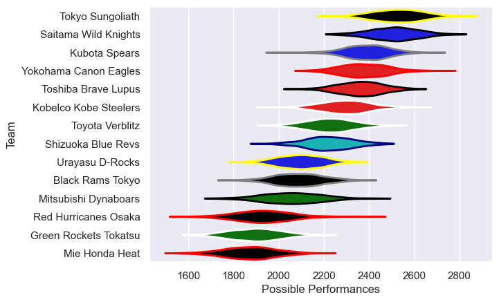

---  
title: "Japan Rugby League One 21/22"  
date: 2025-07-29 6:00:00 -0500  
categories: model review projection  
layout: article  
aside:  
    toc: true  
---
# Current Team Rankings

# Standings

## Current Standings

| Club                  |   Played |   Wins |   Point Differential |   Losing Bonus Points |   Try Bonus Points |   Competition Points |
|:----------------------|---------:|-------:|---------------------:|----------------------:|-------------------:|---------------------:|
| Saitama Wild Knights  |       16 |     16 |                  291 |                     0 |                    |                   64 |
| Tokyo Sungoliath      |       15 |     12 |                  228 |                     1 |                  9 |                   58 |
| Kubota Spears         |       16 |     11 |                  165 |                     2 |                  9 |                   55 |
| Toshiba Brave Lupus   |       17 |     10 |                  118 |                     2 |                 10 |                   52 |
| Yokohama Canon Eagles |       15 |      9 |                   83 |                     1 |                  6 |                   43 |
| Kobelco Kobe Steelers |       13 |      6 |                   46 |                     3 |                  7 |                   34 |
| Toyota Verblitz       |       12 |      7 |                   -9 |                     0 |                  4 |                   32 |
| Shizuoka Blue Revs    |       11 |      4 |                  -13 |                     4 |                  7 |                   27 |
| Urayasu D-Rocks       |       15 |      4 |                 -209 |                     1 |                    |                   17 |
| Green Rockets Tokatsu |       15 |      1 |                 -228 |                     5 |                  4 |                   13 |
| Black Rams Tokyo      |       12 |      2 |                 -204 |                     2 |                  2 |                   12 |
| Mitsubishi Dynaboars  |        2 |      2 |                   22 |                     0 |                    |                    8 |
| Red Hurricanes Osaka  |       11 |      1 |                 -269 |                     0 |                  2 |                    6 |
| Mie Honda Heat        |        2 |      1 |                  -21 |                     0 |                    |                    4 |

# Completed Match Review

| Model | Percent Correct Predictions | Spread Error |
| ------ | ------ | ------ |
| Club Level | 83.7% | 12.4 |
| Player Level: Lineup | nan% | nan |
| Player Level: Minutes | nan% | nan |

