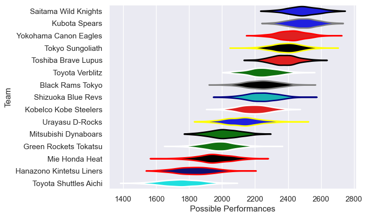

---  
title: "Japan Rugby League One 22/23"  
date: 2025-07-29 6:00:00 -0500  
categories: model review projection  
layout: article  
aside:  
    toc: true  
---
# Current Team Rankings

# Standings

## Current Standings

| Club                     |   Played |   Wins |   Point Differential |   Losing Bonus Points |   Try Bonus Points |   Competition Points |
|:-------------------------|---------:|-------:|---------------------:|----------------------:|-------------------:|---------------------:|
| Kubota Spears            |       18 |     16 |                  304 |                     0 |                 10 |                   76 |
| Saitama Wild Knights     |       18 |     16 |                  298 |                     1 |                 10 |                   75 |
| Tokyo Sungoliath         |       18 |     12 |                  192 |                     3 |                 11 |                   62 |
| Yokohama Canon Eagles    |       18 |     11 |                  242 |                     2 |                 11 |                   61 |
| Toshiba Brave Lupus      |       16 |     10 |                  164 |                     3 |                 10 |                   53 |
| Toyota Verblitz          |       16 |      8 |                   19 |                     3 |                  7 |                   42 |
| Black Rams Tokyo         |       16 |      6 |                   30 |                     4 |                  6 |                   34 |
| Shizuoka Blue Revs       |       16 |      5 |                    1 |                     3 |                  7 |                   34 |
| Mitsubishi Dynaboars     |       18 |      6 |                 -182 |                     1 |                  7 |                   34 |
| Kobelco Kobe Steelers    |       16 |      5 |                  -99 |                     2 |                  8 |                   30 |
| Green Rockets Tokatsu    |       18 |      3 |                 -351 |                     3 |                  6 |                   21 |
| Hanazono Kintetsu Liners |       18 |      3 |                 -500 |                     1 |                  7 |                   20 |
| Mie Honda Heat           |        2 |      2 |                    6 |                     0 |                  1 |                    9 |
| Urayasu D-Rocks          |        2 |      0 |                  -57 |                     0 |                    |                    0 |
| Toyota Shuttles Aichi    |        2 |      0 |                  -67 |                     0 |                    |                    0 |

# Completed Match Review

| Model | Percent Correct Predictions | Spread Error |
| ------ | ------ | ------ |
| Club Level | 75.5% | 13.9 |
| Player Level: Lineup | nan% | nan |
| Player Level: Minutes | nan% | nan |

