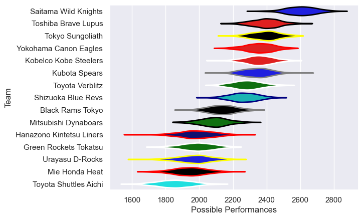

---  
title: "Japan Rugby League One 23/24"  
date: 2025-07-29 6:00:00 -0500  
categories: model review projection  
layout: article  
aside:  
    toc: true  
---
# Current Team Rankings

# Standings

## Current Standings

| Club                     |   Played |   Wins |   Point Differential |   Losing Bonus Points |   Try Bonus Points |   Competition Points |
|:-------------------------|---------:|-------:|---------------------:|----------------------:|-------------------:|---------------------:|
| Saitama Wild Knights     |       18 |     17 |                  471 |                     1 |                 14 |                   83 |
| Toshiba Brave Lupus      |       18 |     16 |                  193 |                     0 |                 12 |                   78 |
| Tokyo Sungoliath         |       18 |     11 |                  158 |                     3 |                 15 |                   64 |
| Yokohama Canon Eagles    |       18 |     10 |                   62 |                     5 |                 11 |                   56 |
| Kobelco Kobe Steelers    |       16 |      9 |                  188 |                     2 |                 12 |                   52 |
| Kubota Spears            |       16 |      8 |                  107 |                     5 |                 11 |                   50 |
| Toyota Verblitz          |       16 |      9 |                   48 |                     2 |                 10 |                   48 |
| Shizuoka Blue Revs       |       16 |      6 |                  -12 |                     2 |                  8 |                   38 |
| Mitsubishi Dynaboars     |       16 |      6 |                 -180 |                     3 |                  7 |                   34 |
| Black Rams Tokyo         |       18 |      5 |                 -108 |                     4 |                  8 |                   32 |
| Hanazono Kintetsu Liners |       18 |      1 |                 -365 |                     3 |                  8 |                   15 |
| Mie Honda Heat           |       18 |      2 |                 -493 |                     3 |                  2 |                   13 |
| Urayasu D-Rocks          |        2 |      2 |                   14 |                     0 |                    |                    8 |
| Toyota Shuttles Aichi    |        2 |      1 |                   -9 |                     0 |                    |                    4 |
| Green Rockets Tokatsu    |        2 |      0 |                  -74 |                     0 |                    |                    0 |

# Completed Match Review

| Model | Percent Correct Predictions | Spread Error |
| ------ | ------ | ------ |
| Club Level | 77.4% | 14.2 |
| Player Level: Lineup | nan% | nan |
| Player Level: Minutes | nan% | nan |

