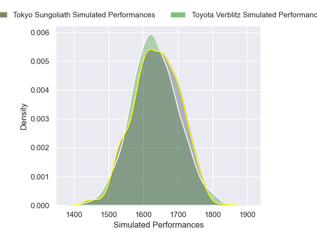
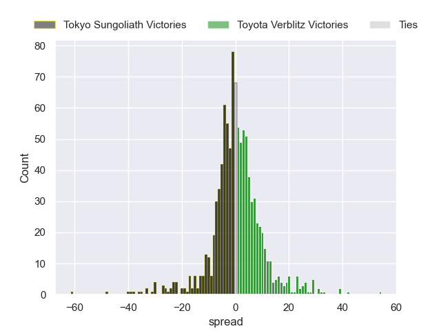

---  
title: "Japan Rugby League One 24/25 Status"  
date: 2025-04-24 6:00:00 -0500  
categories: model review projection  
layout: article  
aside:  
    toc: true  
---
# Current Team Rankings

# Standings

## Current Standings

| Club                  |   Played |   Wins |   Point Differential |   Losing Bonus Points |   Try Bonus Points |   Competition Points |
|:----------------------|---------:|-------:|---------------------:|----------------------:|-------------------:|---------------------:|
| Toshiba Brave Lupus   |       15 |     12 |                  181 |                     1 |                 14 |                   65 |
| Kubota Spears         |       15 |     12 |                  203 |                     2 |                 12 |                   64 |
| Saitama Wild Knights  |       15 |     12 |                  241 |                     1 |                 12 |                   63 |
| Shizuoka Blue Revs    |       15 |     11 |                   86 |                     1 |                 10 |                   55 |
| Kobelco Kobe Steelers |       15 |      8 |                   95 |                     4 |                 12 |                   48 |
| Tokyo Sungoliath      |       15 |      7 |                   -9 |                     2 |                  8 |                   38 |
| Mitsubishi Dynaboars  |       15 |      6 |                 -161 |                     2 |                  8 |                   34 |
| Yokohama Canon Eagles |       15 |      6 |                    1 |                     3 |                  6 |                   33 |
| Black Rams Tokyo      |       15 |      5 |                  -47 |                     4 |                  6 |                   30 |
| Toyota Verblitz       |       15 |      3 |                 -140 |                     4 |                  7 |                   25 |
| Mie Honda Heat        |       15 |      4 |                 -222 |                     2 |                  7 |                   25 |
| Urayasu D-Rocks       |       15 |      2 |                 -228 |                     2 |                  6 |                   16 |

## Projected Remaining Table

| Club                  |   Matches Remaining |   Wins |   Point Differential |   Losing Bonus Points |   Try Bonus Points |   Competition Points |
|:----------------------|--------------------:|-------:|---------------------:|----------------------:|-------------------:|---------------------:|
| Toshiba Brave Lupus   |                   3 |    2.7 |             43.9651  |                   0.2 |                2   |                 13.1 |
| Kubota Spears         |                   3 |    2.4 |             40.9421  |                   0.4 |                1.8 |                 11.6 |
| Saitama Wild Knights  |                   3 |    2.4 |             40.135   |                   0.4 |                1.6 |                 11.5 |
| Shizuoka Blue Revs    |                   3 |    2.2 |             27.8658  |                   0.5 |                1.4 |                 10.6 |
| Kobelco Kobe Steelers |                   3 |    2.1 |             17.1607  |                   0.6 |                1.6 |                 10.6 |
| Toyota Verblitz       |                   3 |    1.3 |             -6.92519 |                   0.7 |                0.9 |                  7   |
| Black Rams Tokyo      |                   3 |    1.3 |             -8.01638 |                   0.5 |                1   |                  6.8 |
| Tokyo Sungoliath      |                   3 |    1.2 |            -16.9993  |                   0.6 |                0.7 |                  6.2 |
| Mitsubishi Dynaboars  |                   3 |    0.8 |            -22.578   |                   0.6 |                0.8 |                  4.6 |
| Yokohama Canon Eagles |                   3 |    0.6 |            -26.0228  |                   0.8 |                0.4 |                  3.8 |
| Urayasu D-Rocks       |                   3 |    0.5 |            -40.3909  |                   0.5 |                0.7 |                  3.3 |
| Mie Honda Heat        |                   3 |    0.4 |            -49.1361  |                   0.5 |                0.5 |                  2.5 |

## Projected Total Table

| Club                  |   Total Matches |   Wins |   Point Differential |   Losing Bonus Points |   Try Bonus Points |   Competition Points |
|:----------------------|----------------:|-------:|---------------------:|----------------------:|-------------------:|---------------------:|
| Toshiba Brave Lupus   |              18 |   14.7 |             224.965  |                   1.2 |               16   |                 78.1 |
| Kubota Spears         |              18 |   14.4 |             243.942  |                   2.4 |               13.8 |                 75.6 |
| Saitama Wild Knights  |              18 |   14.4 |             281.135  |                   1.4 |               13.6 |                 74.5 |
| Shizuoka Blue Revs    |              18 |   13.2 |             113.866  |                   1.5 |               11.4 |                 65.6 |
| Kobelco Kobe Steelers |              18 |   10.1 |             112.161  |                   4.6 |               13.6 |                 58.6 |
| Tokyo Sungoliath      |              18 |    8.2 |             -25.9993 |                   2.6 |                8.7 |                 44.2 |
| Mitsubishi Dynaboars  |              18 |    6.8 |            -183.578  |                   2.6 |                8.8 |                 38.6 |
| Yokohama Canon Eagles |              18 |    6.6 |             -25.0228 |                   3.8 |                6.4 |                 36.8 |
| Black Rams Tokyo      |              18 |    6.3 |             -55.0164 |                   4.5 |                7   |                 36.8 |
| Toyota Verblitz       |              18 |    4.3 |            -146.925  |                   4.7 |                7.9 |                 32   |
| Mie Honda Heat        |              18 |    4.4 |            -271.136  |                   2.5 |                7.5 |                 27.5 |
| Urayasu D-Rocks       |              18 |    2.5 |            -268.391  |                   2.5 |                6.7 |                 19.3 |

# Completed Match Review

| Model | Percent Correct Predictions | Spread Error |
| ------ | ------ | ------ |
| Club Level | 70.0% | 11.5 |
| Player Level: Lineup | 59.5% | 11.4 |
| Player Level: Minutes | 57.1% | 11.1 |

# Future Predictions

## Week 16

### Urayasu D-Rocks V Toshiba Brave Lupus on 2025/04/25

Average Margin: Toshiba Brave Lupus by 17.2

Average Scoreline: 32-15

### Saitama Wild Knights V Black Rams Tokyo on 2025/04/26

Average Margin: Saitama Wild Knights by 20.6

Average Scoreline: 37-16

### Kubota Spears V Mie Honda Heat on 2025/04/26

Average Margin: Kubota Spears by 28.2

Average Scoreline: 42-14

### Kobelco Kobe Steelers V Mitsubishi Dynaboars on 2025/04/26

Average Margin: Kobelco Kobe Steelers by 13.0

Average Scoreline: 32-19

### Shizuoka Blue Revs V Yokohama Canon Eagles on 2025/04/27

Average Margin: Shizuoka Blue Revs by 10.8

Average Scoreline: 30-19

### Toyota Verblitz V Tokyo Sungoliath on 2025/04/27

Average Margin: Toyota Verblitz by 0.5

Average Scoreline: 24-24

## Week 17

### Kubota Spears V Saitama Wild Knights on 2025/05/03

Average Margin: Saitama Wild Knights by 0.2

Average Scoreline: 29-29

### Shizuoka Blue Revs V Urayasu D-Rocks on 2025/05/03

Average Margin: Shizuoka Blue Revs by 20.0

Average Scoreline: 38-18

### Tokyo Sungoliath V Black Rams Tokyo on 2025/05/03

Average Margin: Tokyo Sungoliath by 2.8

Average Scoreline: 29-26

### Mitsubishi Dynaboars V Toshiba Brave Lupus on 2025/05/03

Average Margin: Toshiba Brave Lupus by 12.8

Average Scoreline: 26-13

### Yokohama Canon Eagles V Kobelco Kobe Steelers on 2025/05/03

Average Margin: Kobelco Kobe Steelers by 1.2

Average Scoreline: 29-28

### Mie Honda Heat V Toyota Verblitz on 2025/05/04

Average Margin: Toyota Verblitz by 5.5

Average Scoreline: 22-17

## Week 18

### Urayasu D-Rocks V Mitsubishi Dynaboars on 2025/05/09

Average Margin: Mitsubishi Dynaboars by 3.2

Average Scoreline: 33-29

### Kobelco Kobe Steelers V Shizuoka Blue Revs on 2025/05/10

Average Margin: Kobelco Kobe Steelers by 3.0

Average Scoreline: 30-27

### Toyota Verblitz V Kubota Spears on 2025/05/10

Average Margin: Kubota Spears by 12.9

Average Scoreline: 29-16

### Toshiba Brave Lupus V Yokohama Canon Eagles on 2025/05/10

Average Margin: Toshiba Brave Lupus by 14.0

Average Scoreline: 34-20

### Saitama Wild Knights V Tokyo Sungoliath on 2025/05/10

Average Margin: Saitama Wild Knights by 19.3

Average Scoreline: 37-18

### Black Rams Tokyo V Mie Honda Heat on 2025/05/11

Average Margin: Black Rams Tokyo by 15.4

Average Scoreline: 33-18

