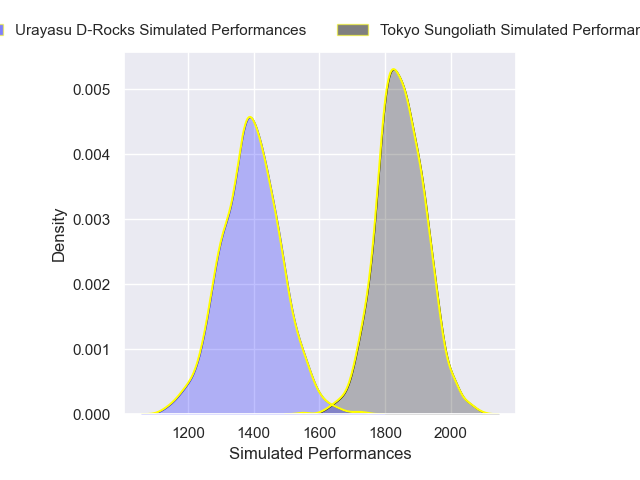
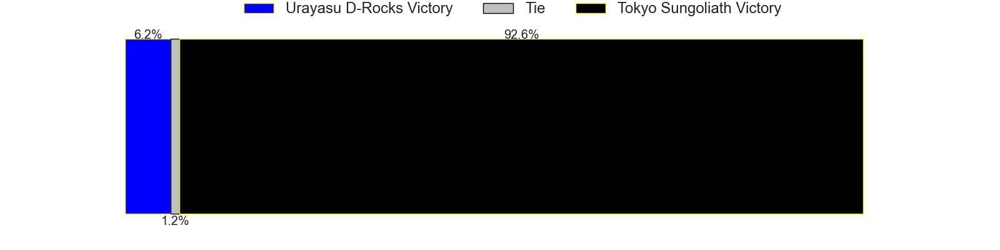
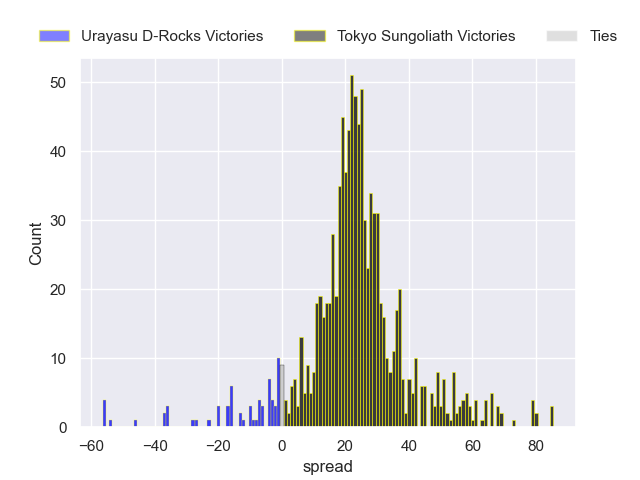

---  
title: "Japan Rugby League One 24/25 Status"  
date: 2025-02-20 6:00:00 -0500  
categories: model review projection  
layout: article  
aside:  
    toc: true  
---
# Current Team Rankings

# Standings

## Current Standings

| Club                  |   Played |   Wins |   Point Differential |   Losing Bonus Points |   Try Bonus Points |   Competition Points |
|:----------------------|---------:|-------:|---------------------:|----------------------:|-------------------:|---------------------:|
| Saitama Wild Knights  |        8 |      7 |                  128 |                     0 |                  6 |                   36 |
| Toshiba Brave Lupus   |        8 |      6 |                  101 |                     1 |                  7 |                   34 |
| Kubota Spears         |        8 |      6 |                   55 |                     1 |                  5 |                   32 |
| Shizuoka Blue Revs    |        8 |      6 |                   38 |                     0 |                  6 |                   30 |
| Kobelco Kobe Steelers |        8 |      3 |                   52 |                     4 |                  6 |                   22 |
| Tokyo Sungoliath      |        8 |      4 |                   -3 |                     1 |                  5 |                   22 |
| Yokohama Canon Eagles |        8 |      4 |                   28 |                     1 |                  4 |                   21 |
| Mitsubishi Dynaboars  |        8 |      3 |                  -90 |                     2 |                  5 |                   19 |
| Mie Honda Heat        |        8 |      3 |                  -58 |                     2 |                  4 |                   18 |
| Toyota Verblitz       |        8 |      1 |                  -27 |                     4 |                  4 |                   14 |
| Black Rams Tokyo      |        8 |      2 |                  -61 |                     1 |                  2 |                   11 |
| Urayasu D-Rocks       |        8 |      1 |                 -163 |                     0 |                  2 |                    6 |

## Projected Remaining Table

| Club                  |   Matches Remaining |   Wins |   Point Differential |   Losing Bonus Points |   Try Bonus Points |   Competition Points |
|:----------------------|--------------------:|-------:|---------------------:|----------------------:|-------------------:|---------------------:|
| Saitama Wild Knights  |                  10 |    8.7 |             177.635  |                   0.7 |                6.5 |                 42.2 |
| Toshiba Brave Lupus   |                  10 |    8   |             114.6    |                   1.1 |                5.3 |                 38.6 |
| Kubota Spears         |                  10 |    7.7 |             108.971  |                   1.3 |                5.2 |                 37.5 |
| Tokyo Sungoliath      |                  10 |    6.8 |              63.7258 |                   1.4 |                4.7 |                 33.1 |
| Kobelco Kobe Steelers |                  10 |    6.3 |              46.7249 |                   1.7 |                5.6 |                 32.4 |
| Yokohama Canon Eagles |                  10 |    6.1 |              46.0747 |                   1.8 |                4.3 |                 30.6 |
| Shizuoka Blue Revs    |                  10 |    4.9 |              11.175  |                   1.7 |                4   |                 25.4 |
| Toyota Verblitz       |                  10 |    4   |             -36.9342 |                   2.2 |                3   |                 21.1 |
| Black Rams Tokyo      |                  10 |    2.4 |             -91.5913 |                   2.1 |                2.1 |                 13.8 |
| Mitsubishi Dynaboars  |                  10 |    2.3 |            -101.042  |                   2   |                1.9 |                 13.1 |
| Mie Honda Heat        |                  10 |    1.5 |            -170.189  |                   1.2 |                1.5 |                  8.6 |
| Urayasu D-Rocks       |                  10 |    1.2 |            -169.15   |                   1.4 |                1.6 |                  8   |

## Projected Total Table

| Club                  |   Total Matches |   Wins |   Point Differential |   Losing Bonus Points |   Try Bonus Points |   Competition Points |
|:----------------------|----------------:|-------:|---------------------:|----------------------:|-------------------:|---------------------:|
| Saitama Wild Knights  |              18 |   15.7 |             305.635  |                   0.7 |               12.5 |                 78.2 |
| Toshiba Brave Lupus   |              18 |   14   |             215.6    |                   2.1 |               12.3 |                 72.6 |
| Kubota Spears         |              18 |   13.7 |             163.971  |                   2.3 |               10.2 |                 69.5 |
| Shizuoka Blue Revs    |              18 |   10.9 |              49.175  |                   1.7 |               10   |                 55.4 |
| Tokyo Sungoliath      |              18 |   10.8 |              60.7258 |                   2.4 |                9.7 |                 55.1 |
| Kobelco Kobe Steelers |              18 |    9.3 |              98.7249 |                   5.7 |               11.6 |                 54.4 |
| Yokohama Canon Eagles |              18 |   10.1 |              74.0747 |                   2.8 |                8.3 |                 51.6 |
| Toyota Verblitz       |              18 |    5   |             -63.9342 |                   6.2 |                7   |                 35.1 |
| Mitsubishi Dynaboars  |              18 |    5.3 |            -191.042  |                   4   |                6.9 |                 32.1 |
| Mie Honda Heat        |              18 |    4.5 |            -228.189  |                   3.2 |                5.5 |                 26.6 |
| Black Rams Tokyo      |              18 |    4.4 |            -152.591  |                   3.1 |                4.1 |                 24.8 |
| Urayasu D-Rocks       |              18 |    2.2 |            -332.15   |                   1.4 |                3.6 |                 14   |

# Completed Match Review

| Model | Percent Correct Predictions | Spread Error |
| ------ | ------ | ------ |
| Club Level | 68.8% | 9.9 |
| Player Level: Lineup | 65.7% | 12.4 |
| Player Level: Minutes | 71.4% | 12.5 |

# Future Predictions

## Week 9

### Tokyo Sungoliath V Urayasu D-Rocks on 2025/02/22

Average Margin: Tokyo Sungoliath by 23.8

Average Scoreline: 55-31

### Kobelco Kobe Steelers V Toyota Verblitz on 2025/02/22

Average Margin: Kobelco Kobe Steelers by 10.3

Average Scoreline: 36-26

### Black Rams Tokyo V Toshiba Brave Lupus on 2025/02/22

Average Margin: Toshiba Brave Lupus by 14.1

Average Scoreline: 42-28

### Saitama Wild Knights V Mitsubishi Dynaboars on 2025/02/22

Average Margin: Saitama Wild Knights by 26.8

Average Scoreline: 54-27

### Kubota Spears V Shizuoka Blue Revs on 2025/02/22

Average Margin: Kubota Spears by 12.0

Average Scoreline: 41-29

### Mie Honda Heat V Yokohama Canon Eagles on 2025/02/23

Average Margin: Yokohama Canon Eagles by 14.5

Average Scoreline: 34-20

## Week 10

### Urayasu D-Rocks V Toyota Verblitz on 2025/03/01

Average Margin: Toyota Verblitz by 10.1

Average Scoreline: 39-29

### Toshiba Brave Lupus V Kubota Spears on 2025/03/01

Average Margin: Toshiba Brave Lupus by 4.2

Average Scoreline: 32-27

### Mitsubishi Dynaboars V Black Rams Tokyo on 2025/03/01

Average Margin: Mitsubishi Dynaboars by 3.8

Average Scoreline: 31-27

### Saitama Wild Knights V Kobelco Kobe Steelers on 2025/03/02

Average Margin: Saitama Wild Knights by 15.9

Average Scoreline: 45-29

### Shizuoka Blue Revs V Mie Honda Heat on 2025/03/02

Average Margin: Shizuoka Blue Revs by 18.0

Average Scoreline: 43-25

### Tokyo Sungoliath V Yokohama Canon Eagles on 2025/03/02

Average Margin: Tokyo Sungoliath by 4.4

Average Scoreline: 32-28

## Week 11

### Urayasu D-Rocks V Kubota Spears on 2025/03/14

Average Margin: Kubota Spears by 21.4

Average Scoreline: 41-19

### Shizuoka Blue Revs V Saitama Wild Knights on 2025/03/15

Average Margin: Saitama Wild Knights by 11.9

Average Scoreline: 39-27

### Yokohama Canon Eagles V Black Rams Tokyo on 2025/03/15

Average Margin: Yokohama Canon Eagles by 14.0

Average Scoreline: 41-27

### Toyota Verblitz V Toshiba Brave Lupus on 2025/03/15

Average Margin: Toshiba Brave Lupus by 9.6

Average Scoreline: 37-28

### Kobelco Kobe Steelers V Mie Honda Heat on 2025/03/15

Average Margin: Kobelco Kobe Steelers by 20.7

Average Scoreline: 44-24

### Mitsubishi Dynaboars V Tokyo Sungoliath on 2025/03/16

Average Margin: Tokyo Sungoliath by 8.9

Average Scoreline: 37-28

## Week 12

### Mie Honda Heat V Urayasu D-Rocks on 2025/03/22

Average Margin: Mie Honda Heat by 4.7

Average Scoreline: 32-28

### Shizuoka Blue Revs V Black Rams Tokyo on 2025/03/22

Average Margin: Shizuoka Blue Revs by 11.7

Average Scoreline: 41-29

### Toshiba Brave Lupus V Saitama Wild Knights on 2025/03/22

Average Margin: Saitama Wild Knights by 2.8

Average Scoreline: 34-32

### Toyota Verblitz V Mitsubishi Dynaboars on 2025/03/22

Average Margin: Toyota Verblitz by 8.5

Average Scoreline: 37-28

### Kubota Spears V Yokohama Canon Eagles on 2025/03/22

Average Margin: Kubota Spears by 9.6

Average Scoreline: 36-26

### Tokyo Sungoliath V Kobelco Kobe Steelers on 2025/03/23

Average Margin: Tokyo Sungoliath by 4.3

Average Scoreline: 37-33

## Week 13

### Tokyo Sungoliath V Shizuoka Blue Revs on 2025/03/29

Average Margin: Tokyo Sungoliath by 7.3

Average Scoreline: 37-30

### Urayasu D-Rocks V Saitama Wild Knights on 2025/03/29

Average Margin: Saitama Wild Knights by 28.3

Average Scoreline: 45-17

### Kubota Spears V Mitsubishi Dynaboars on 2025/03/29

Average Margin: Kubota Spears by 19.0

Average Scoreline: 44-24

### Toshiba Brave Lupus V Mie Honda Heat on 2025/03/30

Average Margin: Toshiba Brave Lupus by 29.1

Average Scoreline: 50-21

### Black Rams Tokyo V Kobelco Kobe Steelers on 2025/03/30

Average Margin: Kobelco Kobe Steelers by 7.7

Average Scoreline: 39-31

### Yokohama Canon Eagles V Toyota Verblitz on 2025/03/30

Average Margin: Yokohama Canon Eagles by 10.7

Average Scoreline: 39-29

## Week 14

### Saitama Wild Knights V Toyota Verblitz on 2025/04/05

Average Margin: Saitama Wild Knights by 21.4

Average Scoreline: 49-27

### Yokohama Canon Eagles V Urayasu D-Rocks on 2025/04/05

Average Margin: Yokohama Canon Eagles by 22.0

Average Scoreline: 47-25

### Shizuoka Blue Revs V Mitsubishi Dynaboars on 2025/04/05

Average Margin: Shizuoka Blue Revs by 12.1

Average Scoreline: 42-30

### Tokyo Sungoliath V Mie Honda Heat on 2025/04/05

Average Margin: Tokyo Sungoliath by 20.9

Average Scoreline: 46-25

### Black Rams Tokyo V Kubota Spears on 2025/04/06

Average Margin: Kubota Spears by 12.2

Average Scoreline: 40-28

### Kobelco Kobe Steelers V Toshiba Brave Lupus on 2025/04/06

Average Margin: Toshiba Brave Lupus by 3.1

Average Scoreline: 37-34

## Week 15

### Mie Honda Heat V Saitama Wild Knights on 2025/04/11

Average Margin: Saitama Wild Knights by 26.6

Average Scoreline: 47-20

### Mitsubishi Dynaboars V Yokohama Canon Eagles on 2025/04/12

Average Margin: Yokohama Canon Eagles by 7.3

Average Scoreline: 35-28

### Toshiba Brave Lupus V Shizuoka Blue Revs on 2025/04/12

Average Margin: Toshiba Brave Lupus by 12.9

Average Scoreline: 44-32

### Urayasu D-Rocks V Kobelco Kobe Steelers on 2025/04/13

Average Margin: Kobelco Kobe Steelers by 14.9

Average Scoreline: 38-23

### Black Rams Tokyo V Toyota Verblitz on 2025/04/13

Average Margin: Black Rams Tokyo by 0.1

Average Scoreline: 29-29

### Kubota Spears V Tokyo Sungoliath on 2025/04/13

Average Margin: Kubota Spears by 8.7

Average Scoreline: 38-29

## Week 16

### Urayasu D-Rocks V Toshiba Brave Lupus on 2025/04/25

Average Margin: Toshiba Brave Lupus by 20.8

Average Scoreline: 41-20

### Kubota Spears V Mie Honda Heat on 2025/04/26

Average Margin: Kubota Spears by 26.0

Average Scoreline: 49-23

### Kobelco Kobe Steelers V Mitsubishi Dynaboars on 2025/04/26

Average Margin: Kobelco Kobe Steelers by 13.7

Average Scoreline: 40-27

### Toyota Verblitz V Tokyo Sungoliath on 2025/04/26

Average Margin: Tokyo Sungoliath by 3.7

Average Scoreline: 31-27

### Saitama Wild Knights V Black Rams Tokyo on 2025/04/26

Average Margin: Saitama Wild Knights by 25.4

Average Scoreline: 48-22

### Shizuoka Blue Revs V Yokohama Canon Eagles on 2025/04/27

Average Margin: Shizuoka Blue Revs by 1.0

Average Scoreline: 30-29

## Week 17

### Shizuoka Blue Revs V Urayasu D-Rocks on 2025/05/03

Average Margin: Shizuoka Blue Revs by 18.5

Average Scoreline: 45-27

### Tokyo Sungoliath V Black Rams Tokyo on 2025/05/03

Average Margin: Tokyo Sungoliath by 14.1

Average Scoreline: 41-27

### Kubota Spears V Saitama Wild Knights on 2025/05/03

Average Margin: Saitama Wild Knights by 3.6

Average Scoreline: 33-30

### Mitsubishi Dynaboars V Toshiba Brave Lupus on 2025/05/03

Average Margin: Toshiba Brave Lupus by 13.2

Average Scoreline: 37-24

### Yokohama Canon Eagles V Kobelco Kobe Steelers on 2025/05/03

Average Margin: Yokohama Canon Eagles by 3.1

Average Scoreline: 36-33

### Mie Honda Heat V Toyota Verblitz on 2025/05/04

Average Margin: Toyota Verblitz by 8.2

Average Scoreline: 37-28

## Week 18

### Urayasu D-Rocks V Mitsubishi Dynaboars on 2025/05/09

Average Margin: Mitsubishi Dynaboars by 4.7

Average Scoreline: 40-35

### Saitama Wild Knights V Tokyo Sungoliath on 2025/05/10

Average Margin: Saitama Wild Knights by 14.9

Average Scoreline: 42-27

### Kobelco Kobe Steelers V Shizuoka Blue Revs on 2025/05/10

Average Margin: Kobelco Kobe Steelers by 6.0

Average Scoreline: 38-32

### Toyota Verblitz V Kubota Spears on 2025/05/10

Average Margin: Kubota Spears by 7.9

Average Scoreline: 34-26

### Toshiba Brave Lupus V Yokohama Canon Eagles on 2025/05/10

Average Margin: Toshiba Brave Lupus by 10.5

Average Scoreline: 39-28

### Black Rams Tokyo V Mie Honda Heat on 2025/05/11

Average Margin: Black Rams Tokyo by 11.1

Average Scoreline: 30-19

