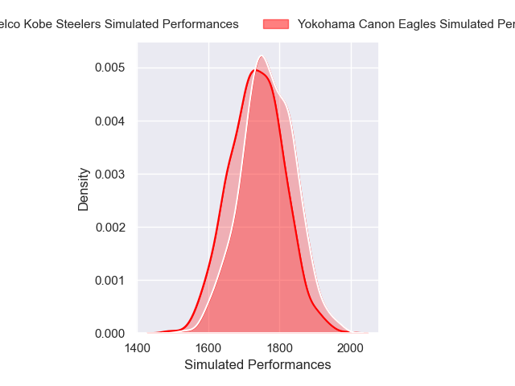
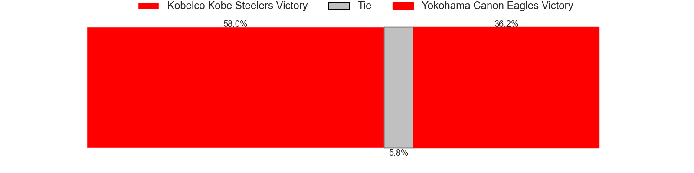
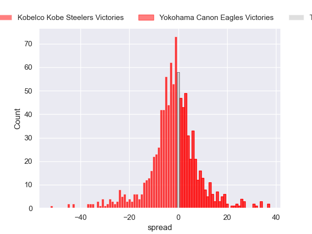

---  
title: "Japan Rugby League One 24/25 Status"  
date: 2025-05-02 6:00:00 -0500  
categories: model review projection  
layout: article  
aside:  
    toc: true  
---
# Current Team Rankings

# Standings

## Current Standings

| Club                  |   Played |   Wins |   Point Differential |   Losing Bonus Points |   Try Bonus Points |   Competition Points |
|:----------------------|---------:|-------:|---------------------:|----------------------:|-------------------:|---------------------:|
| Toshiba Brave Lupus   |       16 |     13 |                  223 |                     1 |                 15 |                   70 |
| Kubota Spears         |       16 |     13 |                  222 |                     2 |                 13 |                   69 |
| Saitama Wild Knights  |       16 |     13 |                  247 |                     1 |                 12 |                   67 |
| Shizuoka Blue Revs    |       16 |     12 |                   96 |                     1 |                 11 |                   60 |
| Kobelco Kobe Steelers |       16 |      9 |                  121 |                     4 |                 13 |                   53 |
| Tokyo Sungoliath      |       16 |      8 |                    8 |                     2 |                  9 |                   43 |
| Mitsubishi Dynaboars  |       16 |      6 |                 -187 |                     2 |                  9 |                   35 |
| Yokohama Canon Eagles |       16 |      6 |                   -9 |                     3 |                  7 |                   34 |
| Black Rams Tokyo      |       16 |      5 |                  -53 |                     5 |                  6 |                   31 |
| Toyota Verblitz       |       16 |      3 |                 -157 |                     4 |                  8 |                   26 |
| Mie Honda Heat        |       16 |      4 |                 -241 |                     2 |                  7 |                   25 |
| Urayasu D-Rocks       |       16 |      2 |                 -270 |                     2 |                  6 |                   16 |

## Projected Remaining Table

| Club                  |   Matches Remaining |   Wins |   Point Differential |   Losing Bonus Points |   Try Bonus Points |   Competition Points |
|:----------------------|--------------------:|-------:|---------------------:|----------------------:|-------------------:|---------------------:|
| Toshiba Brave Lupus   |                   2 |    1.8 |             28.1171  |                   0.1 |                1.5 |                  8.9 |
| Kubota Spears         |                   2 |    1.5 |             15.4455  |                   0.3 |                1   |                  7.2 |
| Saitama Wild Knights  |                   2 |    1.4 |             17.4276  |                   0.4 |                0.9 |                  6.8 |
| Shizuoka Blue Revs    |                   2 |    1.3 |             18.7482  |                   0.4 |                1   |                  6.7 |
| Black Rams Tokyo      |                   2 |    1.2 |             11.2397  |                   0.4 |                1   |                  6.3 |
| Kobelco Kobe Steelers |                   2 |    1.2 |              4.70735 |                   0.5 |                0.6 |                  6.1 |
| Toyota Verblitz       |                   2 |    0.8 |            -10.1203  |                   0.4 |                0.7 |                  4.2 |
| Mitsubishi Dynaboars  |                   2 |    0.7 |            -10.0081  |                   0.4 |                0.6 |                  3.8 |
| Tokyo Sungoliath      |                   2 |    0.7 |            -14.7893  |                   0.3 |                0.4 |                  3.6 |
| Yokohama Canon Eagles |                   2 |    0.5 |            -17.3281  |                   0.5 |                0.2 |                  2.6 |
| Urayasu D-Rocks       |                   2 |    0.5 |            -24.2365  |                   0.4 |                0.4 |                  2.6 |
| Mie Honda Heat        |                   2 |    0.4 |            -19.2033  |                   0.5 |                0.3 |                  2.4 |

## Projected Total Table

| Club                  |   Total Matches |   Wins |   Point Differential |   Losing Bonus Points |   Try Bonus Points |   Competition Points |
|:----------------------|----------------:|-------:|---------------------:|----------------------:|-------------------:|---------------------:|
| Toshiba Brave Lupus   |              18 |   14.8 |            251.117   |                   1.1 |               16.5 |                 78.9 |
| Kubota Spears         |              18 |   14.5 |            237.445   |                   2.3 |               14   |                 76.2 |
| Saitama Wild Knights  |              18 |   14.4 |            264.428   |                   1.4 |               12.9 |                 73.8 |
| Shizuoka Blue Revs    |              18 |   13.3 |            114.748   |                   1.4 |               12   |                 66.7 |
| Kobelco Kobe Steelers |              18 |   10.2 |            125.707   |                   4.5 |               13.6 |                 59.1 |
| Tokyo Sungoliath      |              18 |    8.7 |             -6.78927 |                   2.3 |                9.4 |                 46.6 |
| Mitsubishi Dynaboars  |              18 |    6.7 |           -197.008   |                   2.4 |                9.6 |                 38.8 |
| Black Rams Tokyo      |              18 |    6.2 |            -41.7603  |                   5.4 |                7   |                 37.3 |
| Yokohama Canon Eagles |              18 |    6.5 |            -26.3281  |                   3.5 |                7.2 |                 36.6 |
| Toyota Verblitz       |              18 |    3.8 |           -167.12    |                   4.4 |                8.7 |                 30.2 |
| Mie Honda Heat        |              18 |    4.4 |           -260.203   |                   2.5 |                7.3 |                 27.4 |
| Urayasu D-Rocks       |              18 |    2.5 |           -294.236   |                   2.4 |                6.4 |                 18.6 |

# Completed Match Review

| Model | Percent Correct Predictions | Spread Error |
| ------ | ------ | ------ |
| Club Level | 70.8% | 11.6 |
| Player Level: Lineup | 58.7% | 11.6 |
| Player Level: Minutes | 54.3% | 11.7 |

# Future Predictions

## Week 17

### Tokyo Sungoliath V Black Rams Tokyo on 2025/05/03

Average Margin: Tokyo Sungoliath by 3.9

Average Scoreline: 26-22

### Kubota Spears V Saitama Wild Knights on 2025/05/03

Average Margin: Kubota Spears by 1.3

Average Scoreline: 35-34

### Shizuoka Blue Revs V Urayasu D-Rocks on 2025/05/03

Average Margin: Shizuoka Blue Revs by 21.3

Average Scoreline: 43-22

### Mitsubishi Dynaboars V Toshiba Brave Lupus on 2025/05/03

Average Margin: Toshiba Brave Lupus by 12.9

Average Scoreline: 37-24

### Mie Honda Heat V Toyota Verblitz on 2025/05/04

Average Margin: Toyota Verblitz by 4.0

Average Scoreline: 31-27

### Yokohama Canon Eagles V Kobelco Kobe Steelers on 2025/05/04

Average Margin: Kobelco Kobe Steelers by 2.1

Average Scoreline: 33-31

## Week 18

### Urayasu D-Rocks V Mitsubishi Dynaboars on 2025/05/09

Average Margin: Mitsubishi Dynaboars by 2.9

Average Scoreline: 29-26

### Saitama Wild Knights V Tokyo Sungoliath on 2025/05/10

Average Margin: Saitama Wild Knights by 18.7

Average Scoreline: 34-15

### Toshiba Brave Lupus V Yokohama Canon Eagles on 2025/05/10

Average Margin: Toshiba Brave Lupus by 15.2

Average Scoreline: 30-15

### Kobelco Kobe Steelers V Shizuoka Blue Revs on 2025/05/10

Average Margin: Kobelco Kobe Steelers by 2.6

Average Scoreline: 33-30

### Toyota Verblitz V Kubota Spears on 2025/05/10

Average Margin: Kubota Spears by 14.1

Average Scoreline: 40-26

### Black Rams Tokyo V Mie Honda Heat on 2025/05/11

Average Margin: Black Rams Tokyo by 15.2

Average Scoreline: 32-17

