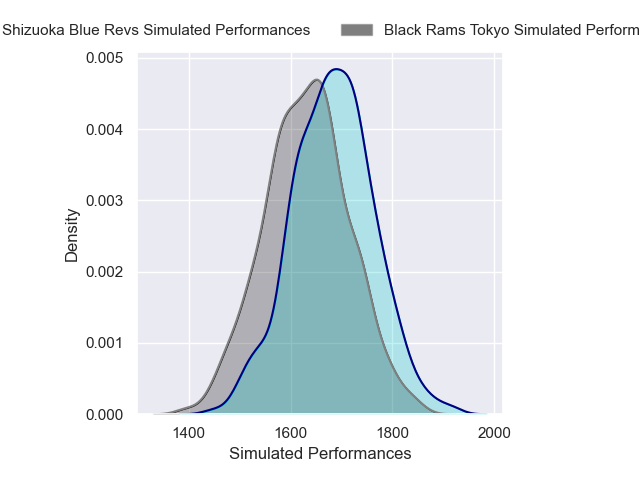
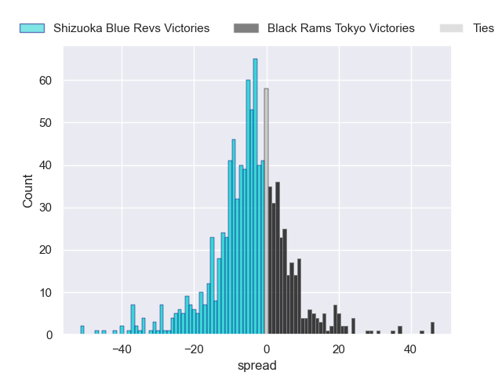

---  
title: "Japan Rugby League One 24/25 Status"  
date: 2025-01-30 6:00:00 -0500  
categories: model review projection  
layout: article  
aside:  
    toc: true  
---
# Current Team Rankings

# Standings

## Current Standings

| Club                  |   Played |   Wins |   Point Differential |   Losing Bonus Points |   Try Bonus Points |   Competition Points |
|:----------------------|---------:|-------:|---------------------:|----------------------:|-------------------:|---------------------:|
| Saitama Wild Knights  |        5 |      5 |                   86 |                     0 |                  4 |                   24 |
| Toshiba Brave Lupus   |        5 |      4 |                   68 |                     1 |                  4 |                   21 |
| Shizuoka Blue Revs    |        5 |      4 |                   39 |                     0 |                  4 |                   20 |
| Kubota Spears         |        5 |      3 |                   14 |                     1 |                  3 |                   18 |
| Yokohama Canon Eagles |        5 |      3 |                   47 |                     1 |                  3 |                   16 |
| Kobelco Kobe Steelers |        5 |      2 |                   30 |                     2 |                  4 |                   14 |
| Mitsubishi Dynaboars  |        5 |      2 |                  -65 |                     1 |                  3 |                   12 |
| Toyota Verblitz       |        5 |      1 |                   -9 |                     2 |                  3 |                   11 |
| Tokyo Sungoliath      |        5 |      2 |                  -14 |                     1 |                  2 |                   11 |
| Mie Honda Heat        |        5 |      2 |                  -31 |                     1 |                  2 |                   11 |
| Black Rams Tokyo      |        5 |      1 |                  -46 |                     1 |                  1 |                    6 |
| Urayasu D-Rocks       |        5 |      0 |                 -119 |                     0 |                  0 |                    0 |

## Projected Remaining Table

| Club                  |   Matches Remaining |   Wins |   Point Differential |   Losing Bonus Points |   Try Bonus Points |   Competition Points |
|:----------------------|--------------------:|-------:|---------------------:|----------------------:|-------------------:|---------------------:|
| Saitama Wild Knights  |                  13 |   11.6 |             232.654  |                   0.8 |                8.2 |                 55.4 |
| Toshiba Brave Lupus   |                  13 |    9.3 |             100.623  |                   1.8 |                6.2 |                 45.3 |
| Kubota Spears         |                  13 |    8.7 |              75.0133 |                   2.2 |                5.3 |                 42.4 |
| Kobelco Kobe Steelers |                  13 |    7.9 |              49.6676 |                   2.4 |                6   |                 40   |
| Yokohama Canon Eagles |                  13 |    7.8 |              50.3885 |                   2.6 |                4.8 |                 38.7 |
| Toyota Verblitz       |                  13 |    7.1 |              12.9276 |                   2.9 |                4.4 |                 35.5 |
| Tokyo Sungoliath      |                  13 |    7   |              25.1954 |                   2.7 |                4.3 |                 35   |
| Shizuoka Blue Revs    |                  13 |    6.7 |              19.5176 |                   2.7 |                4.8 |                 34.5 |
| Black Rams Tokyo      |                  13 |    3.8 |             -92.3565 |                   2.8 |                2.6 |                 20.5 |
| Mitsubishi Dynaboars  |                  13 |    3.4 |            -111.383  |                   2.9 |                2.5 |                 19   |
| Mie Honda Heat        |                  13 |    2.9 |            -147.775  |                   2.1 |                2.3 |                 16   |
| Urayasu D-Rocks       |                  13 |    1.7 |            -214.473  |                   1.9 |                1.2 |                  9.9 |

## Projected Total Table

| Club                  |   Total Matches |   Wins |   Point Differential |   Losing Bonus Points |   Try Bonus Points |   Competition Points |
|:----------------------|----------------:|-------:|---------------------:|----------------------:|-------------------:|---------------------:|
| Saitama Wild Knights  |              18 |   16.6 |            318.654   |                   0.8 |               12.2 |                 79.4 |
| Toshiba Brave Lupus   |              18 |   13.3 |            168.623   |                   2.8 |               10.2 |                 66.3 |
| Kubota Spears         |              18 |   11.7 |             89.0133  |                   3.2 |                8.3 |                 60.4 |
| Yokohama Canon Eagles |              18 |   10.8 |             97.3885  |                   3.6 |                7.8 |                 54.7 |
| Shizuoka Blue Revs    |              18 |   10.7 |             58.5176  |                   2.7 |                8.8 |                 54.5 |
| Kobelco Kobe Steelers |              18 |    9.9 |             79.6676  |                   4.4 |               10   |                 54   |
| Toyota Verblitz       |              18 |    8.1 |              3.92756 |                   4.9 |                7.4 |                 46.5 |
| Tokyo Sungoliath      |              18 |    9   |             11.1954  |                   3.7 |                6.3 |                 46   |
| Mitsubishi Dynaboars  |              18 |    5.4 |           -176.383   |                   3.9 |                5.5 |                 31   |
| Mie Honda Heat        |              18 |    4.9 |           -178.775   |                   3.1 |                4.3 |                 27   |
| Black Rams Tokyo      |              18 |    4.8 |           -138.357   |                   3.8 |                3.6 |                 26.5 |
| Urayasu D-Rocks       |              18 |    1.7 |           -333.473   |                   1.9 |                1.2 |                  9.9 |

# Completed Match Review

| Model | Percent Correct Predictions | Spread Error |
| ------ | ------ | ------ |
| Club Level | 76.7% | 10.5 |
| Player Level: Lineup | 71.4% | 13.1 |
| Player Level: Minutes | 76.2% | 13.2 |

# Future Predictions

## Week 6

### Toyota Verblitz V Yokohama Canon Eagles on 2025/02/01

Average Margin: Toyota Verblitz by 0.4

Average Scoreline: 33-32

### Mitsubishi Dynaboars V Kubota Spears on 2025/02/01

Average Margin: Kubota Spears by 9.3

Average Scoreline: 33-24

### Saitama Wild Knights V Urayasu D-Rocks on 2025/02/01

Average Margin: Saitama Wild Knights by 32.3

Average Scoreline: 43-10

### Kobelco Kobe Steelers V Black Rams Tokyo on 2025/02/01

Average Margin: Kobelco Kobe Steelers by 13.8

Average Scoreline: 38-25

### Shizuoka Blue Revs V Tokyo Sungoliath on 2025/02/01

Average Margin: Shizuoka Blue Revs by 2.5

Average Scoreline: 26-23

### Mie Honda Heat V Toshiba Brave Lupus on 2025/02/02

Average Margin: Toshiba Brave Lupus by 16.4

Average Scoreline: 38-22

## Week 7

### Urayasu D-Rocks V Mie Honda Heat on 2025/02/08

Average Margin: Mie Honda Heat by 1.9

Average Scoreline: 28-26

### Kobelco Kobe Steelers V Tokyo Sungoliath on 2025/02/08

Average Margin: Kobelco Kobe Steelers by 4.4

Average Scoreline: 29-25

### Black Rams Tokyo V Shizuoka Blue Revs on 2025/02/08

Average Margin: Shizuoka Blue Revs by 4.9

Average Scoreline: 29-24

### Yokohama Canon Eagles V Kubota Spears on 2025/02/08

Average Margin: Yokohama Canon Eagles by 3.0

Average Scoreline: 26-23

### Mitsubishi Dynaboars V Toyota Verblitz on 2025/02/09

Average Margin: Toyota Verblitz by 4.9

Average Scoreline: 27-22

### Saitama Wild Knights V Toshiba Brave Lupus on 2025/02/09

Average Margin: Saitama Wild Knights by 12.5

Average Scoreline: 31-19

## Week 8

### Kubota Spears V Kobelco Kobe Steelers on 2025/02/15

Average Margin: Kubota Spears by 6.1

Average Scoreline: 32-26

### Toshiba Brave Lupus V Tokyo Sungoliath on 2025/02/15

Average Margin: Toshiba Brave Lupus by 10.1

Average Scoreline: 31-21

### Toyota Verblitz V Shizuoka Blue Revs on 2025/02/15

Average Margin: Toyota Verblitz by 3.6

Average Scoreline: 25-21

### Black Rams Tokyo V Urayasu D-Rocks on 2025/02/15

Average Margin: Black Rams Tokyo by 13.7

Average Scoreline: 32-18

### Yokohama Canon Eagles V Saitama Wild Knights on 2025/02/16

Average Margin: Saitama Wild Knights by 9.9

Average Scoreline: 33-24

### Mie Honda Heat V Mitsubishi Dynaboars on 2025/02/16

Average Margin: Mitsubishi Dynaboars by 0.3

Average Scoreline: 22-22

## Week 9

### Kubota Spears V Shizuoka Blue Revs on 2025/02/22

Average Margin: Kubota Spears by 8.0

Average Scoreline: 27-19

### Saitama Wild Knights V Mitsubishi Dynaboars on 2025/02/22

Average Margin: Saitama Wild Knights by 28.2

Average Scoreline: 39-11

### Black Rams Tokyo V Toshiba Brave Lupus on 2025/02/22

Average Margin: Toshiba Brave Lupus by 10.9

Average Scoreline: 33-22

### Kobelco Kobe Steelers V Toyota Verblitz on 2025/02/22

Average Margin: Kobelco Kobe Steelers by 5.8

Average Scoreline: 30-24

### Mie Honda Heat V Yokohama Canon Eagles on 2025/02/23

Average Margin: Yokohama Canon Eagles by 13.1

Average Scoreline: 36-23

### Tokyo Sungoliath V Urayasu D-Rocks on 2025/02/23

Average Margin: Tokyo Sungoliath by 22.0

Average Scoreline: 38-16

## Week 10

### Mitsubishi Dynaboars V Black Rams Tokyo on 2025/03/01

Average Margin: Mitsubishi Dynaboars by 3.4

Average Scoreline: 29-25

### Toshiba Brave Lupus V Kubota Spears on 2025/03/01

Average Margin: Toshiba Brave Lupus by 6.8

Average Scoreline: 27-20

### Urayasu D-Rocks V Toyota Verblitz on 2025/03/01

Average Margin: Toyota Verblitz by 13.1

Average Scoreline: 33-20

### Shizuoka Blue Revs V Mie Honda Heat on 2025/03/02

Average Margin: Shizuoka Blue Revs by 15.4

Average Scoreline: 35-19

### Saitama Wild Knights V Kobelco Kobe Steelers on 2025/03/02

Average Margin: Saitama Wild Knights by 16.6

Average Scoreline: 25-9

### Tokyo Sungoliath V Yokohama Canon Eagles on 2025/03/02

Average Margin: Tokyo Sungoliath by 1.7

Average Scoreline: 24-23

## Week 11

### Urayasu D-Rocks V Kubota Spears on 2025/03/14

Average Margin: Kubota Spears by 16.4

Average Scoreline: 33-17

### Yokohama Canon Eagles V Black Rams Tokyo on 2025/03/15

Average Margin: Yokohama Canon Eagles by 14.6

Average Scoreline: 30-16

### Toyota Verblitz V Toshiba Brave Lupus on 2025/03/15

Average Margin: Toshiba Brave Lupus by 3.7

Average Scoreline: 31-27

### Kobelco Kobe Steelers V Mie Honda Heat on 2025/03/15

Average Margin: Kobelco Kobe Steelers by 17.6

Average Scoreline: 38-21

### Shizuoka Blue Revs V Saitama Wild Knights on 2025/03/15

Average Margin: Saitama Wild Knights by 12.1

Average Scoreline: 34-22

### Mitsubishi Dynaboars V Tokyo Sungoliath on 2025/03/16

Average Margin: Tokyo Sungoliath by 6.4

Average Scoreline: 26-20

## Week 12

### Toshiba Brave Lupus V Saitama Wild Knights on 2025/03/22

Average Margin: Saitama Wild Knights by 5.1

Average Scoreline: 28-23

### Mie Honda Heat V Urayasu D-Rocks on 2025/03/22

Average Margin: Mie Honda Heat by 8.8

Average Scoreline: 31-22

### Toyota Verblitz V Mitsubishi Dynaboars on 2025/03/22

Average Margin: Toyota Verblitz by 11.5

Average Scoreline: 36-25

### Shizuoka Blue Revs V Black Rams Tokyo on 2025/03/22

Average Margin: Shizuoka Blue Revs by 11.9

Average Scoreline: 31-19

### Kubota Spears V Yokohama Canon Eagles on 2025/03/22

Average Margin: Kubota Spears by 4.4

Average Scoreline: 25-20

### Tokyo Sungoliath V Kobelco Kobe Steelers on 2025/03/23

Average Margin: Tokyo Sungoliath by 3.4

Average Scoreline: 27-23

## Week 13

### Kubota Spears V Mitsubishi Dynaboars on 2025/03/29

Average Margin: Kubota Spears by 15.7

Average Scoreline: 41-25

### Tokyo Sungoliath V Shizuoka Blue Revs on 2025/03/29

Average Margin: Tokyo Sungoliath by 5.4

Average Scoreline: 28-23

### Urayasu D-Rocks V Saitama Wild Knights on 2025/03/29

Average Margin: Saitama Wild Knights by 26.7

Average Scoreline: 40-13

### Black Rams Tokyo V Kobelco Kobe Steelers on 2025/03/30

Average Margin: Kobelco Kobe Steelers by 6.2

Average Scoreline: 33-27

### Toshiba Brave Lupus V Mie Honda Heat on 2025/03/30

Average Margin: Toshiba Brave Lupus by 22.3

Average Scoreline: 41-19

### Yokohama Canon Eagles V Toyota Verblitz on 2025/03/30

Average Margin: Yokohama Canon Eagles by 7.3

Average Scoreline: 28-21

## Week 14

### Saitama Wild Knights V Toyota Verblitz on 2025/04/05

Average Margin: Saitama Wild Knights by 17.9

Average Scoreline: 28-10

### Shizuoka Blue Revs V Mitsubishi Dynaboars on 2025/04/05

Average Margin: Shizuoka Blue Revs by 11.8

Average Scoreline: 36-24

### Yokohama Canon Eagles V Urayasu D-Rocks on 2025/04/05

Average Margin: Yokohama Canon Eagles by 22.8

Average Scoreline: 38-16

### Tokyo Sungoliath V Mie Honda Heat on 2025/04/05

Average Margin: Tokyo Sungoliath by 16.5

Average Scoreline: 32-15

### Black Rams Tokyo V Kubota Spears on 2025/04/06

Average Margin: Kubota Spears by 7.5

Average Scoreline: 32-24

### Kobelco Kobe Steelers V Toshiba Brave Lupus on 2025/04/06

Average Margin: Toshiba Brave Lupus by 0.9

Average Scoreline: 25-24

## Week 15

### Mie Honda Heat V Saitama Wild Knights on 2025/04/11

Average Margin: Saitama Wild Knights by 22.2

Average Scoreline: 37-15

### Toshiba Brave Lupus V Shizuoka Blue Revs on 2025/04/12

Average Margin: Toshiba Brave Lupus by 10.7

Average Scoreline: 29-18

### Mitsubishi Dynaboars V Yokohama Canon Eagles on 2025/04/12

Average Margin: Yokohama Canon Eagles by 8.2

Average Scoreline: 31-23

### Urayasu D-Rocks V Kobelco Kobe Steelers on 2025/04/13

Average Margin: Kobelco Kobe Steelers by 14.7

Average Scoreline: 34-19

### Black Rams Tokyo V Toyota Verblitz on 2025/04/13

Average Margin: Toyota Verblitz by 4.0

Average Scoreline: 31-27

### Kubota Spears V Tokyo Sungoliath on 2025/04/13

Average Margin: Kubota Spears by 6.9

Average Scoreline: 29-22

## Week 16

### Urayasu D-Rocks V Toshiba Brave Lupus on 2025/04/25

Average Margin: Toshiba Brave Lupus by 18.8

Average Scoreline: 37-18

### Saitama Wild Knights V Black Rams Tokyo on 2025/04/26

Average Margin: Saitama Wild Knights by 25.5

Average Scoreline: 34-8

### Kobelco Kobe Steelers V Mitsubishi Dynaboars on 2025/04/26

Average Margin: Kobelco Kobe Steelers by 13.6

Average Scoreline: 40-26

### Kubota Spears V Mie Honda Heat on 2025/04/26

Average Margin: Kubota Spears by 18.3

Average Scoreline: 35-17

### Toyota Verblitz V Tokyo Sungoliath on 2025/04/26

Average Margin: Toyota Verblitz by 1.8

Average Scoreline: 27-25

### Shizuoka Blue Revs V Yokohama Canon Eagles on 2025/04/27

Average Margin: Shizuoka Blue Revs by 0.1

Average Scoreline: 21-21

## Week 17

### Mitsubishi Dynaboars V Toshiba Brave Lupus on 2025/05/03

Average Margin: Toshiba Brave Lupus by 10.4

Average Scoreline: 32-22

### Yokohama Canon Eagles V Kobelco Kobe Steelers on 2025/05/03

Average Margin: Yokohama Canon Eagles by 5.3

Average Scoreline: 23-18

### Tokyo Sungoliath V Black Rams Tokyo on 2025/05/03

Average Margin: Tokyo Sungoliath by 12.1

Average Scoreline: 29-17

### Kubota Spears V Saitama Wild Knights on 2025/05/03

Average Margin: Saitama Wild Knights by 7.1

Average Scoreline: 30-23

### Shizuoka Blue Revs V Urayasu D-Rocks on 2025/05/03

Average Margin: Shizuoka Blue Revs by 18.5

Average Scoreline: 34-16

### Mie Honda Heat V Toyota Verblitz on 2025/05/04

Average Margin: Toyota Verblitz by 7.7

Average Scoreline: 33-25

## Week 18

### Urayasu D-Rocks V Mitsubishi Dynaboars on 2025/05/09

Average Margin: Mitsubishi Dynaboars by 4.9

Average Scoreline: 28-23

### Toyota Verblitz V Kubota Spears on 2025/05/10

Average Margin: Toyota Verblitz by 0.6

Average Scoreline: 24-24

### Kobelco Kobe Steelers V Shizuoka Blue Revs on 2025/05/10

Average Margin: Kobelco Kobe Steelers by 5.8

Average Scoreline: 25-19

### Saitama Wild Knights V Tokyo Sungoliath on 2025/05/10

Average Margin: Saitama Wild Knights by 16.5

Average Scoreline: 28-11

### Toshiba Brave Lupus V Yokohama Canon Eagles on 2025/05/10

Average Margin: Toshiba Brave Lupus by 7.4

Average Scoreline: 23-16

### Black Rams Tokyo V Mie Honda Heat on 2025/05/11

Average Margin: Black Rams Tokyo by 8.8

Average Scoreline: 30-22

