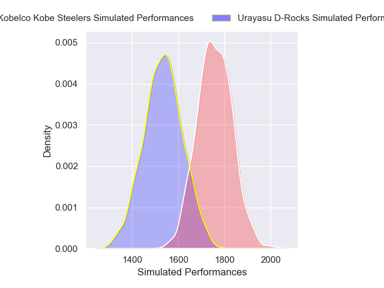
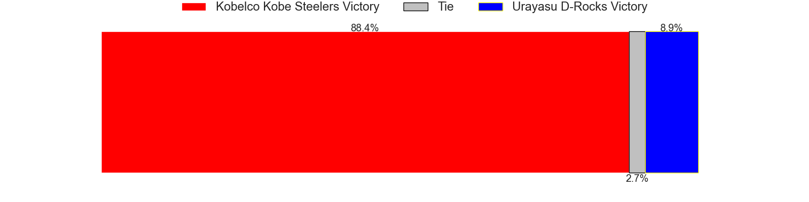
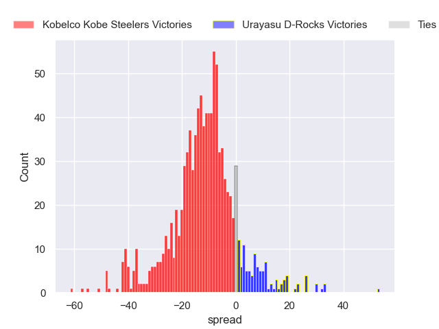

---  
title: "Japan Rugby League One 24/25 Status"  
date: 2025-04-10 6:00:00 -0500  
categories: model review projection  
layout: article  
aside:  
    toc: true  
---
# Current Team Rankings

# Standings

## Current Standings

| Club                  |   Played |   Wins |   Point Differential |   Losing Bonus Points |   Try Bonus Points |   Competition Points |
|:----------------------|---------:|-------:|---------------------:|----------------------:|-------------------:|---------------------:|
| Toshiba Brave Lupus   |       14 |     12 |                  211 |                     1 |                 13 |                   64 |
| Kubota Spears         |       14 |     11 |                  183 |                     2 |                 11 |                   59 |
| Saitama Wild Knights  |       14 |     11 |                  221 |                     1 |                 11 |                   58 |
| Shizuoka Blue Revs    |       14 |     10 |                   56 |                     1 |                  9 |                   50 |
| Kobelco Kobe Steelers |       14 |      7 |                   82 |                     4 |                 11 |                   43 |
| Tokyo Sungoliath      |       14 |      7 |                   11 |                     2 |                  8 |                   38 |
| Yokohama Canon Eagles |       14 |      6 |                   11 |                     3 |                  5 |                   32 |
| Mitsubishi Dynaboars  |       14 |      5 |                 -171 |                     2 |                  7 |                   29 |
| Black Rams Tokyo      |       14 |      4 |                  -77 |                     4 |                  5 |                   25 |
| Toyota Verblitz       |       14 |      3 |                 -110 |                     4 |                  7 |                   25 |
| Mie Honda Heat        |       14 |      4 |                 -202 |                     2 |                  6 |                   24 |
| Urayasu D-Rocks       |       14 |      2 |                 -215 |                     2 |                  6 |                   16 |

## Projected Remaining Table

| Club                  |   Matches Remaining |   Wins |   Point Differential |   Losing Bonus Points |   Try Bonus Points |   Competition Points |
|:----------------------|--------------------:|-------:|---------------------:|----------------------:|-------------------:|---------------------:|
| Toshiba Brave Lupus   |                   4 |    3.7 |             61.2744  |                   0.2 |                2.7 |                 17.6 |
| Saitama Wild Knights  |                   4 |    3.3 |             63.1519  |                   0.4 |                2.7 |                 16.3 |
| Kubota Spears         |                   4 |    3.3 |             58.094   |                   0.4 |                2.4 |                 15.9 |
| Kobelco Kobe Steelers |                   4 |    3   |             29.1856  |                   0.6 |                2.1 |                 14.7 |
| Shizuoka Blue Revs    |                   4 |    2.1 |              8.94389 |                   0.7 |                1.5 |                 10.7 |
| Black Rams Tokyo      |                   4 |    2   |             -2.6669  |                   0.7 |                1.4 |                 10.2 |
| Toyota Verblitz       |                   4 |    1.6 |            -14.0746  |                   1   |                1.4 |                  8.8 |
| Yokohama Canon Eagles |                   4 |    1.4 |            -18.0346  |                   1   |                1.2 |                  7.9 |
| Tokyo Sungoliath      |                   4 |    1.4 |            -30.9418  |                   0.7 |                0.9 |                  7   |
| Mitsubishi Dynaboars  |                   4 |    1.1 |            -29.7149  |                   0.9 |                1   |                  6.3 |
| Urayasu D-Rocks       |                   4 |    0.7 |            -51.6543  |                   0.7 |                0.9 |                  4.3 |
| Mie Honda Heat        |                   4 |    0.4 |            -73.5626  |                   0.6 |                0.5 |                  2.9 |

## Projected Total Table

| Club                  |   Total Matches |   Wins |   Point Differential |   Losing Bonus Points |   Try Bonus Points |   Competition Points |
|:----------------------|----------------:|-------:|---------------------:|----------------------:|-------------------:|---------------------:|
| Toshiba Brave Lupus   |              18 |   15.7 |            272.274   |                   1.2 |               15.7 |                 81.6 |
| Kubota Spears         |              18 |   14.3 |            241.094   |                   2.4 |               13.4 |                 74.9 |
| Saitama Wild Knights  |              18 |   14.3 |            284.152   |                   1.4 |               13.7 |                 74.3 |
| Shizuoka Blue Revs    |              18 |   12.1 |             64.9439  |                   1.7 |               10.5 |                 60.7 |
| Kobelco Kobe Steelers |              18 |   10   |            111.186   |                   4.6 |               13.1 |                 57.7 |
| Tokyo Sungoliath      |              18 |    8.4 |            -19.9418  |                   2.7 |                8.9 |                 45   |
| Yokohama Canon Eagles |              18 |    7.4 |             -7.03465 |                   4   |                6.2 |                 39.9 |
| Mitsubishi Dynaboars  |              18 |    6.1 |           -200.715   |                   2.9 |                8   |                 35.3 |
| Black Rams Tokyo      |              18 |    6   |            -79.6669  |                   4.7 |                6.4 |                 35.2 |
| Toyota Verblitz       |              18 |    4.6 |           -124.075   |                   5   |                8.4 |                 33.8 |
| Mie Honda Heat        |              18 |    4.4 |           -275.563   |                   2.6 |                6.5 |                 26.9 |
| Urayasu D-Rocks       |              18 |    2.7 |           -266.654   |                   2.7 |                6.9 |                 20.3 |

# Completed Match Review

| Model | Percent Correct Predictions | Spread Error |
| ------ | ------ | ------ |
| Club Level | 70.2% | 11.3 |
| Player Level: Lineup | 57.8% | 12.5 |
| Player Level: Minutes | 57.8% | 12.4 |

# Future Predictions

## Week 15

### Mie Honda Heat V Saitama Wild Knights on 2025/04/11

Average Margin: Saitama Wild Knights by 24.6

Average Scoreline: 43-19

### Urayasu D-Rocks V Kobelco Kobe Steelers on 2025/04/12

Average Margin: Kobelco Kobe Steelers by 11.8

Average Scoreline: 40-29

### Mitsubishi Dynaboars V Yokohama Canon Eagles on 2025/04/12

Average Margin: Yokohama Canon Eagles by 3.2

Average Scoreline: 28-24

### Toshiba Brave Lupus V Shizuoka Blue Revs on 2025/04/12

Average Margin: Toshiba Brave Lupus by 13.0

Average Scoreline: 35-22

### Black Rams Tokyo V Toyota Verblitz on 2025/04/13

Average Margin: Black Rams Tokyo by 6.6

Average Scoreline: 36-29

### Kubota Spears V Tokyo Sungoliath on 2025/04/13

Average Margin: Kubota Spears by 16.6

Average Scoreline: 37-21

## Week 16

### Urayasu D-Rocks V Toshiba Brave Lupus on 2025/04/25

Average Margin: Toshiba Brave Lupus by 19.8

Average Scoreline: 44-25

### Kobelco Kobe Steelers V Mitsubishi Dynaboars on 2025/04/26

Average Margin: Kobelco Kobe Steelers by 13.5

Average Scoreline: 41-28

### Saitama Wild Knights V Black Rams Tokyo on 2025/04/26

Average Margin: Saitama Wild Knights by 19.8

Average Scoreline: 46-27

### Toyota Verblitz V Tokyo Sungoliath on 2025/04/26

Average Margin: Toyota Verblitz by 0.3

Average Scoreline: 29-29

### Kubota Spears V Mie Honda Heat on 2025/04/26

Average Margin: Kubota Spears by 28.6

Average Scoreline: 46-17

### Shizuoka Blue Revs V Yokohama Canon Eagles on 2025/04/27

Average Margin: Shizuoka Blue Revs by 7.2

Average Scoreline: 36-28

## Week 17

### Kubota Spears V Saitama Wild Knights on 2025/05/03

Average Margin: Saitama Wild Knights by 0.0

Average Scoreline: 30-30

### Mitsubishi Dynaboars V Toshiba Brave Lupus on 2025/05/03

Average Margin: Toshiba Brave Lupus by 14.3

Average Scoreline: 38-24

### Tokyo Sungoliath V Black Rams Tokyo on 2025/05/03

Average Margin: Tokyo Sungoliath by 4.8

Average Scoreline: 31-26

### Yokohama Canon Eagles V Kobelco Kobe Steelers on 2025/05/03

Average Margin: Yokohama Canon Eagles by 0.1

Average Scoreline: 30-30

### Shizuoka Blue Revs V Urayasu D-Rocks on 2025/05/03

Average Margin: Shizuoka Blue Revs by 18.7

Average Scoreline: 39-20

### Mie Honda Heat V Toyota Verblitz on 2025/05/04

Average Margin: Toyota Verblitz by 5.1

Average Scoreline: 28-23

## Week 18

### Urayasu D-Rocks V Mitsubishi Dynaboars on 2025/05/09

Average Margin: Mitsubishi Dynaboars by 1.3

Average Scoreline: 38-37

### Toyota Verblitz V Kubota Spears on 2025/05/10

Average Margin: Kubota Spears by 12.9

Average Scoreline: 37-24

### Saitama Wild Knights V Tokyo Sungoliath on 2025/05/10

Average Margin: Saitama Wild Knights by 18.7

Average Scoreline: 44-25

### Toshiba Brave Lupus V Yokohama Canon Eagles on 2025/05/10

Average Margin: Toshiba Brave Lupus by 14.1

Average Scoreline: 36-22

### Kobelco Kobe Steelers V Shizuoka Blue Revs on 2025/05/10

Average Margin: Kobelco Kobe Steelers by 3.9

Average Scoreline: 31-27

### Black Rams Tokyo V Mie Honda Heat on 2025/05/11

Average Margin: Black Rams Tokyo by 15.2

Average Scoreline: 39-23

