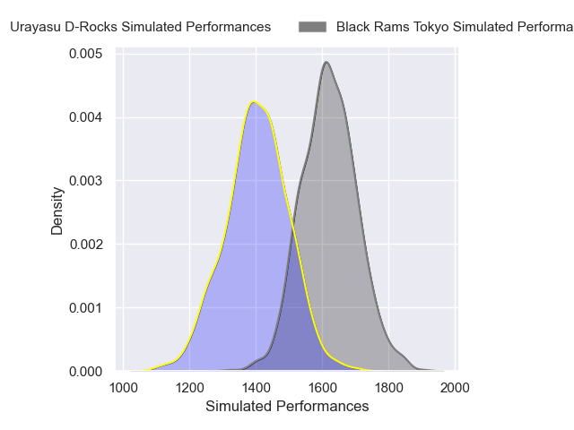
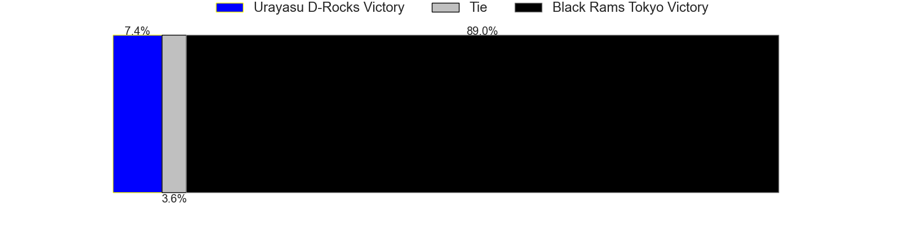
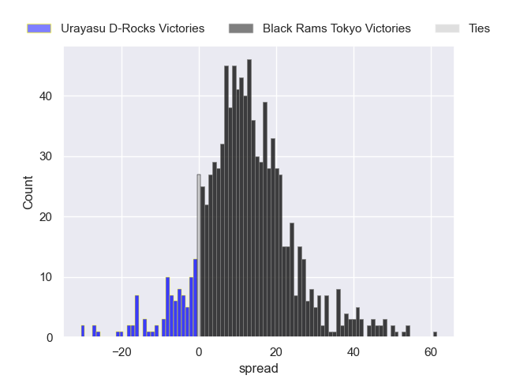

---  
title: "Japan Rugby League One 24/25 Status"  
date: 2025-02-10 6:00:00 -0500  
categories: model review projection  
layout: article  
aside:  
    toc: true  
---
# Current Team Rankings

# Standings

## Current Standings

| Club                  |   Played |   Wins |   Point Differential |   Losing Bonus Points |   Try Bonus Points |   Competition Points |
|:----------------------|---------:|-------:|---------------------:|----------------------:|-------------------:|---------------------:|
| Saitama Wild Knights  |        7 |      6 |                  113 |                     0 |                  5 |                   31 |
| Toshiba Brave Lupus   |        7 |      5 |                   91 |                     1 |                  6 |                   29 |
| Kubota Spears         |        7 |      5 |                   50 |                     1 |                  5 |                   28 |
| Shizuoka Blue Revs    |        7 |      5 |                   28 |                     0 |                  5 |                   25 |
| Kobelco Kobe Steelers |        7 |      3 |                   57 |                     3 |                  6 |                   21 |
| Tokyo Sungoliath      |        7 |      4 |                    7 |                     1 |                  4 |                   21 |
| Yokohama Canon Eagles |        7 |      4 |                   43 |                     1 |                  3 |                   20 |
| Mitsubishi Dynaboars  |        7 |      3 |                  -89 |                     1 |                  4 |                   17 |
| Toyota Verblitz       |        7 |      1 |                  -17 |                     4 |                  4 |                   14 |
| Mie Honda Heat        |        7 |      2 |                  -59 |                     2 |                  3 |                   13 |
| Black Rams Tokyo      |        7 |      1 |                  -83 |                     1 |                  1 |                    6 |
| Urayasu D-Rocks       |        7 |      1 |                 -141 |                     0 |                  2 |                    6 |

## Projected Remaining Table

| Club                  |   Matches Remaining |   Wins |   Point Differential |   Losing Bonus Points |   Try Bonus Points |   Competition Points |
|:----------------------|--------------------:|-------:|---------------------:|----------------------:|-------------------:|---------------------:|
| Saitama Wild Knights  |                  11 |    9.5 |            180.372   |                   0.9 |                6.7 |                 45.5 |
| Toshiba Brave Lupus   |                  11 |    8.8 |            118.533   |                   1.3 |                5.3 |                 41.9 |
| Kubota Spears         |                  11 |    8.5 |            114       |                   1.3 |                5.4 |                 41   |
| Tokyo Sungoliath      |                  11 |    7.2 |             70.0877  |                   1.6 |                5   |                 35.5 |
| Kobelco Kobe Steelers |                  11 |    6.3 |             33.0569  |                   1.9 |                4.8 |                 32   |
| Yokohama Canon Eagles |                  11 |    6.3 |             39.0989  |                   2   |                4.3 |                 31.8 |
| Shizuoka Blue Revs    |                  11 |    5.1 |             -1.27024 |                   2   |                4   |                 26.5 |
| Toyota Verblitz       |                  11 |    4.8 |            -27.0185  |                   2.4 |                3.4 |                 24.9 |
| Black Rams Tokyo      |                  11 |    3.2 |            -85.0525  |                   2   |                2.6 |                 17.5 |
| Mitsubishi Dynaboars  |                  11 |    2.9 |            -98.5297  |                   2.3 |                2.1 |                 16   |
| Mie Honda Heat        |                  11 |    1.7 |           -172.273   |                   1.6 |                1.6 |                 10.1 |
| Urayasu D-Rocks       |                  11 |    1.5 |           -171.004   |                   1.6 |                1.8 |                  9.3 |

## Projected Total Table

| Club                  |   Total Matches |   Wins |   Point Differential |   Losing Bonus Points |   Try Bonus Points |   Competition Points |
|:----------------------|----------------:|-------:|---------------------:|----------------------:|-------------------:|---------------------:|
| Saitama Wild Knights  |              18 |   15.5 |             293.372  |                   0.9 |               11.7 |                 76.5 |
| Toshiba Brave Lupus   |              18 |   13.8 |             209.533  |                   2.3 |               11.3 |                 70.9 |
| Kubota Spears         |              18 |   13.5 |             164      |                   2.3 |               10.4 |                 69   |
| Tokyo Sungoliath      |              18 |   11.2 |              77.0877 |                   2.6 |                9   |                 56.5 |
| Kobelco Kobe Steelers |              18 |    9.3 |              90.0569 |                   4.9 |               10.8 |                 53   |
| Yokohama Canon Eagles |              18 |   10.3 |              82.0989 |                   3   |                7.3 |                 51.8 |
| Shizuoka Blue Revs    |              18 |   10.1 |              26.7298 |                   2   |                9   |                 51.5 |
| Toyota Verblitz       |              18 |    5.8 |             -44.0185 |                   6.4 |                7.4 |                 38.9 |
| Mitsubishi Dynaboars  |              18 |    5.9 |            -187.53   |                   3.3 |                6.1 |                 33   |
| Black Rams Tokyo      |              18 |    4.2 |            -168.052  |                   3   |                3.6 |                 23.5 |
| Mie Honda Heat        |              18 |    3.7 |            -231.273  |                   3.6 |                4.6 |                 23.1 |
| Urayasu D-Rocks       |              18 |    2.5 |            -312.004  |                   1.6 |                3.8 |                 15.3 |

# Completed Match Review

| Model | Percent Correct Predictions | Spread Error |
| ------ | ------ | ------ |
| Club Level | 66.7% | 10.5 |
| Player Level: Lineup | 56.2% | 12.3 |
| Player Level: Minutes | 71.9% | 11.8 |

# Future Predictions

## Week 8

### Toyota Verblitz V Shizuoka Blue Revs on 2025/02/15

Average Margin: Toyota Verblitz by 2.2

Average Scoreline: 26-24

### Black Rams Tokyo V Urayasu D-Rocks on 2025/02/15

Average Margin: Black Rams Tokyo by 11.7

Average Scoreline: 35-24

### Kubota Spears V Kobelco Kobe Steelers on 2025/02/15

Average Margin: Kubota Spears by 10.3

Average Scoreline: 32-22

### Toshiba Brave Lupus V Tokyo Sungoliath on 2025/02/15

Average Margin: Toshiba Brave Lupus by 8.2

Average Scoreline: 33-25

### Yokohama Canon Eagles V Saitama Wild Knights on 2025/02/16

Average Margin: Saitama Wild Knights by 9.4

Average Scoreline: 38-29

### Mie Honda Heat V Mitsubishi Dynaboars on 2025/02/16

Average Margin: Mitsubishi Dynaboars by 4.0

Average Scoreline: 31-27

## Week 9

### Kobelco Kobe Steelers V Toyota Verblitz on 2025/02/22

Average Margin: Kobelco Kobe Steelers by 9.5

Average Scoreline: 33-23

### Saitama Wild Knights V Mitsubishi Dynaboars on 2025/02/22

Average Margin: Saitama Wild Knights by 26.7

Average Scoreline: 53-26

### Kubota Spears V Shizuoka Blue Revs on 2025/02/22

Average Margin: Kubota Spears by 12.9

Average Scoreline: 37-24

### Black Rams Tokyo V Toshiba Brave Lupus on 2025/02/22

Average Margin: Toshiba Brave Lupus by 14.2

Average Scoreline: 45-31

### Mie Honda Heat V Yokohama Canon Eagles on 2025/02/23

Average Margin: Yokohama Canon Eagles by 14.3

Average Scoreline: 38-23

### Tokyo Sungoliath V Urayasu D-Rocks on 2025/02/23

Average Margin: Tokyo Sungoliath by 24.3

Average Scoreline: 47-23

## Week 10

### Urayasu D-Rocks V Toyota Verblitz on 2025/03/01

Average Margin: Toyota Verblitz by 10.3

Average Scoreline: 43-32

### Toshiba Brave Lupus V Kubota Spears on 2025/03/01

Average Margin: Toshiba Brave Lupus by 4.7

Average Scoreline: 33-29

### Mitsubishi Dynaboars V Black Rams Tokyo on 2025/03/01

Average Margin: Mitsubishi Dynaboars by 3.7

Average Scoreline: 29-25

### Saitama Wild Knights V Kobelco Kobe Steelers on 2025/03/02

Average Margin: Saitama Wild Knights by 15.9

Average Scoreline: 37-21

### Shizuoka Blue Revs V Mie Honda Heat on 2025/03/02

Average Margin: Shizuoka Blue Revs by 17.7

Average Scoreline: 40-22

### Tokyo Sungoliath V Yokohama Canon Eagles on 2025/03/02

Average Margin: Tokyo Sungoliath by 5.2

Average Scoreline: 30-25

## Week 11

### Urayasu D-Rocks V Kubota Spears on 2025/03/14

Average Margin: Kubota Spears by 19.4

Average Scoreline: 50-31

### Yokohama Canon Eagles V Black Rams Tokyo on 2025/03/15

Average Margin: Yokohama Canon Eagles by 14.3

Average Scoreline: 39-25

### Kobelco Kobe Steelers V Mie Honda Heat on 2025/03/15

Average Margin: Kobelco Kobe Steelers by 20.5

Average Scoreline: 41-21

### Shizuoka Blue Revs V Saitama Wild Knights on 2025/03/15

Average Margin: Saitama Wild Knights by 12.4

Average Scoreline: 42-30

### Toyota Verblitz V Toshiba Brave Lupus on 2025/03/15

Average Margin: Toshiba Brave Lupus by 8.9

Average Scoreline: 37-28

### Mitsubishi Dynaboars V Tokyo Sungoliath on 2025/03/16

Average Margin: Tokyo Sungoliath by 9.5

Average Scoreline: 35-26

## Week 12

### Toyota Verblitz V Mitsubishi Dynaboars on 2025/03/22

Average Margin: Toyota Verblitz by 9.6

Average Scoreline: 38-28

### Shizuoka Blue Revs V Black Rams Tokyo on 2025/03/22

Average Margin: Shizuoka Blue Revs by 11.9

Average Scoreline: 35-23

### Mie Honda Heat V Urayasu D-Rocks on 2025/03/22

Average Margin: Mie Honda Heat by 3.8

Average Scoreline: 31-27

### Toshiba Brave Lupus V Saitama Wild Knights on 2025/03/22

Average Margin: Saitama Wild Knights by 2.4

Average Scoreline: 30-28

### Kubota Spears V Yokohama Canon Eagles on 2025/03/22

Average Margin: Kubota Spears by 9.3

Average Scoreline: 32-23

### Tokyo Sungoliath V Kobelco Kobe Steelers on 2025/03/23

Average Margin: Tokyo Sungoliath by 6.7

Average Scoreline: 33-26

## Week 13

### Tokyo Sungoliath V Shizuoka Blue Revs on 2025/03/29

Average Margin: Tokyo Sungoliath by 10.0

Average Scoreline: 36-26

### Urayasu D-Rocks V Saitama Wild Knights on 2025/03/29

Average Margin: Saitama Wild Knights by 26.6

Average Scoreline: 51-25

### Kubota Spears V Mitsubishi Dynaboars on 2025/03/29

Average Margin: Kubota Spears by 18.4

Average Scoreline: 42-24

### Yokohama Canon Eagles V Toyota Verblitz on 2025/03/30

Average Margin: Yokohama Canon Eagles by 10.2

Average Scoreline: 35-24

### Toshiba Brave Lupus V Mie Honda Heat on 2025/03/30

Average Margin: Toshiba Brave Lupus by 27.0

Average Scoreline: 44-17

### Black Rams Tokyo V Kobelco Kobe Steelers on 2025/03/30

Average Margin: Kobelco Kobe Steelers by 7.8

Average Scoreline: 37-29

## Week 14

### Tokyo Sungoliath V Mie Honda Heat on 2025/04/05

Average Margin: Tokyo Sungoliath by 23.1

Average Scoreline: 45-22

### Saitama Wild Knights V Toyota Verblitz on 2025/04/05

Average Margin: Saitama Wild Knights by 20.1

Average Scoreline: 39-19

### Yokohama Canon Eagles V Urayasu D-Rocks on 2025/04/05

Average Margin: Yokohama Canon Eagles by 21.7

Average Scoreline: 43-22

### Shizuoka Blue Revs V Mitsubishi Dynaboars on 2025/04/05

Average Margin: Shizuoka Blue Revs by 11.0

Average Scoreline: 38-27

### Kobelco Kobe Steelers V Toshiba Brave Lupus on 2025/04/06

Average Margin: Toshiba Brave Lupus by 3.0

Average Scoreline: 29-26

### Black Rams Tokyo V Kubota Spears on 2025/04/06

Average Margin: Kubota Spears by 12.1

Average Scoreline: 43-31

## Week 15

### Mie Honda Heat V Saitama Wild Knights on 2025/04/11

Average Margin: Saitama Wild Knights by 24.7

Average Scoreline: 47-22

### Mitsubishi Dynaboars V Yokohama Canon Eagles on 2025/04/12

Average Margin: Yokohama Canon Eagles by 7.3

Average Scoreline: 33-26

### Toshiba Brave Lupus V Shizuoka Blue Revs on 2025/04/12

Average Margin: Toshiba Brave Lupus by 13.2

Average Scoreline: 38-24

### Kubota Spears V Tokyo Sungoliath on 2025/04/13

Average Margin: Kubota Spears by 6.9

Average Scoreline: 32-25

### Urayasu D-Rocks V Kobelco Kobe Steelers on 2025/04/13

Average Margin: Kobelco Kobe Steelers by 13.7

Average Scoreline: 42-28

### Black Rams Tokyo V Toyota Verblitz on 2025/04/13

Average Margin: Toyota Verblitz by 1.8

Average Scoreline: 31-30

## Week 16

### Urayasu D-Rocks V Toshiba Brave Lupus on 2025/04/25

Average Margin: Toshiba Brave Lupus by 19.1

Average Scoreline: 49-30

### Kubota Spears V Mie Honda Heat on 2025/04/26

Average Margin: Kubota Spears by 25.6

Average Scoreline: 45-19

### Toyota Verblitz V Tokyo Sungoliath on 2025/04/26

Average Margin: Tokyo Sungoliath by 4.3

Average Scoreline: 30-26

### Saitama Wild Knights V Black Rams Tokyo on 2025/04/26

Average Margin: Saitama Wild Knights by 26.5

Average Scoreline: 41-14

### Kobelco Kobe Steelers V Mitsubishi Dynaboars on 2025/04/26

Average Margin: Kobelco Kobe Steelers by 14.0

Average Scoreline: 39-25

### Shizuoka Blue Revs V Yokohama Canon Eagles on 2025/04/27

Average Margin: Yokohama Canon Eagles by 0.6

Average Scoreline: 26-25

## Week 17

### Tokyo Sungoliath V Black Rams Tokyo on 2025/05/03

Average Margin: Tokyo Sungoliath by 14.8

Average Scoreline: 38-23

### Yokohama Canon Eagles V Kobelco Kobe Steelers on 2025/05/03

Average Margin: Yokohama Canon Eagles by 4.1

Average Scoreline: 29-25

### Kubota Spears V Saitama Wild Knights on 2025/05/03

Average Margin: Saitama Wild Knights by 2.8

Average Scoreline: 32-29

### Mitsubishi Dynaboars V Toshiba Brave Lupus on 2025/05/03

Average Margin: Toshiba Brave Lupus by 13.1

Average Scoreline: 41-28

### Shizuoka Blue Revs V Urayasu D-Rocks on 2025/05/03

Average Margin: Shizuoka Blue Revs by 16.9

Average Scoreline: 42-25

### Mie Honda Heat V Toyota Verblitz on 2025/05/04

Average Margin: Toyota Verblitz by 8.8

Average Scoreline: 35-26

## Week 18

### Urayasu D-Rocks V Mitsubishi Dynaboars on 2025/05/09

Average Margin: Mitsubishi Dynaboars by 3.4

Average Scoreline: 34-31

### Toshiba Brave Lupus V Yokohama Canon Eagles on 2025/05/10

Average Margin: Toshiba Brave Lupus by 9.6

Average Scoreline: 33-23

### Saitama Wild Knights V Tokyo Sungoliath on 2025/05/10

Average Margin: Saitama Wild Knights by 12.7

Average Scoreline: 34-21

### Kobelco Kobe Steelers V Shizuoka Blue Revs on 2025/05/10

Average Margin: Kobelco Kobe Steelers by 7.4

Average Scoreline: 33-25

### Toyota Verblitz V Kubota Spears on 2025/05/10

Average Margin: Kubota Spears by 6.7

Average Scoreline: 32-25

### Black Rams Tokyo V Mie Honda Heat on 2025/05/11

Average Margin: Black Rams Tokyo by 10.5

Average Scoreline: 34-24

