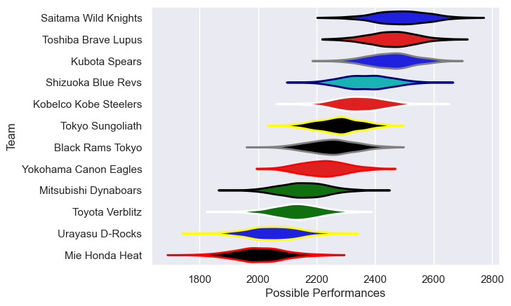

---  
title: "Japan Rugby League One 24/25 Status"  
date: 2025-05-09 6:00:00 -0500  
categories: model review projection  
layout: article  
aside:  
    toc: true  
---
# Current Team Rankings

# Standings

## Current Standings

| Club                  |   Played |   Wins |   Point Differential |   Losing Bonus Points |   Try Bonus Points |   Competition Points |
|:----------------------|---------:|-------:|---------------------:|----------------------:|-------------------:|---------------------:|
| Toshiba Brave Lupus   |       17 |     14 |                  240 |                     1 |                 16 |                   75 |
| Kubota Spears         |       17 |     14 |                  222 |                     2 |                 14 |                   72 |
| Saitama Wild Knights  |       17 |     14 |                  247 |                     1 |                 13 |                   70 |
| Shizuoka Blue Revs    |       17 |     13 |                  106 |                     1 |                 12 |                   65 |
| Kobelco Kobe Steelers |       17 |     10 |                  139 |                     4 |                 14 |                   58 |
| Tokyo Sungoliath      |       17 |      9 |                   17 |                     2 |                 10 |                   48 |
| Mitsubishi Dynaboars  |       18 |      6 |                 -217 |                     2 |                 10 |                   36 |
| Yokohama Canon Eagles |       17 |      6 |                  -27 |                     3 |                  8 |                   35 |
| Black Rams Tokyo      |       17 |      5 |                  -62 |                     5 |                  7 |                   32 |
| Toyota Verblitz       |       17 |      4 |                 -149 |                     4 |                  9 |                   31 |
| Mie Honda Heat        |       17 |      4 |                 -249 |                     2 |                  8 |                   26 |
| Urayasu D-Rocks       |       18 |      3 |                 -267 |                     2 |                  8 |                   22 |

## Projected Remaining Table

| Club                  |   Matches Remaining |   Wins |   Point Differential |   Losing Bonus Points |   Try Bonus Points |   Competition Points |
|:----------------------|--------------------:|-------:|---------------------:|----------------------:|-------------------:|---------------------:|
| Saitama Wild Knights  |                   1 |    0.9 |              18.1771 |                   0   |                0.8 |                  4.5 |
| Kubota Spears         |                   1 |    0.9 |              13.7477 |                   0   |                0.8 |                  4.5 |
| Toshiba Brave Lupus   |                   1 |    0.9 |              17.0613 |                   0   |                0.7 |                  4.4 |
| Black Rams Tokyo      |                   1 |    0.9 |              16.8109 |                   0   |                0.7 |                  4.4 |
| Kobelco Kobe Steelers |                   1 |    0.7 |               3.847  |                   0.2 |                0.3 |                  3.2 |
| Shizuoka Blue Revs    |                   1 |    0.3 |              -3.847  |                   0.4 |                0.3 |                  1.9 |
| Toyota Verblitz       |                   1 |    0.1 |             -13.7477 |                   0.2 |                0.2 |                  0.6 |
| Mie Honda Heat        |                   1 |    0.1 |             -16.8109 |                   0.1 |                0.2 |                  0.6 |
| Yokohama Canon Eagles |                   1 |    0.1 |             -17.0613 |                   0.1 |                0.1 |                  0.5 |
| Tokyo Sungoliath      |                   1 |    0.1 |             -18.1771 |                   0.1 |                0.1 |                  0.5 |

## Projected Total Table

| Club                  |   Total Matches |   Wins |   Point Differential |   Losing Bonus Points |   Try Bonus Points |   Competition Points |
|:----------------------|----------------:|-------:|---------------------:|----------------------:|-------------------:|---------------------:|
| Toshiba Brave Lupus   |              18 |   14.9 |            257.061   |                   1   |               16.7 |                 79.4 |
| Kubota Spears         |              18 |   14.9 |            235.748   |                   2   |               14.8 |                 76.5 |
| Saitama Wild Knights  |              18 |   14.9 |            265.177   |                   1   |               13.8 |                 74.5 |
| Shizuoka Blue Revs    |              18 |   13.3 |            102.153   |                   1.4 |               12.3 |                 66.9 |
| Kobelco Kobe Steelers |              18 |   10.7 |            142.847   |                   4.2 |               14.3 |                 61.2 |
| Tokyo Sungoliath      |              18 |    9.1 |             -1.17706 |                   2.1 |               10.1 |                 48.5 |
| Black Rams Tokyo      |              18 |    5.9 |            -45.1891  |                   5   |                7.7 |                 36.4 |
| Mitsubishi Dynaboars  |              18 |    6   |           -217       |                   2   |               10   |                 36   |
| Yokohama Canon Eagles |              18 |    6.1 |            -44.0613  |                   3.1 |                8.1 |                 35.5 |
| Toyota Verblitz       |              18 |    4.1 |           -162.748   |                   4.2 |                9.2 |                 31.6 |
| Mie Honda Heat        |              18 |    4.1 |           -265.811   |                   2.1 |                8.2 |                 26.6 |
| Urayasu D-Rocks       |              18 |    3   |           -267       |                   2   |                8   |                 22   |

# Completed Match Review

| Model | Percent Correct Predictions | Spread Error |
| ------ | ------ | ------ |
| Club Level | 70.9% | 11.4 |
| Player Level: Lineup | 60.0% | 12.2 |
| Player Level: Minutes | 62.0% | 12.4 |

# Future Predictions

## Week 19

### Toshiba Brave Lupus V Yokohama Canon Eagles on 2025/05/10

Average Margin: Toshiba Brave Lupus by 17.1

Average Scoreline: 41-24

### Toyota Verblitz V Kubota Spears on 2025/05/10

Average Margin: Kubota Spears by 13.7

Average Scoreline: 34-20

### Kobelco Kobe Steelers V Shizuoka Blue Revs on 2025/05/10

Average Margin: Kobelco Kobe Steelers by 3.8

Average Scoreline: 40-37

### Saitama Wild Knights V Tokyo Sungoliath on 2025/05/10

Average Margin: Saitama Wild Knights by 18.2

Average Scoreline: 45-27

### Black Rams Tokyo V Mie Honda Heat on 2025/05/11

Average Margin: Black Rams Tokyo by 16.8

Average Scoreline: 36-19

