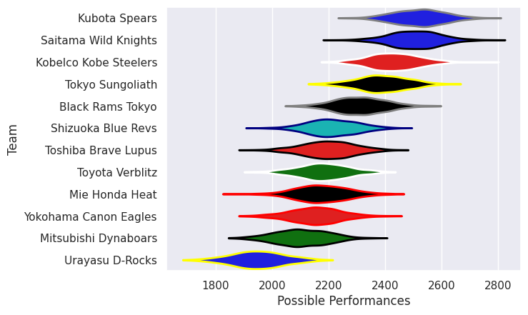

---  
title: "Japan Rugby League One 25/26"  
date: 2025-12-25 6:00:00 -0500  
categories: model review projection  
layout: article  
aside:  
    toc: true  
---
# Team Rankings

# Standings

## Current Standings

| Club                  |   Played |   Wins |   Point Differential |   Losing Bonus Points |   Try Bonus Points |   Competition Points |
|:----------------------|---------:|-------:|---------------------:|----------------------:|-------------------:|---------------------:|
| Tokyo Sungoliath      |        2 |      2 |                   32 |                     0 |                  2 |                   10 |
| Kubota Spears         |        2 |      2 |                   27 |                     0 |                  2 |                   10 |
| Saitama Wild Knights  |        2 |      2 |                   64 |                     0 |                  1 |                    9 |
| Shizuoka Blue Revs    |        2 |      1 |                    8 |                     1 |                  1 |                    6 |
| Mitsubishi Dynaboars  |        2 |      1 |                    4 |                     1 |                    |                    5 |
| Kobelco Kobe Steelers |        2 |      1 |                    0 |                     1 |                    |                    5 |
| Toyota Verblitz       |        2 |      1 |                   -7 |                     0 |                  1 |                    5 |
| Urayasu D-Rocks       |        2 |      1 |                  -15 |                     0 |                    |                    4 |
| Toshiba Brave Lupus   |        2 |      1 |                  -42 |                     0 |                    |                    4 |
| Mie Honda Heat        |        2 |      0 |                  -16 |                     1 |                  1 |                    2 |
| Yokohama Canon Eagles |        2 |      0 |                  -19 |                     1 |                    |                    1 |
| Black Rams Tokyo      |        2 |      0 |                  -36 |                     0 |                    |                    0 |

## Projected Remaining Table

| Club                  |   To Play |   Projected Wins |   Projected Differential |   Projected Losing Bonus Points | Projected Try Bonus Points   |   Projected Competition Points |
|:----------------------|----------:|-----------------:|-------------------------:|--------------------------------:|:-----------------------------|-------------------------------:|
| Kobelco Kobe Steelers |         1 |            0.741 |                    8.246 |                           0.124 |                              |                          3.15  |
| Black Rams Tokyo      |         1 |            0.737 |                    7.316 |                           0.124 |                              |                          3.132 |
| Saitama Wild Knights  |         1 |            0.742 |                    8.356 |                           0.115 |                              |                          3.131 |
| Shizuoka Blue Revs    |         1 |            0.733 |                    8.968 |                           0.121 |                              |                          3.125 |
| Kubota Spears         |         1 |            0.709 |                    6.397 |                           0.148 |                              |                          3.064 |
| Toshiba Brave Lupus   |         1 |            0.685 |                    5.381 |                           0.149 |                              |                          2.969 |
| Yokohama Canon Eagles |         1 |            0.275 |                   -5.381 |                           0.253 |                              |                          1.433 |
| Tokyo Sungoliath      |         1 |            0.251 |                   -6.397 |                           0.247 |                              |                          1.331 |
| Mie Honda Heat        |         1 |            0.233 |                   -7.316 |                           0.222 |                              |                          1.214 |
| Mitsubishi Dynaboars  |         1 |            0.234 |                   -8.356 |                           0.201 |                              |                          1.185 |
| Toyota Verblitz       |         1 |            0.228 |                   -8.246 |                           0.202 |                              |                          1.176 |
| Urayasu D-Rocks       |         1 |            0.231 |                   -8.968 |                           0.17  |                              |                          1.166 |

## Projected Total Table

| Club                  |   Played |   Wins |   Point Differential |   Losing Bonus Points |   Try Bonus Points |   Competition Points |
|:----------------------|---------:|-------:|---------------------:|----------------------:|-------------------:|---------------------:|
| Kubota Spears         |        3 |  2.709 |               33.397 |                 0.148 |                  2 |               13.064 |
| Saitama Wild Knights  |        3 |  2.742 |               72.356 |                 0.115 |                  1 |               12.131 |
| Tokyo Sungoliath      |        3 |  2.251 |               25.603 |                 0.247 |                  2 |               11.331 |
| Shizuoka Blue Revs    |        3 |  1.733 |               16.968 |                 1.121 |                  1 |                9.125 |
| Kobelco Kobe Steelers |        3 |  1.741 |                8.246 |                 1.124 |                    |                8.15  |
| Toshiba Brave Lupus   |        3 |  1.685 |              -36.619 |                 0.149 |                    |                6.969 |
| Mitsubishi Dynaboars  |        3 |  1.234 |               -4.356 |                 1.201 |                    |                6.185 |
| Toyota Verblitz       |        3 |  1.228 |              -15.246 |                 0.202 |                  1 |                6.176 |
| Urayasu D-Rocks       |        3 |  1.231 |              -23.968 |                 0.17  |                    |                5.166 |
| Mie Honda Heat        |        3 |  0.233 |              -23.316 |                 1.222 |                  1 |                3.214 |
| Black Rams Tokyo      |        3 |  0.737 |              -28.684 |                 0.124 |                    |                3.132 |
| Yokohama Canon Eagles |        3 |  0.275 |              -24.381 |                 1.253 |                    |                2.433 |

# Completed Match Review

| Model | Percent Correct Predictions | Spread Error |
| ------ | ------ | ------ |
| Club Level | 88.9% | 9.2 |
| Player Level: Lineup | nan% | nan |
| Player Level: Minutes | nan% | nan |

# Future Predictions

## Week 3

### Black Rams Tokyo V Mie Honda Heat on 2025/12/27

Average Margin: Black Rams Tokyo by 7.3

### Kubota Spears V Tokyo Sungoliath on 2025/12/27

Average Margin: Kubota Spears by 6.4

### Kobelco Kobe Steelers V Toyota Verblitz on 2025/12/27

Average Margin: Kobelco Kobe Steelers by 8.2

### Yokohama Canon Eagles V Toshiba Brave Lupus on 2025/12/28

Average Margin: Toshiba Brave Lupus by 5.4

### Shizuoka Blue Revs V Urayasu D-Rocks on 2025/12/28

Average Margin: Shizuoka Blue Revs by 9.0

### Mitsubishi Dynaboars V Saitama Wild Knights on 2025/12/28

Average Margin: Saitama Wild Knights by 8.4

