# Team Rankings

# Standings

## Current Standings

| Club                  |   Played |   Wins |   Point Differential |   Losing Bonus Points |   Try Bonus Points |   Competition Points |
|:----------------------|---------:|-------:|---------------------:|----------------------:|-------------------:|---------------------:|
| Saitama Wild Knights  |        3 |      3 |                   94 |                     0 |                  3 |                   15 |
| Kubota Spears         |        3 |      3 |                   86 |                     0 |                  3 |                   15 |
| Kobelco Kobe Steelers |        3 |      2 |                   20 |                     1 |                  2 |                   11 |
| Toshiba Brave Lupus   |        3 |      2 |                  -20 |                     0 |                  2 |                   10 |
| Tokyo Sungoliath      |        3 |      2 |                  -27 |                     0 |                  2 |                   10 |
| Urayasu D-Rocks       |        3 |      2 |                   -2 |                     0 |                  1 |                    9 |
| Shizuoka Blue Revs    |        3 |      1 |                   -5 |                     1 |                  1 |                    6 |
| Toyota Verblitz       |        3 |      1 |                  -27 |                     0 |                  2 |                    6 |
| Mitsubishi Dynaboars  |        3 |      1 |                  -26 |                     1 |                    |                    5 |
| Black Rams Tokyo      |        3 |      1 |                  -32 |                     0 |                  1 |                    5 |
| Mie Honda Heat        |        3 |      0 |                  -20 |                     2 |                  2 |                    4 |
| Yokohama Canon Eagles |        3 |      0 |                  -41 |                     1 |                    |                    1 |

## Projected Remaining Table

| Club                  |   To Play |   Projected Wins |   Projected Differential |   Projected Losing Bonus Points | Projected Try Bonus Points   |   Projected Competition Points |
|:----------------------|----------:|-----------------:|-------------------------:|--------------------------------:|:-----------------------------|-------------------------------:|
| Toshiba Brave Lupus   |        16 |            9.81  |                   65.363 |                           2.902 |                              |                         43.45  |
| Kubota Spears         |        15 |            9.767 |                   83.623 |                           2.535 |                              |                         42.807 |
| Saitama Wild Knights  |        15 |            9.751 |                   85.992 |                           2.513 |                              |                         42.653 |
| Kobelco Kobe Steelers |        15 |            8.155 |                   28.625 |                           3.182 |                              |                         37.152 |
| Shizuoka Blue Revs    |        15 |            7.606 |                   11.761 |                           3.253 |                              |                         35.047 |
| Tokyo Sungoliath      |        15 |            7.565 |                   13.036 |                           3.306 |                              |                         35.042 |
| Black Rams Tokyo      |        16 |            6.693 |                  -27.151 |                           3.823 |                              |                         32.071 |
| Mitsubishi Dynaboars  |        16 |            6.109 |                  -51.529 |                           3.646 |                              |                         29.442 |
| Urayasu D-Rocks       |        15 |            6.105 |                  -30.859 |                           3.68  |                              |                         29.4   |
| Toyota Verblitz       |        16 |            5.862 |                  -58.131 |                           3.775 |                              |                         28.641 |
| Yokohama Canon Eagles |        15 |            5.705 |                  -43.462 |                           3.519 |                              |                         27.633 |
| Mie Honda Heat        |        15 |            4.904 |                  -77.268 |                           3.401 |                              |                         24.197 |

## Projected Total Table

| Club                  |   Played |   Wins |   Point Differential |   Losing Bonus Points |   Try Bonus Points |   Competition Points |
|:----------------------|---------:|-------:|---------------------:|----------------------:|-------------------:|---------------------:|
| Kubota Spears         |       18 | 12.767 |              169.623 |                 2.535 |                  3 |               57.807 |
| Saitama Wild Knights  |       18 | 12.751 |              179.992 |                 2.513 |                  3 |               57.653 |
| Toshiba Brave Lupus   |       19 | 11.81  |               45.363 |                 2.902 |                  2 |               53.45  |
| Kobelco Kobe Steelers |       18 | 10.155 |               48.625 |                 4.182 |                  2 |               48.152 |
| Tokyo Sungoliath      |       18 |  9.565 |              -13.964 |                 3.306 |                  2 |               45.042 |
| Shizuoka Blue Revs    |       18 |  8.606 |                6.761 |                 4.253 |                  1 |               41.047 |
| Urayasu D-Rocks       |       18 |  8.105 |              -32.859 |                 3.68  |                  1 |               38.4   |
| Black Rams Tokyo      |       19 |  7.693 |              -59.151 |                 3.823 |                  1 |               37.071 |
| Toyota Verblitz       |       19 |  6.862 |              -85.131 |                 3.775 |                  2 |               34.641 |
| Mitsubishi Dynaboars  |       19 |  7.109 |              -77.529 |                 4.646 |                    |               34.442 |
| Yokohama Canon Eagles |       18 |  5.705 |              -84.462 |                 4.519 |                    |               28.633 |
| Mie Honda Heat        |       18 |  4.904 |              -97.268 |                 5.401 |                  2 |               28.197 |

# Completed Match Review

| Model | Percent Correct Predictions | Spread Error |
| ------ | ------ | ------ |
| Club Level | 60.0% | 10.5 |
| Player Level: Lineup | nan% | nan |
| Player Level: Minutes | nan% | nan |

# Future Predictions

## Week 4

### Saitama Wild Knights V Shizuoka Blue Revs on 2026/01/09

Average Margin: Saitama Wild Knights by 7.9

### Urayasu D-Rocks V Yokohama Canon Eagles on 2026/01/09

Average Margin: Urayasu D-Rocks by 2.6

### Toshiba Brave Lupus V Mitsubishi Dynaboars on 2026/01/09

Average Margin: Toshiba Brave Lupus by 10.1

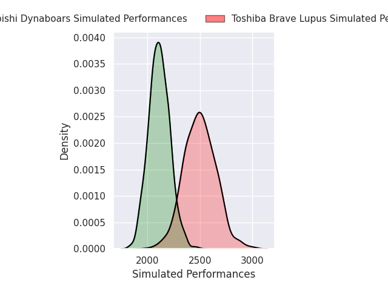
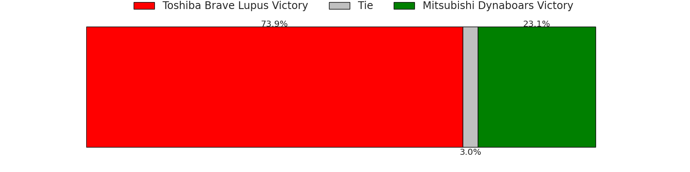
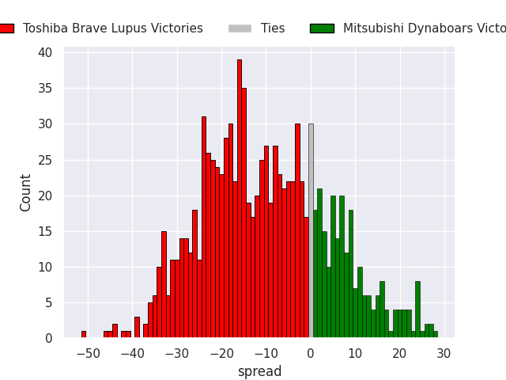

### Toyota Verblitz V Black Rams Tokyo on 2026/01/09

Average Margin: Black Rams Tokyo by 0.5

### Tokyo Sungoliath V Kobelco Kobe Steelers on 2026/01/09

Average Margin: Tokyo Sungoliath by 0.7

### Mie Honda Heat V Kubota Spears on 2026/01/10

Average Margin: Kubota Spears by 10.7

### Toyota Verblitz V Toshiba Brave Lupus on 2026/01/10

Average Margin: Toshiba Brave Lupus by 7.2

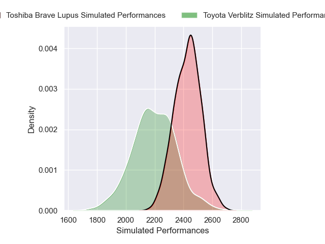
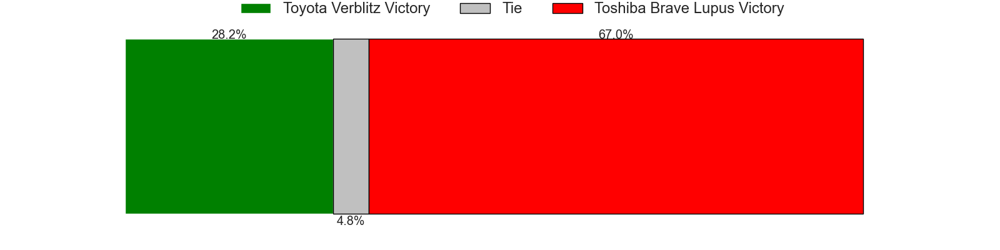
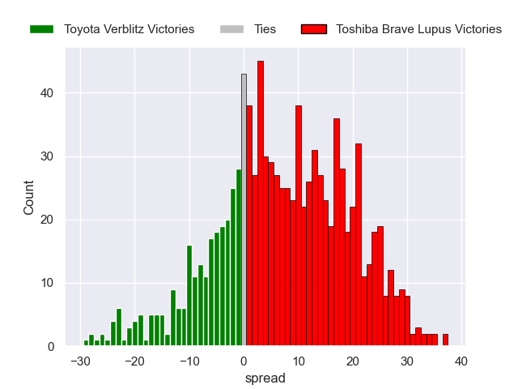

### Black Rams Tokyo V Mitsubishi Dynaboars on 2026/01/10

Average Margin: Black Rams Tokyo by 3.7

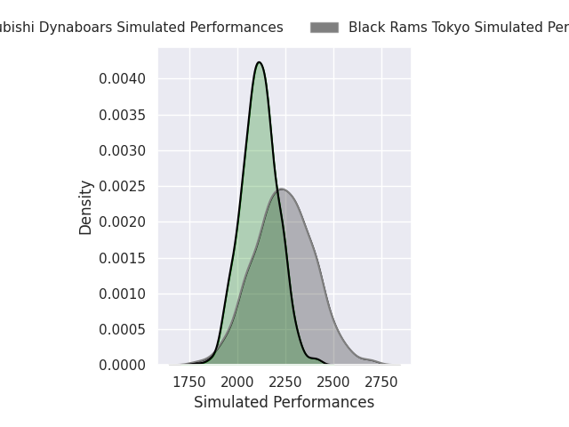
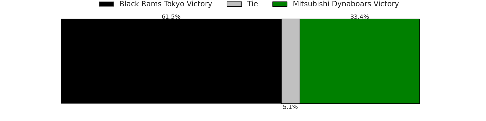
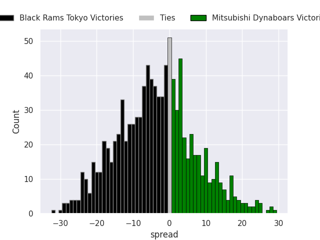

## Week 5

### Kubota Spears V Toyota Verblitz on 2026/01/16

Average Margin: Kubota Spears by 12.7

### Kobelco Kobe Steelers V Black Rams Tokyo on 2026/01/16

Average Margin: Kobelco Kobe Steelers by 6.8

### Yokohama Canon Eagles V Saitama Wild Knights on 2026/01/16

Average Margin: Saitama Wild Knights by 9.1

### Tokyo Sungoliath V Mie Honda Heat on 2026/01/16

Average Margin: Tokyo Sungoliath by 9.1

### Urayasu D-Rocks V Toshiba Brave Lupus on 2026/01/16

Average Margin: Toshiba Brave Lupus by 5.8

### Shizuoka Blue Revs V Mitsubishi Dynaboars on 2026/01/16

Average Margin: Shizuoka Blue Revs by 7.5

## Week 6

### Mie Honda Heat V Urayasu D-Rocks on 2026/01/24

Average Margin: Urayasu D-Rocks by 1.4

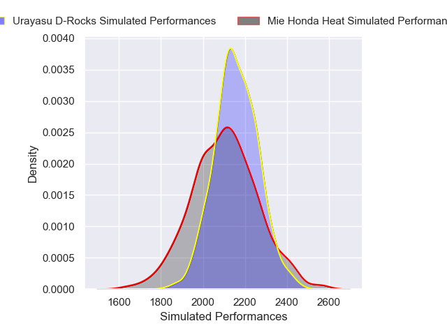

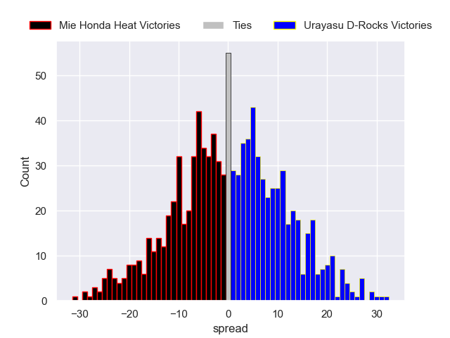

### Saitama Wild Knights V Tokyo Sungoliath on 2026/01/24

Average Margin: Saitama Wild Knights by 7.9

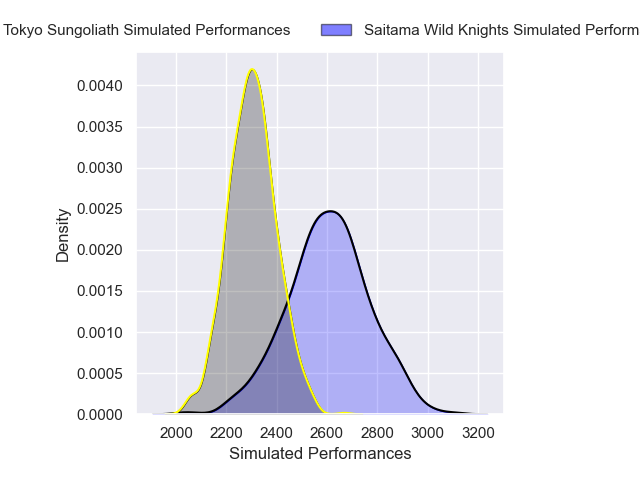
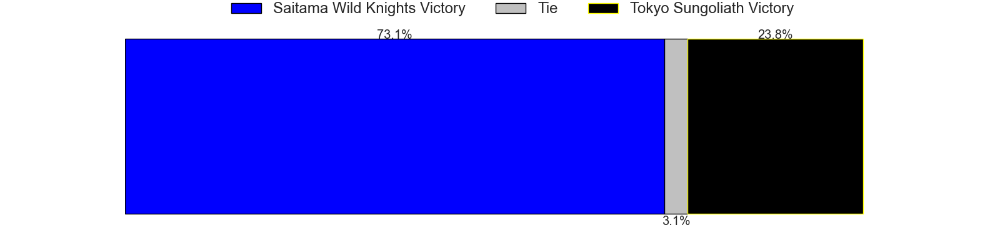
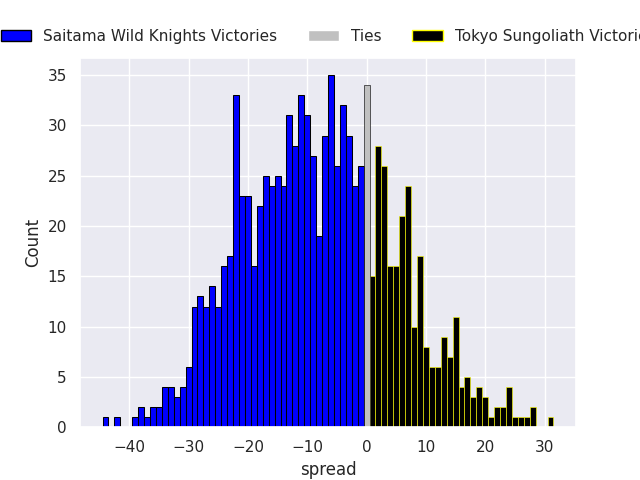

### Toshiba Brave Lupus V Kubota Spears on 2026/01/24

Average Margin: Kubota Spears by 0.0

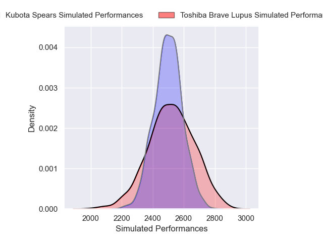
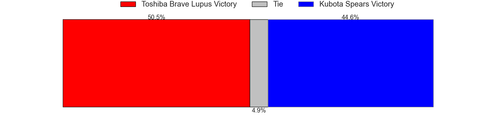

### Yokohama Canon Eagles V Kobelco Kobe Steelers on 2026/01/24

Average Margin: Kobelco Kobe Steelers by 4.1

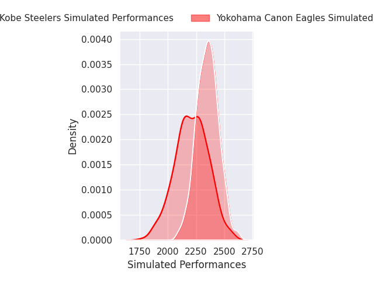
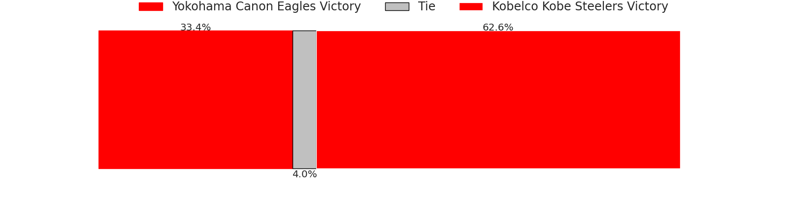
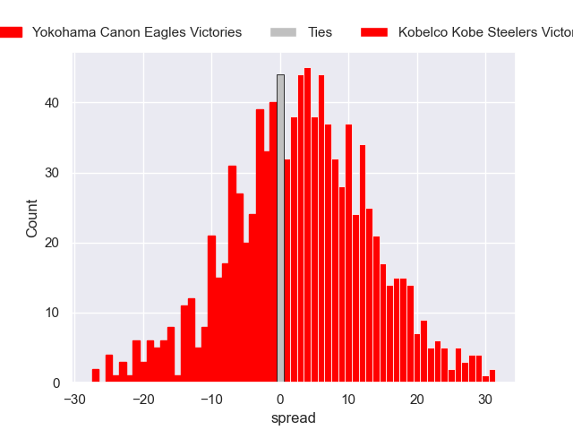

### Mitsubishi Dynaboars V Black Rams Tokyo on 2026/01/24

Average Margin: Mitsubishi Dynaboars by 0.3

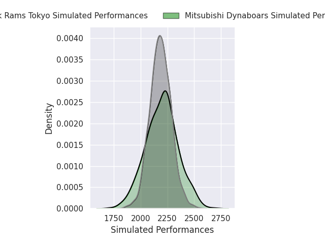

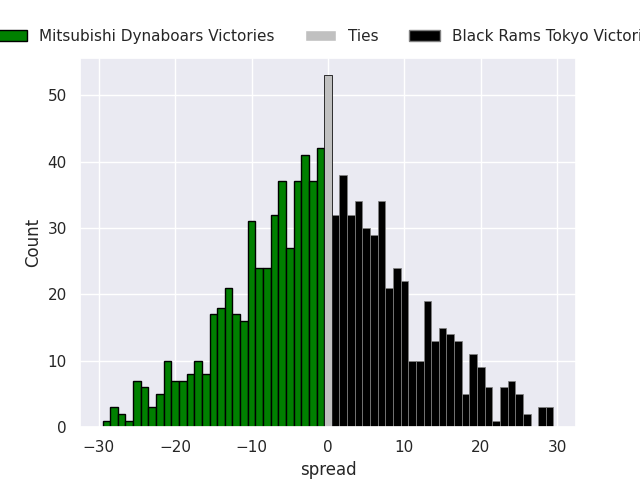

### Shizuoka Blue Revs V Toyota Verblitz on 2026/01/25

Average Margin: Shizuoka Blue Revs by 8.2

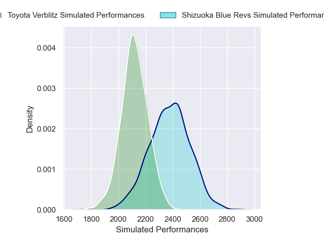
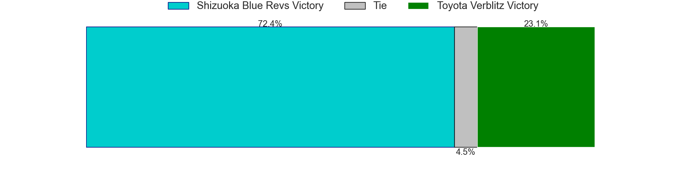
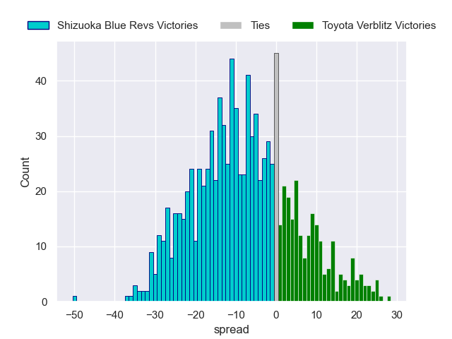

## Week 7

### Kubota Spears V Urayasu D-Rocks on 2026/02/07

Average Margin: Kubota Spears by 10.6

### Kobelco Kobe Steelers V Shizuoka Blue Revs on 2026/02/07

Average Margin: Kobelco Kobe Steelers by 3.0

### Black Rams Tokyo V Saitama Wild Knights on 2026/02/07

Average Margin: Saitama Wild Knights by 6.1

### Mie Honda Heat V Toshiba Brave Lupus on 2026/02/07

Average Margin: Toshiba Brave Lupus by 6.8

### Toyota Verblitz V Yokohama Canon Eagles on 2026/02/07

Average Margin: Toyota Verblitz by 1.6

### Tokyo Sungoliath V Mitsubishi Dynaboars on 2026/02/08

Average Margin: Tokyo Sungoliath by 6.1

## Week 8

### Yokohama Canon Eagles V Black Rams Tokyo on 2026/02/14

Average Margin: Yokohama Canon Eagles by 1.9

### Saitama Wild Knights V Toyota Verblitz on 2026/02/14

Average Margin: Saitama Wild Knights by 11.0

### Shizuoka Blue Revs V Kubota Spears on 2026/02/14

Average Margin: Kubota Spears by 2.9

### Mitsubishi Dynaboars V Mie Honda Heat on 2026/02/14

Average Margin: Mitsubishi Dynaboars by 4.9

### Urayasu D-Rocks V Tokyo Sungoliath on 2026/02/14

Average Margin: Tokyo Sungoliath by 1.3

### Toshiba Brave Lupus V Kobelco Kobe Steelers on 2026/02/15

Average Margin: Toshiba Brave Lupus by 4.0

## Week 9

### Black Rams Tokyo V Urayasu D-Rocks on 2026/02/21

Average Margin: Black Rams Tokyo by 2.7

### Kobelco Kobe Steelers V Saitama Wild Knights on 2026/02/21

Average Margin: Saitama Wild Knights by 1.7

### Toyota Verblitz V Toshiba Brave Lupus on 2026/02/21

Average Margin: Toshiba Brave Lupus by 5.3

### Kubota Spears V Mitsubishi Dynaboars on 2026/02/21

Average Margin: Kubota Spears by 10.7

### Tokyo Sungoliath V Yokohama Canon Eagles on 2026/02/22

Average Margin: Tokyo Sungoliath by 5.7

### Mie Honda Heat V Shizuoka Blue Revs on 2026/02/22

Average Margin: Shizuoka Blue Revs by 3.9

## Week 10

### Toshiba Brave Lupus V Black Rams Tokyo on 2026/02/28

Average Margin: Toshiba Brave Lupus by 7.6

### Urayasu D-Rocks V Kobelco Kobe Steelers on 2026/02/28

Average Margin: Kobelco Kobe Steelers by 1.6

### Saitama Wild Knights V Mie Honda Heat on 2026/02/28

Average Margin: Saitama Wild Knights by 12.6

### Shizuoka Blue Revs V Tokyo Sungoliath on 2026/03/01

Average Margin: Shizuoka Blue Revs by 2.9

### Yokohama Canon Eagles V Kubota Spears on 2026/03/01

Average Margin: Kubota Spears by 4.2

### Mitsubishi Dynaboars V Toyota Verblitz on 2026/03/01

Average Margin: Mitsubishi Dynaboars by 2.6

## Week 11

### Kobelco Kobe Steelers V Mitsubishi Dynaboars on 2026/03/14

Average Margin: Kobelco Kobe Steelers by 6.2

### Black Rams Tokyo V Shizuoka Blue Revs on 2026/03/14

Average Margin: Shizuoka Blue Revs by 0.5

### Mie Honda Heat V Yokohama Canon Eagles on 2026/03/14

Average Margin: Mie Honda Heat by 1.1

### Kubota Spears V Saitama Wild Knights on 2026/03/14

Average Margin: Kubota Spears by 1.9

### Toyota Verblitz V Urayasu D-Rocks on 2026/03/15

Average Margin: Toyota Verblitz by 0.9

### Tokyo Sungoliath V Toshiba Brave Lupus on 2026/03/15

Average Margin: Toshiba Brave Lupus by 0.5

## Week 12

### Kobelco Kobe Steelers V Yokohama Canon Eagles on 2026/03/20

Average Margin: Kobelco Kobe Steelers by 6.7

### Mitsubishi Dynaboars V Tokyo Sungoliath on 2026/03/21

Average Margin: Tokyo Sungoliath by 0.4

### Urayasu D-Rocks V Kubota Spears on 2026/03/21

Average Margin: Kubota Spears by 3.8

### Saitama Wild Knights V Black Rams Tokyo on 2026/03/21

Average Margin: Saitama Wild Knights by 7.9

### Toyota Verblitz V Shizuoka Blue Revs on 2026/03/22

Average Margin: Shizuoka Blue Revs by 1.5

### Toshiba Brave Lupus V Mie Honda Heat on 2026/03/22

Average Margin: Toshiba Brave Lupus by 7.9

## Week 13

### Yokohama Canon Eagles V Toyota Verblitz on 2026/03/28

Average Margin: Yokohama Canon Eagles by 2.1

### Kubota Spears V Toshiba Brave Lupus on 2026/03/28

Average Margin: Kubota Spears by 4.2

### Tokyo Sungoliath V Saitama Wild Knights on 2026/03/28

Average Margin: Saitama Wild Knights by 1.5

### Shizuoka Blue Revs V Kobelco Kobe Steelers on 2026/03/28

Average Margin: Shizuoka Blue Revs by 0.9

### Urayasu D-Rocks V Mie Honda Heat on 2026/03/29

Average Margin: Urayasu D-Rocks by 4.3

### Black Rams Tokyo V Mitsubishi Dynaboars on 2026/03/29

Average Margin: Black Rams Tokyo by 3.0

## Week 14

### Mie Honda Heat V Tokyo Sungoliath on 2026/04/04

Average Margin: Tokyo Sungoliath by 1.9

### Saitama Wild Knights V Yokohama Canon Eagles on 2026/04/04

Average Margin: Saitama Wild Knights by 7.5

### Mitsubishi Dynaboars V Shizuoka Blue Revs on 2026/04/04

Average Margin: Mitsubishi Dynaboars by 0.1

### Toyota Verblitz V Kubota Spears on 2026/04/04

Average Margin: Kubota Spears by 4.0

### Toshiba Brave Lupus V Urayasu D-Rocks on 2026/04/05

Average Margin: Toshiba Brave Lupus by 6.0

### Black Rams Tokyo V Kobelco Kobe Steelers on 2026/04/05

Average Margin: Kobelco Kobe Steelers by 1.0

## Week 15

### Mie Honda Heat V Black Rams Tokyo on 2026/04/17

Average Margin: Mie Honda Heat by 0.3

### Mitsubishi Dynaboars V Toshiba Brave Lupus on 2026/04/18

Average Margin: Toshiba Brave Lupus by 2.6

### Shizuoka Blue Revs V Saitama Wild Knights on 2026/04/18

Average Margin: Saitama Wild Knights by 1.3

### Yokohama Canon Eagles V Urayasu D-Rocks on 2026/04/18

Average Margin: Yokohama Canon Eagles by 1.9

### Tokyo Sungoliath V Kubota Spears on 2026/04/18

Average Margin: Kubota Spears by 1.2

### Toyota Verblitz V Kobelco Kobe Steelers on 2026/04/18

Average Margin: Kobelco Kobe Steelers by 1.2

## Week 16

### Urayasu D-Rocks V Shizuoka Blue Revs on 2026/04/24

Average Margin: Shizuoka Blue Revs by 0.1

### Black Rams Tokyo V Toyota Verblitz on 2026/04/25

Average Margin: Black Rams Tokyo by 2.9

### Toshiba Brave Lupus V Yokohama Canon Eagles on 2026/04/25

Average Margin: Toshiba Brave Lupus by 5.4

### Saitama Wild Knights V Mitsubishi Dynaboars on 2026/04/25

Average Margin: Saitama Wild Knights by 8.3

### Kubota Spears V Mie Honda Heat on 2026/04/25

Average Margin: Kubota Spears by 9.2

### Kobelco Kobe Steelers V Tokyo Sungoliath on 2026/04/25

Average Margin: Kobelco Kobe Steelers by 3.0

## Week 17

### Urayasu D-Rocks V Saitama Wild Knights on 2026/05/01

Average Margin: Saitama Wild Knights by 2.6

### Toyota Verblitz V Tokyo Sungoliath on 2026/05/02

Average Margin: Tokyo Sungoliath by 0.7

### Black Rams Tokyo V Kubota Spears on 2026/05/02

Average Margin: Kubota Spears by 3.2

### Kobelco Kobe Steelers V Mie Honda Heat on 2026/05/02

Average Margin: Kobelco Kobe Steelers by 6.5

### Yokohama Canon Eagles V Mitsubishi Dynaboars on 2026/05/02

Average Margin: Yokohama Canon Eagles by 2.8

### Toshiba Brave Lupus V Shizuoka Blue Revs on 2026/05/02

Average Margin: Toshiba Brave Lupus by 2.8

## Week 18

### Mie Honda Heat V Toyota Verblitz on 2026/05/09

Average Margin: Mie Honda Heat by 0.8

### Saitama Wild Knights V Toshiba Brave Lupus on 2026/05/09

Average Margin: Saitama Wild Knights by 2.5

### Shizuoka Blue Revs V Yokohama Canon Eagles on 2026/05/09

Average Margin: Shizuoka Blue Revs by 4.2

### Kubota Spears V Kobelco Kobe Steelers on 2026/05/10

Average Margin: Kubota Spears by 4.2

### Tokyo Sungoliath V Black Rams Tokyo on 2026/05/10

Average Margin: Tokyo Sungoliath by 4.3

### Mitsubishi Dynaboars V Urayasu D-Rocks on 2026/05/10

Average Margin: Mitsubishi Dynaboars by 1.8

