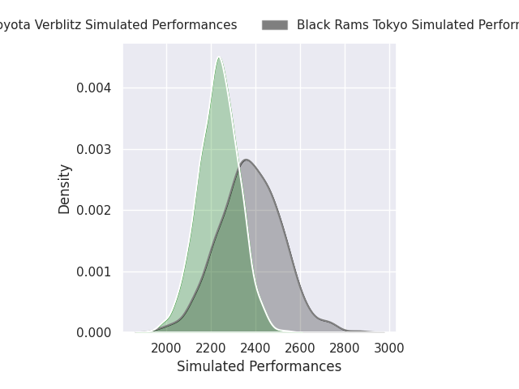
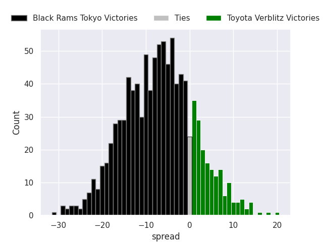

# Team Rankings

# Standings

## Current Standings

| Club                  |   Played |   Wins |   Point Differential |   Losing Bonus Points |   Try Bonus Points |   Competition Points |
|:----------------------|---------:|-------:|---------------------:|----------------------:|-------------------:|---------------------:|
| Saitama Wild Knights  |       15 |     14 |                  248 |                     0 |                  6 |                   62 |
| Kobelco Kobe Steelers |       15 |     13 |                  263 |                     1 |                  4 |                   57 |
| Kubota Spears         |       15 |     12 |                  280 |                     2 |                  5 |                   55 |
| Black Rams Tokyo      |       15 |      9 |                   24 |                     1 |                  2 |                   39 |
| Tokyo Sungoliath      |       14 |      7 |                   94 |                     6 |                  4 |                   38 |
| Toshiba Brave Lupus   |       15 |      7 |                  -87 |                     3 |                  5 |                   36 |
| Shizuoka Blue Revs    |       16 |      6 |                  -59 |                     3 |                  3 |                   30 |
| Mie Honda Heat        |       15 |      6 |                 -110 |                     3 |                  3 |                   30 |
| Toyota Verblitz       |       15 |      6 |                  -28 |                     2 |                  3 |                   29 |
| Yokohama Canon Eagles |       15 |      4 |                 -149 |                     4 |                  1 |                   21 |
| Mitsubishi Dynaboars  |       14 |      3 |                 -176 |                     3 |                  2 |                   17 |
| Urayasu D-Rocks       |       16 |      3 |                 -300 |                     0 |                  2 |                   14 |

## Projected Remaining Table

| Club                  |   To Play |   Projected Wins |   Projected Differential |   Projected Losing Bonus Points | Projected Try Bonus Points   |   Projected Competition Points |
|:----------------------|----------:|-----------------:|-------------------------:|--------------------------------:|:-----------------------------|-------------------------------:|
| Saitama Wild Knights  |         3 |            2.964 |                   65.448 |                           0.023 |                              |                         11.899 |
| Tokyo Sungoliath      |         4 |            2.41  |                   15.242 |                           0.725 |                              |                         10.611 |
| Kubota Spears         |         3 |            2.315 |                   26.946 |                           0.433 |                              |                          9.875 |
| Kobelco Kobe Steelers |         3 |            2.144 |                   23.793 |                           0.428 |                              |                          9.154 |
| Toshiba Brave Lupus   |         3 |            1.413 |                   -6.658 |                           0.485 |                              |                          6.327 |
| Black Rams Tokyo      |         3 |            1.301 |                   -3.57  |                           0.753 |                              |                          6.159 |
| Yokohama Canon Eagles |         3 |            1.137 |                   -6.958 |                           0.74  |                              |                          5.464 |
| Shizuoka Blue Revs    |         2 |            1.16  |                    4.919 |                           0.441 |                              |                          5.223 |
| Mitsubishi Dynaboars  |         4 |            1.087 |                  -38.49  |                           0.551 |                              |                          5.047 |
| Toyota Verblitz       |         3 |            0.966 |                  -10.507 |                           0.962 |                              |                          5.042 |
| Mie Honda Heat        |         3 |            0.533 |                  -36.492 |                           0.461 |                              |                          2.693 |
| Urayasu D-Rocks       |         2 |            0.113 |                  -33.673 |                           0.269 |                              |                          0.777 |

## Projected Total Table

| Club                  |   Played |   Wins |   Point Differential |   Losing Bonus Points |   Try Bonus Points |   Competition Points |
|:----------------------|---------:|-------:|---------------------:|----------------------:|-------------------:|---------------------:|
| Saitama Wild Knights  |       18 | 16.964 |              313.448 |                 0.023 |                  6 |               73.899 |
| Kobelco Kobe Steelers |       18 | 15.144 |              286.793 |                 1.428 |                  4 |               66.154 |
| Kubota Spears         |       18 | 14.315 |              306.946 |                 2.433 |                  5 |               64.875 |
| Tokyo Sungoliath      |       18 |  9.41  |              109.242 |                 6.725 |                  4 |               48.611 |
| Black Rams Tokyo      |       18 | 10.301 |               20.43  |                 1.753 |                  2 |               45.159 |
| Toshiba Brave Lupus   |       18 |  8.413 |              -93.658 |                 3.485 |                  5 |               42.327 |
| Shizuoka Blue Revs    |       18 |  7.16  |              -54.081 |                 3.441 |                  3 |               35.223 |
| Toyota Verblitz       |       18 |  6.966 |              -38.507 |                 2.962 |                  3 |               34.042 |
| Mie Honda Heat        |       18 |  6.533 |             -146.492 |                 3.461 |                  3 |               32.693 |
| Yokohama Canon Eagles |       18 |  5.137 |             -155.958 |                 4.74  |                  1 |               26.464 |
| Mitsubishi Dynaboars  |       18 |  4.087 |             -214.49  |                 3.551 |                  2 |               22.047 |
| Urayasu D-Rocks       |       18 |  3.113 |             -333.673 |                 0.269 |                  2 |               14.777 |

# Completed Match Review

| Model | Percent Correct Predictions | Spread Error |
| ------ | ------ | ------ |
| Club Level | 71.3% | 12.5 |
| Player Level: Lineup | nan% | nan |
| Player Level: Minutes | nan% | nan |

# Future Predictions

## Week 17

### Tokyo Sungoliath V Mitsubishi Dynaboars on 2026/02/07

Average Margin: Tokyo Sungoliath by 15.4

## Week 18

### Kobelco Kobe Steelers V Tokyo Sungoliath on 2026/04/25

Average Margin: Kobelco Kobe Steelers by 8.9

### Kubota Spears V Mie Honda Heat on 2026/04/25

Average Margin: Kubota Spears by 18.4

### Saitama Wild Knights V Mitsubishi Dynaboars on 2026/04/25

Average Margin: Saitama Wild Knights by 25.3

### Toshiba Brave Lupus V Yokohama Canon Eagles on 2026/04/25

Average Margin: Toshiba Brave Lupus by 7.1

### Black Rams Tokyo V Toyota Verblitz on 2026/04/26

Average Margin: Black Rams Tokyo by 7.1

## Week 19

### Urayasu D-Rocks V Saitama Wild Knights on 2026/05/01

Average Margin: Saitama Wild Knights by 23.6

### Black Rams Tokyo V Kubota Spears on 2026/05/02

Average Margin: Kubota Spears by 4.6

### Kobelco Kobe Steelers V Mie Honda Heat on 2026/05/02

Average Margin: Kobelco Kobe Steelers by 18.8

### Yokohama Canon Eagles V Mitsubishi Dynaboars on 2026/05/02

Average Margin: Yokohama Canon Eagles by 7.8

### Toyota Verblitz V Tokyo Sungoliath on 2026/05/02

Average Margin: Tokyo Sungoliath by 2.7

### Toshiba Brave Lupus V Shizuoka Blue Revs on 2026/05/02

Average Margin: Toshiba Brave Lupus by 2.8

## Week 20

### Mie Honda Heat V Toyota Verblitz on 2026/05/09

Average Margin: Mie Honda Heat by 0.7

### Shizuoka Blue Revs V Yokohama Canon Eagles on 2026/05/09

Average Margin: Shizuoka Blue Revs by 7.7

### Saitama Wild Knights V Toshiba Brave Lupus on 2026/05/09

Average Margin: Saitama Wild Knights by 16.5

### Kubota Spears V Kobelco Kobe Steelers on 2026/05/10

Average Margin: Kubota Spears by 3.9

### Tokyo Sungoliath V Black Rams Tokyo on 2026/05/10

Average Margin: Tokyo Sungoliath by 6.1

### Mitsubishi Dynaboars V Urayasu D-Rocks on 2026/05/10

Average Margin: Mitsubishi Dynaboars by 10.1

