# Team Rankings

# Standings

## Current Standings

| Club                  |   Played |   Wins |   Point Differential |   Losing Bonus Points |   Try Bonus Points |   Competition Points |
|:----------------------|---------:|-------:|---------------------:|----------------------:|-------------------:|---------------------:|
| Saitama Wild Knights  |        7 |      7 |                  146 |                     0 |                  6 |                   34 |
| Kubota Spears         |        7 |      6 |                  169 |                     1 |                  5 |                   30 |
| Kobelco Kobe Steelers |        7 |      6 |                   89 |                     1 |                  4 |                   29 |
| Toshiba Brave Lupus   |        7 |      5 |                   14 |                     1 |                  5 |                   26 |
| Tokyo Sungoliath      |        6 |      3 |                  -15 |                     2 |                  4 |                   18 |
| Shizuoka Blue Revs    |        7 |      3 |                    0 |                     1 |                  3 |                   16 |
| Black Rams Tokyo      |        7 |      3 |                  -68 |                     1 |                  2 |                   15 |
| Urayasu D-Rocks       |        7 |      3 |                  -50 |                     0 |                  2 |                   14 |
| Mie Honda Heat        |        7 |      2 |                  -44 |                     2 |                  3 |                   13 |
| Yokohama Canon Eagles |        7 |      1 |                  -76 |                     3 |                  1 |                    8 |
| Toyota Verblitz       |        7 |      1 |                  -94 |                     1 |                  3 |                    8 |
| Mitsubishi Dynaboars  |        6 |      1 |                  -71 |                     1 |                  2 |                    7 |

## Projected Remaining Table

| Club                  |   To Play |   Projected Wins |   Projected Differential |   Projected Losing Bonus Points | Projected Try Bonus Points   |   Projected Competition Points |
|:----------------------|----------:|-----------------:|-------------------------:|--------------------------------:|:-----------------------------|-------------------------------:|
| Kubota Spears         |        11 |            7.238 |                   63.322 |                           1.852 |                              |                         31.666 |
| Saitama Wild Knights  |        11 |            7.107 |                   66.049 |                           1.785 |                              |                         31.075 |
| Toshiba Brave Lupus   |        11 |            6.6   |                   39.101 |                           2.048 |                              |                         29.29  |
| Tokyo Sungoliath      |        12 |            6.226 |                   16.736 |                           2.684 |                              |                         28.6   |
| Kobelco Kobe Steelers |        11 |            6.319 |                   30.335 |                           2.094 |                              |                         28.258 |
| Shizuoka Blue Revs    |        11 |            5.407 |                    4.639 |                           2.604 |                              |                         25.27  |
| Black Rams Tokyo      |        11 |            4.731 |                  -17.149 |                           2.454 |                              |                         22.324 |
| Mitsubishi Dynaboars  |        12 |            4.433 |                  -48.917 |                           2.53  |                              |                         21.258 |
| Yokohama Canon Eagles |        11 |            4.378 |                  -30.617 |                           2.383 |                              |                         20.793 |
| Mie Honda Heat        |        11 |            4.289 |                  -32.867 |                           2.548 |                              |                         20.598 |
| Urayasu D-Rocks       |        11 |            4.037 |                  -33.61  |                           2.746 |                              |                         19.918 |
| Toyota Verblitz       |        11 |            3.456 |                  -57.022 |                           2.652 |                              |                         17.33  |

## Projected Total Table

| Club                  |   Played |   Wins |   Point Differential |   Losing Bonus Points |   Try Bonus Points |   Competition Points |
|:----------------------|---------:|-------:|---------------------:|----------------------:|-------------------:|---------------------:|
| Saitama Wild Knights  |       18 | 14.107 |              212.049 |                 1.785 |                  6 |               65.075 |
| Kubota Spears         |       18 | 13.238 |              232.322 |                 2.852 |                  5 |               61.666 |
| Kobelco Kobe Steelers |       18 | 12.319 |              119.335 |                 3.094 |                  4 |               57.258 |
| Toshiba Brave Lupus   |       18 | 11.6   |               53.101 |                 3.048 |                  5 |               55.29  |
| Tokyo Sungoliath      |       18 |  9.226 |                1.736 |                 4.684 |                  4 |               46.6   |
| Shizuoka Blue Revs    |       18 |  8.407 |                4.639 |                 3.604 |                  3 |               41.27  |
| Black Rams Tokyo      |       18 |  7.731 |              -85.149 |                 3.454 |                  2 |               37.324 |
| Urayasu D-Rocks       |       18 |  7.037 |              -83.61  |                 2.746 |                  2 |               33.918 |
| Mie Honda Heat        |       18 |  6.289 |              -76.867 |                 4.548 |                  3 |               33.598 |
| Yokohama Canon Eagles |       18 |  5.378 |             -106.617 |                 5.383 |                  1 |               28.793 |
| Mitsubishi Dynaboars  |       18 |  5.433 |             -119.917 |                 3.53  |                  2 |               28.258 |
| Toyota Verblitz       |       18 |  4.456 |             -151.022 |                 3.652 |                  3 |               25.33  |

# Completed Match Review

| Model | Percent Correct Predictions | Spread Error |
| ------ | ------ | ------ |
| Club Level | 74.1% | 8.6 |
| Player Level: Lineup | nan% | nan |
| Player Level: Minutes | nan% | nan |

# Future Predictions

## Week 8

### Tokyo Sungoliath V Mitsubishi Dynaboars on 2026/02/07

Average Margin: Tokyo Sungoliath by 8.5

## Week 9

### Mitsubishi Dynaboars V Mie Honda Heat on 2026/02/13

Average Margin: Mitsubishi Dynaboars by 2.3

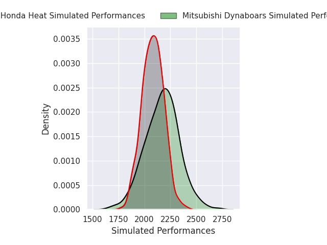
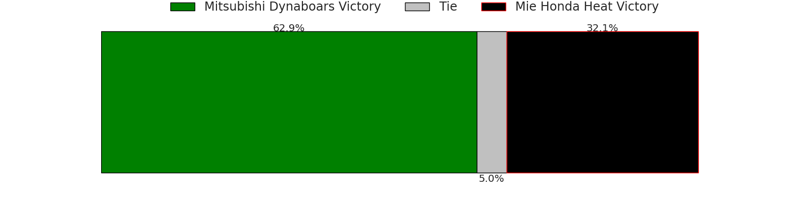
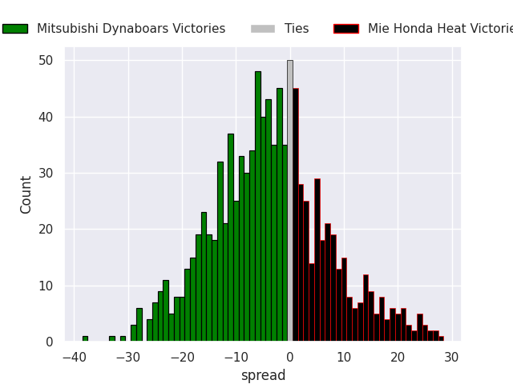

### Yokohama Canon Eagles V Black Rams Tokyo on 2026/02/13

Average Margin: Yokohama Canon Eagles by 0.7

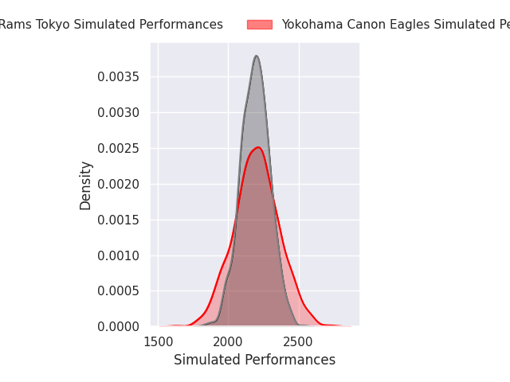
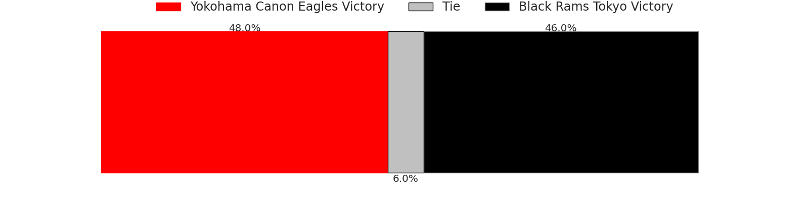
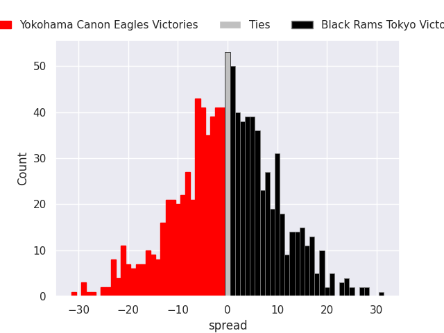

### Saitama Wild Knights V Toyota Verblitz on 2026/02/13

Average Margin: Saitama Wild Knights by 14.7

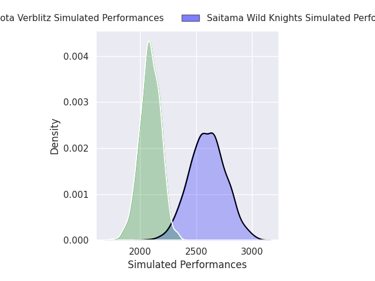
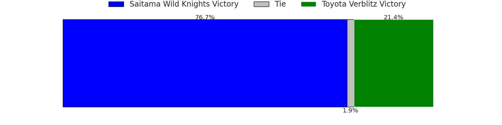
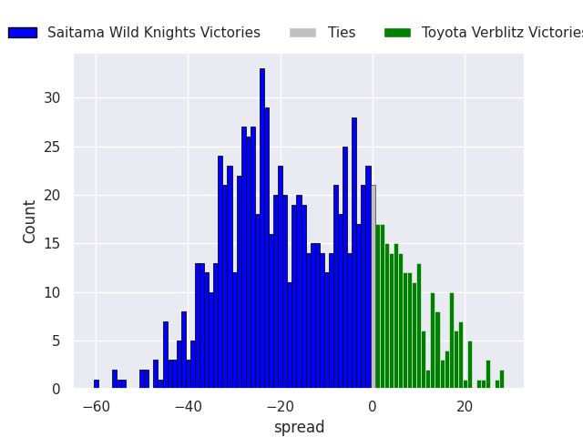

### Urayasu D-Rocks V Tokyo Sungoliath on 2026/02/13

Average Margin: Tokyo Sungoliath by 2.5

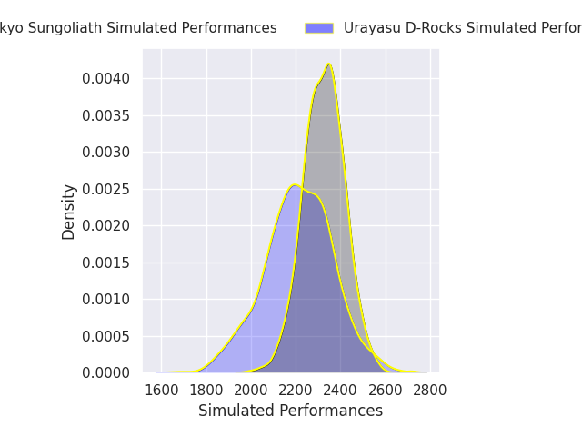
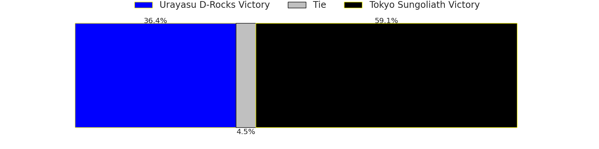
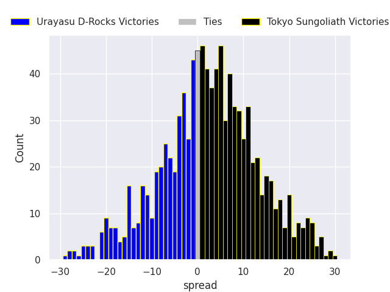

### Shizuoka Blue Revs V Kubota Spears on 2026/02/13

Average Margin: Kubota Spears by 3.9

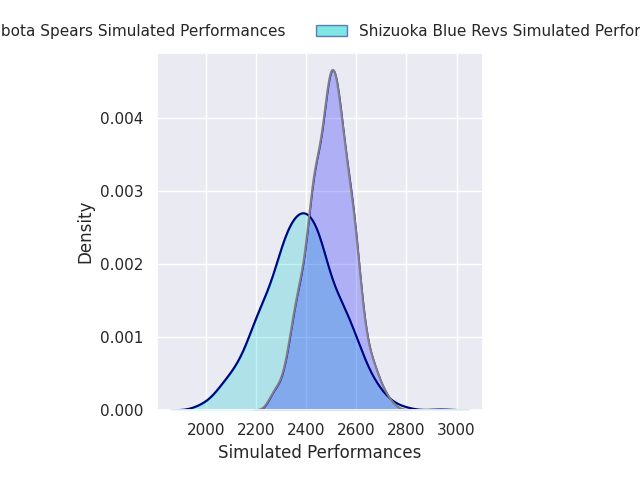
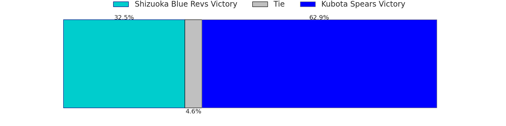
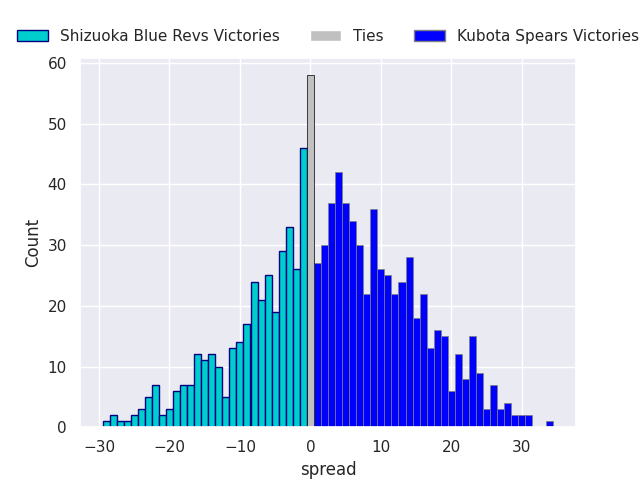

### Toshiba Brave Lupus V Kobelco Kobe Steelers on 2026/02/14

Average Margin: Toshiba Brave Lupus by 2.9

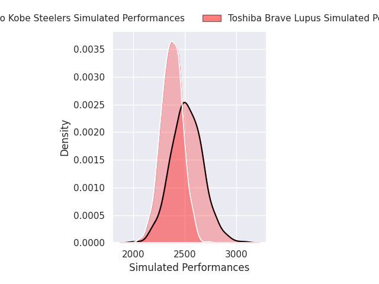
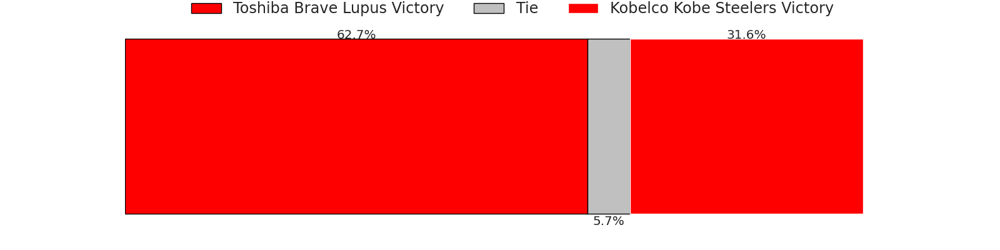
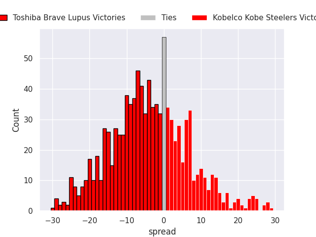

## Week 10

### Toyota Verblitz V Toshiba Brave Lupus on 2026/02/20

Average Margin: Toshiba Brave Lupus by 7.4

### Black Rams Tokyo V Urayasu D-Rocks on 2026/02/20

Average Margin: Black Rams Tokyo by 3.7

### Kubota Spears V Mitsubishi Dynaboars on 2026/02/20

Average Margin: Kubota Spears by 13.5

### Kobelco Kobe Steelers V Saitama Wild Knights on 2026/02/20

Average Margin: Saitama Wild Knights by 0.8

### Mie Honda Heat V Shizuoka Blue Revs on 2026/02/21

Average Margin: Shizuoka Blue Revs by 2.3

### Tokyo Sungoliath V Yokohama Canon Eagles on 2026/02/21

Average Margin: Tokyo Sungoliath by 6.2

## Week 11

### Saitama Wild Knights V Mie Honda Heat on 2026/02/28

Average Margin: Saitama Wild Knights by 11.1

### Toshiba Brave Lupus V Black Rams Tokyo on 2026/02/28

Average Margin: Toshiba Brave Lupus by 7.4

### Urayasu D-Rocks V Kobelco Kobe Steelers on 2026/02/28

Average Margin: Kobelco Kobe Steelers by 4.8

### Shizuoka Blue Revs V Tokyo Sungoliath on 2026/03/01

Average Margin: Shizuoka Blue Revs by 2.0

### Yokohama Canon Eagles V Kubota Spears on 2026/03/01

Average Margin: Kubota Spears by 6.3

### Mitsubishi Dynaboars V Toyota Verblitz on 2026/03/01

Average Margin: Mitsubishi Dynaboars by 3.7

## Week 12

### Kobelco Kobe Steelers V Mitsubishi Dynaboars on 2026/03/14

Average Margin: Kobelco Kobe Steelers by 9.3

### Kubota Spears V Saitama Wild Knights on 2026/03/14

Average Margin: Kubota Spears by 2.0

### Mie Honda Heat V Yokohama Canon Eagles on 2026/03/14

Average Margin: Mie Honda Heat by 2.5

### Black Rams Tokyo V Shizuoka Blue Revs on 2026/03/14

Average Margin: Shizuoka Blue Revs by 0.3

### Tokyo Sungoliath V Toshiba Brave Lupus on 2026/03/15

Average Margin: Toshiba Brave Lupus by 0.7

### Toyota Verblitz V Urayasu D-Rocks on 2026/03/15

Average Margin: Toyota Verblitz by 0.5

## Week 13

### Kobelco Kobe Steelers V Yokohama Canon Eagles on 2026/03/20

Average Margin: Kobelco Kobe Steelers by 7.6

### Saitama Wild Knights V Black Rams Tokyo on 2026/03/21

Average Margin: Saitama Wild Knights by 9.4

### Mitsubishi Dynaboars V Tokyo Sungoliath on 2026/03/21

Average Margin: Tokyo Sungoliath by 2.4

### Urayasu D-Rocks V Kubota Spears on 2026/03/21

Average Margin: Kubota Spears by 6.4

### Toyota Verblitz V Shizuoka Blue Revs on 2026/03/22

Average Margin: Shizuoka Blue Revs by 4.0

### Toshiba Brave Lupus V Mie Honda Heat on 2026/03/22

Average Margin: Toshiba Brave Lupus by 7.5

## Week 14

### Tokyo Sungoliath V Saitama Wild Knights on 2026/03/28

Average Margin: Saitama Wild Knights by 2.9

### Shizuoka Blue Revs V Kobelco Kobe Steelers on 2026/03/28

Average Margin: Kobelco Kobe Steelers by 0.2

### Yokohama Canon Eagles V Toyota Verblitz on 2026/03/28

Average Margin: Yokohama Canon Eagles by 4.7

### Kubota Spears V Toshiba Brave Lupus on 2026/03/28

Average Margin: Kubota Spears by 4.9

### Black Rams Tokyo V Mitsubishi Dynaboars on 2026/03/29

Average Margin: Black Rams Tokyo by 4.2

### Urayasu D-Rocks V Mie Honda Heat on 2026/03/29

Average Margin: Urayasu D-Rocks by 1.4

## Week 15

### Mitsubishi Dynaboars V Shizuoka Blue Revs on 2026/04/04

Average Margin: Shizuoka Blue Revs by 1.2

### Toyota Verblitz V Kubota Spears on 2026/04/04

Average Margin: Kubota Spears by 7.3

### Saitama Wild Knights V Yokohama Canon Eagles on 2026/04/04

Average Margin: Saitama Wild Knights by 8.2

### Mie Honda Heat V Tokyo Sungoliath on 2026/04/04

Average Margin: Tokyo Sungoliath by 1.1

### Toshiba Brave Lupus V Urayasu D-Rocks on 2026/04/05

Average Margin: Toshiba Brave Lupus by 7.5

### Black Rams Tokyo V Kobelco Kobe Steelers on 2026/04/05

Average Margin: Kobelco Kobe Steelers by 2.0

## Week 16

### Mie Honda Heat V Black Rams Tokyo on 2026/04/17

Average Margin: Mie Honda Heat by 1.7

### Mitsubishi Dynaboars V Toshiba Brave Lupus on 2026/04/18

Average Margin: Toshiba Brave Lupus by 4.2

### Tokyo Sungoliath V Kubota Spears on 2026/04/18

Average Margin: Kubota Spears by 2.4

### Shizuoka Blue Revs V Saitama Wild Knights on 2026/04/18

Average Margin: Saitama Wild Knights by 2.8

### Yokohama Canon Eagles V Urayasu D-Rocks on 2026/04/18

Average Margin: Yokohama Canon Eagles by 3.0

### Toyota Verblitz V Kobelco Kobe Steelers on 2026/04/18

Average Margin: Kobelco Kobe Steelers by 4.4

## Week 17

### Urayasu D-Rocks V Shizuoka Blue Revs on 2026/04/24

Average Margin: Shizuoka Blue Revs by 1.0

### Saitama Wild Knights V Mitsubishi Dynaboars on 2026/04/25

Average Margin: Saitama Wild Knights by 10.8

### Black Rams Tokyo V Toyota Verblitz on 2026/04/25

Average Margin: Black Rams Tokyo by 4.9

### Kobelco Kobe Steelers V Tokyo Sungoliath on 2026/04/25

Average Margin: Kobelco Kobe Steelers by 3.7

### Kubota Spears V Mie Honda Heat on 2026/04/25

Average Margin: Kubota Spears by 9.0

### Toshiba Brave Lupus V Yokohama Canon Eagles on 2026/04/25

Average Margin: Toshiba Brave Lupus by 7.0

## Week 18

### Urayasu D-Rocks V Saitama Wild Knights on 2026/05/01

Average Margin: Saitama Wild Knights by 3.7

### Kobelco Kobe Steelers V Mie Honda Heat on 2026/05/02

Average Margin: Kobelco Kobe Steelers by 5.9

### Black Rams Tokyo V Kubota Spears on 2026/05/02

Average Margin: Kubota Spears by 3.7

### Toyota Verblitz V Tokyo Sungoliath on 2026/05/02

Average Margin: Tokyo Sungoliath by 2.9

### Yokohama Canon Eagles V Mitsubishi Dynaboars on 2026/05/02

Average Margin: Yokohama Canon Eagles by 2.8

### Toshiba Brave Lupus V Shizuoka Blue Revs on 2026/05/02

Average Margin: Toshiba Brave Lupus by 3.1

## Week 19

### Shizuoka Blue Revs V Yokohama Canon Eagles on 2026/05/09

Average Margin: Shizuoka Blue Revs by 3.9

### Saitama Wild Knights V Toshiba Brave Lupus on 2026/05/09

Average Margin: Saitama Wild Knights by 3.8

### Mie Honda Heat V Toyota Verblitz on 2026/05/09

Average Margin: Mie Honda Heat by 3.4

### Kubota Spears V Kobelco Kobe Steelers on 2026/05/10

Average Margin: Kubota Spears by 3.9

### Tokyo Sungoliath V Black Rams Tokyo on 2026/05/10

Average Margin: Tokyo Sungoliath by 4.8

### Mitsubishi Dynaboars V Urayasu D-Rocks on 2026/05/10

Average Margin: Mitsubishi Dynaboars by 1.9

