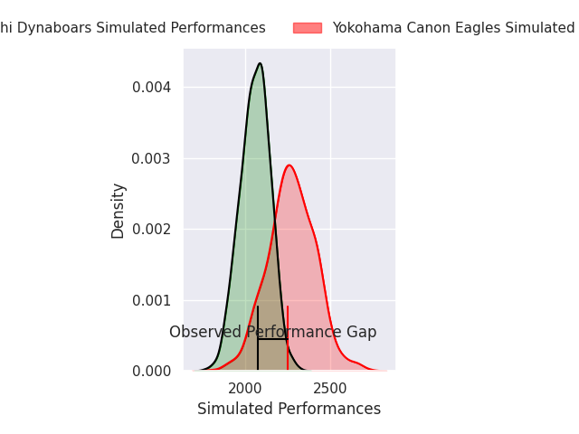
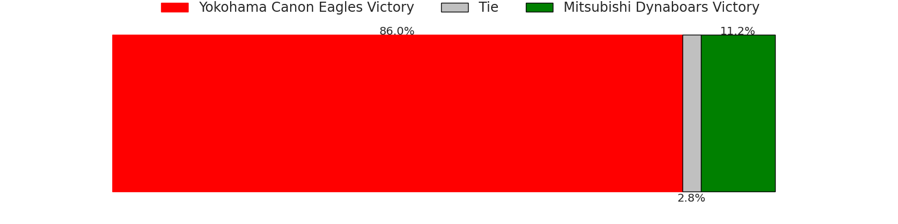
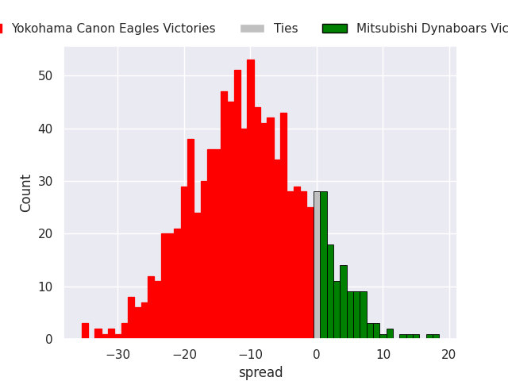

# Team Rankings

# Standings

## Current Standings

| Club                  |   Played |   Wins |   Point Differential |   Losing Bonus Points |   Try Bonus Points |   Competition Points |
|:----------------------|---------:|-------:|---------------------:|----------------------:|-------------------:|---------------------:|
| Saitama Wild Knights  |       17 |     15 |                  283 |                     1 |                  6 |                   67 |
| Kobelco Kobe Steelers |       16 |     14 |                  284 |                     1 |                  4 |                   61 |
| Kubota Spears         |       16 |     13 |                  313 |                     2 |                  5 |                   59 |
| Black Rams Tokyo      |       16 |      9 |                   12 |                     1 |                  2 |                   39 |
| Tokyo Sungoliath      |       15 |      7 |                   73 |                     6 |                  4 |                   38 |
| Toshiba Brave Lupus   |       16 |      7 |                 -111 |                     3 |                  5 |                   36 |
| Toyota Verblitz       |       16 |      7 |                  -16 |                     2 |                  3 |                   33 |
| Shizuoka Blue Revs    |       16 |      6 |                  -59 |                     3 |                  3 |                   30 |
| Mie Honda Heat        |       16 |      6 |                 -143 |                     3 |                  3 |                   30 |
| Yokohama Canon Eagles |       16 |      5 |                 -125 |                     4 |                  1 |                   25 |
| Urayasu D-Rocks       |       17 |      4 |                 -297 |                     0 |                  2 |                   18 |
| Mitsubishi Dynaboars  |       15 |      3 |                 -214 |                     3 |                  2 |                   17 |

## Projected Remaining Table

| Club                  |   To Play |   Projected Wins |   Projected Differential |   Projected Losing Bonus Points | Projected Try Bonus Points   |   Projected Competition Points |
|:----------------------|----------:|-----------------:|-------------------------:|--------------------------------:|:-----------------------------|-------------------------------:|
| Tokyo Sungoliath      |         3 |            2.195 |                   22.338 |                           0.501 |                              |                          9.449 |
| Kubota Spears         |         2 |            1.385 |                   10.22  |                           0.382 |                              |                          6.088 |
| Kobelco Kobe Steelers |         2 |            1.327 |                   16.736 |                           0.303 |                              |                          5.717 |
| Shizuoka Blue Revs    |         2 |            1.178 |                    5.204 |                           0.515 |                              |                          5.375 |
| Yokohama Canon Eagles |         2 |            1.091 |                    4.851 |                           0.435 |                              |                          4.933 |
| Toyota Verblitz       |         2 |            0.964 |                    0.368 |                           0.579 |                              |                          4.639 |
| Mitsubishi Dynaboars  |         3 |            0.973 |                  -17.767 |                           0.505 |                              |                          4.535 |
| Saitama Wild Knights  |         1 |            0.964 |                   17.259 |                           0.024 |                              |                          3.898 |
| Toshiba Brave Lupus   |         2 |            0.544 |                  -17.032 |                           0.375 |                              |                          2.639 |
| Black Rams Tokyo      |         2 |            0.398 |                  -13.701 |                           0.593 |                              |                          2.307 |
| Mie Honda Heat        |         2 |            0.448 |                  -20.653 |                           0.345 |                              |                          2.253 |
| Urayasu D-Rocks       |         1 |            0.165 |                   -7.823 |                           0.298 |                              |                          1.022 |

## Projected Total Table

| Club                  |   Played |   Wins |   Point Differential |   Losing Bonus Points |   Try Bonus Points |   Competition Points |
|:----------------------|---------:|-------:|---------------------:|----------------------:|-------------------:|---------------------:|
| Saitama Wild Knights  |       18 | 15.964 |              300.259 |                 1.024 |                  6 |               70.898 |
| Kobelco Kobe Steelers |       18 | 15.327 |              300.736 |                 1.303 |                  4 |               66.717 |
| Kubota Spears         |       18 | 14.385 |              323.22  |                 2.382 |                  5 |               65.088 |
| Tokyo Sungoliath      |       18 |  9.195 |               95.338 |                 6.501 |                  4 |               47.449 |
| Black Rams Tokyo      |       18 |  9.398 |               -1.701 |                 1.593 |                  2 |               41.307 |
| Toshiba Brave Lupus   |       18 |  7.544 |             -128.032 |                 3.375 |                  5 |               38.639 |
| Toyota Verblitz       |       18 |  7.964 |              -15.632 |                 2.579 |                  3 |               37.639 |
| Shizuoka Blue Revs    |       18 |  7.178 |              -53.796 |                 3.515 |                  3 |               35.375 |
| Mie Honda Heat        |       18 |  6.448 |             -163.653 |                 3.345 |                  3 |               32.253 |
| Yokohama Canon Eagles |       18 |  6.091 |             -120.149 |                 4.435 |                  1 |               29.933 |
| Mitsubishi Dynaboars  |       18 |  3.973 |             -231.767 |                 3.505 |                  2 |               21.535 |
| Urayasu D-Rocks       |       18 |  4.165 |             -304.823 |                 0.298 |                  2 |               19.022 |

# Completed Match Review

| Model | Percent Correct Predictions | Spread Error |
| ------ | ------ | ------ |
| Club Level | 68.5% | 13.4 |
| Player Level: Lineup | nan% | nan |
| Player Level: Minutes | nan% | nan |

# Future Predictions

## Week 18

### Tokyo Sungoliath V Mitsubishi Dynaboars on 2026/02/07

Average Margin: Tokyo Sungoliath by 15.3

## Week 19

### Black Rams Tokyo V Kubota Spears on 2026/05/02

Average Margin: Kubota Spears by 6.9

### Toyota Verblitz V Tokyo Sungoliath on 2026/05/02

Average Margin: Tokyo Sungoliath by 0.2

### Kobelco Kobe Steelers V Mie Honda Heat on 2026/05/02

Average Margin: Kobelco Kobe Steelers by 20.1

### Toshiba Brave Lupus V Shizuoka Blue Revs on 2026/05/02

Average Margin: Toshiba Brave Lupus by 0.2

### Yokohama Canon Eagles V Mitsubishi Dynaboars on 2026/05/03

Average Margin: Yokohama Canon Eagles by 10.3

## Week 20

### Saitama Wild Knights V Toshiba Brave Lupus on 2026/05/09

Average Margin: Saitama Wild Knights by 17.3

### Mie Honda Heat V Toyota Verblitz on 2026/05/09

Average Margin: Toyota Verblitz by 0.6

### Shizuoka Blue Revs V Yokohama Canon Eagles on 2026/05/09

Average Margin: Shizuoka Blue Revs by 5.4

### Mitsubishi Dynaboars V Urayasu D-Rocks on 2026/05/10

Average Margin: Mitsubishi Dynaboars by 7.8

### Kubota Spears V Kobelco Kobe Steelers on 2026/05/10

Average Margin: Kubota Spears by 3.3

### Tokyo Sungoliath V Black Rams Tokyo on 2026/05/10

Average Margin: Tokyo Sungoliath by 6.8

