# Team Rankings

# Standings

## Current Standings

| Club                  |   Played |   Wins |   Point Differential |   Losing Bonus Points |   Try Bonus Points |   Competition Points |
|:----------------------|---------:|-------:|---------------------:|----------------------:|-------------------:|---------------------:|
| Kubota Spears         |        9 |      8 |                  208 |                     1 |                  5 |                   38 |
| Saitama Wild Knights  |        9 |      8 |                  136 |                     0 |                  6 |                   38 |
| Kobelco Kobe Steelers |        9 |      8 |                  106 |                     1 |                  4 |                   37 |
| Toshiba Brave Lupus   |        9 |      5 |                  -18 |                     2 |                  5 |                   27 |
| Tokyo Sungoliath      |        8 |      5 |                   39 |                     2 |                  4 |                   26 |
| Black Rams Tokyo      |        9 |      5 |                  -24 |                     1 |                  2 |                   23 |
| Shizuoka Blue Revs    |        9 |      3 |                  -28 |                     2 |                  3 |                   17 |
| Mie Honda Heat        |        9 |      3 |                  -49 |                     2 |                  3 |                   17 |
| Urayasu D-Rocks       |        9 |      3 |                  -94 |                     0 |                  2 |                   14 |
| Toyota Verblitz       |        9 |      2 |                  -69 |                     2 |                  3 |                   13 |
| Mitsubishi Dynaboars  |        8 |      2 |                  -77 |                     1 |                  2 |                   11 |
| Yokohama Canon Eagles |        9 |      1 |                 -130 |                     3 |                  1 |                    8 |

## Projected Remaining Table

| Club                  |   To Play |   Projected Wins |   Projected Differential |   Projected Losing Bonus Points | Projected Try Bonus Points   |   Projected Competition Points |
|:----------------------|----------:|-----------------:|-------------------------:|--------------------------------:|:-----------------------------|-------------------------------:|
| Kubota Spears         |         9 |            6.101 |                   56.309 |                           1.389 |                              |                         26.413 |
| Tokyo Sungoliath      |        10 |            5.406 |                   18.566 |                           2.133 |                              |                         24.683 |
| Kobelco Kobe Steelers |         9 |            5.551 |                   42.822 |                           1.624 |                              |                         24.552 |
| Saitama Wild Knights  |         9 |            5.559 |                   45.258 |                           1.565 |                              |                         24.477 |
| Toshiba Brave Lupus   |         9 |            4.915 |                   18.35  |                           1.701 |                              |                         22.083 |
| Shizuoka Blue Revs    |         9 |            4.078 |                   -5.475 |                           2.25  |                              |                         19.368 |
| Black Rams Tokyo      |         9 |            4.079 |                   -8.967 |                           1.94  |                              |                         18.99  |
| Mitsubishi Dynaboars  |        10 |            3.779 |                  -36.913 |                           2.182 |                              |                         18.108 |
| Toyota Verblitz       |         9 |            3.612 |                  -18.093 |                           2.247 |                              |                         17.517 |
| Mie Honda Heat        |         9 |            3.49  |                  -33.457 |                           1.891 |                              |                         16.549 |
| Yokohama Canon Eagles |         9 |            3.19  |                  -40.852 |                           1.891 |                              |                         15.335 |
| Urayasu D-Rocks       |         9 |            2.994 |                  -37.548 |                           2.196 |                              |                         14.934 |

## Projected Total Table

| Club                  |   Played |   Wins |   Point Differential |   Losing Bonus Points |   Try Bonus Points |   Competition Points |
|:----------------------|---------:|-------:|---------------------:|----------------------:|-------------------:|---------------------:|
| Kubota Spears         |       18 | 14.101 |              264.309 |                 2.389 |                  5 |               64.413 |
| Saitama Wild Knights  |       18 | 13.559 |              181.258 |                 1.565 |                  6 |               62.477 |
| Kobelco Kobe Steelers |       18 | 13.551 |              148.822 |                 2.624 |                  4 |               61.552 |
| Tokyo Sungoliath      |       18 | 10.406 |               57.566 |                 4.133 |                  4 |               50.683 |
| Toshiba Brave Lupus   |       18 |  9.915 |                0.35  |                 3.701 |                  5 |               49.083 |
| Black Rams Tokyo      |       18 |  9.079 |              -32.967 |                 2.94  |                  2 |               41.99  |
| Shizuoka Blue Revs    |       18 |  7.078 |              -33.475 |                 4.25  |                  3 |               36.368 |
| Mie Honda Heat        |       18 |  6.49  |              -82.457 |                 3.891 |                  3 |               33.549 |
| Toyota Verblitz       |       18 |  5.612 |              -87.093 |                 4.247 |                  3 |               30.517 |
| Mitsubishi Dynaboars  |       18 |  5.779 |             -113.913 |                 3.182 |                  2 |               29.108 |
| Urayasu D-Rocks       |       18 |  5.994 |             -131.548 |                 2.196 |                  2 |               28.934 |
| Yokohama Canon Eagles |       18 |  4.19  |             -170.852 |                 4.891 |                  1 |               23.335 |

# Completed Match Review

| Model | Percent Correct Predictions | Spread Error |
| ------ | ------ | ------ |
| Club Level | 63.9% | 10.9 |
| Player Level: Lineup | nan% | nan |
| Player Level: Minutes | nan% | nan |

# Future Predictions

## Week 10

### Tokyo Sungoliath V Mitsubishi Dynaboars on 2026/02/07

Average Margin: Tokyo Sungoliath by 7.9

## Week 11

### Urayasu D-Rocks V Kobelco Kobe Steelers on 2026/02/27

Average Margin: Kobelco Kobe Steelers by 3.6

### Toshiba Brave Lupus V Black Rams Tokyo on 2026/02/27

Average Margin: Toshiba Brave Lupus by 9.3

### Saitama Wild Knights V Mie Honda Heat on 2026/02/27

Average Margin: Saitama Wild Knights by 14.2

### Yokohama Canon Eagles V Kubota Spears on 2026/02/28

Average Margin: Kubota Spears by 9.5

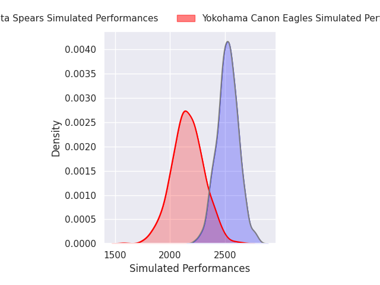
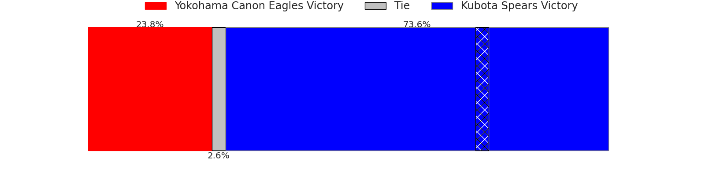
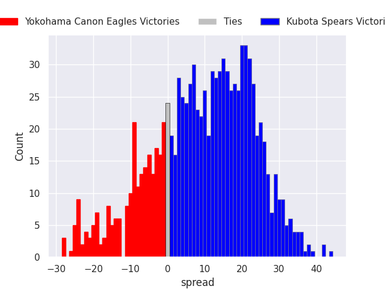

### Shizuoka Blue Revs V Tokyo Sungoliath on 2026/02/28

Average Margin: Tokyo Sungoliath by 0.9

### Mitsubishi Dynaboars V Toyota Verblitz on 2026/02/28

Average Margin: Mitsubishi Dynaboars by 1.5

## Week 12

### Mie Honda Heat V Yokohama Canon Eagles on 2026/03/14

Average Margin: Mie Honda Heat by 4.2

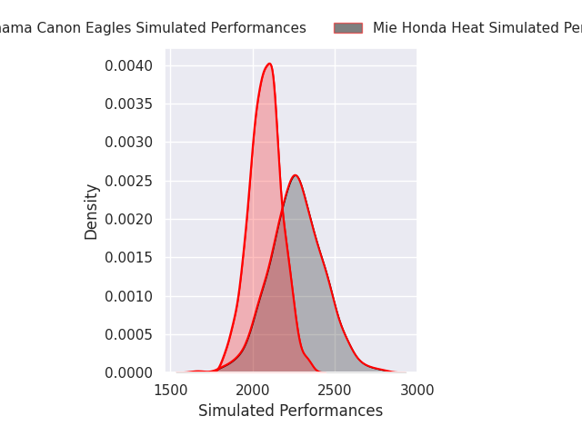
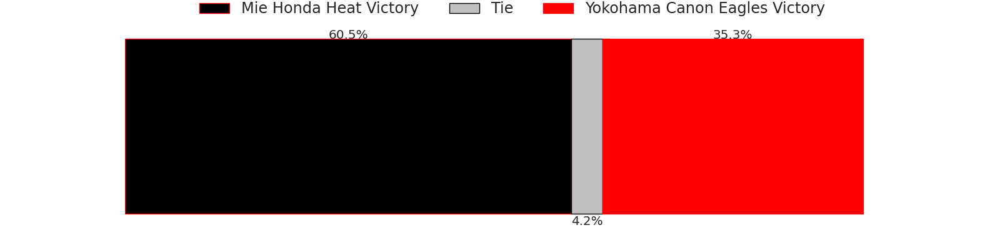
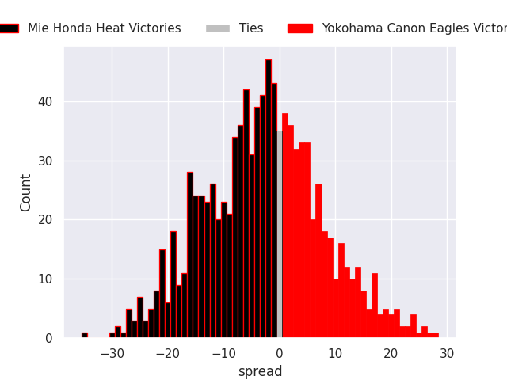

### Kubota Spears V Saitama Wild Knights on 2026/03/14

Average Margin: Kubota Spears by 5.0

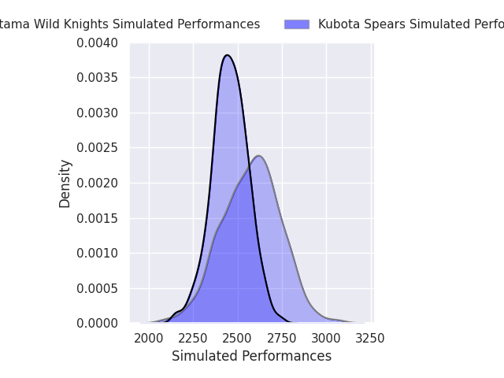
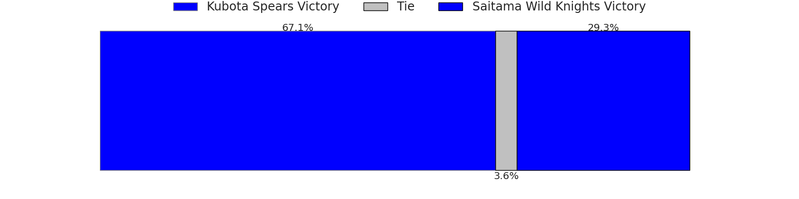
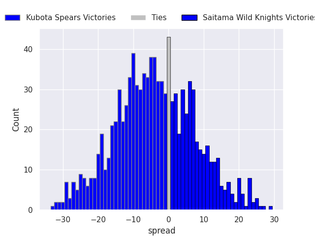

### Black Rams Tokyo V Shizuoka Blue Revs on 2026/03/14

Average Margin: Black Rams Tokyo by 2.7

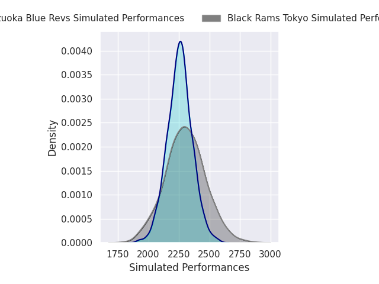
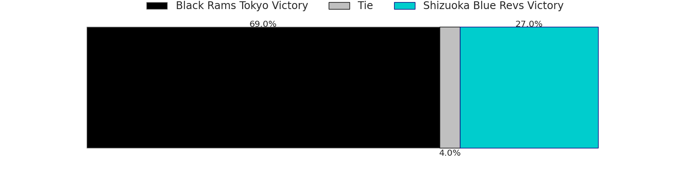
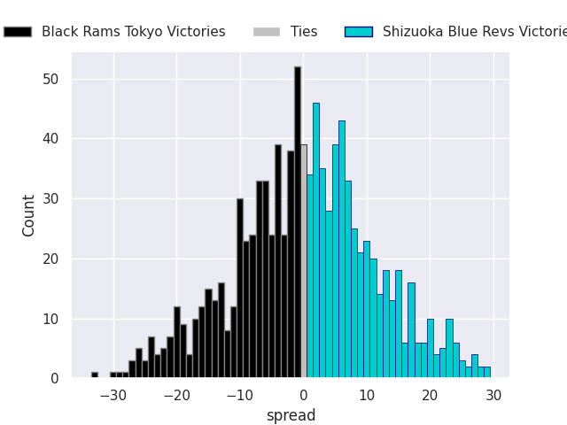

### Kobelco Kobe Steelers V Mitsubishi Dynaboars on 2026/03/14

Average Margin: Kobelco Kobe Steelers by 11.7

### Toyota Verblitz V Urayasu D-Rocks on 2026/03/15

Average Margin: Toyota Verblitz by 4.4

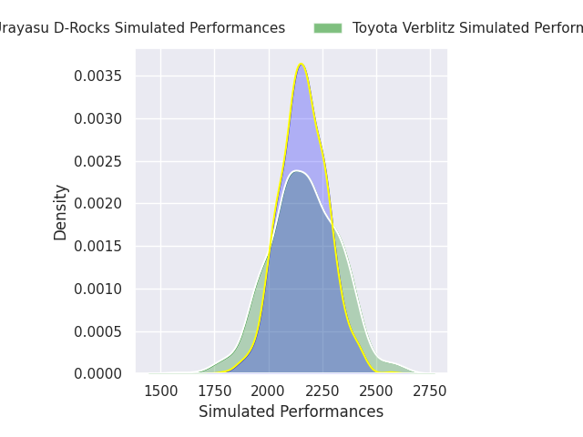
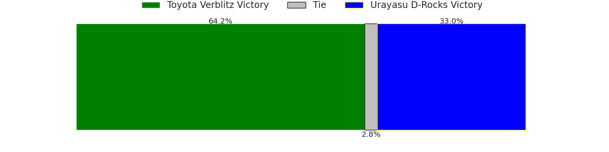
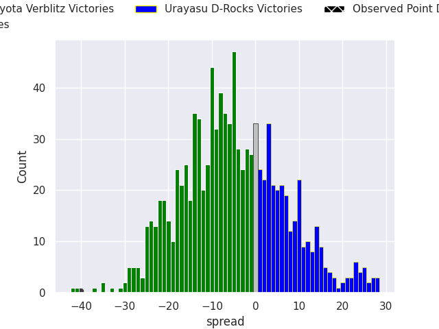

### Tokyo Sungoliath V Toshiba Brave Lupus on 2026/03/15

Average Margin: Tokyo Sungoliath by 3.4

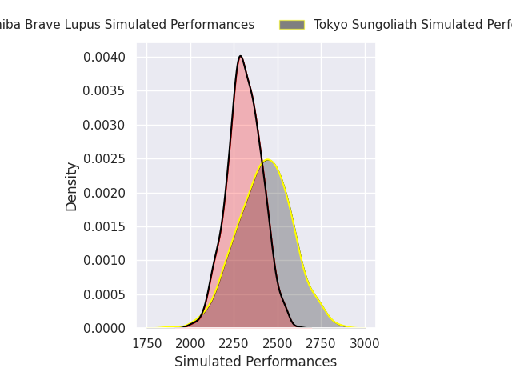
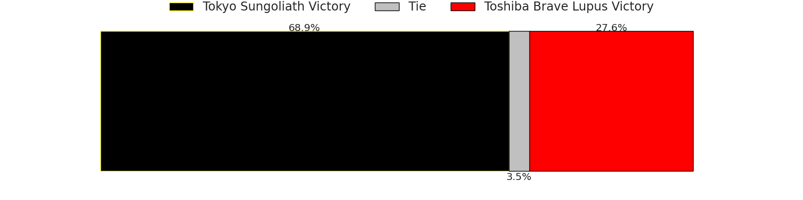
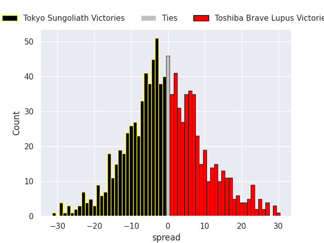

## Week 13

### Kobelco Kobe Steelers V Yokohama Canon Eagles on 2026/03/20

Average Margin: Kobelco Kobe Steelers by 10.5

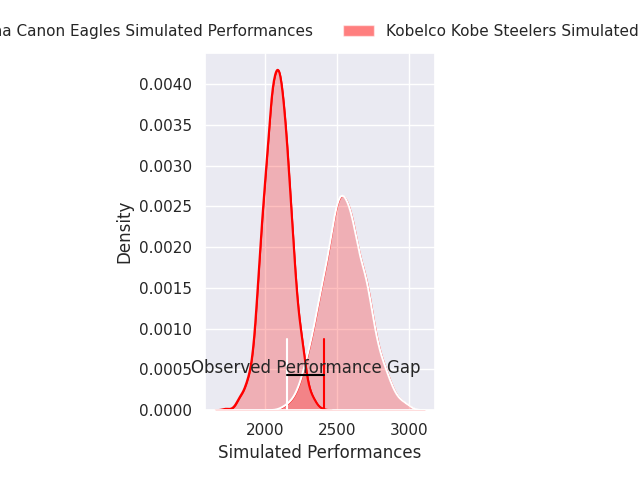
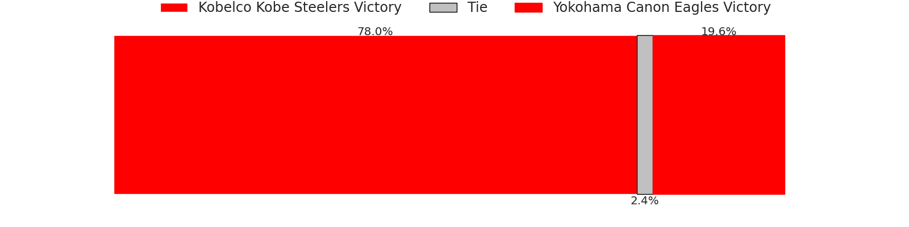
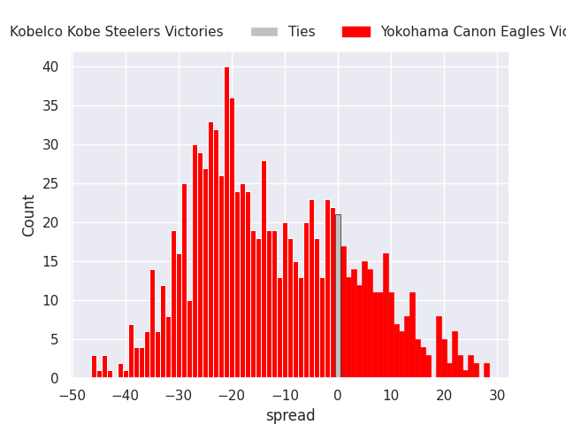

### Urayasu D-Rocks V Kubota Spears on 2026/03/21

Average Margin: Kubota Spears by 9.5

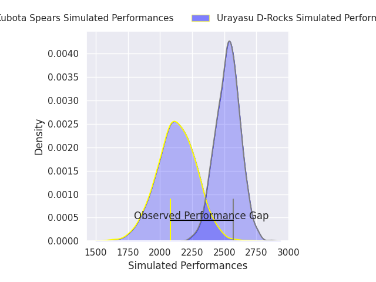
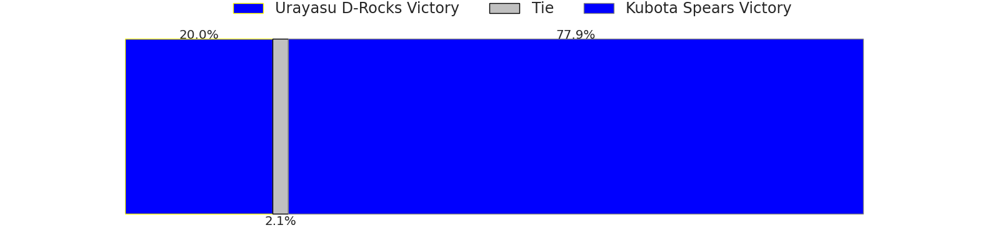
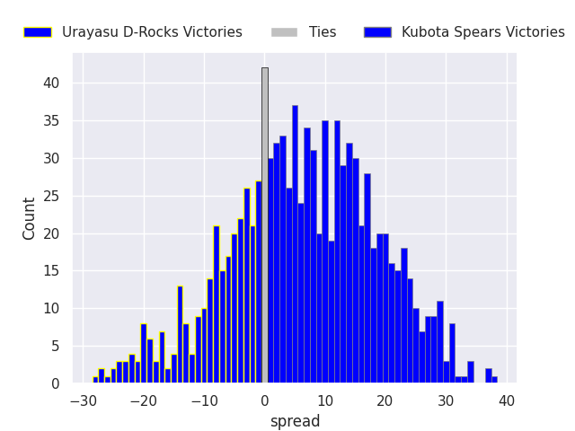

### Saitama Wild Knights V Black Rams Tokyo on 2026/03/21

Average Margin: Saitama Wild Knights by 5.2

### Mitsubishi Dynaboars V Tokyo Sungoliath on 2026/03/21

Average Margin: Tokyo Sungoliath by 3.6

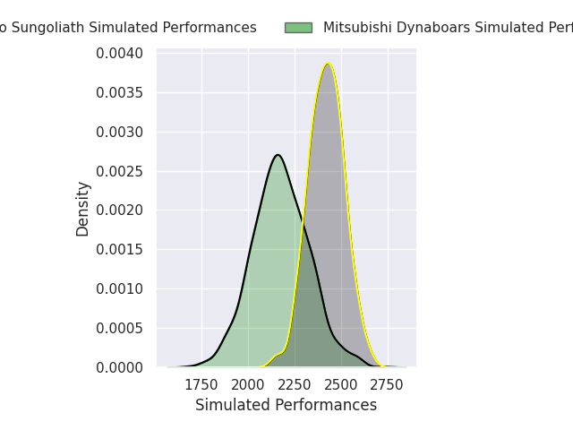

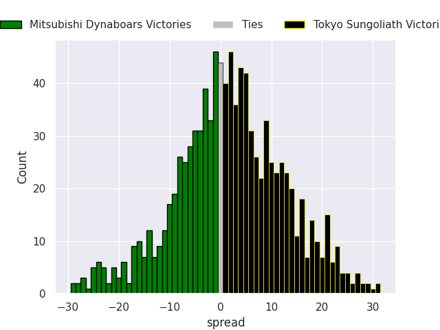

### Toshiba Brave Lupus V Mie Honda Heat on 2026/03/22

Average Margin: Toshiba Brave Lupus by 5.6

### Toyota Verblitz V Shizuoka Blue Revs on 2026/03/22

Average Margin: Shizuoka Blue Revs by 0.2

## Week 14

### Yokohama Canon Eagles V Toyota Verblitz on 2026/03/28

Average Margin: Yokohama Canon Eagles by 0.4

### Shizuoka Blue Revs V Kobelco Kobe Steelers on 2026/03/28

Average Margin: Kobelco Kobe Steelers by 3.7

### Tokyo Sungoliath V Saitama Wild Knights on 2026/03/28

Average Margin: Saitama Wild Knights by 0.4

### Kubota Spears V Toshiba Brave Lupus on 2026/03/28

Average Margin: Kubota Spears by 7.4

### Black Rams Tokyo V Mitsubishi Dynaboars on 2026/03/29

Average Margin: Black Rams Tokyo by 6.0

### Urayasu D-Rocks V Mie Honda Heat on 2026/03/29

Average Margin: Mie Honda Heat by 0.0

## Week 15

### Toyota Verblitz V Kubota Spears on 2026/04/04

Average Margin: Kubota Spears by 6.5

### Mitsubishi Dynaboars V Shizuoka Blue Revs on 2026/04/04

Average Margin: Mitsubishi Dynaboars by 0.3

### Saitama Wild Knights V Yokohama Canon Eagles on 2026/04/04

Average Margin: Saitama Wild Knights by 9.8

### Mie Honda Heat V Tokyo Sungoliath on 2026/04/04

Average Margin: Tokyo Sungoliath by 2.4

### Black Rams Tokyo V Kobelco Kobe Steelers on 2026/04/05

Average Margin: Kobelco Kobe Steelers by 1.3

### Toshiba Brave Lupus V Urayasu D-Rocks on 2026/04/05

Average Margin: Toshiba Brave Lupus by 7.4

## Week 16

### Mie Honda Heat V Black Rams Tokyo on 2026/04/17

Average Margin: Black Rams Tokyo by 0.8

### Yokohama Canon Eagles V Urayasu D-Rocks on 2026/04/18

Average Margin: Yokohama Canon Eagles by 3.0

### Shizuoka Blue Revs V Saitama Wild Knights on 2026/04/18

Average Margin: Saitama Wild Knights by 2.5

### Toyota Verblitz V Kobelco Kobe Steelers on 2026/04/18

Average Margin: Kobelco Kobe Steelers by 4.6

### Tokyo Sungoliath V Kubota Spears on 2026/04/18

Average Margin: Kubota Spears by 1.7

### Mitsubishi Dynaboars V Toshiba Brave Lupus on 2026/04/18

Average Margin: Toshiba Brave Lupus by 1.8

## Week 17

### Urayasu D-Rocks V Shizuoka Blue Revs on 2026/04/24

Average Margin: Shizuoka Blue Revs by 1.4

### Saitama Wild Knights V Mitsubishi Dynaboars on 2026/04/25

Average Margin: Saitama Wild Knights by 9.2

### Toshiba Brave Lupus V Yokohama Canon Eagles on 2026/04/25

Average Margin: Toshiba Brave Lupus by 6.8

### Black Rams Tokyo V Toyota Verblitz on 2026/04/25

Average Margin: Black Rams Tokyo by 4.6

### Kubota Spears V Mie Honda Heat on 2026/04/25

Average Margin: Kubota Spears by 10.1

### Kobelco Kobe Steelers V Tokyo Sungoliath on 2026/04/25

Average Margin: Kobelco Kobe Steelers by 3.9

## Week 18

### Urayasu D-Rocks V Saitama Wild Knights on 2026/05/01

Average Margin: Saitama Wild Knights by 4.8

### Toyota Verblitz V Tokyo Sungoliath on 2026/05/02

Average Margin: Tokyo Sungoliath by 2.2

### Yokohama Canon Eagles V Mitsubishi Dynaboars on 2026/05/02

Average Margin: Yokohama Canon Eagles by 1.7

### Kobelco Kobe Steelers V Mie Honda Heat on 2026/05/02

Average Margin: Kobelco Kobe Steelers by 7.0

### Black Rams Tokyo V Kubota Spears on 2026/05/02

Average Margin: Kubota Spears by 3.0

### Toshiba Brave Lupus V Shizuoka Blue Revs on 2026/05/02

Average Margin: Toshiba Brave Lupus by 2.3

## Week 19

### Mie Honda Heat V Toyota Verblitz on 2026/05/09

Average Margin: Mie Honda Heat by 2.5

### Saitama Wild Knights V Toshiba Brave Lupus on 2026/05/09

Average Margin: Saitama Wild Knights by 4.0

### Shizuoka Blue Revs V Yokohama Canon Eagles on 2026/05/09

Average Margin: Shizuoka Blue Revs by 5.2

### Tokyo Sungoliath V Black Rams Tokyo on 2026/05/10

Average Margin: Tokyo Sungoliath by 4.2

### Mitsubishi Dynaboars V Urayasu D-Rocks on 2026/05/10

Average Margin: Mitsubishi Dynaboars by 3.4

### Kubota Spears V Kobelco Kobe Steelers on 2026/05/10

Average Margin: Kubota Spears by 3.6

