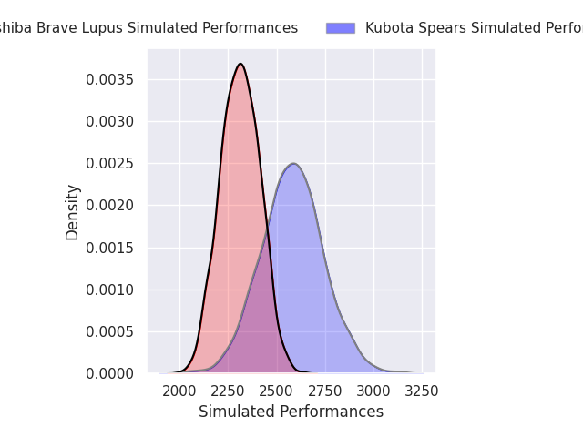
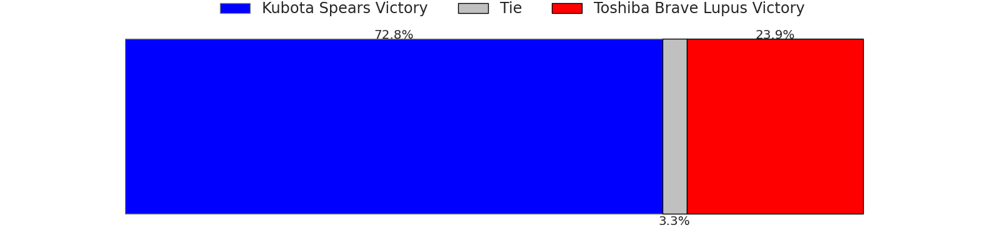
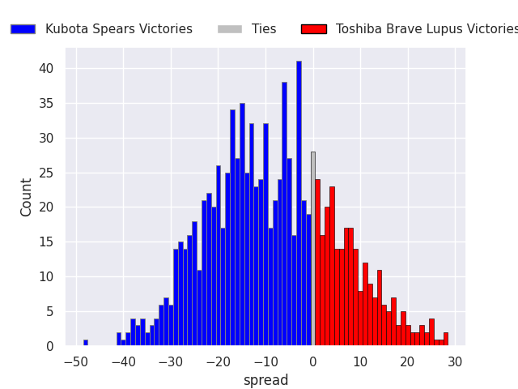

# Team Rankings

# Standings

## Current Standings

| Club                  |   Played |   Wins |   Point Differential |   Losing Bonus Points |   Try Bonus Points |   Competition Points |
|:----------------------|---------:|-------:|---------------------:|----------------------:|-------------------:|---------------------:|
| Saitama Wild Knights  |       12 |     11 |                  209 |                     0 |                  6 |                   50 |
| Kubota Spears         |       12 |     10 |                  248 |                     2 |                  5 |                   47 |
| Kobelco Kobe Steelers |       12 |     10 |                  207 |                     1 |                  4 |                   45 |
| Tokyo Sungoliath      |       11 |      7 |                  108 |                     3 |                  4 |                   35 |
| Black Rams Tokyo      |       12 |      7 |                  -25 |                     1 |                  2 |                   31 |
| Toshiba Brave Lupus   |       12 |      5 |                  -78 |                     3 |                  5 |                   28 |
| Shizuoka Blue Revs    |       12 |      4 |                  -55 |                     3 |                  3 |                   22 |
| Mie Honda Heat        |       12 |      4 |                  -99 |                     3 |                  3 |                   22 |
| Toyota Verblitz       |       12 |      4 |                  -37 |                     2 |                  3 |                   21 |
| Mitsubishi Dynaboars  |       11 |      3 |                 -127 |                     2 |                  2 |                   16 |
| Yokohama Canon Eagles |       12 |      3 |                 -134 |                     3 |                  1 |                   16 |
| Urayasu D-Rocks       |       12 |      3 |                 -217 |                     0 |                  2 |                   14 |

## Projected Remaining Table

| Club                  |   To Play |   Projected Wins |   Projected Differential |   Projected Losing Bonus Points | Projected Try Bonus Points   |   Projected Competition Points |
|:----------------------|----------:|-----------------:|-------------------------:|--------------------------------:|:-----------------------------|-------------------------------:|
| Saitama Wild Knights  |         6 |            4.123 |                   43.564 |                           0.883 |                              |                         17.815 |
| Tokyo Sungoliath      |         7 |            3.916 |                   17.639 |                           1.471 |                              |                         17.775 |
| Kubota Spears         |         6 |            3.955 |                   34.89  |                           1.002 |                              |                         17.262 |
| Kobelco Kobe Steelers |         6 |            3.345 |                   14.25  |                           1.225 |                              |                         15.153 |
| Black Rams Tokyo      |         6 |            2.94  |                    2.825 |                           1.31  |                              |                         13.638 |
| Shizuoka Blue Revs    |         6 |            2.823 |                   -1.561 |                           1.37  |                              |                         13.292 |
| Mitsubishi Dynaboars  |         7 |            2.729 |                  -22.698 |                           1.524 |                              |                         13.038 |
| Toshiba Brave Lupus   |         6 |            2.764 |                   -7.337 |                           1.226 |                              |                         12.748 |
| Yokohama Canon Eagles |         6 |            2.746 |                   -7.655 |                           1.297 |                              |                         12.723 |
| Mie Honda Heat        |         6 |            2.205 |                  -22.624 |                           1.373 |                              |                         10.725 |
| Toyota Verblitz       |         6 |            2.066 |                  -21.392 |                           1.546 |                              |                         10.294 |
| Urayasu D-Rocks       |         6 |            1.819 |                  -29.901 |                           1.462 |                              |                          9.226 |

## Projected Total Table

| Club                  |   Played |   Wins |   Point Differential |   Losing Bonus Points |   Try Bonus Points |   Competition Points |
|:----------------------|---------:|-------:|---------------------:|----------------------:|-------------------:|---------------------:|
| Saitama Wild Knights  |       18 | 15.123 |              252.564 |                 0.883 |                  6 |               67.815 |
| Kubota Spears         |       18 | 13.955 |              282.89  |                 3.002 |                  5 |               64.262 |
| Kobelco Kobe Steelers |       18 | 13.345 |              221.25  |                 2.225 |                  4 |               60.153 |
| Tokyo Sungoliath      |       18 | 10.916 |              125.639 |                 4.471 |                  4 |               52.775 |
| Black Rams Tokyo      |       18 |  9.94  |              -22.175 |                 2.31  |                  2 |               44.638 |
| Toshiba Brave Lupus   |       18 |  7.764 |              -85.337 |                 4.226 |                  5 |               40.748 |
| Shizuoka Blue Revs    |       18 |  6.823 |              -56.561 |                 4.37  |                  3 |               35.292 |
| Mie Honda Heat        |       18 |  6.205 |             -121.624 |                 4.373 |                  3 |               32.725 |
| Toyota Verblitz       |       18 |  6.066 |              -58.392 |                 3.546 |                  3 |               31.294 |
| Mitsubishi Dynaboars  |       18 |  5.729 |             -149.698 |                 3.524 |                  2 |               29.038 |
| Yokohama Canon Eagles |       18 |  5.746 |             -141.655 |                 4.297 |                  1 |               28.723 |
| Urayasu D-Rocks       |       18 |  4.819 |             -246.901 |                 1.462 |                  2 |               23.226 |

# Completed Match Review

| Model | Percent Correct Predictions | Spread Error |
| ------ | ------ | ------ |
| Club Level | 66.7% | 12.4 |
| Player Level: Lineup | nan% | nan |
| Player Level: Minutes | nan% | nan |

# Future Predictions

## Week 13

### Tokyo Sungoliath V Mitsubishi Dynaboars on 2026/02/07

Average Margin: Tokyo Sungoliath by 7.9

## Week 14

### Tokyo Sungoliath V Saitama Wild Knights on 2026/03/28

Average Margin: Saitama Wild Knights by 0.3

### Yokohama Canon Eagles V Toyota Verblitz on 2026/03/28

Average Margin: Yokohama Canon Eagles by 1.7

### Shizuoka Blue Revs V Kobelco Kobe Steelers on 2026/03/28

Average Margin: Kobelco Kobe Steelers by 2.6

### Kubota Spears V Toshiba Brave Lupus on 2026/03/28

Average Margin: Kubota Spears by 10.2

### Black Rams Tokyo V Mitsubishi Dynaboars on 2026/03/29

Average Margin: Black Rams Tokyo by 6.0

### Urayasu D-Rocks V Mie Honda Heat on 2026/03/29

Average Margin: Mie Honda Heat by 0.9

## Week 15

### Toyota Verblitz V Kubota Spears on 2026/04/04

Average Margin: Kubota Spears by 6.4

### Saitama Wild Knights V Yokohama Canon Eagles on 2026/04/04

Average Margin: Saitama Wild Knights by 11.3

### Mitsubishi Dynaboars V Shizuoka Blue Revs on 2026/04/04

Average Margin: Shizuoka Blue Revs by 0.3

### Mie Honda Heat V Tokyo Sungoliath on 2026/04/04

Average Margin: Tokyo Sungoliath by 4.8

### Black Rams Tokyo V Kobelco Kobe Steelers on 2026/04/05

Average Margin: Kobelco Kobe Steelers by 0.9

### Toshiba Brave Lupus V Urayasu D-Rocks on 2026/04/05

Average Margin: Toshiba Brave Lupus by 7.0

## Week 16

### Mie Honda Heat V Black Rams Tokyo on 2026/04/17

Average Margin: Black Rams Tokyo by 1.5

### Tokyo Sungoliath V Kubota Spears on 2026/04/18

Average Margin: Kubota Spears by 0.7

### Mitsubishi Dynaboars V Toshiba Brave Lupus on 2026/04/18

Average Margin: Mitsubishi Dynaboars by 0.1

### Toyota Verblitz V Kobelco Kobe Steelers on 2026/04/18

Average Margin: Kobelco Kobe Steelers by 4.1

### Shizuoka Blue Revs V Saitama Wild Knights on 2026/04/18

Average Margin: Saitama Wild Knights by 4.4

### Yokohama Canon Eagles V Urayasu D-Rocks on 2026/04/18

Average Margin: Yokohama Canon Eagles by 6.1

## Week 17

### Urayasu D-Rocks V Shizuoka Blue Revs on 2026/04/24

Average Margin: Shizuoka Blue Revs by 2.4

### Kubota Spears V Mie Honda Heat on 2026/04/25

Average Margin: Kubota Spears by 10.3

### Kobelco Kobe Steelers V Tokyo Sungoliath on 2026/04/25

Average Margin: Kobelco Kobe Steelers by 2.8

### Toshiba Brave Lupus V Yokohama Canon Eagles on 2026/04/25

Average Margin: Toshiba Brave Lupus by 3.5

### Black Rams Tokyo V Toyota Verblitz on 2026/04/25

Average Margin: Black Rams Tokyo by 4.5

### Saitama Wild Knights V Mitsubishi Dynaboars on 2026/04/25

Average Margin: Saitama Wild Knights by 10.9

## Week 18

### Urayasu D-Rocks V Saitama Wild Knights on 2026/05/01

Average Margin: Saitama Wild Knights by 8.3

### Toshiba Brave Lupus V Shizuoka Blue Revs on 2026/05/02

Average Margin: Toshiba Brave Lupus by 1.0

### Black Rams Tokyo V Kubota Spears on 2026/05/02

Average Margin: Kubota Spears by 3.3

### Kobelco Kobe Steelers V Mie Honda Heat on 2026/05/02

Average Margin: Kobelco Kobe Steelers by 7.8

### Toyota Verblitz V Tokyo Sungoliath on 2026/05/02

Average Margin: Tokyo Sungoliath by 3.7

### Yokohama Canon Eagles V Mitsubishi Dynaboars on 2026/05/02

Average Margin: Yokohama Canon Eagles by 3.0

## Week 19

### Mie Honda Heat V Toyota Verblitz on 2026/05/09

Average Margin: Mie Honda Heat by 0.9

### Saitama Wild Knights V Toshiba Brave Lupus on 2026/05/09

Average Margin: Saitama Wild Knights by 8.5

### Shizuoka Blue Revs V Yokohama Canon Eagles on 2026/05/09

Average Margin: Shizuoka Blue Revs by 3.8

### Tokyo Sungoliath V Black Rams Tokyo on 2026/05/10

Average Margin: Tokyo Sungoliath by 5.0

### Mitsubishi Dynaboars V Urayasu D-Rocks on 2026/05/10

Average Margin: Mitsubishi Dynaboars by 5.3

### Kubota Spears V Kobelco Kobe Steelers on 2026/05/10

Average Margin: Kubota Spears by 4.0

