# Team Rankings

# Standings

## Current Standings

| Club                  |   Played |   Wins |   Point Differential |   Losing Bonus Points |   Try Bonus Points |   Competition Points |
|:----------------------|---------:|-------:|---------------------:|----------------------:|-------------------:|---------------------:|
| Kubota Spears         |        9 |      8 |                  208 |                     1 |                  5 |                   38 |
| Saitama Wild Knights  |        9 |      8 |                  136 |                     0 |                  6 |                   38 |
| Kobelco Kobe Steelers |        9 |      8 |                  106 |                     1 |                  4 |                   37 |
| Toshiba Brave Lupus   |        9 |      5 |                  -18 |                     2 |                  5 |                   27 |
| Tokyo Sungoliath      |        8 |      5 |                   39 |                     2 |                  4 |                   26 |
| Black Rams Tokyo      |        9 |      5 |                  -24 |                     1 |                  2 |                   23 |
| Shizuoka Blue Revs    |        9 |      3 |                  -28 |                     2 |                  3 |                   17 |
| Mie Honda Heat        |        9 |      3 |                  -49 |                     2 |                  3 |                   17 |
| Urayasu D-Rocks       |        9 |      3 |                  -94 |                     0 |                  2 |                   14 |
| Toyota Verblitz       |        9 |      2 |                  -69 |                     2 |                  3 |                   13 |
| Mitsubishi Dynaboars  |        8 |      2 |                  -77 |                     1 |                  2 |                   11 |
| Yokohama Canon Eagles |        9 |      1 |                 -130 |                     3 |                  1 |                    8 |

## Projected Remaining Table

| Club                  |   To Play |   Projected Wins |   Projected Differential |   Projected Losing Bonus Points | Projected Try Bonus Points   |   Projected Competition Points |
|:----------------------|----------:|-----------------:|-------------------------:|--------------------------------:|:-----------------------------|-------------------------------:|
| Kubota Spears         |         9 |            6.046 |                   56.485 |                           1.414 |                              |                         26.262 |
| Kobelco Kobe Steelers |         9 |            5.694 |                   46.357 |                           1.52  |                              |                         24.974 |
| Tokyo Sungoliath      |        10 |            5.421 |                   18.652 |                           2.122 |                              |                         24.754 |
| Saitama Wild Knights  |         9 |            5.469 |                   38.559 |                           1.565 |                              |                         24.203 |
| Toshiba Brave Lupus   |         9 |            4.813 |                   12.911 |                           1.723 |                              |                         21.733 |
| Black Rams Tokyo      |         9 |            4.151 |                   -3.791 |                           2.048 |                              |                         19.456 |
| Shizuoka Blue Revs    |         9 |            4.083 |                   -6.185 |                           2.182 |                              |                         19.298 |
| Toyota Verblitz       |         9 |            3.729 |                  -14.056 |                           2.207 |                              |                         18.015 |
| Mitsubishi Dynaboars  |        10 |            3.618 |                  -37.19  |                           2.241 |                              |                         17.683 |
| Mie Honda Heat        |         9 |            3.547 |                  -26.79  |                           1.957 |                              |                         16.951 |
| Yokohama Canon Eagles |         9 |            3.062 |                  -43.977 |                           1.925 |                              |                         14.869 |
| Urayasu D-Rocks       |         9 |            2.975 |                  -40.975 |                           2.103 |                              |                         14.809 |

## Projected Total Table

| Club                  |   Played |   Wins |   Point Differential |   Losing Bonus Points |   Try Bonus Points |   Competition Points |
|:----------------------|---------:|-------:|---------------------:|----------------------:|-------------------:|---------------------:|
| Kubota Spears         |       18 | 14.046 |              264.485 |                 2.414 |                  5 |               64.262 |
| Saitama Wild Knights  |       18 | 13.469 |              174.559 |                 1.565 |                  6 |               62.203 |
| Kobelco Kobe Steelers |       18 | 13.694 |              152.357 |                 2.52  |                  4 |               61.974 |
| Tokyo Sungoliath      |       18 | 10.421 |               57.652 |                 4.122 |                  4 |               50.754 |
| Toshiba Brave Lupus   |       18 |  9.813 |               -5.089 |                 3.723 |                  5 |               48.733 |
| Black Rams Tokyo      |       18 |  9.151 |              -27.791 |                 3.048 |                  2 |               42.456 |
| Shizuoka Blue Revs    |       18 |  7.083 |              -34.185 |                 4.182 |                  3 |               36.298 |
| Mie Honda Heat        |       18 |  6.547 |              -75.79  |                 3.957 |                  3 |               33.951 |
| Toyota Verblitz       |       18 |  5.729 |              -83.056 |                 4.207 |                  3 |               31.015 |
| Urayasu D-Rocks       |       18 |  5.975 |             -134.975 |                 2.103 |                  2 |               28.809 |
| Mitsubishi Dynaboars  |       18 |  5.618 |             -114.19  |                 3.241 |                  2 |               28.683 |
| Yokohama Canon Eagles |       18 |  4.062 |             -173.977 |                 4.925 |                  1 |               22.869 |

# Completed Match Review

| Model | Percent Correct Predictions | Spread Error |
| ------ | ------ | ------ |
| Club Level | 66.7% | 10.7 |
| Player Level: Lineup | nan% | nan |
| Player Level: Minutes | nan% | nan |

# Future Predictions

## Week 10

### Tokyo Sungoliath V Mitsubishi Dynaboars on 2026/02/07

Average Margin: Tokyo Sungoliath by 8.8

## Week 11

### Toshiba Brave Lupus V Black Rams Tokyo on 2026/02/28

Average Margin: Toshiba Brave Lupus by 3.5

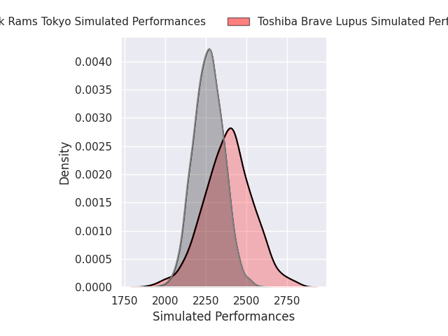
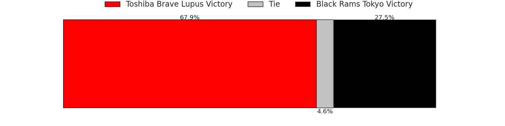
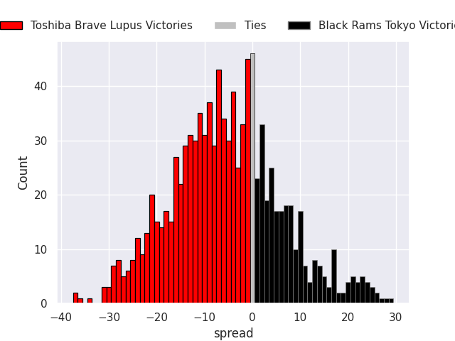

### Saitama Wild Knights V Mie Honda Heat on 2026/02/28

Average Margin: Saitama Wild Knights by 9.4

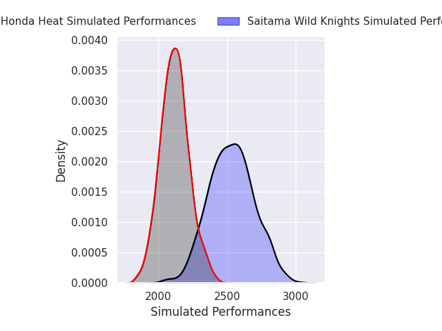

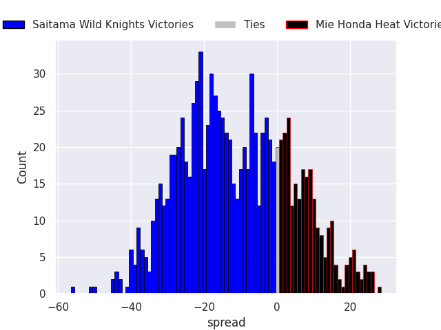

### Urayasu D-Rocks V Kobelco Kobe Steelers on 2026/02/28

Average Margin: Kobelco Kobe Steelers by 8.0

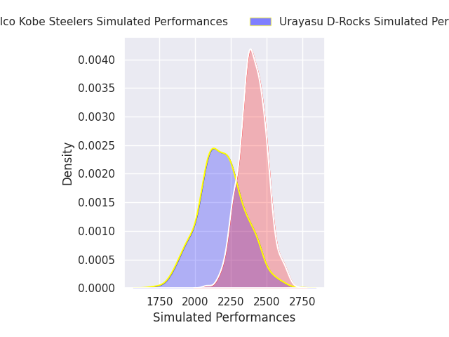
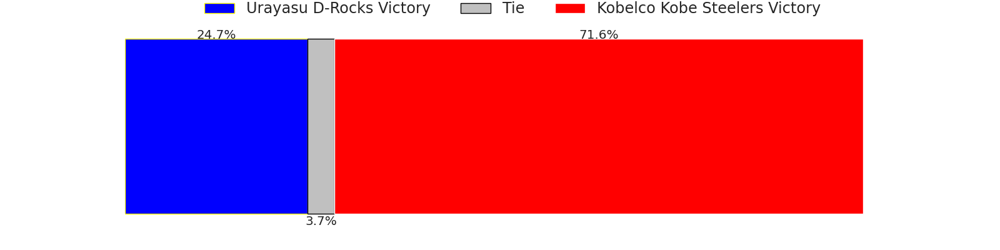
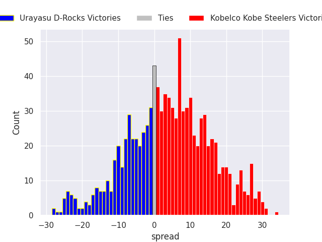

### Yokohama Canon Eagles V Kubota Spears on 2026/03/01

Average Margin: Kubota Spears by 10.3

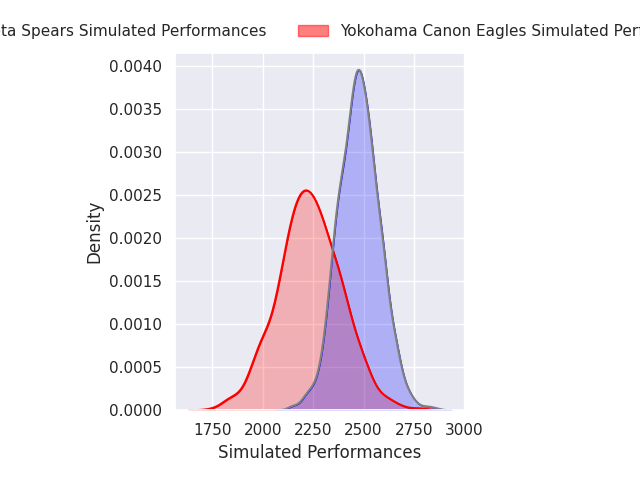
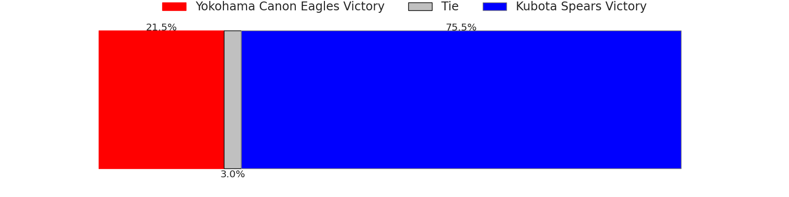
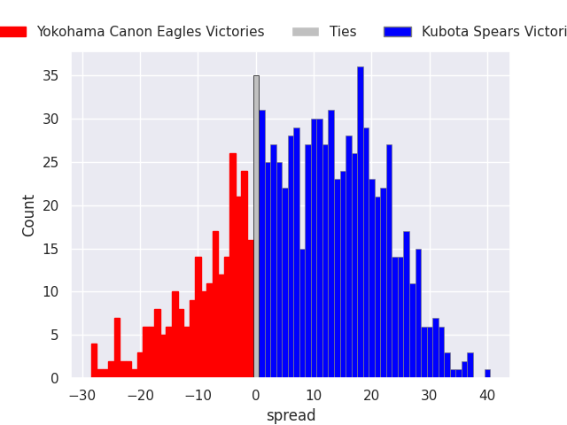

### Shizuoka Blue Revs V Tokyo Sungoliath on 2026/03/01

Average Margin: Tokyo Sungoliath by 1.5

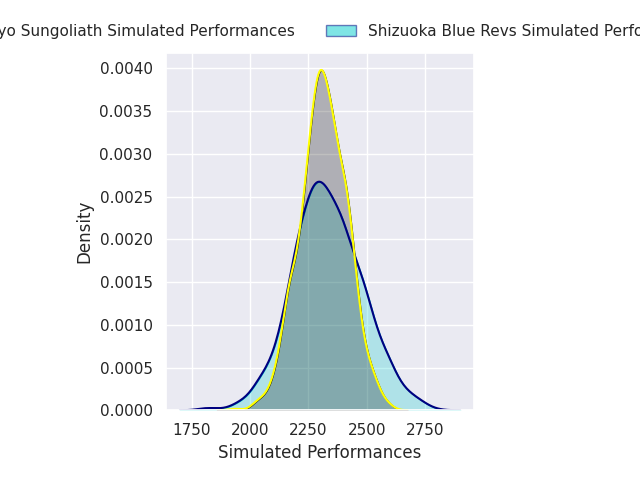

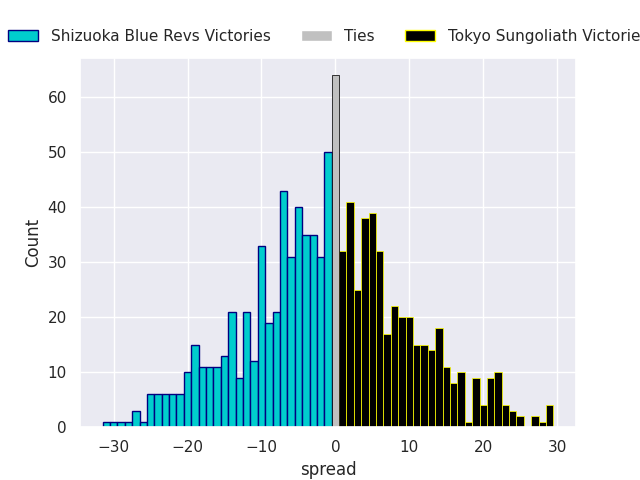

### Mitsubishi Dynaboars V Toyota Verblitz on 2026/03/01

Average Margin: Mitsubishi Dynaboars by 0.8

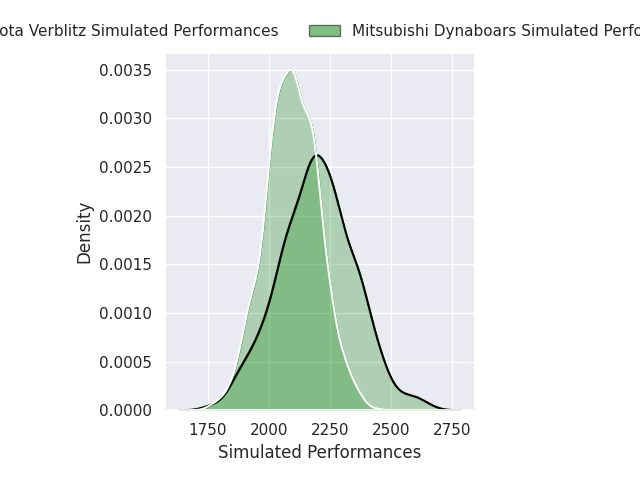
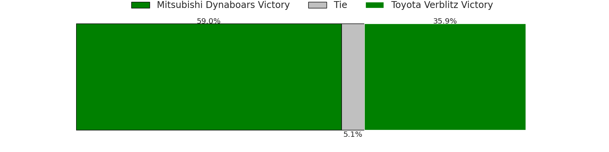
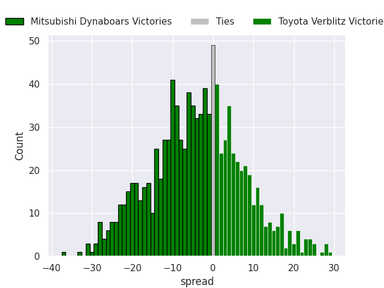

## Week 12

### Black Rams Tokyo V Shizuoka Blue Revs on 2026/03/14

Average Margin: Black Rams Tokyo by 2.6

### Kubota Spears V Saitama Wild Knights on 2026/03/14

Average Margin: Kubota Spears by 4.8

### Kobelco Kobe Steelers V Mitsubishi Dynaboars on 2026/03/14

Average Margin: Kobelco Kobe Steelers by 10.1

### Mie Honda Heat V Yokohama Canon Eagles on 2026/03/14

Average Margin: Mie Honda Heat by 5.1

### Tokyo Sungoliath V Toshiba Brave Lupus on 2026/03/15

Average Margin: Tokyo Sungoliath by 3.3

### Toyota Verblitz V Urayasu D-Rocks on 2026/03/15

Average Margin: Toyota Verblitz by 4.4

## Week 13

### Kobelco Kobe Steelers V Yokohama Canon Eagles on 2026/03/20

Average Margin: Kobelco Kobe Steelers by 12.1

### Saitama Wild Knights V Black Rams Tokyo on 2026/03/21

Average Margin: Saitama Wild Knights by 5.1

### Urayasu D-Rocks V Kubota Spears on 2026/03/21

Average Margin: Kubota Spears by 9.3

### Mitsubishi Dynaboars V Tokyo Sungoliath on 2026/03/21

Average Margin: Tokyo Sungoliath by 3.6

### Toyota Verblitz V Shizuoka Blue Revs on 2026/03/22

Average Margin: Toyota Verblitz by 0.9

### Toshiba Brave Lupus V Mie Honda Heat on 2026/03/22

Average Margin: Toshiba Brave Lupus by 5.6

## Week 14

### Yokohama Canon Eagles V Toyota Verblitz on 2026/03/28

Average Margin: Yokohama Canon Eagles by 0.1

### Tokyo Sungoliath V Saitama Wild Knights on 2026/03/28

Average Margin: Saitama Wild Knights by 0.2

### Kubota Spears V Toshiba Brave Lupus on 2026/03/28

Average Margin: Kubota Spears by 7.8

### Shizuoka Blue Revs V Kobelco Kobe Steelers on 2026/03/28

Average Margin: Kobelco Kobe Steelers by 3.3

### Black Rams Tokyo V Mitsubishi Dynaboars on 2026/03/29

Average Margin: Black Rams Tokyo by 5.9

### Urayasu D-Rocks V Mie Honda Heat on 2026/03/29

Average Margin: Mie Honda Heat by 0.0

## Week 15

### Mie Honda Heat V Tokyo Sungoliath on 2026/04/04

Average Margin: Tokyo Sungoliath by 1.9

### Mitsubishi Dynaboars V Shizuoka Blue Revs on 2026/04/04

Average Margin: Shizuoka Blue Revs by 0.4

### Toyota Verblitz V Kubota Spears on 2026/04/04

Average Margin: Kubota Spears by 5.8

### Saitama Wild Knights V Yokohama Canon Eagles on 2026/04/04

Average Margin: Saitama Wild Knights by 9.7

### Toshiba Brave Lupus V Urayasu D-Rocks on 2026/04/05

Average Margin: Toshiba Brave Lupus by 7.7

### Black Rams Tokyo V Kobelco Kobe Steelers on 2026/04/05

Average Margin: Kobelco Kobe Steelers by 1.2

## Week 16

### Mie Honda Heat V Black Rams Tokyo on 2026/04/17

Average Margin: Mie Honda Heat by 0.2

### Shizuoka Blue Revs V Saitama Wild Knights on 2026/04/18

Average Margin: Saitama Wild Knights by 2.3

### Mitsubishi Dynaboars V Toshiba Brave Lupus on 2026/04/18

Average Margin: Toshiba Brave Lupus by 2.5

### Yokohama Canon Eagles V Urayasu D-Rocks on 2026/04/18

Average Margin: Yokohama Canon Eagles by 2.9

### Toyota Verblitz V Kobelco Kobe Steelers on 2026/04/18

Average Margin: Kobelco Kobe Steelers by 4.2

### Tokyo Sungoliath V Kubota Spears on 2026/04/18

Average Margin: Kubota Spears by 2.2

## Week 17

### Urayasu D-Rocks V Shizuoka Blue Revs on 2026/04/24

Average Margin: Shizuoka Blue Revs by 1.4

### Kobelco Kobe Steelers V Tokyo Sungoliath on 2026/04/25

Average Margin: Kobelco Kobe Steelers by 3.8

### Toshiba Brave Lupus V Yokohama Canon Eagles on 2026/04/25

Average Margin: Toshiba Brave Lupus by 6.4

### Black Rams Tokyo V Toyota Verblitz on 2026/04/25

Average Margin: Black Rams Tokyo by 4.1

### Kubota Spears V Mie Honda Heat on 2026/04/25

Average Margin: Kubota Spears by 10.5

### Saitama Wild Knights V Mitsubishi Dynaboars on 2026/04/25

Average Margin: Saitama Wild Knights by 8.8

## Week 18

### Urayasu D-Rocks V Saitama Wild Knights on 2026/05/01

Average Margin: Saitama Wild Knights by 3.7

### Toshiba Brave Lupus V Shizuoka Blue Revs on 2026/05/02

Average Margin: Toshiba Brave Lupus by 2.4

### Yokohama Canon Eagles V Mitsubishi Dynaboars on 2026/05/02

Average Margin: Yokohama Canon Eagles by 1.6

### Toyota Verblitz V Tokyo Sungoliath on 2026/05/02

Average Margin: Tokyo Sungoliath by 2.2

### Kobelco Kobe Steelers V Mie Honda Heat on 2026/05/02

Average Margin: Kobelco Kobe Steelers by 6.7

### Black Rams Tokyo V Kubota Spears on 2026/05/02

Average Margin: Kubota Spears by 2.9

## Week 19

### Shizuoka Blue Revs V Yokohama Canon Eagles on 2026/05/09

Average Margin: Shizuoka Blue Revs by 5.0

### Mie Honda Heat V Toyota Verblitz on 2026/05/09

Average Margin: Mie Honda Heat by 2.0

### Saitama Wild Knights V Toshiba Brave Lupus on 2026/05/09

Average Margin: Saitama Wild Knights by 4.1

### Kubota Spears V Kobelco Kobe Steelers on 2026/05/10

Average Margin: Kubota Spears by 3.1

### Tokyo Sungoliath V Black Rams Tokyo on 2026/05/10

Average Margin: Tokyo Sungoliath by 3.5

### Mitsubishi Dynaboars V Urayasu D-Rocks on 2026/05/10

Average Margin: Mitsubishi Dynaboars by 3.6

