# Team Rankings

# Standings

## Current Standings

| Club                  |   Played |   Wins |   Point Differential |   Losing Bonus Points |   Try Bonus Points |   Competition Points |
|:----------------------|---------:|-------:|---------------------:|----------------------:|-------------------:|---------------------:|
| Saitama Wild Knights  |       13 |     12 |                  211 |                     0 |                  6 |                   54 |
| Kubota Spears         |       13 |     11 |                  292 |                     2 |                  5 |                   51 |
| Kobelco Kobe Steelers |       13 |     11 |                  228 |                     1 |                  4 |                   49 |
| Tokyo Sungoliath      |       12 |      7 |                  106 |                     4 |                  4 |                   36 |
| Black Rams Tokyo      |       13 |      8 |                    1 |                     1 |                  2 |                   35 |
| Toshiba Brave Lupus   |       13 |      5 |                 -122 |                     3 |                  5 |                   28 |
| Mie Honda Heat        |       13 |      5 |                  -73 |                     3 |                  3 |                   26 |
| Toyota Verblitz       |       13 |      5 |                  -31 |                     2 |                  3 |                   25 |
| Shizuoka Blue Revs    |       13 |      4 |                  -76 |                     3 |                  3 |                   22 |
| Yokohama Canon Eagles |       13 |      3 |                 -140 |                     4 |                  1 |                   17 |
| Mitsubishi Dynaboars  |       12 |      3 |                 -153 |                     2 |                  2 |                   16 |
| Urayasu D-Rocks       |       13 |      3 |                 -243 |                     0 |                  2 |                   14 |

## Projected Remaining Table

| Club                  |   To Play |   Projected Wins |   Projected Differential |   Projected Losing Bonus Points | Projected Try Bonus Points   |   Projected Competition Points |
|:----------------------|----------:|-----------------:|-------------------------:|--------------------------------:|:-----------------------------|-------------------------------:|
| Saitama Wild Knights  |         5 |            3.644 |                   47.519 |                           0.618 |                              |                         15.5   |
| Tokyo Sungoliath      |         6 |            3.292 |                   12.768 |                           1.199 |                              |                         14.935 |
| Kubota Spears         |         5 |            3.274 |                   27.237 |                           0.853 |                              |                         14.337 |
| Kobelco Kobe Steelers |         5 |            2.905 |                   15.549 |                           0.994 |                              |                         13.028 |
| Mitsubishi Dynaboars  |         6 |            2.445 |                  -18.316 |                           1.284 |                              |                         11.53  |
| Shizuoka Blue Revs    |         5 |            2.444 |                    1.586 |                           1.13  |                              |                         11.396 |
| Toshiba Brave Lupus   |         5 |            2.453 |                    0.687 |                           1.028 |                              |                         11.29  |
| Yokohama Canon Eagles |         5 |            2.318 |                   -5.906 |                           1.005 |                              |                         10.635 |
| Black Rams Tokyo      |         5 |            2.243 |                   -2.919 |                           1.185 |                              |                         10.627 |
| Mie Honda Heat        |         5 |            1.752 |                  -22.752 |                           1.1   |                              |                          8.508 |
| Toyota Verblitz       |         5 |            1.598 |                  -21.608 |                           1.241 |                              |                          8.099 |
| Urayasu D-Rocks       |         5 |            1.351 |                  -33.845 |                           1.071 |                              |                          6.823 |

## Projected Total Table

| Club                  |   Played |   Wins |   Point Differential |   Losing Bonus Points |   Try Bonus Points |   Competition Points |
|:----------------------|---------:|-------:|---------------------:|----------------------:|-------------------:|---------------------:|
| Saitama Wild Knights  |       18 | 15.644 |              258.519 |                 0.618 |                  6 |               69.5   |
| Kubota Spears         |       18 | 14.274 |              319.237 |                 2.853 |                  5 |               65.337 |
| Kobelco Kobe Steelers |       18 | 13.905 |              243.549 |                 1.994 |                  4 |               62.028 |
| Tokyo Sungoliath      |       18 | 10.292 |              118.768 |                 5.199 |                  4 |               50.935 |
| Black Rams Tokyo      |       18 | 10.243 |               -1.919 |                 2.185 |                  2 |               45.627 |
| Toshiba Brave Lupus   |       18 |  7.453 |             -121.313 |                 4.028 |                  5 |               39.29  |
| Mie Honda Heat        |       18 |  6.752 |              -95.752 |                 4.1   |                  3 |               34.508 |
| Shizuoka Blue Revs    |       18 |  6.444 |              -74.414 |                 4.13  |                  3 |               33.396 |
| Toyota Verblitz       |       18 |  6.598 |              -52.608 |                 3.241 |                  3 |               33.099 |
| Yokohama Canon Eagles |       18 |  5.318 |             -145.906 |                 5.005 |                  1 |               27.635 |
| Mitsubishi Dynaboars  |       18 |  5.445 |             -171.316 |                 3.284 |                  2 |               27.53  |
| Urayasu D-Rocks       |       18 |  4.351 |             -276.845 |                 1.071 |                  2 |               20.823 |

# Completed Match Review

| Model | Percent Correct Predictions | Spread Error |
| ------ | ------ | ------ |
| Club Level | 69.4% | 12.8 |
| Player Level: Lineup | nan% | nan |
| Player Level: Minutes | nan% | nan |

# Future Predictions

## Week 14

### Tokyo Sungoliath V Mitsubishi Dynaboars on 2026/02/07

Average Margin: Tokyo Sungoliath by 8.3

## Week 15

### Toyota Verblitz V Kubota Spears on 2026/04/04

Average Margin: Kubota Spears by 7.0

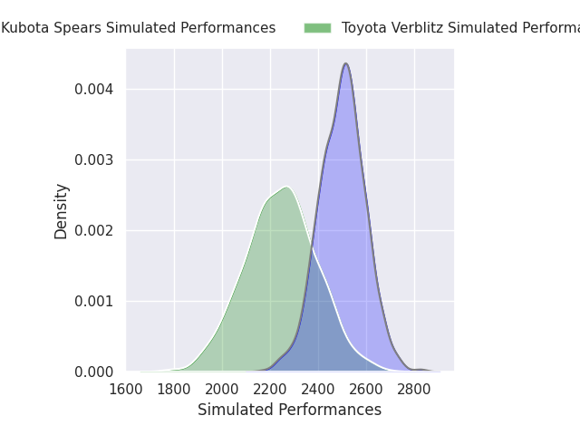
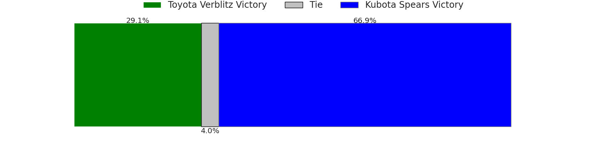
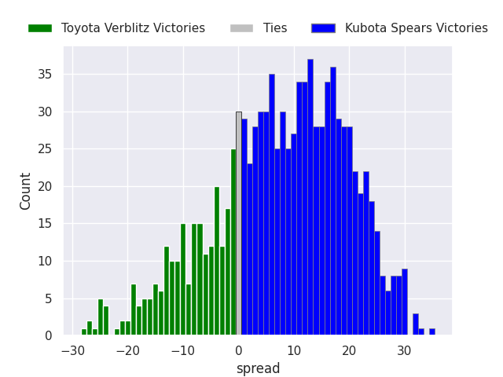

### Mitsubishi Dynaboars V Shizuoka Blue Revs on 2026/04/04

Average Margin: Shizuoka Blue Revs by 0.0

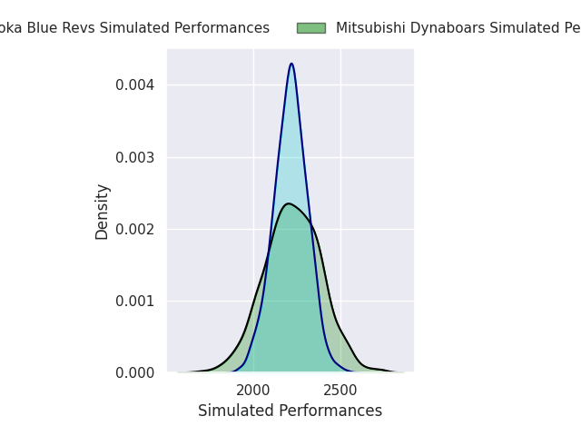
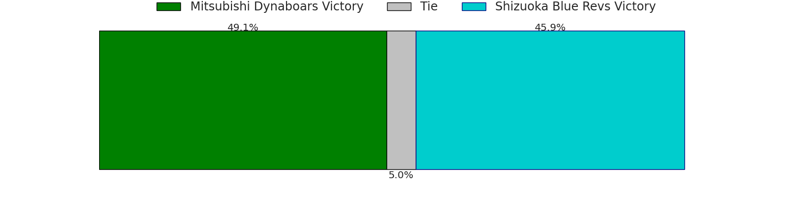
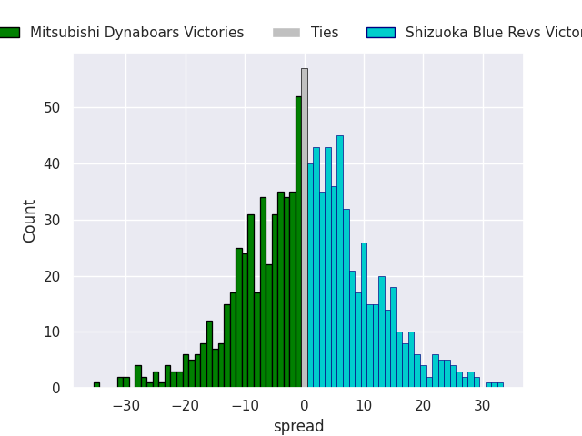

### Mie Honda Heat V Tokyo Sungoliath on 2026/04/04

Average Margin: Tokyo Sungoliath by 3.3

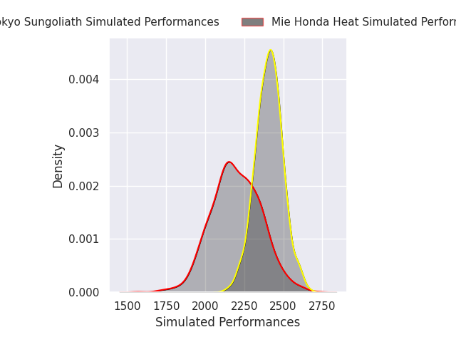

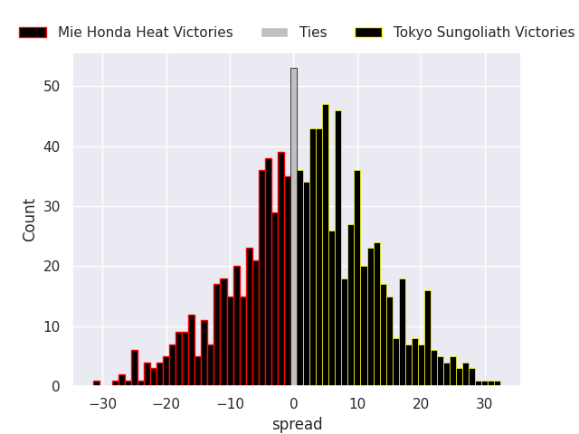

### Saitama Wild Knights V Yokohama Canon Eagles on 2026/04/04

Average Margin: Saitama Wild Knights by 10.6

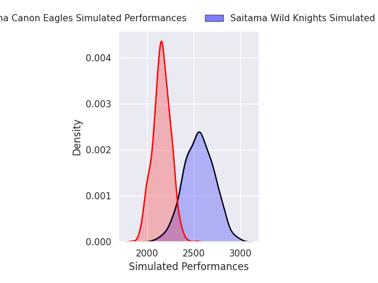

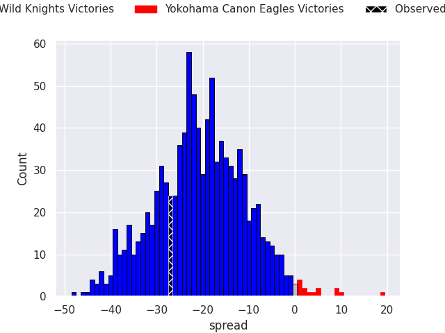

### Toshiba Brave Lupus V Urayasu D-Rocks on 2026/04/05

Average Margin: Toshiba Brave Lupus by 7.7

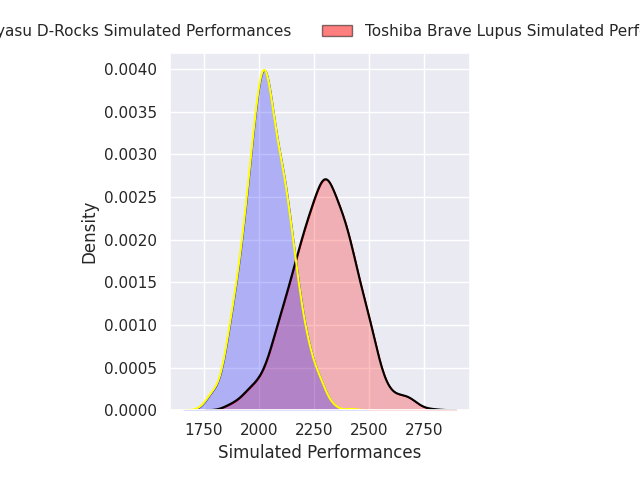

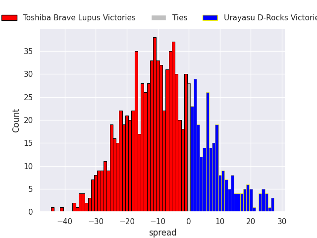

### Black Rams Tokyo V Kobelco Kobe Steelers on 2026/04/05

Average Margin: Kobelco Kobe Steelers by 2.2

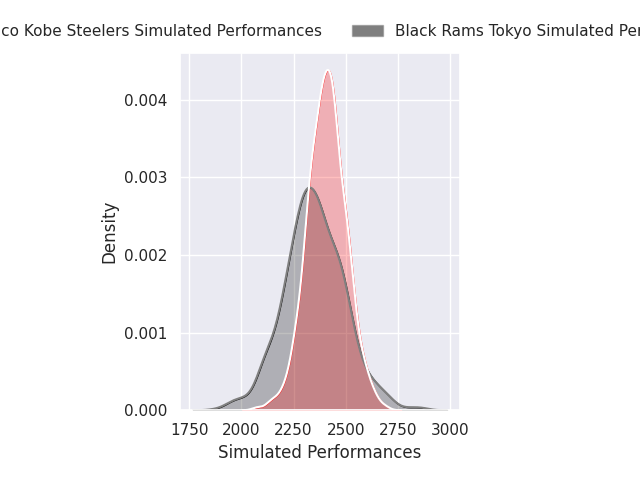
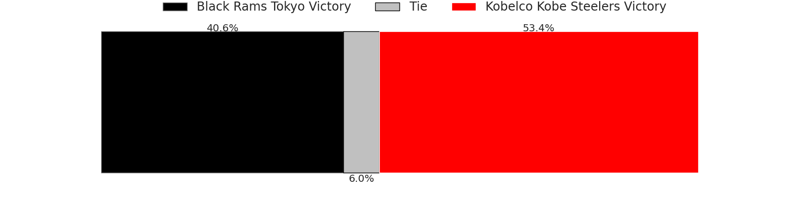
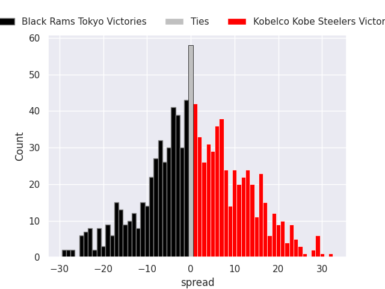

## Week 16

### Mie Honda Heat V Black Rams Tokyo on 2026/04/17

Average Margin: Black Rams Tokyo by 2.1

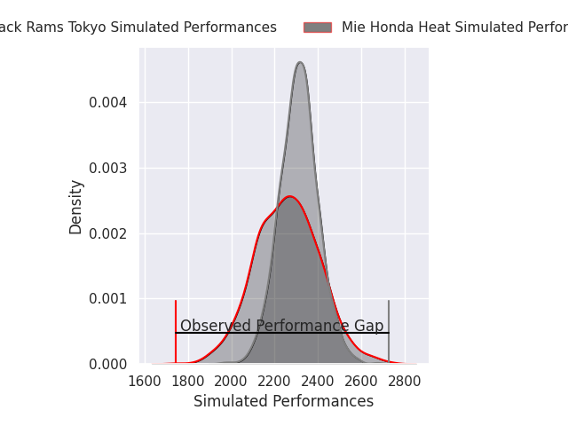

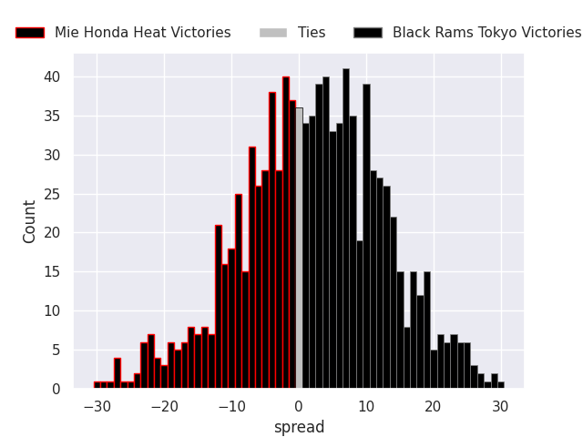

### Toyota Verblitz V Kobelco Kobe Steelers on 2026/04/18

Average Margin: Kobelco Kobe Steelers by 5.2

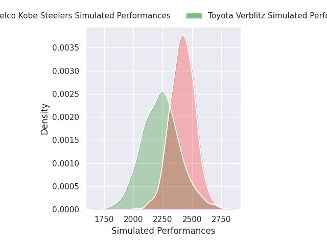
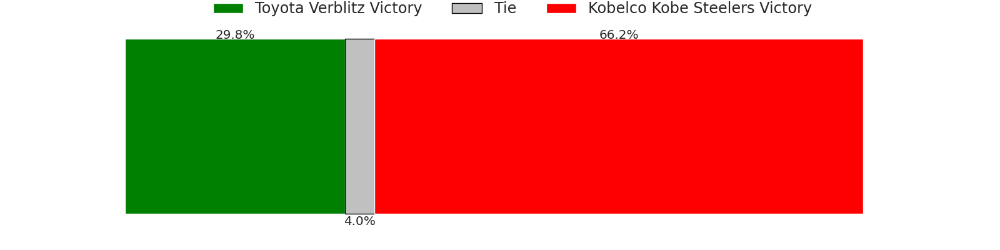
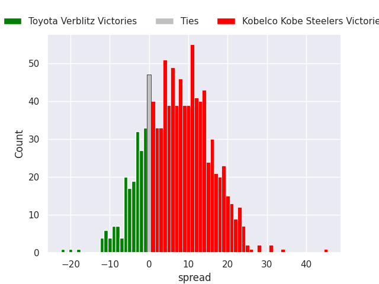

### Shizuoka Blue Revs V Saitama Wild Knights on 2026/04/18

Average Margin: Saitama Wild Knights by 5.8

### Tokyo Sungoliath V Kubota Spears on 2026/04/18

Average Margin: Kubota Spears by 1.6

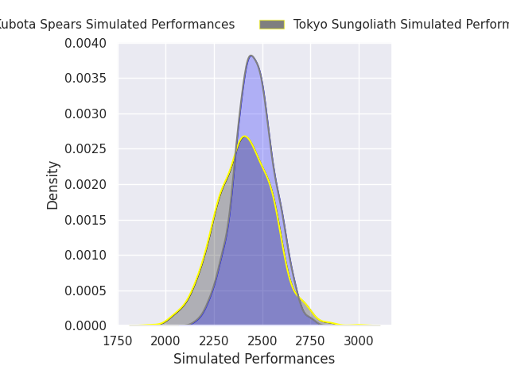

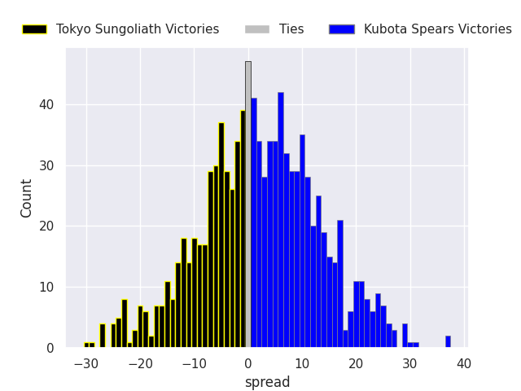

### Mitsubishi Dynaboars V Toshiba Brave Lupus on 2026/04/18

Average Margin: Mitsubishi Dynaboars by 0.1

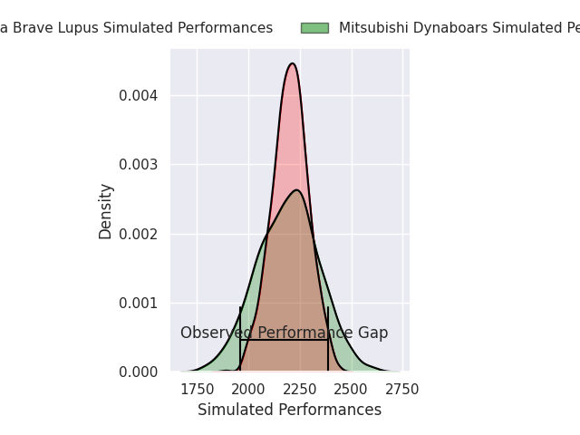
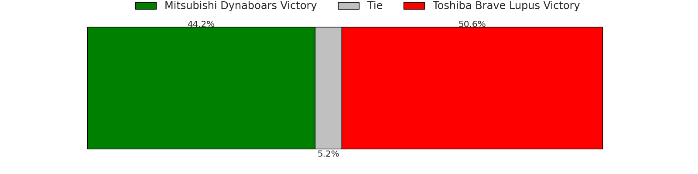
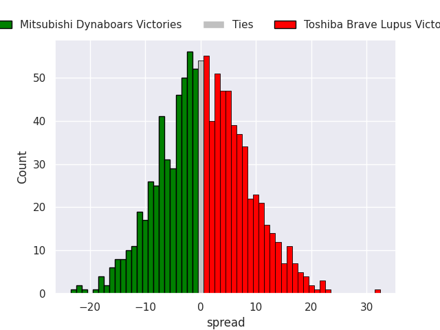

### Yokohama Canon Eagles V Urayasu D-Rocks on 2026/04/18

Average Margin: Yokohama Canon Eagles by 7.0

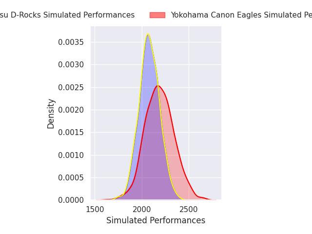
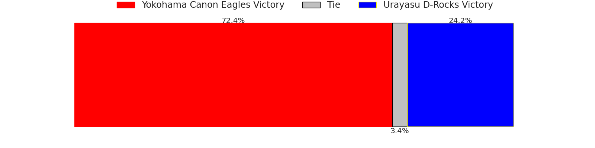
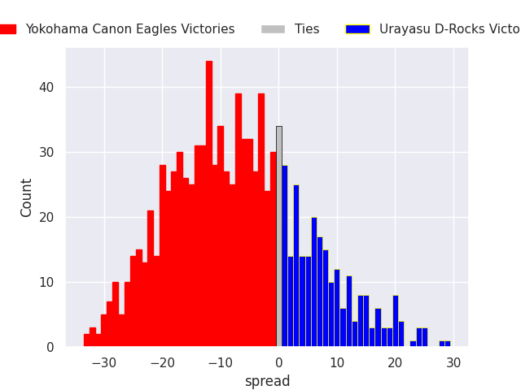

## Week 17

### Urayasu D-Rocks V Shizuoka Blue Revs on 2026/04/24

Average Margin: Shizuoka Blue Revs by 4.5

### Kubota Spears V Mie Honda Heat on 2026/04/25

Average Margin: Kubota Spears by 11.2

### Black Rams Tokyo V Toyota Verblitz on 2026/04/25

Average Margin: Black Rams Tokyo by 5.0

### Saitama Wild Knights V Mitsubishi Dynaboars on 2026/04/25

Average Margin: Saitama Wild Knights by 12.5

### Toshiba Brave Lupus V Yokohama Canon Eagles on 2026/04/25

Average Margin: Toshiba Brave Lupus by 2.4

### Kobelco Kobe Steelers V Tokyo Sungoliath on 2026/04/25

Average Margin: Kobelco Kobe Steelers by 3.9

## Week 18

### Urayasu D-Rocks V Saitama Wild Knights on 2026/05/01

Average Margin: Saitama Wild Knights by 9.1

### Toyota Verblitz V Tokyo Sungoliath on 2026/05/02

Average Margin: Tokyo Sungoliath by 2.5

### Kobelco Kobe Steelers V Mie Honda Heat on 2026/05/02

Average Margin: Kobelco Kobe Steelers by 8.1

### Toshiba Brave Lupus V Shizuoka Blue Revs on 2026/05/02

Average Margin: Toshiba Brave Lupus by 0.3

### Black Rams Tokyo V Kubota Spears on 2026/05/02

Average Margin: Kubota Spears by 3.6

### Yokohama Canon Eagles V Mitsubishi Dynaboars on 2026/05/02

Average Margin: Yokohama Canon Eagles by 3.1

## Week 19

### Mie Honda Heat V Toyota Verblitz on 2026/05/09

Average Margin: Mie Honda Heat by 1.9

### Saitama Wild Knights V Toshiba Brave Lupus on 2026/05/09

Average Margin: Saitama Wild Knights by 9.5

### Shizuoka Blue Revs V Yokohama Canon Eagles on 2026/05/09

Average Margin: Shizuoka Blue Revs by 3.1

### Tokyo Sungoliath V Black Rams Tokyo on 2026/05/10

Average Margin: Tokyo Sungoliath by 4.2

### Mitsubishi Dynaboars V Urayasu D-Rocks on 2026/05/10

Average Margin: Mitsubishi Dynaboars by 5.4

### Kubota Spears V Kobelco Kobe Steelers on 2026/05/10

Average Margin: Kubota Spears by 3.9

